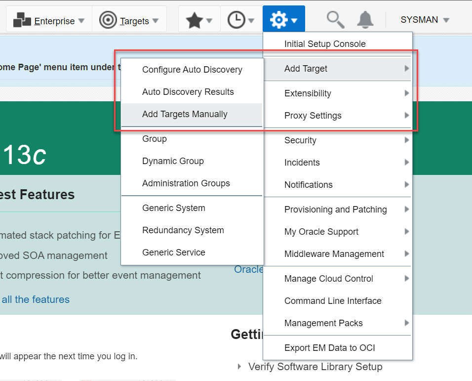
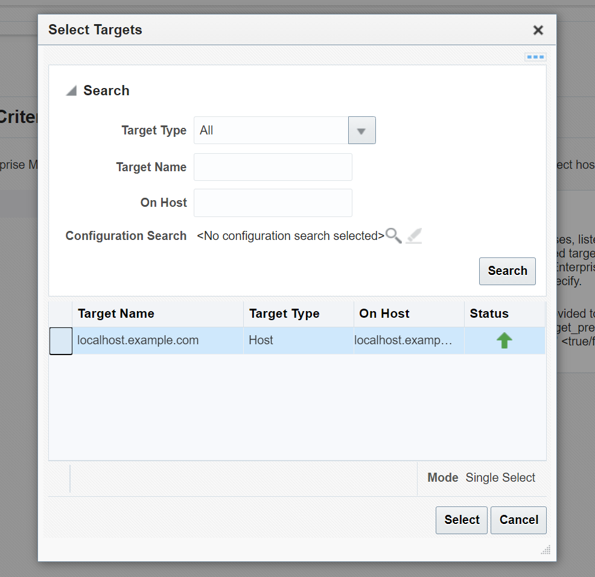
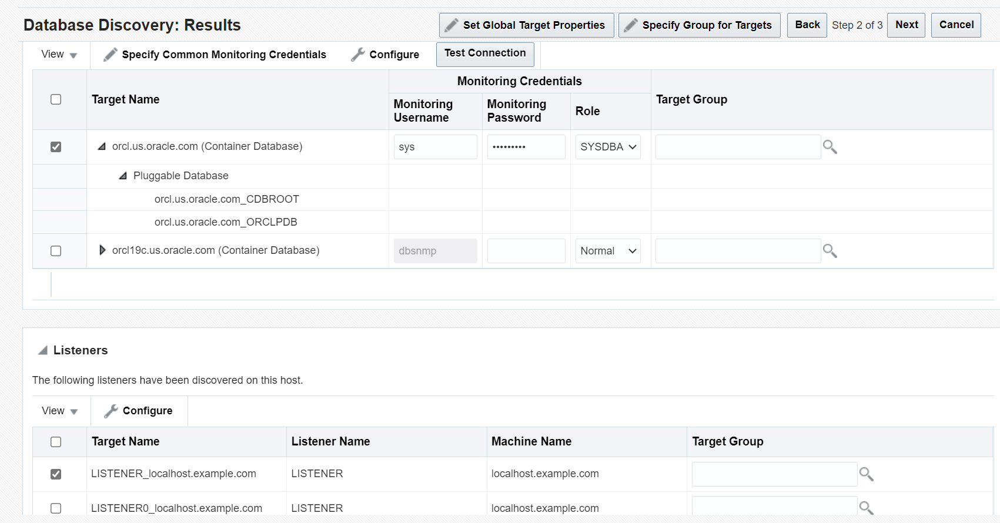
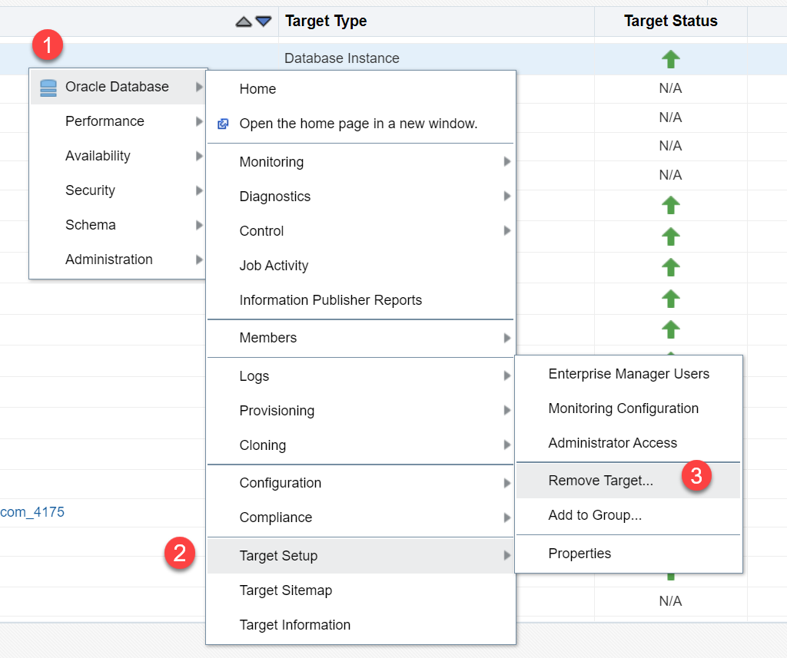
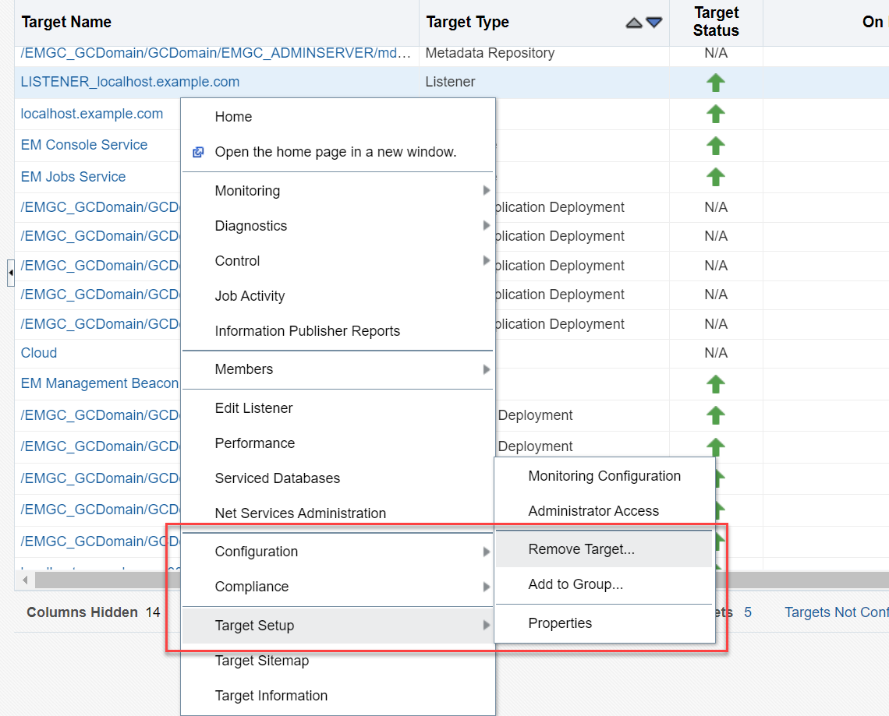

# Manage Targets - Oracle Database and Listener

## Introduction

This lab shows how to manage the targets discovered by Oracle EMCC. You can view details of Oracle Database and listener and administer them from Oracle EMCC as managed targets.

Estimated Time: 15 minutes

### Objectives

Log in to Oracle EMCC and view the targets. Add Oracle Database and Listener as targets in Oracle EMCC and remove them from managed targets. 

### Prerequisites

 - Oracle Database 21c installed and a Container Database (CDB) with at least one Pluggable Database (PDB) created.
 - Oracle EMCC 13.5 installed with Oracle Database 19c as the repository.
 - You have completed -
    - Lab: Prepare Setup (*Free-tier* and *Paid Tenants* only)
    - Lab: Setup Compute Instance
    - Lab: Initialize Environment
    - Lab: Log in to Oracle EMCC

## Task 1: View targets in Oracle EMCC

After logging in to Oracle EMCC, you can view the existing targets from the All Targets page.

1.	From the **Targets** menu, select **All Targets**.

	
    
	The All Targets page displays a complete list of targets discovered by Oracle EMCC, such as Hosts, Oracle homes, Listeners, PDBs, and so on.
    
	

2. 	You can use the filters in the **Refine Search** pane on the left to view a specific target type.
 
	

	Click on a target name to open its homepage and view the details.

## Task 2: Add Oracle Database and Listener as targets

Add targets using the discovery process and perform database administration from Oracle EMCC. You can add both Oracle Database and the Listener as targets simultaneously in the same step.

1.  From the **Setup** menu, select **Add Target** > **Add Targets Manually**.

    

    <!-- 
	Alternatively, you can add Oracle Database as a target from the Databases page. From the **Targets** menu, select **Databases**.

    

    On the Databases page, click **Add** > **Oracle Database**.

    
	-->

2.  On the Add Targets Manually page, use the guided discovery process for this lab. Under **Add Non-Host Targets Using Guided Process** click *Add Using Guided Process* to initiate the discovery.

    

    You can add targets in Oracle EMCC in the following ways.  

    - **Installing an agent** - This is an autodiscovery process where you install a management agent on an unmanaged host and convert it to a managed host. You can then search for targets on that host and add them.   
	  **Note**: With this process, if you add any new components to your infrastructure in the future, Oracle EMCC automatically finds and brings them under management.  

    - **Using guided process** - This process takes you through a discovery wizard that displays the specifications prefilled by default. The wizard searches for targets, such as Oracle Databases or other deployed components or applications, on the host and helps you promote these targets to managed status. 
		> This is the *easy and quick way* to add targets in Oracle EMCC. 

    - **Adding manually** - This is a declarative process where you explicitly specify the monitoring properties required to discover the target Oracle Database.   
	This process is useful if both autodiscovery and the guided process failed to discover the target.  

3.  Under Guided Discovery, select *Oracle Database, Listener and Automatic Storage Management* and click **Add**.

    

    The Discovered Target Types for Oracle Database is 'Autonomous Transaction processing, Database instance, Listener, Pluggable database, Cluster ASM, Automatic Storage Management, Cluster Database'.

4.  Specify the host or cluster where your Oracle Database resides. Click the magnifier icon to search for the target Oracle Database.

5.  In the Select Targets window, click the **Target Name** and click **Select**.  
    If the window shows multiple hosts or clusters, use the filters to search for the required target. 

    

     > **Note:** The upward green arrow in the status indicates that Oracle Database is up and running.  
    
6.  Verify that the **Specify Host or Cluster** field displays your target name and go to the **Next** page. You may add discovery hints to change the default discovery behavior.

    

7.  The Results page displays all Oracle Databases and listeners discovered on your host system. Select the Oracle Database you want to manage and specify the monitoring credentials.  

    For this lab, specify the following.  
     - **Target Name** - *orcl.us.oracle.com (Container Database)*. Select Oracle Database 21c that you want to monitor and administer   
     - **Role** - *SYSDBA*  
     The Monitoring Username changes to *sys* automatically.  
     - **Monitoring Password** - *We!come1*  
     - **Listeners** – *Listener_localhost.example.com*  

    The values may differ depending on the system you are using.  

    

    After you enter the database monitoring credentials, click **Test Connection** and verify that the connection is successful. For the selected Oracle Database, you can click **Configure** and view the general configuration and the PDBs. You can also click **Configure** for the selected listener and view the configuration. For this lab, do not modify the defaults.  

    You can specify common monitoring credentials or set global target properties for the selected targets and add them to a target group. For this lab, leave these options, select one Oracle Database and one listener, and go to the **Next** page.  

8.  Review the target Oracle Database and the related listener. Click **Save**. 

    

    The window displays a confirmation message about the targets.

    

    Congratulations! You have added your Oracle Database and the listener as targets.  The Databases page displays the target Oracle Database, including Database Instance, CDB, and PDBs.

    <!---->

You can start monitoring and managing your target Oracle Database and the target listener from Oracle EMCC.

## Task 3: Remove Oracle Database from managed targets

You can remove the Oracle Database Instance, Database System, CDB, and PDBs from managed targets in Oracle EMCC. After removing a target, you cannot manage it from Oracle EMCC anymore. 

> **Note**: Removing a target database from Oracle EMCC does not delete or deinstall the Oracle Database from the host system. It also does not remove the target listener from Oracle EMCC automatically.

1.  From the **Targets** menu, select **All Targets**.

	

2.  On the All Targets page, select the target Oracle Database that you want to remove.   
    For this lab, let us remove the `Oracle Database Instance`. Right-click the Database Instance, *orcl.us.oracle.com*, and select **Oracle Database** > **Target Setup** > **Remove Target**.    
	The values may differ depending on the system you are using.

    

3.  The window displays a warning message. Click **Yes** to confirm the removal.

    
	
	Clicking **No** will cancel the delete operation and take you back to the All Targets page.

You have successfully removed the Oracle Database Instance from managed targets in Oracle EMCC. 

Removing an Oracle Database Instance or a Database System deletes the entire Oracle Database, including the CDB and PDBs, from managed targets in Oracle EMCC. Whereas, if you remove a specific CDB or a PDB, Oracle EMCC deletes only that target database and leaves the Database Instance, Database System, and other PDBs intact. 

> **Note**: Oracle EMCC allows you to remove Oracle Databases or PDBs one at a time. You cannot remove multiple Oracle Databases together in a single step.

## Task 4: Remove Listener from managed targets

You can remove a listener from managed targets in Oracle EMCC. After removing a target, you cannot manage it from Oracle EMCC anymore.

> **Note**: Removing a target listener from Oracle EMCC does not delete the listener from the host system.

1.  From the **Targets** menu, select **All Targets**.

	

2.  On the All Targets page, select the listener you want to remove.  
    For this lab, let us remove the listener for `orcl.us.oracle.com`. Right-click *LISTENER_localhost.example.com* and select **Target Setup** > **Remove Target**.  
    The values may differ depending on the system you are using.

   

3.  The window displays a confirmation message. Click **Yes** to confirm the removal.

   

    Clicking **No** will cancel the delete operation and take you back to the All Targets page. 

   

You have successfully removed the listener from managed targets in Oracle EMCC. When you remove a listener, Oracle EMCC does not delete the target Oracle Database automatically.

> **Note**: Oracle EMCC allows you to remove listeners one at a time. You cannot remove multiple listeners together in a single step.

To run the labs and tasks related to Oracle EMCC, you would need Oracle Database 21c and the listener as managed targets in Oracle EMCC. If you have removed the Oracle Database and the listener from Oracle EMCC as per the above tasks, add them again as managed targets as explained in *Task 2*. 

You may now **proceed to the next lab**.

## Acknowledgements

-   **Author** - Manish Garodia, Principal User Assistance Developer, Database Technologies

-   **Contributors** - Suresh Rajan, Kurt Engeleiter, Subhash Chandra

-   **Last Updated By/Date** - Manish Garodia, October 2021
