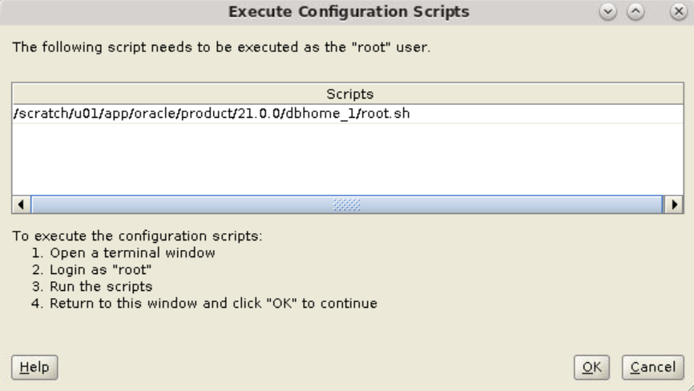

# Install Oracle Database (Server Class)

## Introduction

This lab walks you through the steps for installing Oracle Database 21c with detailed configuration. 

Estimated Lab Time: 30 minutes

### Objective

Install the Oracle Database software, create a container database, and configure it using Oracle Database Setup Wizard (Installer).

### Assumptions

<!-- 
[](include:assumptions-installer.md)

Add to manifest:
“include”: {“shortname”: “file_path_from_manifest”}
-->

- You logged in as *oracle*, the user who is authorized to install the Oracle Database software and create Oracle Database.  

- In the terminal window the current working directory is Oracle home, the directory where the database installer is located.

	```
	$ <copy>cd /u01/app/oracle/product/21.0.0/dbhome_1</copy>
	```

- From Oracle home, you launched Oracle Database Setup Wizard with this command.

	```
	$ <copy>./runInstaller</copy>
	```
## Task 1: Install and Configure Oracle Database

<!-- 
[](include:runinstaller.md)

Add to manifest:
“include”: {“shortname”: “file_path_from_manifest”}
-->

The `runInstaller` command from Oracle home starts the database installer with the Configuration Option window.

<!-- 
[](include:cmd-buttons-installer.md)

Add to manifest:
“include”: {“shortname”: “file_path_from_manifest”}
-->

At any point, you can go **Back** to the previous window or **Cancel** the installation. You can click **Help** to view more information on the current window.

1. The Configuration Option window opens with the default option **Create and configure a single instance database** selected. This option helps you create a starter database. Click **Next**.

   

	<!-- 
	[](include:acknowledgements.md)

	Add to manifest:
	“include”: {“shortname”: “file_path_from_manifest”}
	-->

	> If you select *Set Up Software Only*, the setup wizard installs only the Oracle Database software but does not create a database. To create a container database, run Oracle DBCA after you complete the software installation.  
	> For this lab, do not select this option.

2. Select **Server Class** in the System Class window to customize your installation and perform advanced configuration. Click **Next**.

   

	The *Desktop Class* option is used for basic installation with minimal configuration. 

3. The default option, **Enterprise Edition**, installs a database suitable for large enterprises. Click **Next**.

   

	*Standard Edition 2* is suitable for small and medium-sized businesses. 

4. The Installation Location window prompts you to select the Oracle base location. For this lab, leave the default value and click **Next**.

   

5. The first time you install Oracle Database on your host, the installer prompts you to specify the location of `oraInventory`, the directory for Oracle Database inventory. This directory provides a centralized inventory for all Oracle software products installed on the host. The default operating system group for Oracle inventory is *dba*.  

<!-- 
[](include:orainventory-step.md)

Add to manifest:
“include”: {“shortname”: “file_path_from_manifest”}
-->

	For this lab, leave the defaults and click **Next**. 

   

<!-- 
[](include:orainventory-note.md)

Add to manifest:
“include”: {“shortname”: “file_path_from_manifest”}
-->

	**Note**: If you have installed Oracle Database earlier, the next time you run the database installer, it does not display the Create Inventory window. The inventory location for Oracle Database is already set. 

6. The Configuration Type window displays the default option **General Purpose / Transaction Processing** selected. Click **Next**.

   

	<!-- 
	[](include:gen-purpose-template.md)

	Add to manifest:
	“include”: {“shortname”: “file_path_from_manifest”}
	-->
	
	**Note**: The General Purpose or Transaction Processing template and the Data Warehouse template create an Oracle Database with the `COMPATIBLE` initialization parameter set to `12.2.0.0.0`. This ensures that the new features in Oracle Database 21c are compatible with older versions of the database up to version 12c Release 2. 

7. The Database Identifiers window displays pre-filled names and the System Identifier (SID) for Oracle Database. Leave the defaults and click **Next**.

   

	<!-- 
	[](include:oracle-sid.md)

	Add to manifest:
	“include”: {“shortname”: “file_path_from_manifest”}
	-->

	> Oracle SID is a unique name given to an Oracle Database. It distinguishes this instance of Oracle Database from other instances on the host. You cannot create multiple Oracle Databases on a host with the same SID. If an Oracle Database with the specified SID already exists, enter a different SID, for example, *orcl2*. Similarly, specify a unique Global database name for each Oracle Database on the same host.

8. In the Configuration Options window, you can specify the amount of memory you want to allocate and select the character sets.

    - **Memory** - For this lab, the allocated memory specified is *5906* MB. You may choose a different value based on your requirement. For more information on memory management, see [About Automatic Memory Management Installation Options](https://docs.oracle.com/en/database/oracle/oracle-database/21/ladbi/about-automatic-memory-management-installation-options.html#GUID-38F46564-B167-4A78-A974-8C7CEE34EDFE).

      

	<!-- 
	[](include:char-set.md)

	Add to manifest:
	“include”: {“shortname”: “file_path_from_manifest”}
	-->

	- **Character sets** - The *Use Unicode (AL32UTF8)* option is selected by default. AL32UTF8 is Oracle's name for the standard Unicode encoding UTF-8, which enables universal support for virtually all languages of the world. 

      

	For this lab, leave the defaults and click **Next**. 

9. In the Database Storage window, leave the default **File system** option and click **Next**.

    

	> Oracle Automatic Storage Management (Oracle ASM) allows you to store your data files in ASM disk groups. For this lab, do not select this option.

10. In the Management Options window, do not select the checkbox **Register with Enterprise Manager (EM) Cloud Control**. Leave the default settings and click **Next**.

    

	<!-- 
	[](include:register-emcc.md)

	Add to manifest:
	“include”: {“shortname”: “file_path_from_manifest”}
	-->

    > If you have EMCC details, such as OMS hostname, port number, and the admin credentials, you can specify in this window and register your Oracle Database.  

	> However, instead of registering from this window, it is much easier to use the discovery process from EMCC and add your Oracle Database 21c as a managed target. 

   <!-- Add a link to WS2 lab on how to add managed targets. 
   For more information on managed targets, see [Manage your targets in EMCC](./files/data.csv?download=1). 
   -->

11. Select **Enable Recovery** in the Recovery Options window to allow restoration of Oracle Database in event of a failure. Leave the default settings for recovery area storage and click **Next**.

    

12. Specify the password for admin user accounts, namely SYS, SYSTEM, and PDBADMIN, in the Schema Passwords window.  

	Though you can specify different passwords for each admin user, for this lab, select **Use the same password for all accounts**. Note the **Password** you entered in this window and click **Next**.

	

	After you install Oracle Database, enter the admin username and use this password to connect to the database.  
	
	<!-- 
	[](include:std-pwd.md)

	Add to manifest:
	“include”: {“shortname”: “file_path_from_manifest”}
	-->

	**Note**: The password must conform to the Oracle recommended standards. 

13. In the Privileged Operating System groups window, you can grant your user account administrative access to Oracle Database. For this, you select the value for each OS Group listed below. The values represent the OS groups you belong to.  

    For this lab, select the Database Operator group as *dba*. For rest of the groups, *dba* is selected by default.

    

<!--13. You need to run a root script to configure the database. If you select **Automatically run configuration scripts** skip step 16-A.  
	For this lab, do not select this option and run the script manually as root user. Click **Next**.-->

14. You need to run root scripts to configure your Oracle Database.   
	<!--If you select **Automatically run configuration scripts** then skip step 7-A.-->
	For this lab, do not select the checkbox and run the scripts manually as explained in step 17. Click **Next**.

   

15. The database installer performs prerequisite checks to verify the installation and configuration requirements on the target environment.  

<!-- 
[](include:prereq-check.md)

Add to manifest:
“include”: {“shortname”: “file_path_from_manifest”}
-->

	If the verification result shows failure to meet a requirement, click **Fix & Check Again**.  
	If the issues are minor in nature, you may **Ignore All** and proceed with the installation.

   
 
16. Review the summary and click **Install** to start the installation.

   

17.	The Install Product window displays the status of Oracle Database installation process.	Run the scripts displayed in the Execute Configuration Scripts window as the root user. Do not close this window.

<!-- 
[](include:root-script-step.md)

Add to manifest:
“include”: {“shortname”: “file_path_from_manifest”}
-->

   

<!-- 
[](include:root-script-command.md)

Add to manifest:
“include”: {“shortname”: “file_path_from_manifest”}
-->

    A. Open a new terminal window and log in as the root user.
	
	 ```
	 $ <copy>sudo su -</copy>
	 (Requires no password)
	 ```

	B. Run the script `orainstRoot.sh` located in the `oraInventory` folder.
	
	 ```
	 $ <copy>/u01/app/oraInventory/orainstRoot.sh</copy>
	 ```

	 It returns the following output. 

	 ```
	 Changing permissions of /u01/app/oraInventory.
	 Adding read,write permissions for group.
	 Removing read,write,execute permissions for world.

	 Changing groupname of /u01/app/oraInventory to dba.
	 The execution of the script is complete.
	 ```
	 
	C. Run the script `root.sh` from Oracle home.

	 ```
	 $ <copy>/u01/app/oracle/product/21.0.0/dbhome_1/root.sh</copy>
	 ```

	 It returns the following output. 
 
	 ```
     The following environment variables are set as:
	 ORACLE_OWNER= oracle
     ORACLE_HOME=  /u01/app/oracle/product/21.0.0/dbhome_1

	 Enter the full pathname of the local bin directory: [/usr/local/bin]: Enter
	 
	 /usr/local/bin is read only.  Continue without copy (y/n) or retry (r)? [y]: y

 	 Warning: /usr/local/bin is read only. No files will be copied.

	 Entries will be added to the /etc/oratab file as needed by
	 Database Configuration Assistant when a database is created
	 Finished running generic part of root script.
	 Now product-specific root actions will be performed.
	 ```
	 
	Close the terminal window.  

<!-- 
[](include:root-script-note.md)

Add to manifest:
“include”: {“shortname”: “file_path_from_manifest”}
-->

	> This step is applicable for Linux and UNIX operating systems only. If you have installed Oracle Database earlier, the next time you run the database installer, it displays only one script `root.sh`.

	<!--B. If you provided the privileged user credentials in step 13, click **Yes** in the dialog box to run the configuration script automatically.

   -->

18. Return to the Execute Configuration Scripts window and click **OK** to continue. The installer proceeds with creating Oracle Database as per your configuration.
	
   

	The confirmation message in the Finish window indicates that you installed the Oracle Database software and configured the database successfully. 

Click **Close** to exit Oracle Database Setup Wizard.

You may now [proceed to the next lab](#next).

## Acknowledgements

<!-- 
[](include:acknowledgements.md)

Add to manifest:
“include”: {“shortname”: “file_path_from_manifest”}
-->

- **Author**: Manish Garodia, Principal User Assistance Developer, Database Technologies

- **Contributors**: Suresh Rajan (Senior Manager, User Assistance Development), Prakash Jashnani (Manager, User Assistance Development), Subhash Chandra (Principal User Assistance Developer), Subrahmanyam Kodavaluru (Principal Member Technical Staff), Dharma Sirnapalli (Principal Member Technical Staff)

- **Last Updated By/Date**: Manish Garodia, August 2021
