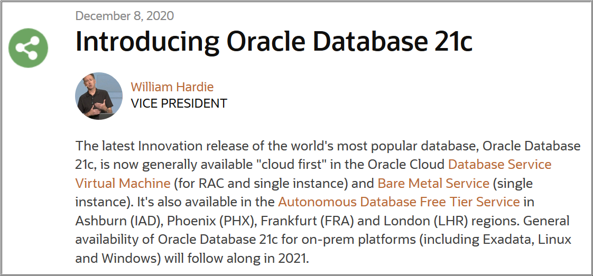

# Oracle Database Administration Essentials

## Introduction

**Oracle Database Administration Essentials** is a task-oriented, quick start approach to familiarize you with Oracle Database administration. It features the basic know-hows of Oracle Database and helps you perform various tasks necessary to keep the database operational.

Estimated Workshop Time: 2 hours 

Watch this video to learn about the core *Oracle Database Breakthrough Innovations*.

> Read the blog on the core Oracle Database 21c features - [Introducing Oracle Database 21c](https://blogs.oracle.com/database/introducing-oracle-database-21c).

> 

### Objective

In this workshop, you will learn different ways of installing and configuring Oracle Database 21c.

## How to Install Oracle Database?

Setting up Oracle Database is a two-step process, which involves installing the Oracle Database software and creating a database.

 - Install the Oracle Database software and configure your database using Oracle Database Setup Wizard (Installer).
 - Create additional databases using Oracle Database Configuration Assistant (Oracle DBCA).

	## About Oracle Database Setup Wizard (Installer)

	The database installer is a graphical user interface utility to systematically install the Oracle Database software and create the database through a wizard. Depending on the type of installation, the installer can launch Oracle DBCA automatically. However, you can also run Oracle DBCA manually after the installation.

	During the installation:

	- If you select *Create and configure a single instance database*, the setup wizard not only installs the Oracle Database software but also invokes Oracle DBCA automatically to create a single instance database.

	- 

	## About Oracle Database Configuration Assistant (Oracle DBCA)

	Like the database installer, the Oracle DBCA tool helps you create and configure your Oracle Database but does not install the database software.

	Consider the scenarios:

	- **Case#1** You have installed only the database software with the database installer. Then you need to run Oracle DBCA to create your Oracle Database.

	- **Case#2** Along with the software, you have also created an Oracle Database with the installer. You can still use Oracle DBCA to create additional databases.

    > You can run Oracle DBCA only after you install the Oracle Database software using the database installer.  

	Oracle DBCA offers two database creation modes - typical and advanced.

	With the *Advanced* mode, you can customize the configurations of Oracle Database, such as storage locations, initialization parameters, management options, database options, passwords for administrator accounts, and so on.

	Whereas if you select the *Typical* mode, though it gives fewer choices to configure, you can create an Oracle Database very quickly.

Let us install Oracle Database 21c as explained in the subsequent labs and explore these options in detail.

## Installation Prerequisites

Before installing the Oracle Database software, the installer performs several automated checks to verify whether the hardware and the software required for installation are available. If your computer does not meet any specific requirement, it displays a corresponding error message. The requirements may vary depending upon the computer and the operating system you are using.

### Minimum recommendations

 - 1 GB RAM
 - Sufficient paging space
 - Installation of service packages and/or patches
 - Use the correct file system format
 - Access to Oracle Database 21c installer
 - General knowledge about product installation

Oracle Database Enterprise Edition requires *7.8 GB* of local disk storage space to install the Oracle Database software.

> Oracle recommends that you allocate approximately *100 GB* to allow additional space for applying any future patches on top of the existing Oracle home.

You may now [proceed to the next lab](#next).

## Acknowledgements

- **Author**: Manish Garodia, Principal User Assistance Developer, Database Technologies

- **Contributors**: Suresh Rajan (Senior Manager, User Assistance Development), Prakash Jashnani (Manager, User Assistance Development), Subhash Chandra (Principal User Assistance Developer), Subrahmanyam Kodavaluru (Principal Member Technical Staff), Dharma Sirnapalli (Principal Member Technical Staff)

- **Last Updated By/Date**: Manish Garodia, August 2021
