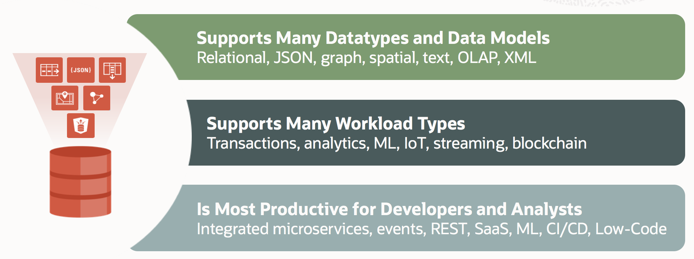

# Introduction 

This section of the workshop highlights enhancements in Oracle Data Pump. Oracle Data Pump has the capacity to resume transportable tablespace export and import jobs. Due to errors, or other problems, you can find that transportable tablespace export or import jobs are stopped. Oracle Data Pump's capacity to resume these stopped jobs helps to save you time, and makes the system more available.

Estimated Workshop Time: 60 minutes

### Labs
* Data Pump Checksums
* Data Pump Includes & Excludes
* Data Pump Transportable Tablespaces
* Data Pump Index Compression

### Prerequisites

* An Oracle Free Tier, Paid or LiveLabs Cloud Account
* Working knowledge of vi

You may now [proceed to the next lab](#next).

## About Oracle Database 21c
The 21c generation of Oracle's converged database offers customers; best of breed support for all data types (e.g. relational, JSON, XML, spatial, graph, OLAP, etc.), and industry leading performance, scalability, availability and security for all their operational, analytical and other mixed workloads.

 
Key updates made in Database 21c are:
* JSON binary data type
* Blockchain tables
* Auto machine learning with Python
* Enhancements for sharding, database in-memory and graph analytics.

With 21c, customers can
* Reduce IT cost and complexity
* Unlock innovation
* Develop powerful, data-driven applications

## Learn More

* [Oracle Database Blog](http://blogs.oracle.com/database)
* [Introducing Oracle Database 21c](https://blogs.oracle.com/database/introducing-oracle-database-21c)

## Acknowledgements
* **Author** - Dominique Jeunot, Database UA Team
* **Contributors** - Kay Malcolm, David Start, Kamryn Vinson, Anoosha Pilli, Tom McGinn, Database Product Management
* **Last Updated By/Date** - Kay Malcolm, November 2020

## Need Help?
Please submit feedback or ask for help using our [LiveLabs Support Forum](https://community.oracle.com/tech/developers/categories/database-19c). Please click the **Log In** button and login using your Oracle Account. Click the **Ask A Question** button to the left to start a *New Discussion* or *Ask a Question*.  Please include your workshop name and lab name.  You can also include screenshots and attach files.  Engage directly with the author of the workshop.

If you do not have an Oracle Account, click [here](https://profile.oracle.com/myprofile/account/create-account.jspx) to create one.
