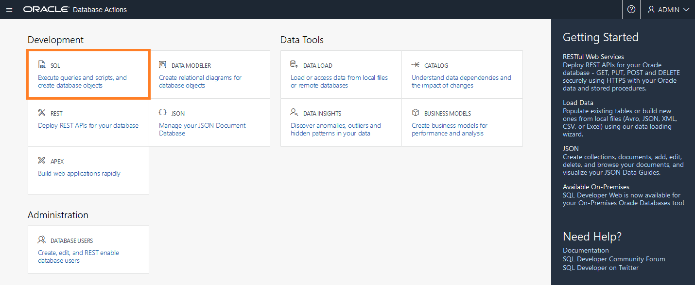
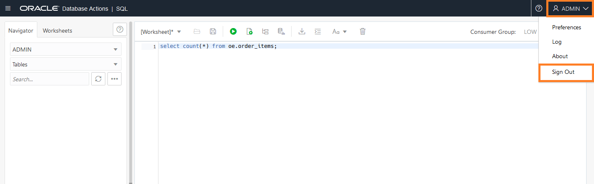

# Setup

## Introduction
In the previous lab you created an ADB instance.  In this lab you will connect to the ADB instance from Oracle Cloud Shell.

*Estimated time:* 20 Minutes

### Objectives
- Create auth token and Oracle Wallet 
- Load ADB instance

### Prerequisites
- Lab: Provision ADB

## **STEP 1:** Create Oracle Wallet in Cloud Shell
There are multiple ways to create an Oracle Wallet for ADB.  We will be using Oracle Cloud Shell as this is not the focus of this workshop.  To learn more about Oracle Wallets and use the interface to create one, please refer to the lab in this workshop: [Analyzing Your Data with ADB - Lab 6](https://apexapps.oracle.com/pls/apex/dbpm/r/livelabs/view-workshop?p180_id=553)

1.  Login to the Oracle Cloud if you aren't logged in already.
   
2.  Click the Cloud Shell icon to start up Cloud Shell
      
3.  While your Cloud Shell is starting up, click on the Hamburger Menu -> **Autonomous Transaction Processing** 
      

4.  Click on the **Display Name** to go to your ADB main page.
   
5.  Locate the **OCID** (Oracle Cloud ID) you will need that in a few minutes. 

      

6.  Use your autonomous\_database\_ocid to create the Oracle Wallet. You will be setting the wallet password to the same value as the ADB admin password for ease of use: *WElcome123##* Note: This is not a recommended practice and just used for the purposes of this lab. 
7.  Copy the command below and paste it into Cloud Shell.  Do not hit enter yet.  

      ````
      <copy>
      cd ~
      oci db autonomous-database generate-wallet --password WElcome123## --file 21c-wallet.zip --autonomous-database-id  </copy> ocid1.autonomousdatabase.oc1.iad.xxxxxxxxxxxxxxxxxxxxxx
      ````

      

8.  Press copy to copy the OCID from Step 5 and fill in the autonomous database ocid that is listed in the output section of your terraform.  Make sure there is a space between the --autonomous-database-id phrase and the ocid.  Click **enter**.  Be patient, it takes about 20 seconds.

9.  The wallet file will be downloaded to your cloud shell file system in /home/yourtenancyname

10. Enter the list command in your cloud shell below to verify the *21c-wallet.zip* was created
   
      ````
      ls
      ````
      

## **STEP 2:** Create Auth Token

1.  Click on the person icon in the upper right corner.
2.  Select **User Settings**
      

3.  Under the **User Information** tab, click the **Copy** button to copy your User OCID.
      

4.  Create your auth token using the command below substituting your actual *user OCID* for the userid below.  *Note: If you already have an auth token, you may get an error if you try to create more than 2 per user*
   
      ````
      <copy>
       oci iam auth-token create --description adb1 --user-id </copy> ocid1.user.oc1..axxxxxxxxxxxxxxxxxxxxxx
      ````
      

5.  Identify the line in the output that starts with "token".
6.  Copy the value for the token somewhere safe, you will need it for the next step.


## **STEP 3:**  Load ADB Instance with Application Schemas
1. Go back to your cloud shell and start the cloud shell if it isn't already running
   
2. Run the wget command to download the load_21c.sh script from object storage.

      ````
      <copy>
      cd $HOME
      pwd
      wget https://objectstorage.us-ashburn-1.oraclecloud.com/p/IP2M0lIZ4vAmTv-z828w1E41TAwIKiIHY7C6Z8p2GDxKYVBxLeFYTp1MbgbHBAWD/n/c4u03/b/data-management-library-files/o/load-21c.sh
      chmod +x load-21c.sh
      export PATH=$PATH:/usr/lib/oracle/19.10/client64/bin
      </copy>
      ````

3.   Run the load script passing in the two arguments from your notepad, your admin password and the name of your ATP instance.  This script will import all the data into your ATP instance for your application and set up SQL Developer Web for each schema.  This script runs as the opc user.  Your ATP name should be the name of your ADB instance.  In the example below we used *adb1*.  This load script takes approximately 3 minutes to run.  *Note : If you use a different ADB name, replace adb1 with your adb instance name*

      ``` 
      <copy> 
      ./load-21c.sh WElcome123## adb1 2>&1 > load-21c.out</copy>
      ```

      

## **STEP 4:** Grant Roles and Privileges to Users

1.  Go back to your Autonomous Database Homepage.

       

       

2.  Click on the **Tools** tab.

       

3.  Click **Database Actions**.

       

4.  Select **admin** for your username.

       

5.  Password:  **WElcome123##**.

       

6. Under Administration, select **Database Users**.

      

7. For **HR** user, click the **3 Dots** to expand the menu and select **Edit**.

      

8. Enable the **REST Enable** and **Authorization required** sliders.

      

9. Click on the **Granted Roles** tab at the top. 

      

10. Scroll down **DWROLE**, and make sure the **1st** and **3rd** check boxes are enabled.

      

11. Scroll all the way to the bottom, and click **Apply Changes**.

      

11. Click the **X** in the search bar to view all the users again. Repeat steps 7-12 for **OE** and **REPORT** users.

      

## **STEP 5:** Login to SQL Developer Web

1.  Test to ensure that your data has loaded by logging into SQL Developer Web. 

2.  In the upper left, select the **Hamburger Button** and expand out the **Development** tab. Select **SQL**.

       

8. Click the **X** to dismiss the pop-up.

       

8. Run the code snippet below and verify that there are 665 items.

      ````
      <copy>
      select count(*) from oe.order_items;
      </copy>
      ````

       

8.  Click the down arrow next to the word **ADMIN** and **Sign Out**.

       


You may now [proceed to the next lab](#next).

## Acknowledgements
* **Authors** - Kay Malcolm
* **Last Updated By/Date** - Didi Han, April 2021

