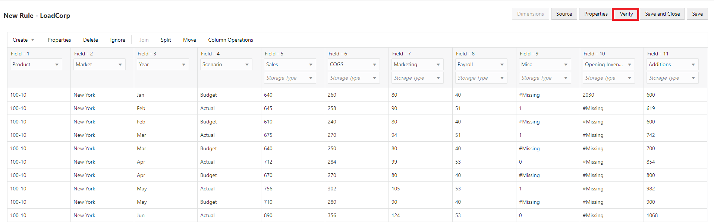

# Essbase Features: Advanced

## Introduction

This lab will walk you through some of the advanced features of Essbase 21c. For example:
* Data load to cubes 
* Execution of Calculation scripts 
* Utilities for Migration to Essbase 21c 
* Overview of Essbase REST API Functionality

Estimated Lab Time: *60 minutes*.

### Objectives

* Learn how to build rules, calculations and run corresponding jobs.
* Understand the Migration Utilities
* Understand the Essbase REST API functionality.

### Prerequisites

This lab requires -

* Essbase 21c instance
* Service administrator role
* Windows Operating System for Essbase add-ins (Smart View and Cube Designer)


## **Step 1:** Data Load to Cube

DataCorp IT group stores data in an Oracle Data warehouse that is being used to normalize the data. The IT group extracts data in flat files on a regular basis.

Loading data is the process of adding data values to a cube from any number of data sources or SQL database. Since data sources seldom are configured solely to support Essbase dimension build and data load processes, a rule file is generally used to create Essbase-compatible directives to be applied to the data source.

Create a rule file that is based on a sample file from the data warehouse.

1.	Download the rules file [here](https://objectstorage.us-ashburn-1.oraclecloud.com/p/Pnp9bHy2Ja5o7FQILaBFhCd02G4LM9Z1buBnCIjhW84/n/natdsepltfrmanalyticshrd1/b/Essbase-Workshop/o/Data_Basic.txt)


    Open the downloaded data file "Data_Basic.txt". Notice that there's no header row and the file delimiter is a comma.

    

2.	Sign in to the Essbase web interface.

3.	On the home page, expand the DynamicCorp application, and select the Sales cube.

4.	Now create the load rule.  
    a. In the Sales cube, from the right side hamburger, Click on "Inspect".  
       

	b. On the Scripts tab, select Rules. The Rules editor will show defined rules.  

	c. Click on Create and select Data Load to define the load data rule.  

	  

	d. In the New Rule dialog box, enter LoadCorp as the name of rule.

	e. Enter Measures as the data dimension.

	f. Under Preview Data, select File for flat file input.

	g. Browse to the file Data_Basic.txt that you downloaded. Click Open to select it.

	h.	As you saw earlier, the first row of the flat file doesn't contain header values. Uncheck the Header Row, if it is selected. When the header row is present the columns are mapped automatically.  

	i.	Select Comma as the Delimiter value based on the file format.  

	j.	Click Proceed.  

	  

1.  You can now see the preview of the data in the Rules editor based on the input flat file.

    The Global options toolbar, on the top right of the Rules editor allows you to modify file properties or the data source and to see the results in the Rules editor. The Field options toolbar on the left side of the Rules editor allows you map fields in the rule.

    Because there were no headers in the input file, you need to map each column to the appropriate dimensions and members.

2. In the Rules editor, you can now set up the rule fields.

    

    a. Click Create drop-down menu, and map the fields as below:.

    * Field 1 - Product
    * Field 2 - Market
    * Field 3 - Year
    * Field 4 - Scenario
    * Field 5 - Sales
    * Field 6 - COGS
    * Field 7 - Marketing
    * Field 8 - Payroll
    * Field 9 - Misc
    * Field 10 - Opening Inventory
    * Field 11 - Additions  
  
       All dimensions must be represented in the load data rule before any data can be loaded.

    b. After defining the rule with global and field options, click Verify on the Global toolbar to validate the syntax and then click Save and Close.

    c. Click Refresh. See that the created rule is now listed in the Rules pane of the Scripts tab.

    d. Click Close to return to the Applications home page. Next create a job to load the data using the rule.

3. On the home page, select Jobs and then New Job.
    

    a. Select Load Data.

    b. In the Load Data dialog box, from the Application menu, select the DynamicCorp application.

    c. In the Database list, select the Sales cube.

    d. In the Script list, select the load data rule that you created, LoadCorp.rul.

    e. For Load Type, select File.

    f. Select the file Data-basic.txt from the Data File list. This file is located in the DataCorp > Sales folder.

    g. Optional: select the Abort on error check box if you want the load to stop if an error occurs.

    h. Click OK. The load data job is executed.

    

    i. On the Jobs page, click Refresh to monitor the job status.


4. After the job is completed, verify that the input records were processed and loaded.

    a.	Select Job Details to check the load data job details.

    b.	Click Close when done.
     

9.	On the Applications page, click the Actions to the right of the DynamicCorp - Sales cube and click Inspect.

10. Select Statistics to view the resulting statistics for the Sales cube.

    

    You have now completed the data load using rule file.

## **Step 2:** Calculating Essbase Cube

A cube contains two types of values: values that you enter called input data and values that are calculated from input data.

A cube can be calculated using one of two methods:
*  Outline calculation: The calculation of a cube is based on the relationships between members in the cube outline(the hierarchy) and on any formulas that are associated with members in the outline. 

* Script based calculations: This contains a series of calculation commands, equations, and formulas, which allows you to define calculations other than those defined by the database outline calculation.  
  
  You create calculation scripts using a script editor in the Essbase web interface.  
  Calculation scripts do not apply to aggregate storage applications.

1.	On the Application page, expand the application.

2.	From the Actions menu on the right of the cube, click on Inspect.

    

3.	Select the Scripts tab, and then select the Calculation Scripts tab.

    

4.	Click Add  to create a new calculation script.

    Note:   
    If member names are required in your calculation script, drill into the Member Tree to find the members you want to add.
    Right-click dimension or member names to insert them into the script.  

    If function names are required in your calculation script, use the Function Name menu to find calculation functions and add them to the script.
    See the Function description under the menu to read descriptions of each function.

5.	The following calculation script, based on the DynamicCorp.Sales database, calculates the Actual values from the Year, Measures, Market, and Product dimensions:

    ```
    <copy>        
          FIX (Actual)
		CALC DIM(Year, Measures, Market, Product);
	ENDFIX</copy>
    ````


1. In the name field of script editor give the name to script as CalcActual.

    

7.	Click **Validate** before saving your script. Validating a script verifies the script syntax. For example, incorrectly spelled function names and omitted end-of-line semicolons are identified. Validation also verifies dimension names and member names.

8.	Correct any validation errors.

9.	Click Save and Close.

10.  After creating and saving calculation scripts, use the Jobs page to execute them and perform the calculations on data loaded in your cube.


11.	On the Jobs page, click New Job and select Run Calculation.

    

12.	On the Run Calculation dialog box, select the application - DynamicCorp and cube – Sales.

13.	Select the script – CalcActual.

    

14.	Click OK to start the calculation.

15.	Click Refresh to see the status of your calculation.

## **Step 3:** Migration Utilities

1. Download and configure CLI:  

  a. Login to Essbase web user interface.  
  
  b. Click on the Console tab at the top. Navigate to the Desktop tools on the left pane.  
  
  c. Expand the Command Line Tools section.  
  
  d. Download the Command-line Tool.  

     
  
  e. Unzip the cli.zip file in a directory e.g. C:\app\cli  
  
  f. Open a command shell window and change directory to where you unzipped the the CLI tool.  
 
 **    Tip:  To run the CLI tool you need JAVA\_HOME to be set or you will get this error
    C:\app\cli>esscs.bat
    Install JDK8 and set JAVA_HOME variable to JDK8 installed location**  
   
  g. From the command window type esscs.bat to get a list of the available command. 
      

  h. Next login using below commad:
      ```
    <copy>        
          esscs.bat login -url http://ip:9000/essbase -u userid
	</copy>
    ````
      
   


2. Import Sample Basic from CLI:

   a. Download the file [Sample_Basic.xlsx](https://objectstorage.us-ashburn-1.oraclecloud.com/p/84mR3q7KTI_8Fnno0QzJRAMX4HsPPTmU2863GqOo-ok/n/natdsepltfrmanalyticshrd1/b/Essbase-Workshop/o/Sample_Basic.xlsx) to your CLI directory.

     

      This file will be imported using CLI and it will be used for rest of the exercise.   

   b. Enter below command to deploy the the Sample cube using the Sample_Basic.xlsx file.  Name the application **Sample01** and cube as **Base**.

    ```
    <copy> esscs.bat deploy --help
    esscs.bat deploy -a Sample01 -db Basic -file Sample_Basic.xlsx </copy>
    ```

    

   c. Next, review the newly create cube from the Essbase Web Interface.

    

3. LcmExport: The LcmExport CLI command backs up cube artifacts to a Lifecycle Management (LCM) .zip file. To export Sample application deployed in last step use command.


    ```
    <copy> 
    esscs.bat lcmExport --help  
    esscs lcmExport -application Sample01 -zipfilename Sample01.zip </copy>
    ```

    

4. LcmImport: Restores cube artifacts from a Lifecycle Management (LCM) .zip file.

    ```
		<copy> 
        esscs.bat lcmImport --help 
        esscs lcmImport -z  C:/cli/Sample01.zip -o </copy>
    ```

    *NOTE:* The mentioned path should not contain spaces.

    

## **Step 4:** REST APIs

REST API for Oracle Essbase enables you to automate management of Essbase resources and operations. All requests and responses are communicated over HTTP.

You can view a list of all REST Endpoints.

**Explore the Swagger Interface**

The Swagger interface for Essbase REST enables you to try out REST requests in a visual interface, even before you have set up cURL(Client URL) or another API implementation method. cURL is a command-line data transfer tool you can use for making HTTP requests and other requests.

To use the Swagger interface,

1. Login Essbase web interface with url. For example: http://ip:9000/essbase/jet

2. In your browser address bar, select all of the URL string that immediately follows essbase, and replace it with /rest/doc/. For example, change the URL to:  http://ip:9000/essbase/rest/doc/

3. On Swagger web interface, you will be presented with number of different REST APIs.  

4.	Under Application logs, click on the second GET button (Download All Logs).

    

    

5.	Click the Try it Out button.

    

6.	Enter the name of application.

    

7.	Click the Execute button.

8.	Look under the Server Response section. If the request was successful, then you should see a 200 response with a body such as the following:

    

9.	Click on the Download File link to download zip file containing application log.

10. You can integrate REST APIs with cURL in order to automate various Essbase tasks. 
You may proceed to the next lab.

## Acknowledgements
* **Authors** -Sudip Bandyopadhyay, Manager, Analytics Platform Specialist Team, NA Technology
* **Contributors** - Eshna Sachar, Jyotsana Rawat, Kowshik Nittala, Venkata Anumayam
* **Last Updated By/Date** - Jyotsana Rawat, Solution Engineer, Analytics, NA Technology, March 2021

## Need Help?
Please submit feedback or ask for help using our [LiveLabs Support Forum](https://community.oracle.com/tech/developers/categories/oracle-analytics-cloud). Please click the **Log In** button and login using your Oracle Account. Click the **Ask A Question** button to the left to start a *New Discussion* or *Ask a Question*.  Please include your workshop name and lab name.  You can also include screenshots and attach files.  Engage directly with the author of the workshop.

If you do not have an Oracle Account, click [here](https://profile.oracle.com/myprofile/account/create-account.jspx) to create one.
