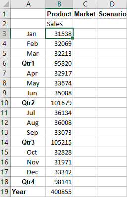
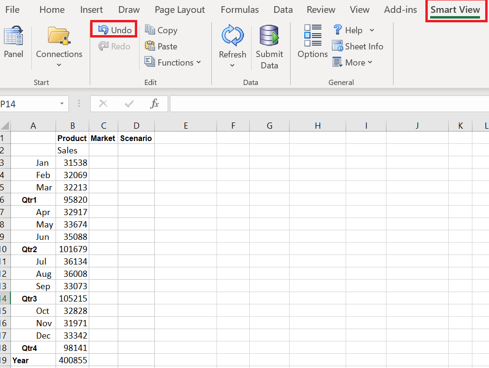
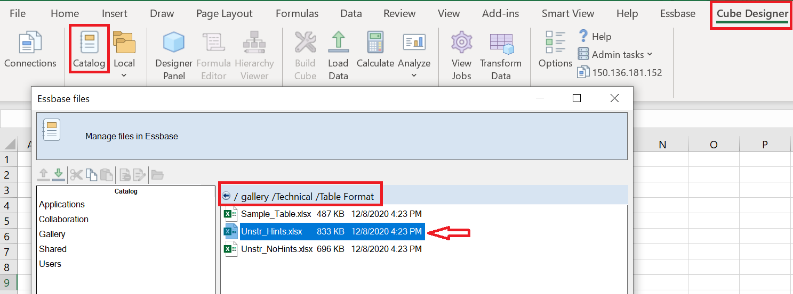
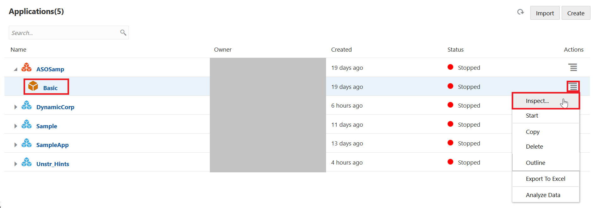
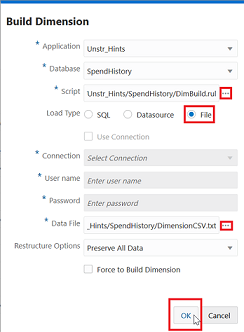
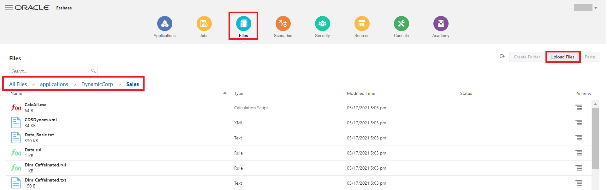

# Essbase Features: Basic

## Introduction

This lab walks you through the major features of Essbase 21c and their functionalities across the platform along with Overview of the Essbase 21c Web interface.

In this lab, the following topics will be covered:  

* Explore the Smart View interface
* Create Ad Hoc grids
* Overview of Web user interface

Estimated Lab Time: *30 minutes*.

### Objectives

 * Understand the Essbase 21c add-ins (Smart View and Cube designer)
 * Understand the Essbase 21c Web-interface overview.

### Prerequisites

This lab requires:

* Essbase 21c instance
* Service administrator role
* Windows Operating System for Essbase add-ins (Smart View and Cube Designer)

## **Step 1:** Creating a Sample Application in Essbase21c

1.	Login to the Essbase 21c web interface  using the Essbase URL. i.e. http://ip:9000/essbase/jet.
    
    Note: Please replace ip with your instance's IP Address.

2.	On the Applications tab click “Import” option in the Essbase web interface as shown below.

    

3.	Click Catalog.

    

4.	Select “Sample_Basic.xlsx” file  from:   
    All Files -> Gallery -> Applications ->Demo Samples-> Block Storage.

    

5.	Name the application “DynamicCorp” and the cube “Sales”. Click OK.

    

6.	Once the application is deployed, it will be visible under the "Applications" tab.

    

This concludes the creation of sample application from the “Catalog” in the Essabase 21c Web Interface.

## **Step 2:** Analyzing Essbase data using Smart View Add-ins

After installing Oracle Smart View for Office, you can create connections to Essbase. 

*Steps to create a private connection to Essbase:*

1. In Excel, select the Smart View ribbon, and then click Panel.

2. On the Smart View Panel, select the Private Connections from the list.

    

3. Enter the URL to create a connection. URL syntax: `http://ip:9000/essbase/smartview`

4. Click Go.

5. On the login window, enter your login credentials.
   Note: login with your IP address. 

    

6. After successful login, you can now begin working with data in Essbase. Expand ‘EssbaseCluster,’ navigate to the ‘DynamicCorp’ application.    
   
   Click on ‘Sales’ and 'connect'.  
   Click on 'Ad hoc analysis'.  
   
   

   

 

## **Step 3:** Create Ad Hoc Grids

  

**Smart View Ribbon**

The Smart View ribbon option enables you to set Smart View options and perform commands that are common for all data source providers.

**Essbase Ribbon**

The Essbase ribbon contains commands that enable you to view, navigate, and analyze Essbase data.

**POV Toolbar**

Dimensions that are not displayed in columns or rows of a data grid are displayed on POV toolbar, which identifies a slice of the database for a grid. For default ad hoc grids, all database dimensions are displayed on the POV toolbar at the dimension level.

**Smart View Panel**

You use Smart View panel to connect to your smart view data sources and manage connections.

1. Open a new Excel. Click Smart View – Panel – Private Connections. Enter the Smart View URL and the credentials.

2. In the Connection Manager panel to your right, click ‘DynamicCorp’ – ‘Sales’. Click Connect and then Ad hoc analysis.

    

3. After connecting to an Essbase server, you can initiate Ad Hoc reports against databases on the connected server. The Adhoc report on a blank worksheet returns data from the top levels of each database dimension.

    

4. Double click on year or Zoom in to next level. You will now see the Quarter level data.

    

5. Go to Year. Navigate to Essbase Ribbon and Click on Keep only. Using this option, only the Year Dimension will be displayed and all the Quarters are removed.
    

6. Go to Year. Click on Zoom in-All levels.You will now see the numbers drill down to leaf level(Months).

    

    

7. Double Click on Measures. It will Zoom into next level. 
   
   
   Now double click on Profit, it will take you further next level.
   

    Now double click on Margin, it will take you further to next level(i.e, at sales level).
   
   
   Select Sales and click Keep Only. Now you are analyzing only Sales numbers and you have removed the rest of the members from your sheet.

    

8.  In the Smart View ribbon click 'Undo'. Undo reverses the last change you made to the data.
    

9.  In the Smart View ribbon click ‘Redo’. It will take you back to the sheet prior to the ‘Undo’.

10. Click on Year and select Keep only. Click on Sales and change it to Measures by clicking "zoom out" on sales 3 times.

    Create the below report by zooming into next level of Year Dimension and Measures Dimension.
    
    
    
    

11.  Pivot to POV:

    a. Click on ‘POV’ in ‘Essbase’ ribbon.

    

    b. Click the down arrow next to Market. Select New York.

    

    

    c. Select New York in the POV toolbar, and click Refresh to see the figures refreshed in the sheet for New York.

    

12. Member Selection:

    Note: Revert the last step changes by Selecting Market and Scenario in the POV and Click on refresh.

    a. Click on ‘POV’ in ‘Essbase’ ribbon again.

    

    b. Click on Scenario

    c. Click on Member Selection in the Essbase ribbon. Select Actual and Refresh.

    

    

    

13. Free Form processing:

    a. You can enter a member combination on a sheet. Click Refresh. The sheet will be updated to show the results of the query in your free form sheet.

    b. Start by creating smart view analysis report.

    c. Create the below report by zooming into the Year & Measures dimension.

    

14. You can directly enter Sales account member in place of Profit to visualize sales data across year without needing to perform member selection.

15. Click on the Profit cell, and write Sales, hit enter and select refresh.
    
    

    

## **Step 4:** Install the Smart View Cube Designer Extension

1. On the ‘Smart View’ ribbon, select ‘Options’, and then ‘Extensions’.

    

2. Click the ‘Check for updates’ link. Smart View checks for all extensions that your administrator has made available to you.

    

3. Locate the extension named Oracle ‘Cube Designer’ and click ‘Install’ to start the installer.

4. Follow the prompts to install the extension.
   
   Note: Please give 1 or 2 minutes for cube designer to complete the installation. 

## **Step 5:** Creating a Cube from Tabular Data in Cube Designer

This workflow uses two sample tabular data Excel files to demonstrate the concepts of intrinsic and forced-designation headers. See About [Design and Manage Cubes from Tabular Data](https://docs.oracle.com/en/database/other-databases/essbase/21/ugess/design-and-manage-cubes-tabular-data.html)

1. In the Cube Designer ribbon, click connections -> select the current connection from the dropdown menu to connect to Essbase. 
   
   
   In Excel, on the ‘Cube Designer’ ribbon, click ‘Catalog’.

2.	On the Essbase Files dialog box, under Catalog, go to ‘gallery/Technical/Table Format’ as shown below, then select a sample tabular data file: `Unstr_Hints.xlsx`.

 

3.	Double click on the above directed file.  
 The table format workbook have Intrinsic headers that uses table.column format.

4.	On the `Cube Designer` ribbon, select `Transform Data`.

5.	On the `Transform Data` dialog box, enter an application and cube name, if you want to change the default names that are prepopulated.

    

1. The application name is based on the source file name without the extension and the cube name is based on the worksheet name.

    `Unstr_Hints.xlsx: Application name is Unstr_Hints and the cube name is SpendHistory`

7.	Click `Preview Data`. The workbook is sent to Essbase 21c for analysis and then you can verify the dimensions and their members. 

8.	When you are ready to create the cube, click `Run`.

9.	Once the job is finished, a pop-up will appear to view the job staus. If you want to see the job status, click `Yes`.

    

10.  The newly created application and cube are listed on the Applications home page in the user interface. Now the cube has been created from the tabular data, you can export the cube to an application workbook.

11.	On the `Cube Designer` ribbon, select `Local`, then select `Export Cube to Application Workbook`

    

12.	On the `Export Cube to Application Workbook` dialog box, select the application and cube, and then select `Run`

    

* In this exercise, you saw how a normal flat file Excel sheet can be converted into an Essbase application and a cube. You can get the application workbook DBX (Design by Example) file in a matter of seconds with the dynamic capabilities of Essbase powered by the Cube Designer add-ins.

## **Step 6:** Overview of the WEB-User Interface

### Applications:
1. Applications tab gives us the information about the Essbase applications and their respective cubes.

    

   Note: You can try below options for any application. For example, in below screenshots we are taking the ASOSamp or UnitHints Applications.

2. By choosing the Inspect option for application, you can see application specific logs, audit files, configuration files, etc.

    
    

3. You can access cube specific options by selecting Inspect for each cube.

    
    

4. Outline Analysis: The Outline option is equivalent to the EAS console in Essbase on-premises.

  This is where you can add new dimensions or members under dimensions at any level, as required, and can make changes to existing cubes quickly using the ‘Edit’ option. Select the ‘Outline’ option for the ‘SpendHistory’ cube. [or any cube that is already LIVE on the Essbase 21c web interface ].

    
    

5. Here, add a new child called ‘TotalA’ under the ‘Measures’ dimension as shown below. Let us now assign an ‘Ignore’ Consolidation operator to the ‘TotalA’ member. The operator defines how a new member rolls up across the hierarchy.

    

    

6. We now have to add a formula to this new member using the pencil icon under the ‘formula’ tab as shown. We will use **Spend + Invoice**;.
   
    

7. Once added, we need to verify the formula and then select Apply and Close.

    

8. You can also specify other options such as Data storage type and ‘Sort/Inspect’ of members in a dimension using the options in the web interface. 

    

9. Under Inspect, Click on Display selected columns in the table. You can select the different member properties to display in the outline tab.
   

   

10. Click on outline properties.
   

    Outline properties, in part, control the functionality available in an Essbase cube, they also control member naming and member formatting for attribute dimensions, alias tables and text measures.
    

### Jobs:

1. The Jobs tab displays all the information about the jobs that have been executed in the Essbase web user interface.  

   You can create and run new jobs using this tab by clicking on "New Job", as shown below.
    

1. Execute a Build Dimension job by selecting the application(Unstr_Hints) and cube(SpendHistory).

   The ‘Script’ file is the rule[.rul] file where the dimension build script exists.

   Select the pre-existing ‘DimBuild.rul’ file and its corresponding ‘DimensionsCSV.txt’ pair as the Data File, select the Restructure Options as "Preserve all data" and execute the job.

    

2. You can see the status of the job in Essbase web interface once it is submitted. For more details about the job you can click on "Actions".

    

### Files:

1. The Files tab is equivalent to the file directory of Essbase. The "Applications" folder consists of  all the files related to applications and their respective cubes.

    

2. In the Files tab, you can upload the artifacts/files related to Essbase, such as script files, rule files, load files etc. from your local system directly into the cube using the ‘Upload Files’ option under the corresponding cube path. [In the image below, the application name is ‘Sample’ and the cube name is ‘Basic’].

    

3. The ‘Gallery’ folder on the ‘Files’ tab has industry wide sample templates in dbx format that are ready to use. They help you kickstart the process of building cubes related to that specific industry very quickly.

    
    

### Scenarios:

1. The ‘Scenarios’ tab is where you create scenario modeling on the applications for ‘What-If’ analysis, which empowers the users to analyze the data and get insights from the data. [More details on this will be covered in an upcoming lab. ]

### Security:

1. The ‘Security’ tab holds the information about the users in Essbase and the roles they’re assigned. You can change the level of access assigned to a particular user.

2. You can add new users/groups by clicking on the ‘Add Role’ option.

    

### Sources:

1. Many cube operations require connection information to access remote source data or hosts. You can define ‘Connections’ and ‘Datasources’ once and reuse them in various operations.
   
   A connection stores login credentials required to access an external source. A Datasource points to an external source of information.  
   More details on this will be covered in an upcoming lab. 

    

### Console:

1. The Console tab is one stop place for Essbase Administrator tools such as:

    *	Export Utility: Command-Line tool for exporting the outline of a cube and other related elements into a application workbook.
    *	LCM: Life-Cycle Management tool is used for backing up and restoring the Essbase artifacts.  
    *	Command-Line Tool: CLI utility to perform administrative actions on On-Premise Essbase platform.
    *	Migration Utility: This utility is used for migrating Essbase artifacts  between Essbase instances and environments. This tab also contains the download links for Smart View and Cube Designer add-ins. Extensions and Essbase Client tools such as MaxL, Java API, and others are also available in the Desktop Tools section.

    

    * ‘Console’ tab also holds the information regarding session login by users, settings of the Essbase environment, email configuration settings etc.
    * The ‘Global configuration’ file of Essbase is available directly from the Essbase Web-user interface, here we can add new variable property settings with corresponding values using ‘Add’ option.

    

### Academy:

1. This tab contains all the information and documentation links related to Essbase 21c.

    

You may proceed to the next lab.

## Acknowledgements
* **Authors** -Sudip Bandyopadhyay, Manager, Analytics Platform Specialist Team, NA Technology
* **Contributors** - Eshna Sachar, Jyotsana Rawat, Kowshik Nittala, Venkata Anumayam
* **Last Updated By/Date** - Jyotsana Rawat, Solution Engineer, Analytics, NA Technology, March 2021

## Need Help?
Please submit feedback or ask for help using our [LiveLabs Support Forum](https://community.oracle.com/tech/developers/categories/oracle-analytics-cloud). Please click the **Log In** button and login using your Oracle Account. Click the **Ask A Question** button to the left to start a *New Discussion* or *Ask a Question*.  Please include your workshop name and lab name.  You can also include screenshots and attach files.  Engage directly with the author of the workshop.

If you do not have an Oracle Account, click [here](https://profile.oracle.com/myprofile/account/create-account.jspx) to create one.
