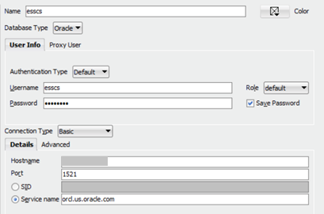
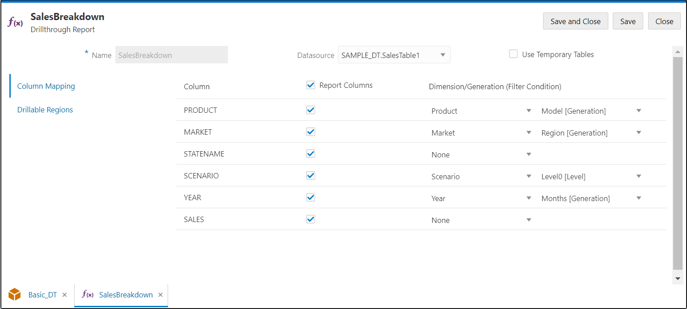
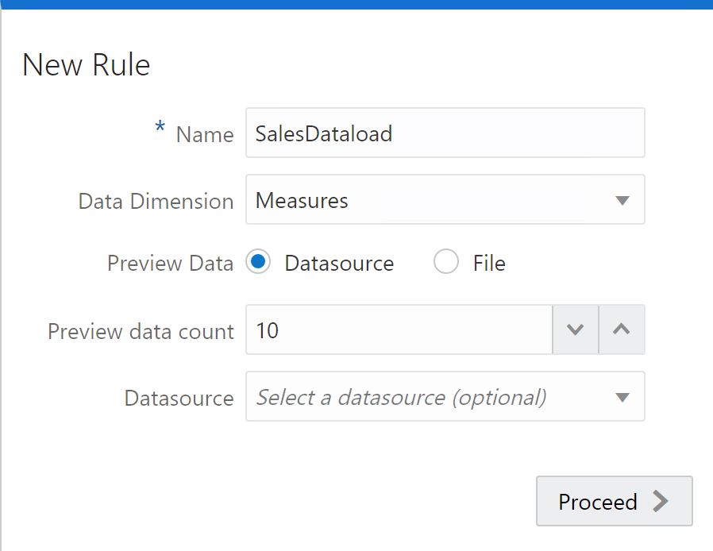
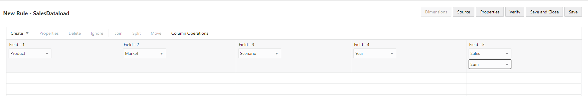
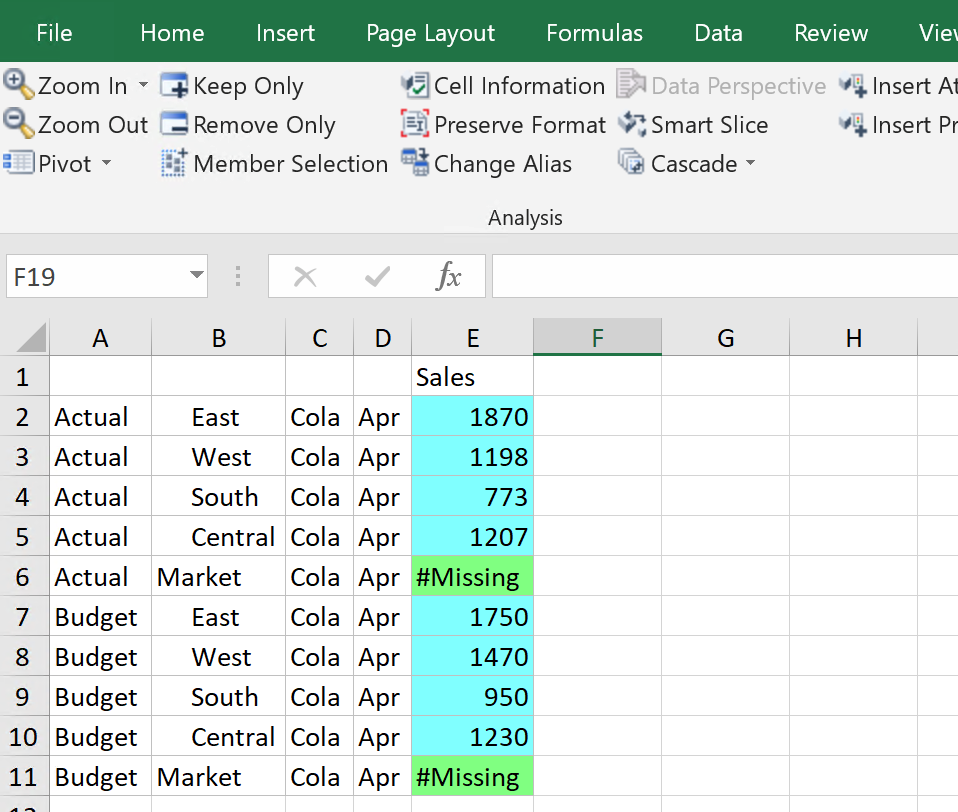
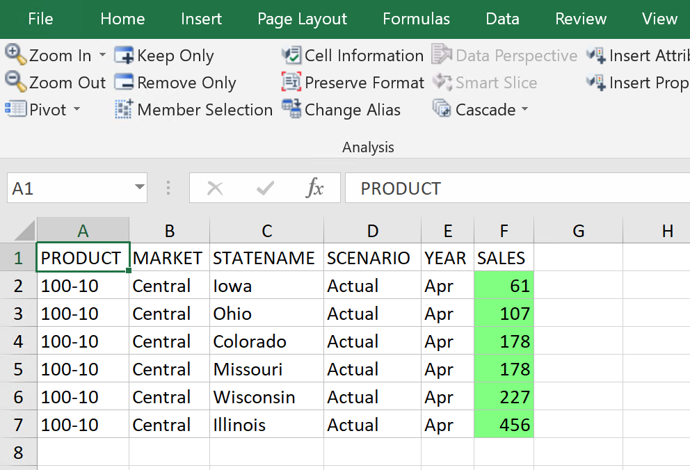

# Essbase and ADW

## Introduction

In this lab, you will learn how to analyze and interactively report the data in Essbase.  
We will use Essbase drill-through functionality to display additional detailed data that is retrieved from the external data sources.   

When you create an Essbase cube, you do not use all the data from an external data source. You choose and summarize the data in the cube for Essbase users to analyze. Using Essbase drill-through, you can create reports that display additional detailed data that is retrieved from the external data sources. This additional detailed data is not available in the Essbase cube.

Estimated Lab Time: *60 minutes*

### Objectives

* Connecting and verifyng data in Oracle Database.
* Create a connection from Essbase 21c to Oracle Database.
* Build dimension using data in database.
* Load data from Database to Essbase cube.
* View / Analyze data from database in Smart View.
* Drill through to data in database from Smart View.

### Prerequisites

* Essbase 21c instance.
* Database Conection details(Refer to Lab5).  
* Smart View plugin for Excel.
* SQL Developer Client(Optional)


## **Step 1:** Create the cube
We will create a variation of the Sample/Basic cube where Market dim has Region in the leaf level and it has no State. We will then load data from a relational table. The relational table contains Sales data that contains breakdown of Region Sales figures by States. All the Sales numbers for different States in a Region gets added to that Region. The summaries in Essbase enable users to compare Sales figures across Regions. 

This section demonstrates how to import a table to ADW instance.

1. Log in to Essbase Web User Interface.

2. Download the worksheet Sample\_Basic\_DT.xlsx [here](./files/Sample_Basic_DT.xlsx).  
 In the Home page, click on Import and create the cube using the worksheet Sample\_Basic\_DT.xlsx.  
 Change application Sample to SampleDT. 
 

3. Go to Home. Expand application SampleDT<StudentID>, cube Basic, select Actions and click on Outline. Click on the Market Dimension and check that Regions are at leaf level. 
  


4.  Close the outline browser tab.

5.	Open the query worksheet QueryDT.Sample within Sample\_Basic\_DT.xlsx.   
    Login to Smart View. Select the application SampleDT and click connect.

6.  Go to SmartView Ribbon –> Options –> Cell Styles –> Essbase –> Data Cells and pick colors for    Drill-through (blue), Read-Only (pink), Writable (green) and Linked Objects (yellow). 

    Click OK.
    
     

7. Refresh the sheet in Smart View. Notice data cells E2 to E11 representing Sales figures for different Regions are all color coded green.
    

  
## **Step 2:** Check the data in relational table(Optional)

   **Note**: The data was already loaded in the databases.  

1. Bring up SQL Developer. Create a connection to your relational data source. Enter provided information: Connection Name, Username, Password, Hostname, Port, SID/Service name.
   

2. Query the data in the relational table.
   Right click on Connection name -> Open SQL Worksheet. Type the query and check the result:   
    ```
    <copy>        
          select product, market, statename, scenario, year, sales from SALES_BREAKDOWN_SB order by product, market, scenario, year, sales
	</copy>
    ````
  
   
   Notice for example: For the Month April, under the Central Region, there are 6 Sales figures, one each for the 6 States under the Central Region. These 6 Sales numbers will get accumulated into the Sales for Central Region for the month of April. 

3. Check the database table SALES\_BREAKDOWN\_SB. Type the query: 

    ```
    <copy>        
          Select * from SALES_BREAKDOWN_SB
	</copy>
    ````
  


## **Step 3:** Define a Drill-through Connection
1. In Essbase UI, go to Home. Select the application SampleDT.

2. Launch application inspector, by clicking icon under Actions for the application selected and choose Inspect.
   

3. Click the Sources tab on the application inspector.

4. Click on Connections and click “Create connection” -> choose Oracle Database.
   

5. Provide the connection details for the Database Create Connection: Name, Host, User, Password, Port, Service Name.   
   Click Test to check that the connection to the database is successful. Click Create. 
   
    
## **Step 4:** Define Drill-through Datasource

1. Click Datasources link on the Sources tab on application inspector. Click on Create Datasource.

2. In the General tab of the Create Datasource wizard, select the connection from the drop down, pick the connection you just created in the previous exercise.
  Enter Name: "SalesTable". In the Query field, enter the database query string below and click Next. 

        
        <copy>        
            select product, market, statename, scenario, year, sales from SALES_BREAKDOWN_SB order by product, market, scenario, year, sales
        </copy>
        

   

3. The next page displays the Columns. Click Next.
   

4. Next page is Parameters. Click Next. 
   
   
5. In the next page Preview, you can see the results of the query, which is same as what you saw through SQL Developer. Click Create.
   

6. Now, you should see listed under Datasource: Datasource SalesTable1 and Connection Name you created above. 
   

7. Close the application inspector by clicking Close.

## **Step 5:** Exercise 1-6	Define Drill-through Report
1. Navigate to the database inspector for the application SampleDT and database Basic. Click on Scripts.   

   Select the -> Drill Through Reports on left navigation section.   

   On the Create menu to the right, click on the down arrow -> select Datasource.
   

2. Enter Name "SalesBreakdown". 

   Click dropdown for Datasource and select the data source you created above called "SAMPLEDT.
   
   SalesTable". Select the data source column name on the left and provide the generation mapping on the right. Select the Report Columns check boxes for all the rows. 
   
   Select the mappings:   
    i.   PRODUCT – Product -> Model[Generation]  
    ii.  MARKET – Market -> Region[Generation]  
    iii. SCENARIO – Scenario -> Level0 [Level]   
    iv.  YEAR – Year -> Months[Generation]   

   

3. Select Drillable Regions on the left navigation bar, click the “+” icon and enter @Children("Market").
   
   Click Save and Close. Click Close to close the database inspector.
   


## **Step 6:** Drill-through Color Coding
1. Go back to Smart View and open the query worksheet QueryDT.Sample within Sample\_Basic\_DT.xlsx.
   

2. We will now check drill-through color coding (blue color) to see if drill-through reports are defined.   

   Click Refresh in Smart View.   

   You will see data cells E2 – E5 and E7 – E10 enabled for drill-through reports.  

   This is the same region where we created the drill-through report through Essbase Cloud UI and represent summarized Sales for the different Regions.  
   

   Next, we will load data and drill through to the detailed breakdown of data in the external relational table.

## **Step 7:** Load Data
1. Create Load Rules:     

   Go to Home in Essbase Web User Interface. Select application SampleDT and cube Basic.   
   
   Launch the database inspector by clicking the icon under Actions and selecting Inspect.   
   
   Click Scripts. On the left navigation bar select -> Rules. Click Create menu to the right.  
   
   In the drop down menu, select Data Load.    
     * In the Name field, provide the name of the rules file as SalesDataload.  
     * For Data Dimension, select “Measures” dimension.  
     * Click Proceed.   
    
   
   

2. Click Create and select “Regular” from the drop down options. Do the same 3 more times to have 5 fields.

3. Map the fields as following:
      *  field #1:  Product 
      *  field #2:  Market  
      *  field #3:  Scenario
      *  field #4:  Year
      *  field #5:  Sales
      *  field #3:  Scenario
   
   

4. Click the Source button at the top. In the General tab, nn the Name field, enter the valid OCI connection string – $OCI$IP:1521/orcl. 

5. Click the SQL/Datasource Properties tab, enter below SQL statement in the Query field. Click Ok. 

    <copy>        
          select product, market, scenario, year, sales from SALES_BREAKDOWN_SB
	</copy>
    
   
   

6.	Click Verify. 

7.	Click Save and Close.

8.	Close the database inspector.

9.	Next, load the data from Jobs:   
    
    a.	On the home page select Jobs.   
    b.	Click New Job.   
    c.	Select Load Data as the job type.   
    d.	Select application SampleDT, cube Basic.  
    e.	SQL as the load type.   
    f.	For Scripts, select the name of the data load rules file you created, SalesDataload.rul.   
    g.	Enter the user name and password of your SQL database schema user. Click OK.

    

    The data load begins. Click Refresh to watch the status and when it completes, scroll to the right of the Status column, and click Job details to check Job execution Success. 
    


## **Step 8:** Execute Drill-through
1.	Go back to Smart View. Refresh the query sheet. Observe the Sales figure for the Central Region.
   

2.	We see sales for the month of April in the Central Region is 1207. 

    We want to see the detailed breakdown of Sales by States in Central Region. 

    Click on cell E5 1207.   
    
    Execute the drill-through report defined in cell E5 by clicking Drill-through in the Essbase ribbon.  
    You will land in a new sheet with the results of the drill-through report execution. It contains the detailed breakdown. 
    
    Note:  
    1) There are 6 states in Central Region with Sales for April. This matches the Sales query results from the relational table. Check Column C Statename showing the breakdown.  

    2) Enter a formula in cell F8 to sum the Sales numbers for the States: =SUM(F2:F7). The sum is 1207 which is the same value as the summarized Sales for Region Central in the Essbase cube.
      
    3) The column names A1 to F1 for the drill-through table matches the Alias you specified in the drill-through datasource definition.   

    


You may proceed to the next lab.

## Acknowledgements
* **Authors** -Sudip Bandyopadhyay, Manager, Analytics Platform Specialist Team, NA Technology
* **Contributors** - Eshna Sachar, Jyotsana Rawat, Kowshik Nittala, Venkata Anumayam
* **Last Updated By/Date** - Jyotsana Rawat, Solution Engineer, Analytics, NA Technology, March 2021

## Need Help?
Please submit feedback or ask for help using our [LiveLabs Support Forum](https://community.oracle.com/tech/developers/categories/oracle-analytics-cloud). Please click the **Log In** button and login using your Oracle Account. Click the **Ask A Question** button to the left to start a *New Discussion* or *Ask a Question*.  Please include your workshop name and lab name.  You can also include screenshots and attach files.  Engage directly with the author of the workshop.

If you do not have an Oracle Account, click [here](https://profile.oracle.com/myprofile/account/create-account.jspx) to create one.
