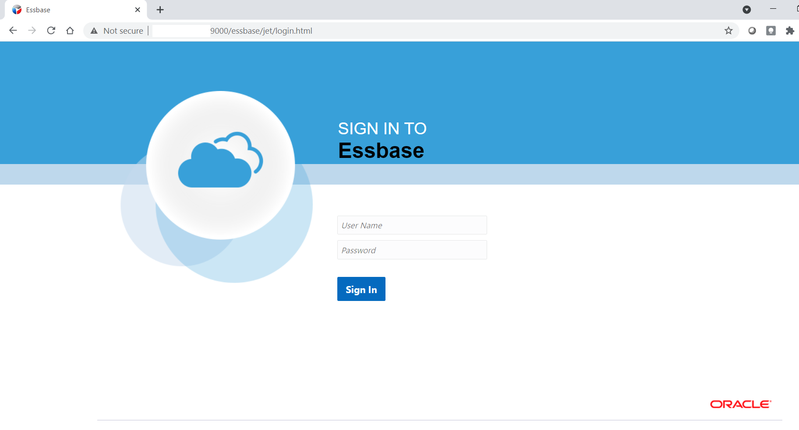

# Initialize Environment

## Introduction

This lab provides detailed instructions of connecting to Essbase 21c using Web UI. This machine comes with Essbase installed and configured with Oracle database and it also starts services on its own start-up.

*Estimated Lab Time:* 15 Minutes.

### Objectives
- Initialize the workshop environment.

### Prerequisites
This lab assumes you have:
- A Free Tier, Paid or LiveLabs Oracle Cloud account
- SSH Private Key to access the host via SSH
- You have completed:
    - Lab: Generate SSH Keys (*Free-tier* and *Paid Tenants* only)
    - Lab: Prepare Setup (*Free-tier* and *Paid Tenants* only)
    - Lab: Environment Setup

## **STEP 1**: Login To Oracle Essbase 21c Web UI
This lab has been designed to be executed end-to-end with any modern browser on your laptop or workstation. Proceed as detailed below to login.
### UI Access
1. Launch your browser to the following URL to access Oracle Essbase 21c UI  

    ```
    <copy>http://[Instance-public-ip]:9000/essbase/jet</copy>
    ```
    
    

***Note:*** While application processes are automatically started upon instance boot up, it takes approximately 15 minutes for this URL to become active after all processes have fully started. If the URL remains inactive even after 15 minutes, refer to **Step 2** below for manual start-up.

1. Login with the below credentials
    ```
    Username	: <copy>Weblogic</copy>
    ```

    ```
    Password	: <copy>EssbaseTechBang123</copy>
    ````

## **STEP 2**: Login to Host for manual startup (Optional)
While you will only need the browser to perform all tasks included in this workshop, you can optionally use your preferred SSH client to connect to the instance to perform any troubleshooting task such as restarting processes, rebooting the instance, or just look around.

### Start Script
Refer to *Lab Environment Setup* for detailed instructions relevant to your SSH client type (e.g. Putty on Windows or Native such as terminal on Mac OS):
 - Authentication OS User - “*opc*”
 - Authentication method - *SSH RSA Key*
 - OS User – “*oracle*”.

​Your workshop instance is configured to start all processes automatically needed for the labs. Perform these steps only if you are unable launch Essbase 21c UI in **Step1**

1. First login as “*opc*” using your SSH Private Key
​
2. Then login to *oracle*.


    ```
    <copy>sudo su - oracle</copy>
    ```


    
3.  Go to this folder /u01/scripts to find the manual startup script

    ```
    <copy>cd /u01/scripts/</copy>
    ```
    
4.  Start the env_startup_script to start all the services of Database and Essbase.

    ```
    <copy>./env_start_script.sh</copy>
    ```
    
Your script should be started and wait for the confirmation on start of servers.
You may now *proceed to the next lab*.

## Acknowledgements

- **Authors** - Sudip Bandyopadhyay, Manager, Analytics Platform Specialist Team, NA Technology
- **Contributors** - Eshna Sachar, Jyotsana Rawat, Kowshik Nittala, Venkata Anumayam
- **Last Updated By/Date** - Kowshik Nittala, Associate Solution Engineer, Analytics, NA Technology, March 2021

## Need Help?
Please submit feedback or ask for help using our [LiveLabs Support Forum](https://community.oracle.com/tech/developers/categories/converged-database). Please click the **Log In** button and login using your Oracle Account. Click the **Ask A Question** button to the left to start a *New Discussion* or *Ask a Question*.  Please include your workshop name and lab name.  You can also include screenshots and attach files.  Engage directly with the author of the workshop.

If you do not have an Oracle Account, click [here](https://profile.oracle.com/myprofile/account/create-account.jspx) to create one.
