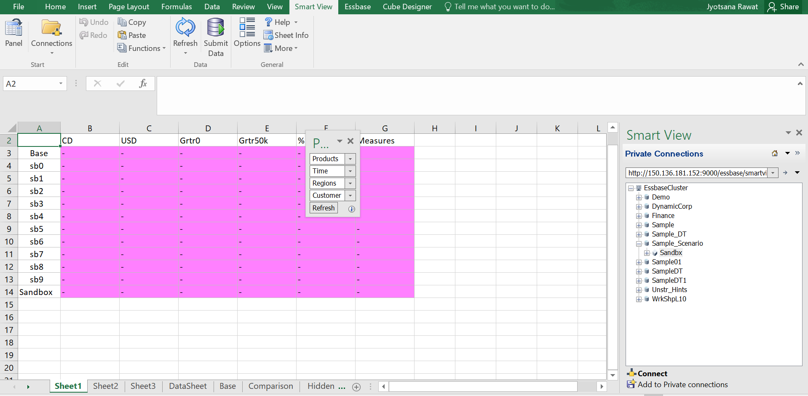
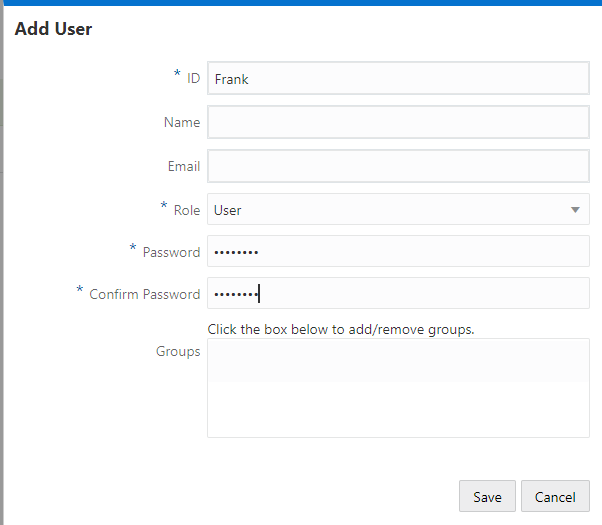
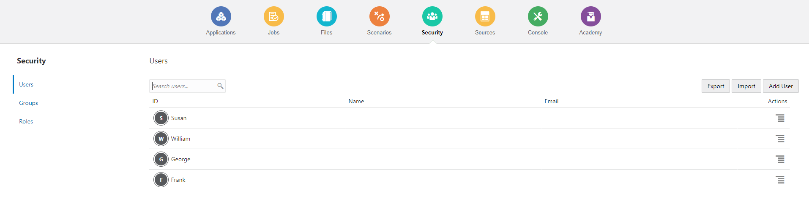
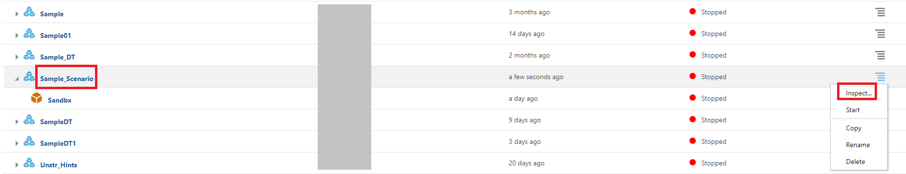
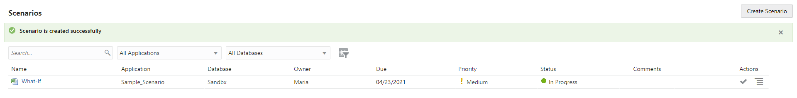
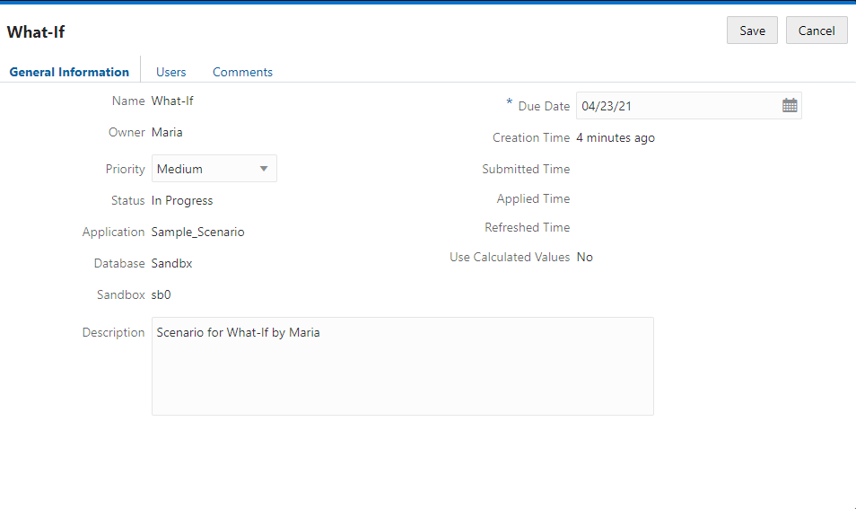
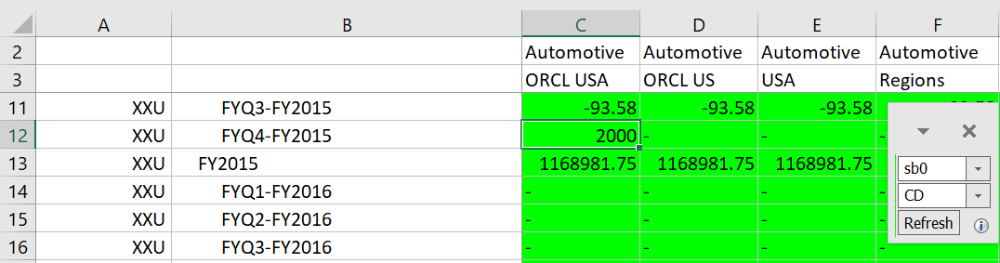

# Scenario Management

## Introduction

Using scenario management, scenario participants can perform what-if analysis to model data in their own private work areas. These scenarios can optionally be subject to an approval workflow, which includes a scenario owner and one or more approvers. In the workflow, scenario owners merge scenario data with the final cube data only after it is approved.

Estimated Lab Time: *30 minutes*.

### Objectives

To understand the following:

*	Scenario Management Overview
*	Creating a cube with Sandboxes
*	Creating a Scenario
*	Lightweight Sandboxes		
*	Changing Sandbox Data
*	Scenario Workflow

### Prerequisites

* Essbase 21 instance with Service administrator role.
* Windows Operating System for Essbase add-ins (Smart View and Cube Designer).
* Smart View plugin enabled for Excel.

## Overview – Understand Scenario

The exercises contained within this lesson will allow the user to get acquainted with different aspects of Scenario Management.  The different aspects include the lightweight nature of sandboxes on the cube; the process involved with initiating Scenario Management and adding sandboxes; as well as, the workflow supported by Scenario Management.  

*	Scenarios are private work areas in which users can model different assumptions within the data and see the effect on aggregated results, without affecting the existing data.

*	Each scenario is a virtual slice of a cube in which one or more users can model data and then commit or discard the changes.

*	The sandbox dimension is flat, with one member called Base and up to 1000 other members, commonly referred to as sandbox members. Sandbox members are named sb0, sb1, and so on.

*	Each sandbox is a separate work area, whereas the Base holds the data currently contained in the cube. A specific scenario is associated with exactly one sandbox member.

*	When first created, sandbox member intersections are all virtual and have no physical storage.

## **Step 1:**	Create a Scenario-Enabled Sample Cube

You can create a scenario-enabled cube by importing the scenario-enabled sample application workbook.

1. Download the worksheet SandboxApp.xlsx [here](./files/SandboxApp.xlsx).

   Open the SandboxApp.xlsx file.

2. Change the Application name (sheet Essbase.Cube) to Sample_Scenario.

   

3.	Navigate to the Cube.Settings sheet and check the properties section and the Scenario Sandboxes properties.

    

1. Save your file as SandboxApp.xlsx and close it. Create a new cube with the help of **Lab6->Step1**. Make sure to check that Load Data option is selected under Advanced Option.

    

## **Step 2:** Lightweight Sandboxes

**Show that Sandboxes are lightweight**  

This Step shows that creating sandboxes has little impact on resource usage such as disk space.

1. Download SmartView.xlsx file [here](./files/SmartView.xlsx).
   
   Open SmartView.xlsx  and go to sheet1 tab.
   

2. Go to the smartview, Create a private connection to Essbase: http://IP:9000/essbase/smartview.
   
   Note: Replace the IP with your instance's ip.

   Login and Select the “Sample_Scenario” Application and “Sandbx” Cube.
   
   
   
   In order to query the selected Cube, choose the option -> “Set Active Connection for this Worksheet”.

3. Refresh the data.
   

   **Note:**

   By default, all Sandboxes you create have the same values as the data loaded into the base. The data in the sandbox is dynamically queried and will not use any extra storage disk space. Only values that are modified as part of a scenario will be stored. This makes creating and using most scenarios a very light weight operation.  

## **Step 3:** Scenario Management
This Step is geared towards developing an understanding of security for Essbase and also the workflow aspects of Scenario Management.  In addition, you will create a couple of calculation scripts and leverage run-time substitution variables from within Smart View.

1. Add Users:   
   Go to security tab to add Users
   
   a) Under Users tab, click on Add user
   
   
   b) Provide the details for adding user: "John"
     * Id: John
     * Role: user
     * Password: password
    

   c) Repeat above steps for adding  Maria, Phillip & Sam.
    

2.	Defining Security:  

    We will define security roles for several people to be used throughout the next several exercises. Once the security is defined validate the privileges by logging in as each user and pay attention to the differences from user to user.
    
   a) On the home page, navigate to the “Sample_Scenario” Application. Launch the application inspector by clicking the button under Actions and selecting Inspect.
   

   b) On the application inspector, click the Permissions tab. Click the + icon on this page to add users to this application.
   

   c) Search for John, Maria, Phillip & Sam and click the + icon next to their ids to add the to the application.
     
     

   d) by default all users have the Database Access Roles.
     

   e) Assign the following roles to the below users and Click Close:
      * John -> Database Manager
      * Phillip -> Database Update
      * Sam -> Database Update
      * Maria -> Database Update
      

    f) Go to Smartview and disconnect from the current connection.

    g) Open the Smart View.xlsx file and go to the Sheet3 tab.

    h) Connect as John, Sam and Maria drilling down and up on the Sandbox dimension for each user. 

    **Note: To easily switch between users – select Disconnect All from the SmartView Panel and then re-log in.**


1. Creating Scenarios:
   
   In this exercise you will login as Maria and create a new scenario defining Sam as a participant. Validate the impact of the security changes for each user John, Maria, Sam and Phillip.  Without logging out from Smart View, make Phillip a Scenario Approver, then refresh the data in Smart View validate the change to his security.
    
   a) Go to the Web UI, logging in as Maria.

   b) Navigate to Scenarios tab. Click Create Scenario button.
      

   c) Give the scenario a name:**What-If** and a due date. On the Users tab Click the "+" icon and add Sam as a Participant. By default a user is added as a Participant. 
      
      

      Click Save.

   d) Identify which sandbox member your scenario is using by clicking on the name of the scenario once it is created.
     
     

   e) Go back to Smart View.-----remove

   f) Go to SmartView Excel and on the Sheet3 tab connect as John, Sam, and Maria drilling down and up on the Sandbox dimension for each user.----remove

   g) Go to the Web UI, login in as Maria and assign Phillip the approver role to the sandbox.
      

   h) Go to Smart View and connect as Phillip drilling down on the Sandbox dimension.
      


2. Changing Sandbox Data:
   As Sam, you will change some data for the scenario that was just created and using the Essbase Web UI you can see the differences between Base and the scenario.

   a) Go to Excel and in the Smart View.xlsx 

   b) Go to the DataSheet tab and connect to the database as Sam, ensure the the POV has the correct sandbox member(sb0). 
      

   c) Go to the cell C12 enter a number(for e.g, 2000) then click submit (the intersection updates should be  XXU->FYQ4-FY2015->Automotive->ORCL USA).
      

   d) Go to Essbase Web UI, navigate to the Scenarios tab. Select the scenario What-if and click the Actions icon.

   e) Click on the Show Changes button, to show the changes in the UI.
      

      Verify the changes:
      

3. Calculations in a Sandbox: 
In this step you will create a calculation script that will create data for ORCL USA->XXU->Automotive in 2016 by increasing 2014 data by 15%.

   a) Login to Essbase Web UI as John.

   b) Navigate to the database inspector for the “Sandbx” database under the “Sample_Scenario” application.

   c) Click on the Scripts tab on the database inspector and select Calculation Scripts from the left navigation menu.
     

   d) Click the + icon on the right to create a calculation script. Name the script as **Feed16**, type the below content in the scripts section:


    ```
    <copy>        
    set updatecalc off;
    SET CREATENONMISSINGBLK ON;
    Fix("XXU","Automotive","[USA].[ORCL US].[ORCL USA]", @Children(FY2016), "sb0")
    "CD" (@Prior(Base, 8, @LevMbrs(Time,0)) * 1.15;)
    "USD" (@Prior(Base, 8, @LevMbrs(Time,0)) * 1.15;)
    EndFix

	</copy>
    ````
    
    

   e) Validate the script. Click Save and Close.

   f) To execute the script, navigate to the Jobs tab and create a new job by clicking New Job -> Run Calculation.
     

   g) Select the Application and database and the calc script that was just created(Feed16). For Variables select the “sb0” as Value for the sandbox variable.

   h) Click OK.
     

   i) Click refresh icon, to see the job status.
      

   j) Go to Smart View and retrieve data into the DataSheet tab. Also review the comparison tab.
      Datasheet:
      
      
      Comparison:
      

      Note: In Smartview you are already logged in as Sam.

   k) Go to Essbase Web UI as Sam, Navigate to the Scenarios tab. For What-If Scenario, click on the icon under Actions and select Show Changes to show the changes in the UI.
      

      Verify the Changes:
      

4. Scenario Workflow:
   
   At this point two things happened with our Sandbox. Sam entered some data using Smart View and John run a calc script that created some data for 2016. Now we will use the Scenario workflow to submit and ultimately merge the scenario data with the base. The flow that we will simulate is:

   * Maria is submitting the data for approval.
   * Phillip can review the data and decides to approve.
   * Once Maria sees that Phillip approve, she can apply the data to the Base.

   Since you are doing it by yourself, you will need to play both Maria and Phillip. If you have two different browsers (e.g. Firefox and Chrome) you can log in as each participant in a different browser and jump between the two personas. The instructions will assume that you are using the same browser for both (and therefore logout and login will be needed).

   Let’s start:

   a) Login to Essbase Web UI as Maria. Navigate to the Scenarios tab and select Scenario What-if.
      

   b) Under Actions, click the “->” icon to Submit, enter a comment if needed. The status should now be submitted.
      

   c) Go to Smart View and retrieve data into the Comparison tab.

   d) Go to the Web UI logging in as Phillip. Navigate to the Scenarios tab and select Scenario What-if.

   e) Under Actions, click the  icon to Approve, enter a comment if needed.
      
      

   f) Go to Smart View and retrieve data into the Comparison tab.

   g) Login to Essbase Web UI as Maria. Navigate to the Scenarios tab and select Scenario What-if.

   h) Under Actions, click the   icon to Apply sandbox “sb0” to the Base, enter a comment if needed.
      

   i) Go to Smart View and retrieve data into the Comparison tab.

    

    Note: Notice that changes still not been updated to base.


## **Step 4:** Run-time Substitution Variables

Upload the Merge calculation script to your database and review it.  Then, in Smart View, execute the script using the selections (mentioned in Point 10e).  After the script has run validate the data in the Base member.

1. Log on to Essbase Web UI as John.

2. Download the file Merge.csc [here](./files/Merge.csc).

   Launch the database inspector for the application “Sample_Scenario” and database “Sandbx”. Select Files tab and click Upload Files.

   

3. Drag or select the provided Merge.csc file.
   

4. Click Close.

5. Select the Scripts tab on the database inspector.

6. Click on the Merge Script to view/edit it.
   

7. Look through it. Validate the script.
   

8. Click on Roles tab. Click on the + icon and add Maria.
   

9. Click Close to close the database inspector. 

10. Go to Smart View and make sure you are logged in as Maria. On the Comparison tab.  
     a.	Select the “sb0” cell(C2 if unadulterated)  

     b.	Click on Calculate on the Essbase ribbon.  
              

     c.	Select the Merge calculation script 

     d.	Notice the default selections and that “sb0” was selected for the Sandbox to merge  

     e.	Change the propmts:  

        i)  Product = XXU  
        ii)  Customer = Automotive (Hint: Use the search feature to find the member)  
        iii) Region = USA  
        iv) Periods = FYQ1-FY2016, FYQ2-FY2016, FYQ3-FY2016, FYQ4-FY2016  
        v)  Sandbox = sb0  
            
    

11. Click launch.

12. Retrieve data in comparison tab.
    

    Notice now th changes are applied to the base.


Note:
Notice that John having "Database Manager" permission, was able to define who can update the changes in the base(database). Also, Maria after creating scenario was not able to apply the changes to base(database) because she was having only "Database Access" permission.


## Acknowledgements
* **Authors** -Sudip Bandyopadhyay, Manager, Analytics Platform Specialist Team, NA Technology
* **Contributors** - Eshna Sachar, Jyotsana Rawat, Kowshik Nittala, Venkata Anumayam
* **Last Updated By/Date** - Jyotsana Rawat, Solution Engineer, Analytics, NA Technology, April 2021

## Need Help?
Please submit feedback or ask for help using our [LiveLabs Support Forum](https://community.oracle.com/tech/developers/categories/oracle-analytics-cloud). Please click the **Log In** button and login using your Oracle Account. Click the **Ask A Question** button to the left to start a *New Discussion* or *Ask a Question*.  Please include your workshop name and lab name.  You can also include screenshots and attach files.  Engage directly with the author of the workshop.

If you do not have an Oracle Account, click [here](https://profile.oracle.com/myprofile/account/create-account.jspx) to create one.
