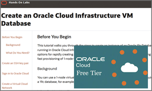
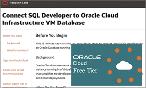

# Oracle Database Github

The industry’s leading database continues to deliver leading-edge innovations, including machine learning, to enable self-driving data management. This enterprise-proven, database cloud service is designed to support mixed workloads through any deployment strategy, on premises or in the cloud. Experience the power of the next-generation database with unmatched performance, ease, and flexibility by clicking on one of our hands-on workshops.

## Workshops
Click below to access the content.

### New Features for Developers Workshops

    

### Multitenant Workshops

    

### In-Memory Workshops

    

### Create a Database on OCI VM 

   

### Connect SQL Developer to OCI VM Database

   

- [I have a Freetier or Oracle Cloud account](https://oracle.github.io/learning-library/developer-library/oracle-db-features-for-developers/freetier/index.html)
- [I have an account from SSWorkshop](https://oracle.github.io/learning-library/developer-library/oracle-db-features-for-developers/ssworkshop/index.html)

## Get an Oracle Cloud Trial Account for Free!
If you don't have an Oracle Cloud account then you can quickly and easily sign up for a free trial account that provides:
- $300 of free credits good for up to 3500 hours of Oracle Cloud usage
- Credits can be used on all eligible Cloud Platform and Infrastructure services for the next 30 days
- Your credit card will only be used for verification purposes and will not be charged unless you 'Upgrade to Paid' in My Services

Click here to request your trial account: [https://www.oracle.com/cloud/free](https://www.oracle.com/cloud/free)

## Product Pages
- [Oracle Database 19c](https://www.oracle.com/database/)

## Documentation
- [Oracle Database 19c Documentation](https://docs.oracle.com/en/database/oracle/oracle-database/19/books.html)

## Videos
- [Oracle Database Product Management YouTube Channel](https://www.youtube.com/channel/UCr6mzwq_gcdsefQWBI72wIQ)

### Issues?
Please submit an issue on our [issues](https://github.com/oracle/learning-library/issues) page.  We review it regularly.

-- Oracle Database Product Management
