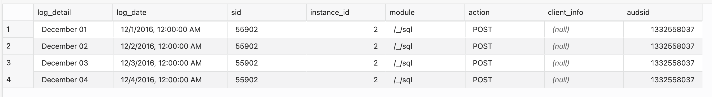
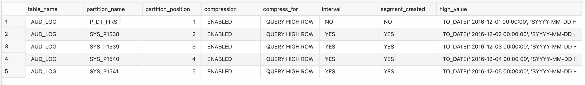

# Advanced row compression

## Introduction

Advanced row compression enables table data to be compressed during all types of data manipulation operations, including DML INSERT and UPDATE operations. The intelligent algorithm minimizes compression overhead during write operations, making compression viable for data warehouse and OLTP workloads. The benefits of Advanced row compression go beyond just on-disk storage savings. One significant advantage is Oracle’s ability to read compressed blocks (data and indexes) directly, in memory, without uncompressing the blocks. This helps improve performance due to the reduction in I/O and system calls related to the I/O operations. Further, the buffer cache becomes more efficient by storing more data without adding memory.

### Data growth challenges 

Exponential data growth has put severe pressure from a cost, performance, scalability and management perspective. It has become imperative to employ more efficient ways of storing and managing data to meet the growing demands on IT systems. The rapid growth in data volumes and associated costs are of significant concern for many companies. The companies have started a global initiative to identify and drive a reduction in storage costs. 

### Expectations from adapting a compression technique 

*	Storage costs to drop as the result of any compression deployments, and 
*	No query performance degradation and only minimal Data Manipulation Language (DML) performance impact from compression.
 
This Lab will teach you how to create advanced row compression. 

### Objectives
 
In this lab, you will:
* Create advanced row compression 

### Prerequisites
This lab assumes you have completed the following lab:

- Provision an Oracle Autonomous Database and ADW Instance has been created
  
## Task 1: Create advanced row compressed table

create table aud_log 

```
<copy>
  create table aud_log 
  ( 
    log_detail              varchar2(1000), 
    log_date                date          default sysdate, 
    sid	                    varchar2(256)	default sys_context('USERENV','SID'), 
    instance_id             number(2)     default sys_context('USERENV','INSTANCE'), 
    module	                varchar2(256)	default sys_context('USERENV','MODULE'), 
    action	                varchar2(256)	default sys_context('USERENV','ACTION'), 
    client_info	            varchar2(256)	default sys_context('USERENV','CLIENT_INFO'), 
    audsid                  number        default sys_context('USERENV','SESSIONID') 
  ) 
  partition by range (log_date) interval (interval '1' day)  
  ( partition p_dt_first 
    values less than (to_date(' 2016-12-01 00:00:00', 'SYYYY-MM-DD HH24:MI:SS', 'NLS_CALENDAR=GREGORIAN')) segment creation deferred 
  );
</copy>
```  

Create unique index pky\_aud\_log.

```
<copy> 
create unique index pky_aud_log on aud_log (log_date, sid, instance_id) local;
</copy>
```

add constraint pky\_aud\_log primary key.

```
<copy>
alter table aud_log add constraint pky_aud_log primary key (log_date, sid, instance_id) using index enable;
</copy>
```

insert data into aud_log table.

```
<copy>
insert into aud_log (log_date, log_detail) values ( date '2016-12-01', 'December 01');
insert into aud_log (log_date, log_detail) values ( date '2016-12-02', 'December 02');
insert into aud_log (log_date, log_detail) values ( date '2016-12-03', 'December 03');
insert into aud_log (log_date, log_detail) values ( date '2016-12-04', 'December 04');
</copy>
```

view aud_log table data.

```
<copy>
select * from aud_log; 
</copy>
```



Insert values into the table.

```
<copy>
select table_name, partition_name, partition_position, compression, compress_for, interval, segment_created, high_value 
from user_tab_partitions 
where table_name = 'AUD_LOG' 
order by partition_position;
</copy>
```

  

Display data from a specified partition in the table. 

```
<copy>
select index_name, partition_name, partition_position, compression, segment_created, high_value, 'alter index '||index_name||' rebuild partition '||partition_name||' compress advanced low;' cmd 
from user_ind_partitions 
where index_name = 'PKY_AUD_LOG';
</copy>
```


When you are finished testing the example, you can clean up the environment by dropping the table 

## Task 2: Cleanup
 
```
<copy>
DROP TABLE aud_log; 
</copy>
```
  
You successfully made it to the end this lab Range Partitions.   

## Learn More

* [Row Compression](https://livesql.oracle.com/apex/livesql/file/content_D84SJGGDXB1SW4HKXVX6BK7N9.html) 
 
## Acknowledgements

- **Author** - Madhusudhan Rao, Principal Product Manager, Database
* **Contributors** - Kevin Lazarz, Senior Principal Product Manager, Database  
* **Last Updated By/Date** -  Madhusudhan Rao, Feb 2022 
