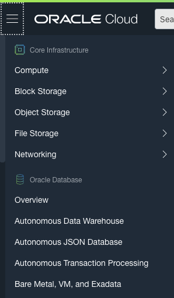

# Creation of the primary Database

In this lab we will setup will create the primary database.

> **Warning** on copying and pasting commands with multiple lines from the browser screen; when you copy from outside of the Remote Desktop environment and paste inside the Remote Desktop environment, additional **enters** or CRLF characters are pasted causing some commands to fail. 

## Create the primary database

To create the primary database we need to follow a wizard. 
Click the hamburger menu at the top left then select **Bare Metal, VM and Exadata**

This will bring you to the Database As A Service DB Systems page.
To start creating the primary database, click the **Create DB System** Button.

Verify that at the top, you have selected the correct compartment that you have been assigned to.
Then you can start to fill in the required information. This Workshop can be run in any region with 3 Availabilty domains. 
Use following information to enter in the wizard.

* Name of the DB System: 	**ADGHOLAD1**
* Select the first AD in the region you are located.
* Choose the Virtual Machine Shape type.
* Select the VM.Standard2.2 shape. If this is not the default, use the "Change Shape" button to change this. 

Up to now, the screen should look similar to this.

Then we scroll further down and we use following information:
* Total node count: 1
* Oracle Database Software Edition: Enterprise Edition Extreme Performance
* Storage Management: Logical Volume Manager

We choose the Logical Volume Manager for 2 reasons. The creation of the database is faster but also, we need access to the datafiles for the Excercise about Automatic Block media recovery later in the Workshop where we will corrupt a block and let Active Data Guard repair it. 
We need Enterprise Edition Extreme Performance to have access to Active Data Guard. Enterprise Edition High Performance will give you access to Data Guard with the mounted physical standby.
 
We leave the storage Default:

And we will let the cloud create the SSH Key pair for us.

Make sure to download both of the keys **NOW** and store them locally on a safe place so you do not lose them and find them back easily.

For the license, pick "License Included"

With regards to the network configuration, pick the Virtual Cloud network you have created with the setup of your compartment and also specified the already existing client subnet. 

For the Hostname prefix, use: **VMADGHOLAD1**

Next step is to configure our database. Go further by clicking the Next button.

Use following information to create the database.
* Database name: DGHOL
* Database image: Oracle Database 19c
* PDB name: mypdb

As the password use: **WelC0me2##**

Leave all the rest default and click the "Create DB system" Button.

This will bring you to the DB System home page which will be provisioning. 

When this step has been completed, then you have succesfully created the primary database.

This will take some time (20 to 45 minutes).

Afterwards the Database is available

