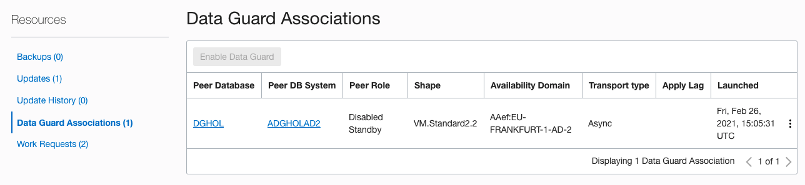

# Performing a Failover

In this lab, we will be performing a failover operation.

Oracle Data Guard helps you change the role of databases between primary and standby using either a switchover or failover operation.

A switchover is a role reversal between the primary database and one of its standby databases. A switchover guarantees no data loss and is typically done for planned maintenance of the primary system. During a switchover, the primary database transitions to a standby role, and the standby database transitions to the primary role.

A failover is a role transition in which one of the standby databases is transitioned to the primary role after the primary database (all instances in the case of an Oracle RAC database) fails or has become unreachable. A failover may or may not result in data loss depending on the protection mode in effect at the time of the failover.

> **Warning** on copying and pasting commands with multiple lines from the browser screen; when you copy from outside of the Remote Desktop environment and paste inside the Remote Desktop environment, additional **enters** or CRLF characters are pasted causing some commands to fail. 


## Performing a Failover

A switchover is always started from the primary database, where a failover is initiated from the standby database. 
The difference between a switchover and a failover is that a switchover is a graceful operation where a failover is only needed when the primary database is broken beyond repair or that repair would take too long. 

We will use SQL Developer to connect to the Database System.You can run this tool from any desktop that has network connectivity to the Database System.

You can download SQL Developer from this link: [SQL Developer Home page](https://www.oracle.com/be/database/technologies/appdev/sqldeveloper-landing.html) 

Please make sure to complete Lab 3 before starting this Lab.


## Verify the database roles in the database

Using SQL Developer, you can drag and drop the panes so that they are next to eachother or shown split horizontally. 


Verify the roles with following Query:

````
Select name, db_unique_name, database_role from v$database;
````

Enter this query in both panes and click the run button to see the result.


We can conclude that the Database in AD2 is the primary database and the database in AD1 is the Standby database.


## Perform the role transition

In the OCI console, navigate to the DB System Details of the ADGHOLAD1 database and scroll down to the Databases section.

Overview
-> Bare Metal, VM and Exadata
-> DB Systems

Select **ADGHOLAD1**


Click on the name **DGHOL** and in the next screen scroll down immediately and click on **Data Guard Associations**


Click on the 3 dots on the right, and click **Failover**


This is a DBA responsability, so the tooling asks the password. Enter the SYS password from the Primary database and click **OK** then the role transition starts.


At this point, the lifecycle state will be updating and the role transition happens in the background.


After some time the role transition finished and the state is Available again. 


## Reinstate the old primary, the new standby

A failover means that the old primary, in our case the DB in AD2, will be disabled. To use this database again as a standby database, we need to reinstate it.

To do so, navigate to the new primary, the database in AD1 via 

Overview
-> Bare Metal, VM and Exadata
-> DB Systems

And select ADGHOLAD1.
Then scroll down and click on HOLDG database.


This brings you to the Database details. Scroll down on the page and click on **Data Guard Associations**.
 


Click on the 3 dots on the right, and click **Reinstate**


This is a DBA responsability, so the tooling asks the password. Enter the SYS password from the Primary database and click **OK** then the reinstate starts.


At this point, the lifecycle state will be updating and the reinstate happens in the background.


After some time the role transition finished and the state is Available again. 


## Verify the database roles in the database

Using SQL Developer, verify the roles again with following Query:

````
Select name, db_unique_name, database_role from v$database;
````

Enter this query in both panes and click the run button to see the result.


We can conclude that the Database in AD2 is the primary database and the database in AD1 is the Standby database.


## Summary
You have now succesfully performed a failover.