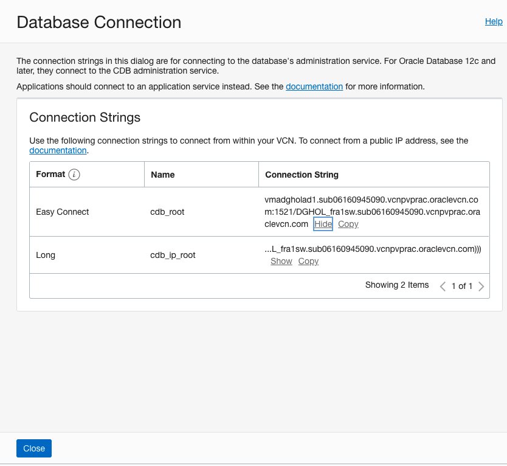

# Connection to the Databases

In this lab we will set up will create the standby database.

> **Warning** on copying and pasting commands with multiple lines from the browser screen; when you copy from outside of the Remote Desktop environment and paste inside the Remote Desktop environment, additional **enters** or CRLF characters are pasted causing some commands to fail. 

## Connection to the Databases

We will use SQL Developer to connect to our new database system with a primary and a standby database. 
You can run this tool from any desktop that has network connectivity to the database system.

You can download SQL Developer from this link: [SQL Developer Home page](https://www.oracle.com/be/database/technologies/appdev/sqldeveloper-landing.html) 

When you first opened SQL Developer, the screen looks like this:

## Create the Connection to the primary ##

First we need to know the service name from the primary Database and also the IP address it listens to. 

To get that information, navigate to the Overview
-> Bare Metal, VM and Exadata
-> DB Systems
-> DB System Details
-> Database Details

There you click the **DB Connection** button and the Database Connection information window opens.

Click the **Show** Hyperlink from the Easy Connect format and make a note of the connection string. The part after the / (slash) is the service name. Make a copy of this on the clipboard or make sure to have this information noted down. Then close this window.

The second thing we need to know to connect to the database is the IP Addres from the host it is running on.

To get that information, navigate to the Overview
-> Bare Metal, VM and Exadata
-> DB Systems (Select the **ADGHOLAD1** DB System)
-> DB System Details

Scroll down on the page and click on **Nodes(1)** to find on which host it resides.
The Public IP Address part is the IP Address we want to know. Make a copy of this on the clipboard or make sure to have this information noted down. 

Then we go back to SQL Developer.

To add the connection, click the **Green Plus icon** at the top left.
The wizard opens.

To add the connection, use following information:

* Name: sys@ADGHOLAD1
* Username: sys
* Role: SYSDBA
* Hostname: The Public IP Address you found in the step above
* Service name: The service name you found in the step above (the part after the / (slash)).

Then click the **Test** button and this connection should be successful. When it is successful, click the save button and click thet **Connect** button.

## Create the Connection to the Standby ##

First we need to know the service name from the standby Database and also the IP address it listens to. 

To get that information, navigate to the Overview
-> Bare Metal, VM and Exadata
-> DB Systems  (Select the **ADGHOLAD2** DB System)
-> DB System Details
-> Database Details

There you click the **DB Connection** button and the Database Connection information window opens.

Click the **Show** Hyperlink from the Easy Connect format and make a note of the connection string. The part after the / (slash) is the service name. Make a copy of this on the clipboard or make sure to have this information noted down. Then close this window.

The second thing we need to know to connect to the database is the IP Addres from the host it is running on.

To get that information, navigate to the Overview
-> Bare Metal, VM and Exadata
-> DB Systems
-> DB System Details

Scroll down on the page and click on **Nodes(1)** to find on which host it resides.
The Public IP Address part is the IP Address we want to know. Make a copy of this on the clipboard or make sure to have this information noted down. 

Then we go back to SQL Developer.

To add the connection, click the **Green Plus icon** at the top left.
The wizard opens.

To add the connection, use following information:

* Name: sys@ADGHOLAD2
* Username: sys
* Role: SYSDBA
* Hostname: The Public IP Address you found in the step above
* Service name: The service name you found in the step above (the part after the / (slash)).

Then click the **Test** button and this connection should be successful. When it is successful, click the save button and click thet **Connect** button.

## Summary
You have now successfully created a database connection to the primary and the standby database.