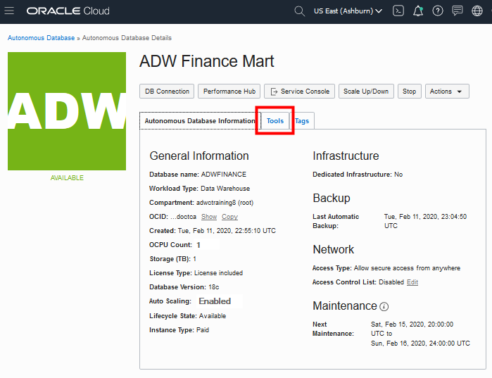

<!-- Updated March 24, 2020 -->

# Connect to the Database Using SQL Developer Web

## Introduction

In this lab, you will connect to the database using SQL Developer Web, a browser-based tool that is easily accessible from the Autonomous Data Warehouse or Autonomous Transaction Processing console.

## Objectives

-   Learn how to connect to your new autonomous database using SQL Developer Web

## Prerequisites

-   This lab requires completion of the 2 prior labs in this workshop: **Get a Free Trial** and **Provision an Autonomous Database**, in the Contents menu on the right.

## **Step 1:** Connect with SQL Developer Web

Although you can connect to your autonomous database from local PC desktop tools like Oracle SQL Developer, you can conveniently access the browser-based SQL Developer Web directly from your Autonomous Data Warehouse or Autonomous Transaction Processing console.
1. In your database's details page, click the **Tools** tab.

    

2. The Tools page provides you access to SQL Developer Web, Oracle Application Express, and Oracle ML User Administration. In the SQL Developer Web box, click **Open SQL Developer Web**.

    

3. A sign in page opens for SQL Developer Web. For this lab, simply use your database instance's default administrator account, ADMIN, with the admin password you specified when creating the database. Click **Sign in**.

    

4. SQL Developer Web opens on a worksheet tab. The first time you open SQL Developer Web, a series of pop-up informational boxes introduce the main features.

    

    Keep this worksheet tab open and please proceed to the next lab.

## Want to Learn More?

Click [here](https://docs.oracle.com/en/cloud/paas/autonomous-data-warehouse-cloud/user/sql-developer-web.html#GUID-102845D9-6855-4944-8937-5C688939610F) for documentation on connecting with the built-in SQL Developer Web.

## Acknowledgements

- **Author** - Richard Green, Principal Developer, Database User Assistance
- **Last Updated By/Date** - Richard Green, May 2020

## Need Help?
Please submit feedback or ask for help using our [LiveLabs Support Forum](https://community.oracle.com/tech/developers/categories/livelabsdiscussions). Please click the **Log In** button and login using your Oracle Account. Click the **Ask A Question** button to the left to start a *New Discussion* or *Ask a Question*.  Please include your workshop name and lab name.  You can also include screenshots and attach files.  Engage directly with the author of the workshop.

If you do not have an Oracle Account, click [here](https://profile.oracle.com/myprofile/account/create-account.jspx) to create one.
