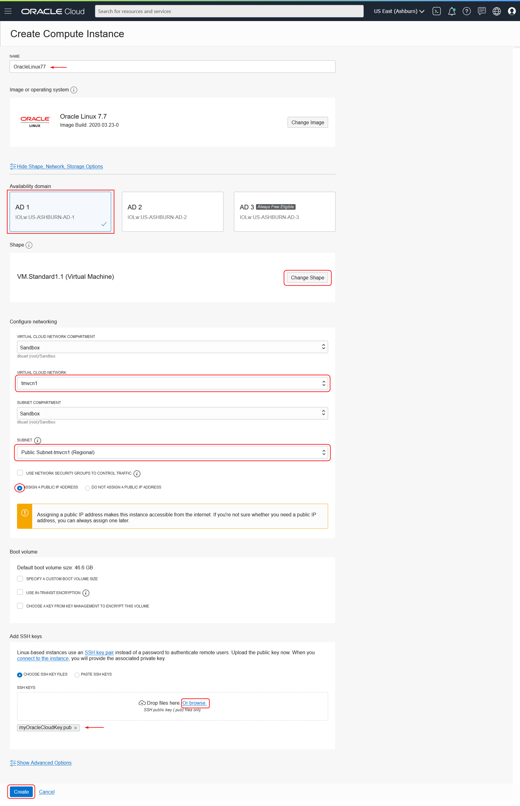
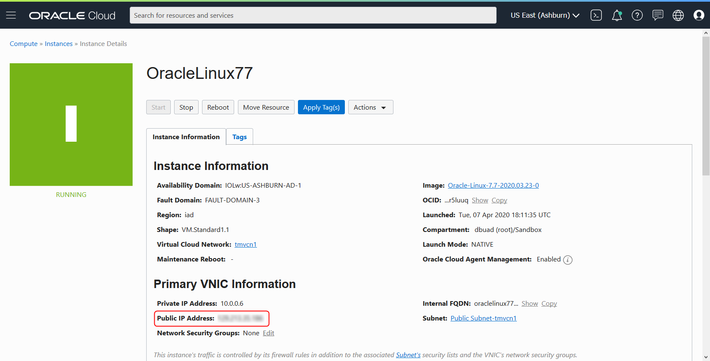

# Create an Oracle Cloud Infrastructure Compute Instance
## Before You Begin

This lab walks you through the steps to create an Oracle Cloud Infrastructure Compute instance with an Oracle Linux virtual machine.

### Background
Oracle Cloud Infrastructure Compute allows you provision and manage compute hosts, known as instances. You can launch instances as needed to meet your compute and application requirements. After you launch an instance, you can access it securely from your computer, restart it, attach and detach volumes, and terminate it when you're done with it.

### What Do You Need?

* An Oracle Cloud paid account or free trial. To sign up for a trial account with $300 in credits for 30 days, click [here](http://oracle.com/cloud/free).
* SSH Keys
* A Virtual Cloud Network (VCN)

## **STEP 1**: Create a Compute instance

1. From the Console menu, select **Compute -> Instances**.

  

2. Select the compartment you want to create your compute instance in, and click **Create Instance**.

  

3. On the Create Compute Instance screen, perform the following actions:

    - Enter a **Name** for your compute instance, for example `OracleLinux77`.
    - (Optional) Select an availability domain.
    - Click **Change Shape** to select a compute shape with at least 4GB of memory. Note that an Always Free shape will not work for this lab. In this example, VM.Standard1.1 is a single OCPU, 7GB memory shape. See [Compute Shapes](https://docs.cloud.oracle.com/en-us/iaas/Content/Compute/References/computeshapes.htm#vm-standard) for more information.
    - Select your Virtual Cloud Network (change your compartment if you don't see the VCN you want).
    - Select the **Public Subnet** for your VCN.
    - Be sure that **Assign a Public IP Address** is checked.
    - Click **Or browse** to locate your SSH public key file.
    - Click **Create** to create the compute instance.

  

4. When the compute instance provisioning process is complete, the icon will turn green. Make a note of the **Public IP Address**.

  

  You may now proceed to the next lab.

## Want to Learn More?

* [Overview of Compute Service](https://docs.cloud.oracle.com/en-us/iaas/Content/Compute/Concepts/computeoverview.htm)

## Acknowledgements
* **Author** - Gerald Venzl, Master Product Manager, Database Development
* **Adapted for Cloud by** -  Tom McGinn, Learning Architect, Database User Assistance
* **Last Updated By/Date** - Tom McGinn, March 2020

## **See an issue?**
Please submit feedback using this [form](https://apexapps.oracle.com/pls/apex/f?p=133:1:::::P1_FEEDBACK:1). Please include the *workshop name*, *lab* and *step* in your request.  If you don't see the workshop name listed, please enter it manually. If you would like for us to follow up with you, enter your email in the *Feedback Comments* section. 
