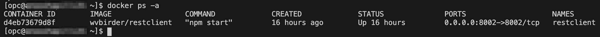
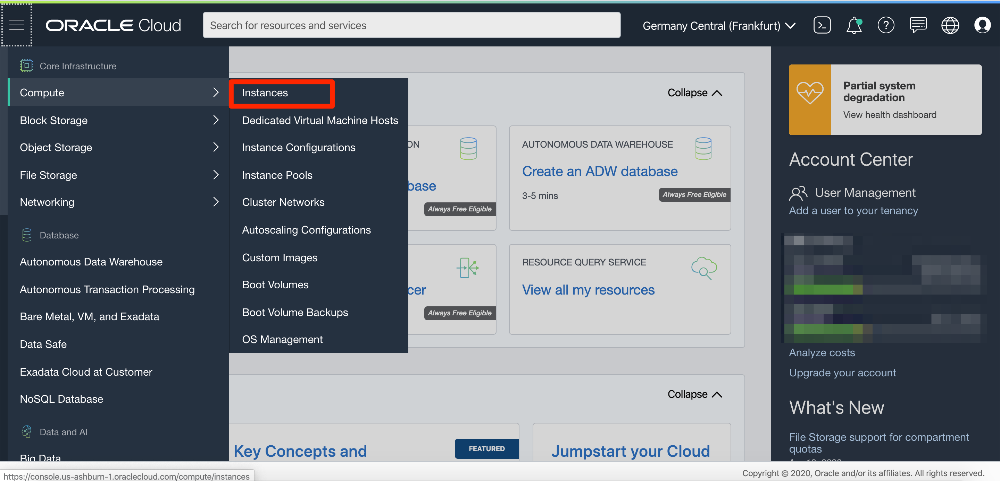
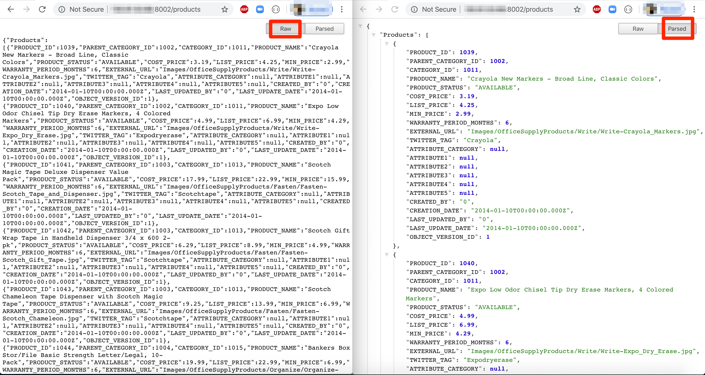
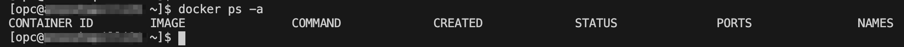
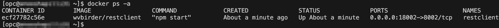
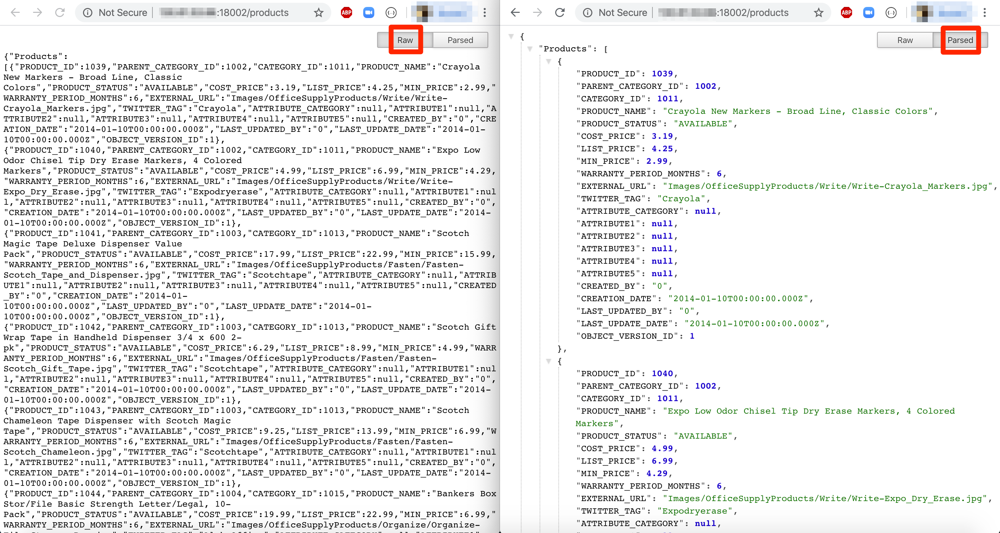

# Docker Basic Concepts
## Before Your Begin

This lab walks you through the steps to start, stop, relocate and get information about the network of a Docker container.  This lab takes approximately 10 minutes.

### What is Docker?
Docker is an open platform for developing, shipping, and running applications. Docker enables you to separate your applications from your infrastructure so you can deliver software quickly. With Docker, you can manage your infrastructure in the same ways you manage your applications.  A Docker container is a running instance of a Docker image. However, unlike in traditional virtualization with a type 1 or type 2 hypervisor, a Docker container runs on the kernel of the host operating system. Within a Docker container, there is no separate operating system.

### Docker Basic Commands

This lab will walk you through a few basic commands used in docker.  Here's a list of common commands for your reference.

- docker run – Runs a command in a new container.
- docker start – Starts one or more stopped containers
- docker stop – Stops one or more running containers
- docker build – Builds an image form a Docker file
- docker pull – Pulls an image or a repository from a registry
- docker push – Pushes an image or a repository to a registry
- docker export – Exports a container’s filesystem as a tar archive
- docker exec – Runs a command in a run-time container
- docker search – Searches the Docker Hub for images
- docker attach – Attaches to a running container
- docker commit – Creates a new image from a container’s changes

### Lab Prerequisites?

* Chrome Browser (preferred)
* Install JSON Extension [click here]()
* Completed the following labs:  Login to Oracle Cloud/Setup Free Tier, Create SSH Keys, Setup Compute Instance
  

## **STEP 1**: Start the Application

1.  Check the version of docker:

    ````
    [opc@oraclelinux77 ~]$ <copy>docker version</copy>
    Client: Docker Engine - Community
    Version:           19.03.1-ol
    API version:       1.40
    Go version:        go1.12.5
    Git commit:        ead9442
    Built:             Wed Sep 11 06:40:28 2019
    OS/Arch:           linux/amd64
    Experimental:      false

    Server: Docker Engine - Community
     Engine:
      Version:          19.03.1-ol
      API version:      1.40 (minimum version 1.12)
      Go version:       go1.12.5
      Git commit:       ead9442
      Built:            Wed Sep 11 06:38:43 2019
      OS/Arch:          linux/amd64
      Experimental:     false
      Default Registry: docker.io
     containerd:
      Version:          v1.2.0-rc.0-108-gc444666
      GitCommit:        c4446665cb9c30056f4998ed953e6d4ff22c7c39
     runc:
      Version:          spec: 1.0.1-dev
      GitCommit:        
     docker-init:
      Version:          0.18.0
      GitCommit:        fec3683
    [opc@oraclelinux77 ~]$
    ````

2.  The `ps` command is used to list the existing docker containers.
   
    ````
    [opc@oraclelinux77 ~]$ <copy>docker ps</copy> 
    ````

    
   
3.  Start your application, `restclient`, in docker on port 8002 in JSON format.  

    ````
    [opc@oraclelinux77 ~]$ <copy>docker run -d -it --rm --name restclient -p=8002:8002 -e DS='json' wvbirder/restclient</copy>
    Unable to find image 'wvbirder/restclient:latest' locally
    Trying to pull repository docker.io/wvbirder/restclient ... 
    latest: Pulling from docker.io/wvbirder/restclient
    d3c7072f2c09: Pull complete 
    2b20841a9829: Pull complete 
    c116f21f499c: Pull complete 
    d75d720b3ed2: Pull complete 
    fdb28d19184b: Pull complete 
    52877892e2e0: Pull complete 
    dfc9dc6c0d02: Pull complete 
    d53863f7e327: Pull complete 
    8127b1a45280: Pull complete 
    2218da00cfd9: Pull complete 
    Digest: sha256:56cc4b9e8dddf4922e0189c1840c682df6c806e80db8ea93f1c957bc96b4f932
    Status: Downloaded newer image for wvbirder/restclient:latest
    d4eb73679d8f8629fa7f4c79b24b573c977bcc2d0beed9ceaca4b42be0745f2d
    [opc@oraclelinux77 ~]$ 
    ````

    - "-d" flag runs the container in the background
    - "-it" flags instructs docker to allocate a pseudo-TTY connected to the container’s stdin, creating an interactive bash capable shell in the container (which we will use in a moment when we connect into the container)
    - "-h" We give the container a hostname "oracledb-ao" to make it easier to start/stop/remove, reference from other containers, etc
    - "-p" We map port 8002 from within the container to the same ports on the HOST for accessibility from outside of the container's private subnet (typically 172.17.0.0/16). This allows the container to be accessed from the HOST, for example. The default port for Oracle's tns listener is on port 1521 and port 5600 is used for HTTP access to Enterprise Manager Express
    - "--name" The name of the container will be "restclient"
    - "-v" This maps the directory where you downloaded the restclient setup.

4.  The `ps` command with the `-a` option shows the status of all containers that are running.

    ````
    [opc@oraclelinux77 ~]$ <copy>docker ps -a</copy>
    ````

    

5.  To find the public IP address of your instance, click on Compute -> Instance in Oracle Console as shown in below image.

    

    Make note of the public IP address for your compute instance under the `Public IP` column as highlighted in below image.

    

6.  Navigate to http://YOUR PUBLIC IP ADDRESS:8002/products in a new tab on your browser using public IP address copied earlier. You should see the products in your application in JSON format. To visualize the JSON data in parsed format you should install `JSON Formatter` browser extension.
   
    `Note: Disconnect from Oracle's VPN`

    

## **STEP 2**: Stop the Application

1.  The `restclient` container was started earlier with the `-rm` remove option. While stopping, it removes all allocated resources.

    ````
    [opc@oraclelinux77 ~]$ <copy>docker stop restclient</copy>
    restclient
    [opc@oraclelinux77 ~]$ 
    ````

2.  After stopping the application, you can see that there are no containers running.

    ````
    [opc@oraclelinux77 ~]$ <copy>docker ps -a</copy>
    ````

    

## **STEP 3**: Start the Container in Another Port

1.  Let's start another container on your compute instance on 18002 port. Type the following command:

    ````
    [opc@oraclelinux77 ~]$ <copy>docker run -d -it --rm --name restclient -p=18002:8002 -e DS='json' wvbirder/restclient</copy>
    ecf27782c56e75df376e9d6d0aaa915c17e50362e9487f2ab98441a11369df6d
    [opc@oraclelinux77 ~]$ 
    ````

2.  Check the status of all the containers that are running.

    ````
    [opc@oraclelinux77 ~]$ <copy>docker ps -a</copy>
    ````

    

3.  Go back to your browser and change the port to 18002 to see the products in your application.

    

## **STEP 4**: Inspect the Network Bridge

Inspecting the network bridge shows network information about all the containers running on the default bridge.

1.  Inspect the network bridge that docker created for you out of the box. We see that our restclient container is assigned IP address 172.17.0.2. You can ping that address from your compute instance.

    ````
    [opc@oraclelinux77 ~]$ <copy>docker network inspect bridge</copy>
    [
        {
            "Name": "bridge",
            "Id": "8f7a23f70a68e29ca058c4756fb43155d9a6db9d6ede50da08cae8d2e473f0ed",
            "Created": "2020-04-16T21:05:39.515702648Z",
            "Scope": "local",
            "Driver": "bridge",
            "EnableIPv6": false,
            "IPAM": {
                "Driver": "default",
                "Options": null,
                "Config": [
                    {
                        "Subnet": "172.17.0.0/16"
                    }
                ]
            },
            "Internal": false,
            "Attachable": false,
            "Ingress": false,
            "ConfigFrom": {
                "Network": ""
            },
            "ConfigOnly": false,
            "Containers": {
                "ecf27782c56e75df376e9d6d0aaa915c17e50362e9487f2ab98441a11369df6d": {
                    "Name": "restclient",
                    "EndpointID": "3a7d4f37aafa814a61c288ac974c0faeb238b9471ac8ead6610ca0bdda5f5ede",
                    "MacAddress": "02:42:ac:11:00:02",
                    "IPv4Address": "172.17.0.2/16",
                    "IPv6Address": ""
                }
            },
            "Options": {
                "com.docker.network.bridge.default_bridge": "true",
                "com.docker.network.bridge.enable_icc": "true",
                "com.docker.network.bridge.enable_ip_masquerade": "true",
                "com.docker.network.bridge.host_binding_ipv4": "0.0.0.0",
                "com.docker.network.bridge.name": "docker0",
                "com.docker.network.driver.mtu": "1500"
            },
            "Labels": {}
        }
    ]
    [opc@oraclelinux77 ~]$ 
    ````

2.  Ping IP address for your restclient container from your compute instance.

    ````
    [opc@oraclelinux77 ~]$ <copy>ping 172.17.0.2 -c3</copy>
    PING 172.17.0.2 (172.17.0.2) 56(84) bytes of data.
    64 bytes from 172.17.0.2: icmp_seq=1 ttl=64 time=0.075 ms
    64 bytes from 172.17.0.2: icmp_seq=2 ttl=64 time=0.054 ms
    64 bytes from 172.17.0.2: icmp_seq=3 ttl=64 time=0.063 ms

    --- 172.17.0.2 ping statistics ---
    3 packets transmitted, 3 received, 0% packet loss, time 2075ms
    rtt min/avg/max/mdev = 0.054/0.064/0.075/0.008 ms
    [opc@oraclelinux77 ~]$ 
    ````

3.  Stop your restclient container.

    ````
    [opc@oraclelinux77 ~]$ <copy>docker stop restclient</copy>
    restclient
    [opc@oraclelinux77 ~]$ 
    ````  
    
You may now proceed to the next lab.

## Acknowledgements
* **Author** - Oracle NATD Solution Engineering
* **Last Updated By/Date** - Anoosha Pilli, April 2020

See an issue?  Please open up a request [here](https://github.com/oracle/learning-library/issues).   Please include the workshop name and lab in your request. 


