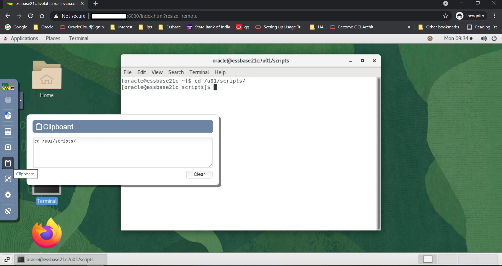
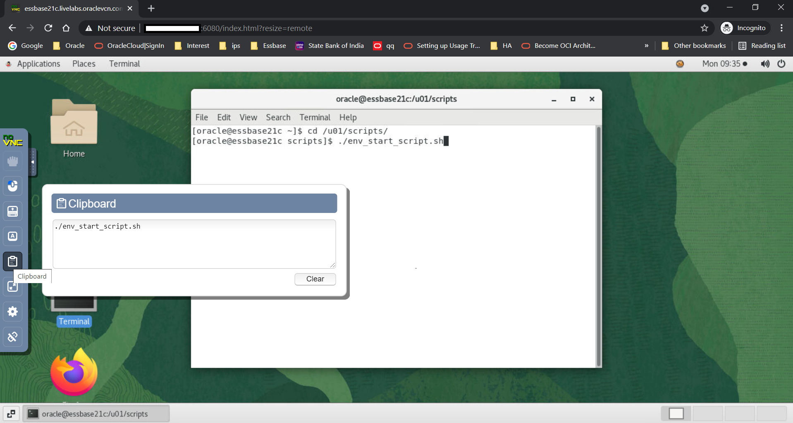
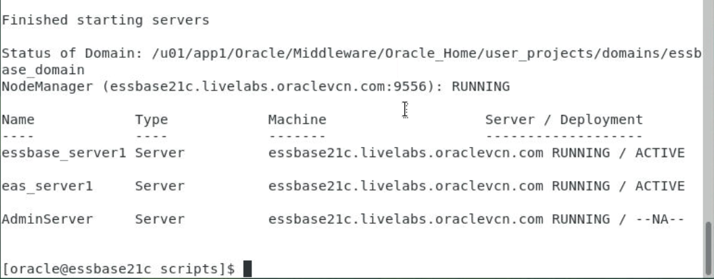

# Initialize Environment

## Introduction

This lab provides detailed instructions of connecting to Essbase 21c using Web UI. This machine comes with Essbase installed and configured with Oracle database and also starts its services on its own start-up.

*Estimated Lab Time:* 10 Minutes.

### Objectives
- Initialize the workshop environment.

### Prerequisites
This lab assumes you have:
- A Free Tier, Paid or LiveLabs Oracle Cloud account
- You have completed:
    - Lab: Prepare Setup (*Free-tier* and *Paid Tenants* only)
    - Lab: Environment Setup

## Task 1: Validate That Required Processes are Up and Running.
1. Now with access to your remote desktop session, proceed as indicated below to validate your environment before you start executing the subsequent labs. The following Processes should be up and running:

    - Database Listener
        - LISTENER
    - Database Server instance
        - ORCL
    - Essbase Server

2. On the *Web Browser* window on the right preloaded with *Essbase Console*, click on the *Username* field and select the saved credentials to login. These credentials have been saved within *Web Browser* and are provided below for reference

    - Username

    ```
    <copy>Weblogic</copy>
    ```

    - Password

    ```
    <copy>Oracle_4U</copy>
    ```

    

3. Confirm successful login. Please note that it takes about 5 minutes after instance provisioning for all processes to fully start.

    

    If successful, the page above is displayed and as a result your environment is now ready.  

    You may now [proceed to the next task](#task-2-download-and-stage-workshop-artifacts).

4. If you are still unable to login or the login page is not functioning after reloading the application URL, open a terminal session and proceed as indicated below to validate the services.

    - Database and Listener
    ```
    <copy>
    sudo systemctl status oracle-database
    </copy>
    ```

    
    

    - WLS Admin Server and Essbase Server
    ```
    <copy>
    sudo systemctl status essbase.service
    </copy>
    ```

    

5. If you see questionable output(s), failure or down component(s), restart the corresponding service(s) accordingly

    - Database and Listener

    ```
    <copy>
    sudo sudo systemctl restart oracle-database
    </copy>
    ```

    - WLS Admin Server and Essbase Server

    ```
    <copy>
    sudo sudo systemctl restart essbase.service
    </copy>
    ```

You may now [proceed to the next task](#task-2-download-and-stage-workshop-artifacts).


## Task 2: Download and Stage Workshop Artifacts

1. Download [`essbase_21c_labfiles.zip`](https://objectstorage.us-ashburn-1.oraclecloud.com/p/51DwosGpWuwiHMYKbcgWcxsHkBaYipTRlGh-bcMSTVaCfVBwDwYoRfA4VpPSh7LR/n/natdsecurity/b/labs-files/o/essbase_21c_labfiles.zip) and save to a staging area on your laptop or workstation.

2. Uncompress the ZIP archive.

You may now [proceed to the next Lab](#next)

## Appendix 1: Login to Host for manual startup (Optional)
While you only need the browser to perform all tasks in this workshop, you can optionally use your preferred SSH client to connect to the instance to perform any troubleshooting task such as restarting processes, rebooting the instance, or to just look around.

### Start Script

​Your workshop instance is configured to automatically start all processes needed for the labs. Perform these steps only if you are unable to launch Essbase 21c UI in Task1**.

1. Launch your browser to the following URL to access noVnc web UI.

    ```
    <copy>http://[Instance-public-ip]:6080/vnc.html?password=LiveLabs.Rocks_99&resize=scale&quality=9&autoconnect=true</copy>
    ```
   ​

2.  Open the terminal on the desktop and go to folder /u01/scripts to find the manual startup script.

    ```
    <copy>cd /u01/scripts/</copy>
    ```

    Use the clipboard on the left menu to paste on the clipboard and use shift+Insert key on the terminal.

    

3.  Start the "env_startup_script" to start all the services of Database and Essbase.

    ```
    <copy>./env_start_script.sh</copy>
    ```

    

4.  Your services should be started. Wait for the confirmation.

    

## Appendix 2: Managing Startup Services

1. Database Service (Database and Listener).

    - Start

    ```
    <copy>sudo systemctl start oracle-database</copy>
    ```

    - Stop

    ```
    <copy>sudo systemctl stop oracle-database</copy>
    ```

    - Status

    ```
    <copy>sudo systemctl status oracle-database</copy>
    ```

    - Restart

    ```
    <copy>sudo systemctl restart oracle-database</copy>
    ```

2. Essbase Service (WLS Admin Server and Essbase Server)

    - Start

    ```
    <copy>sudo systemctl start essbase.service</copy>
    ```

    - Stop

    ```
    <copy>sudo systemctl stop essbase.service</copy>
    ```

    - Status

    ```
    <copy>sudo systemctl status essbase.service</copy>
    ```

    - Restart

    ```
    <copy>sudo systemctl restart essbase.service</copy>
    ```

## Acknowledgements

- **Authors** - Sudip Bandyopadhyay, Manager, Analytics Platform Specialist Team, NA Technology
- **Contributors** - Kowshik Nittala, Eshna Sachar, Jyotsana Rawat, Venkata Anumayam
- **Last Updated By/Date** - Kowshik Nittala, Associate Solution Engineer, Analytics, NA Technology, August 2021
