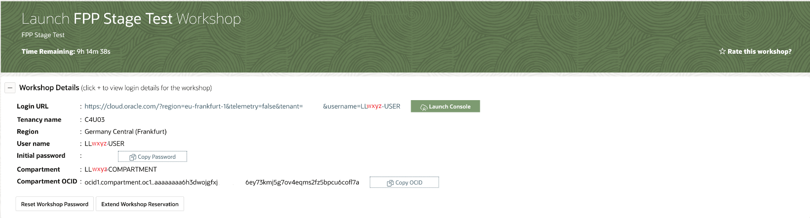
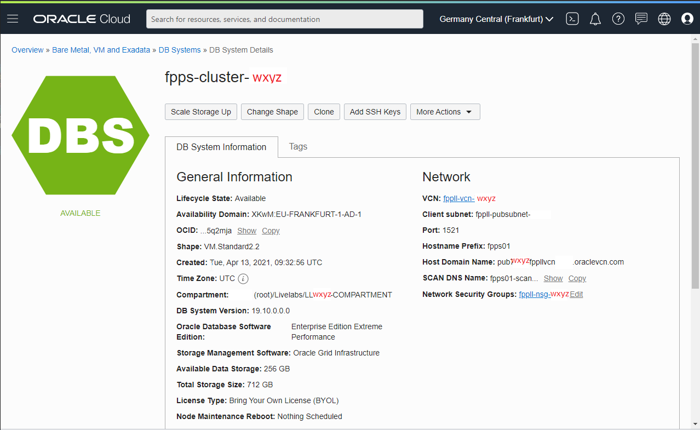

# Get the public IP of the FPP Server

It might sound obvious, but **please, don't use the values provided in the example images**, get the values that are proper to your reservation!

## Step 1: Access the OCI Console
Access the OCI Console using the **User Name**, **Initial Password** and **Login URL** that you have got with your Livelabs Reservation confirmation.

Change the password as required.

## Step 2: Verify your Region and Compartment
Make sure that the **Region** (top-right corner) corresponds to the one you have got in the reservation confirmation.

Navigate from the Hamburger Menu (top-left corner) to **Oracle Database** -> **Bare Metal, VM, and Exadata**.

**Important**: in the left menu, under **List Scope**, verify that you select the same compartment that you have got in the reservation confirmation.

## Step 3: Get the Public IP of the FPP Server
Click on the DB System name **fpps-cluster-wxyz** (wxyz is your reservation number: the number that compose also your Compartment name, e.g. LLwxyz-COMPARTMENT).

The DB System Details page appear:

Scroll down, at the end of the left pane click **Nodes(1)**, then note down the Public IP Address.

You may now [proceed to the next lab](#next) and connect to the server.
