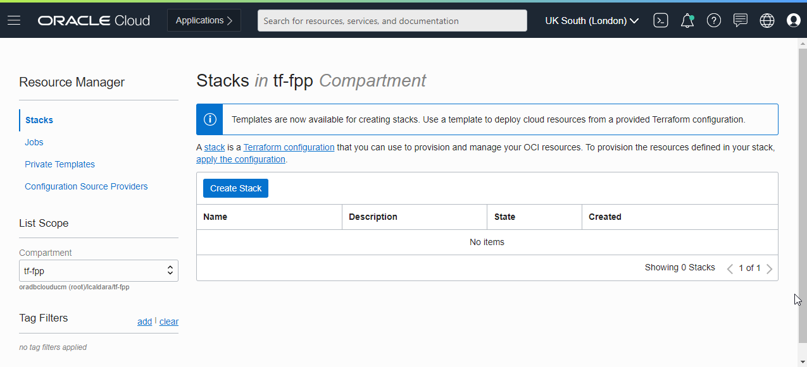

# Create the environment with Resource Manager
## Introduction
This lab will show you how to setup a Resource Manager stack that will generate the Oracle Cloud objects needed to run this workshop. This workshop requires a DB System running the FPP Server and a Compute Instance to run the FPP Target in a Virtual Cloud Network (VCN).

Estimated Lab Setup Time: 20 minutes (Execution Time - 2 hours)

### About Terraform and Oracle Cloud Resource Manager
For more information about Terraform and Resource Manager, please see the appendix below.

### Objectives
* Create the DB System, Compute and Networking Resource Manager stack.
* Get the public IP address of the FPP server.

### Prerequisites
* An Oracle Livelabs or Paid Oracle Cloud Account.
* A SSH key-pair ready to use.

## Step 1: Create the stack

*  Click on the link below to download the Resource Manager zip file you need to build your environment.

[tf-fpp-1.0.zip](https://objectstorage.us-ashburn-1.oraclecloud.com/p/SiXU2m1mrYj_HApnyJ11Ze7r4pcxpVhVBwM1NoBFlMggfi6fqaH8EqtMTS3H1CeW/n/c4u03/b/data-management-library-files/o/tf-fpp-1.0.zip)

* Login to Oracle Cloud
* Select the correct region
* Open up the hamburger menu in the left hand corner. Under the **Solutions and Platform** submenu, choose **Resource Manager > Stacks**.
* In the left pane, select the compartment where you would like to create the environment. It is recommended that you choose an empty compartment.
* Click on Create Stack

* Select **My Configuration**, choose the **.ZIP FILE** button, click the **Browse** link and select the zip file (tf-fpp-1.0.zip) that you downloaded. Click **Select**.

* Make sure that the base information is populated properly

* Click **Next**
* In the **Configure Variables** step, select the appropriate Availability Domain (depending on your region you may need to specify it or not)
* Paste your **SSH Public Key**, you will need the corresponding private key to access the FPP Server once the environment will be provisioned
* The variable **ResID** is Optional. You can use it to add a specific suffix to the Display Name of the Cloud Resources.

* Click **Next**
* Review the **Stack Information** and click **Create**

* Your Stack has now been created!

## Step 2: Terraform Plan (OPTIONAL)
This is optional, you may skip directly to Step 3.

When using Resource Manager to deploy an environment, execute a **Terraform plan** to verify the configuration.
* **[OPTIONAL]** Click **Terraform Actions -> Plan** to validate your configuration. This takes about a minute, please be patient.

## Step 3: Terraform Apply
When using Resource Manager to deploy an environment, execute a **Terraform Apply** to actually create the configuration. Let's do that now.

* At the top of your page, click on **Stack Details**. click the button, **Terraform Actions -> Apply**. This will create your cloud network, the db system and the compute instance.

* Once this job succeeds, you will get an apply complete notification from Terraform. Examine it closely.

* In the left pane, click **Outputs**
* Slick on **Show** next to **fppserver** to show the IP address of the FPP Server. Note it down, you will need it to access it as **opc** user with the private key that you have supplied when creating the stack.

You may now [proceed to the next lab](#next) and connect to the server.
