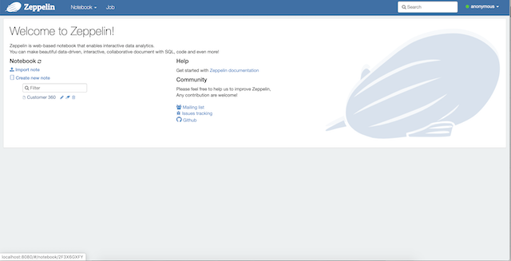
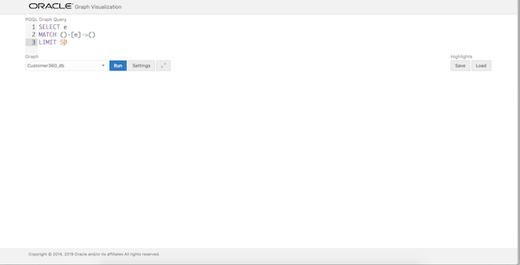
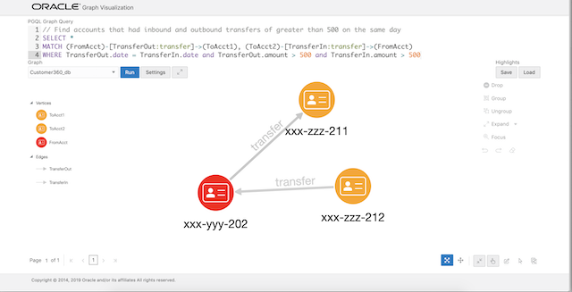

# Use Case: Customer 360 analysis #

## Overview
This example shows how integrating multiple datasets, using a graph, facilitates additional analytics can lead to new insights. We will use three small datasets for illustrative purposes. The first contains accounts and account  owners. The second is purchases by the people who own those accounts. The third is transactions between these accounts.

The combined dataset is then used to perform the following common graph query and analyses: pattern matching, detection of cycles, finding important nodes, community detection, and recommendation.

**Note:** This lab assumes you have successfully completed Lab 1 [Setup with Docker](https://oracle.github.io/learning-library/data-management-library/database/graph/livelabs/) and have an environment up and running with Zeppelin at [http://localhost:8080](http://localhost:8080/) and the Graph Visualization component at [http://localhost:7007/ui/](http://localhost:7007/ui/).

## Graph Query and Analysis in Apache Zeppelin 

Navigate to the Zeppelin in the browser and click on the "Customer 360" notebook link.



Run through the notebook paragraphs in sequence. 


## Graph Visualization

Next we will use the Graph Visualization component to explore the graph and run some PGQL queries.
Open the Graph Viz at [http://localhost:7007/ui/](http://localhost:7007/ui/)

You should see a screen similar to the screenshot below.  



Modify the query to get the first 50 rows, i.e. change LIMIT 10 to LIMIT 50, and click Run.

You should see a graph similar to the screenshot below.  


Now let's add some labels and other visual context. These are known as highlights. 
Click on the Load button under Highlights (on the right side of the screen). Browse to the `customer_360` folder in the repository that you cloned in Lab1. That is, to `oracle-pg/graphs/customer_360` and choose the file named 'highlights.json' and click Open to load that.  


The graph should now look like  


### Pattern matching with PGQL
Next let's run a few PGQL queries. 

The [pgql-lang.org](http://pgql-lang.org) site and [specification](http://pgql-land.org/spec/1.2) are the best reference for details and examples. For the purposes of this lab, however, here are minimal basics. 

The general structure of a PGQL query is
```
SELECT <select list>
FROM <graph_name> 
MATCH <graph_pattern>
WHERE <condition>
```

PGQL provides a specific construct known as the MATCH clause for matching graph patterns. A graph pattern matches vertices and edges that satisfy the given conditions and constraints.  
- `(v)` indicates a vertex variable `v`   
- `-` indicates an undirected edge, as in (source)-(dest)  
- `->` an outgoing edge from source to destination  
- `<-` an incoming edge from destination to source  
- `[e]` indicates an edge variable `e`

Let's find accounts that have had an outbound and and inbound transfer of over 500 on the same day.

The PGQL query for this is:
```
<copy>SELECT * 
MATCH (FromAcct)-[TransferOut:transfer]->(ToAcct1), (ToAcct2)-[TransferIn:transfer]->(FromAcct)
WHERE TransferOut.date = TransferIn.date and TransferOut.amount > 500 and TransferIn.amount > 500
</copy>
```
In the query text above (FromAcct) indicates the source vertex and (ToAcct1) the destination, while [TransferOut:transfer] is the edge connecting them. The [:transfer] specifies that the TransferOut edge has  the label 'transfer'. The comma (',') between the two patterns is an AND condition. 

Copy and paste the query into the PGQL Graph Query text input box of the GraphViz application.
Click Run.

The result should look as shown below.



The next query finds patterns of transfers to and from the same two accounts, i.e. from A->B and back B->A.

The PGQL query for this is:
```
<copy>SELECT * 
MATCH (FromAcct)-[TransferOut:transfer]->(ToAcct)-[TransferIn:transfer]->(FromAcct)
WHERE TransferOut.date < TransferIn.date 
</copy>
```

Copy and paste the query into the PGQL Graph Query text input box of the GraphViz application.
Click Run.

The result should look as shown below.


Let's add one more account to that query to find a circular transfer pattern between 3 accounts. 

The PGQL query becomes:
```
<copy>SELECT * 
MATCH (FromAcct)-[TxnAB:transfer]->(ToAcctB)-[TxnBC:transfer]->(ToAcctC)-[TxnCA:transfer]->(FromAcct)
WHERE TxnAB.date < TxnBC.date and TxnBC.date < TxnCA.date
</copy>
```

Copy and paste the query into the PGQL Graph Query text input box of the GraphViz application.
Click Run.

The result should look as shown below.


## Graph Query and Analysis in JShell

Start the JShell in the graph-client. Copy and paste the following command to do that.
```
<copy>docker exec -it graph-client opg-jshell -b http://graph-server:7007</copy>
```

That starts up a shell which connects to the server instance running on graph-server.
Once it starts up you should see the following:

```
For an introduction type: /help intro
Oracle Graph Server Shell 20.1.0
PGX server version: 19.4.0 type: SM
PGX server API version: 3.6.0
PGQL version: 1.2
Variables instance, session, and analyst ready to use.
opg-jshell>
```

Check to see which graphs have been loaded into the graph server.
```
<copy>session.getGraphs();</copy>
```
The result will be something like:  
`$1 ==> {Customer360-PG=PgxGraph[name=Customer360-PG,N=15,E=24,created=1589032892327]}`  
If the graph server loaded the graph from files the name will be 'Customer360-PG'. If the graph was loaded from the database it will be named 'Customer360_db'.

Now get a handle to that graph so you and query and analyse it in your shell's session. use the appropriate graph anme, i.e. "Customer360-PG" or "Customer360_db".

```
<copy>var g = session.getGraph("Customer360-PG");</copy>
```

Now we can query this graph and run some analyses on it.

### Pattern Matching

PGQL Query is convenient for detecting specific patterns.

Find accounts that had an inbound and an outbound transfer, of over 500, on the same day. The PGQL query for this is:

```
<copy>g.queryPgql(
  " SELECT a.account_no, a.balance, t1.amount, t2.amount, t1.date " +
  " MATCH (a)<-[t1:transfer]-(a1) " +
  "    , (a)-[t2:transfer]->(a2) " +
  " WHERE t1.date = t2.date " +
  "  AND t1.amount > 500 " +
  "  AND t2.amount > 500 "
).print();
</copy>

+---------------------------------------------------------------+
| a.account_no | a.balance | t1.amount | t2.amount | t1.date    |
+---------------------------------------------------------------+
| xxx-yyy-202  | 200       | 900       | 850       | 2018-10-06 |
+---------------------------------------------------------------+
```

### Detection of Cycles

Next we use PGQL to find a series of transfers that start and end at the same account such as A to B to A, or A to B to C to A.

The first query could be expressed as:

```
<copy>g.queryPgql(
"  SELECT a1.account_no, t1.date, t1.amount, a2.account_no, t2.date, t2.amount " +
"  MATCH (a1)-[t1:transfer]->(a2)-[t2:transfer]->(a1) " +
" WHERE t1.date < t2.date"
).print();
</copy>

+---------------------------------------------------------------------------------+
| a1.account_no | t1.date    | t1.amount | a2.account_no | t2.date    | t2.amount |
+---------------------------------------------------------------------------------+
| xxx-yyy-201   | 2018-10-05 | 200       | xxx-yyy-202   | 2018-10-10 | 300       |
+---------------------------------------------------------------------------------+
```


The second query just adds one more transfer to the pattern (list) and could be expressed as:


```
<copy>g.queryPgql(
"  SELECT a1.account_no, t1.amount, a2.account_no, t2.amount " +
"       , a3.account_no, t3.amount " + 
"  MATCH (a1)-[t1:transfer]->(a2)-[t2:transfer]->(a3)-[t3:transfer]->(a1) " +
"  WHERE t1.date < t2.date " +
"    AND t2.date < t3.date "
).print();
</copy>

+-----------------------------------------------------------------------------------+
| a1.account_no | t1.amount | a2.account_no | t2.amount | a3.account_no | t3.amount |
+-----------------------------------------------------------------------------------+
| xxx-yyy-201   | 500       | xxx-yyy-203   | 400       | xxx-yyy-204   | 300       |
+-----------------------------------------------------------------------------------+
```


### Influential Accounts

Filter customers from the graph. (cf. [Filter Expressions](https://docs.oracle.com/cd/E56133_01/latest/prog-guides/filter.html))

```
<copy>var sg = g.filter(new EdgeFilter("edge.label()='transfer'")); </copy>
```  
Run [pagerank](https://docs.oracle.com/cd/E56133_01/latest/reference/analytics/algorithms/pagerank.html) algorithm.

```
<copy>analyst.pagerank(sg); </copy>
```

Show the result.

```
<copy>sg.queryPgql(
" SELECT a.account_no, a.pagerank " +
" MATCH (a) " + 
" ORDER BY a.pagerank DESC "
).print();
</copy>

+-------------------------------------+
| a.account_no | a.pagerank           |
+-------------------------------------+
| xxx-yyy-201  | 0.18012007557258927  |
| xxx-yyy-204  | 0.1412461615467829   |
| xxx-yyy-203  | 0.1365633635065475   |
| xxx-yyy-202  | 0.12293884324085073  |
| xxx-zzz-002  | 0.05987452026569676  |
| xxx-zzz-001  | 0.025000000000000005 |
+-------------------------------------+
```

### Community Detection

Let's find which subsets of accounts form communities. That is, there are more transfers among accounts in the same subset than there are between those and accounts in another subset. We'll use the built-in weekly / strongly connected components algorithm.

The first step is to create a subgraph that only has the accounts and the transfers among them. This is done by creating and applying an edge filter (for edges with the table "transfer') to the graph.

Filter customers from the graph.
```
<copy>var sg = g.filter(new EdgeFilter("edge.label()='transfer'")); </copy>
```  

[Weakly connected component](https://docs.oracle.com/cd/E56133_01/latest/reference/analytics/algorithms/wcc.html) algorithm detects only one partition.

```
<copy>
var result = analyst.wcc(sg);
// The partition value is stored in a property named wcc
sg.queryPgql(
" SELECT a.wcc, COUNT(a) MATCH (a) GROUP BY a.wcc"
).print();
</copy>
```

Run a strongly connected components algorithm, SCC Kosaraju, instead.

[Strongly connected component](https://docs.oracle.com/cd/E56133_01/latest/reference//analytics/algorithms/scc.html) algorithm detects three partitions.

```
<copy>
result = analyst.sccKosaraju(sg);
// List partitions and number of vertices in each
sg.queryPgql(
" SELECT a.scc_kosaraju, COUNT(a) MATCH (a) GROUP BY a.scc_kosaraju"
).print();
</copy>

+---------------------------+  
| a.scc_kosaraju | COUNT(a) |  
+---------------------------+  
| 1              | 4        |  
| 2              | 1        |  
| 0              | 1        |  
+---------------------------+  
```

List the other accounts in the same conneted component (partition) as John's account.

The partition (or component) id is added as a property named scc_kosaraju for use in PGQL queries.

```
<copy>
sg.queryPgql(
" SELECT a.scc_kosaraju as component, COUNT(a.account_no), MAX(a.account_no) " +
" MATCH (a) " +
" GROUP BY component " +
" ORDER BY component"
).print();
</copy>

+-------------------------------------------------------+  
| component   | COUNT(a.account_no) | MAX(a.account_no) |  
+-------------------------------------------------------+  
| 0           | 1                   | xxx-zzz-001       |  
| 1           | 4                   | xxx-yyy-204       |  
| 2           | 1                   | xxx-zzz-002       |  
+-------------------------------------------------------+  
```


### Recommendation

Lastly let's use Personalized PageRank to find stores that John may purchase from given that people he is connected to have made purchases from those stores.

Filter customers and merchants from the graph.
```
<copy>sg = g.filter(new EdgeFilter("edge.label()='purchased'"));</copy>
```

Add reverse edges.

```
<copy>
var cs = sg.&lt;Integer&gt;createChangeSet();
var rs = sg.queryPgql("SELECT id(a), id(x) MATCH (a)-[]->(x)");
for (var r : rs) {
   var e = cs.addEdge(r.getInteger(2),r.getInteger(1)).setLabel("purchased_by");
}
</copy>
```

Build the graph with the reverse edges. Query it to verify.

```
<copy>
sg = cs.build();
sg.queryPgql(
" SELECT ID(r), x.name, LABEL(r), a.account_no" +
"  MATCH (x)-[r:purchased_by]->(a)" +
" LIMIT 3"
).print();
</copy>

+---------------------------------------------------+
| ID(r) | x.name      | LABEL(r)     | a.account_no |
+---------------------------------------------------+
| 11    | Apple Store | purchased_by | xxx-yyy-201  |
| 13    | Apple Store | purchased_by | xxx-yyy-202  |
| 16    | Apple Store | purchased_by | xxx-yyy-203  |
+---------------------------------------------------+
```


We will focus on the account no. xxx-yyy-201 (John's account) and run PPR.

Create a vertex set of the vertices used in personalizing the ranking.

```
<copy>
var vertexSet = sg.&lt;Integer&gt;createVertexSet();
vertexSet.addAll(201);
</copy>
```

Then compute the Personalized PageRank.

```
<copy>

var ppr = analyst.personalizedPagerank(sg, vertexSet);
</copy>
```

Show the result. (cf. [EXISTS and NOT EXISTS subqueries](https://pgql-lang.org/spec/1.3/#exists-and-not-exists-subqueriess))

```
<copy>
sg.queryPgql(
"  SELECT ID(x), x.name, x.pagerank " +
"  MATCH (x) " +
"  WHERE x.type = 'merchant' " +
"    AND NOT EXISTS ( " +
"     SELECT * " +
"     MATCH (x)-[:purchased_by]->(a) " +
"     WHERE ID(a) = 201 " +
"    ) " +
"  ORDER BY x.pagerank DESC"
).print();
</copy>

+--------------------------------------------+
| ID(x) | x.name       | x.pagerank          |
+--------------------------------------------+
| m03   | Kindle Store | 0.04932640133302745 |
| m04   | Asia Books   | 0.04932640133302745 |
| m05   | ABC Travel   | 0.01565535511504672 |
+--------------------------------------------+
```

## Acknowledgements ##

- **Author** - Ryota Yamanaka - Product Manager in Asia-Pacific for geospatial and graph technologies  
With a little help from colleagues (Albert Godfrind and Jayant Sharma).