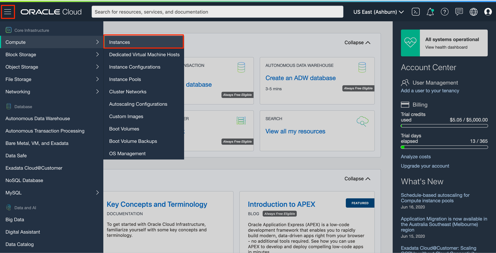
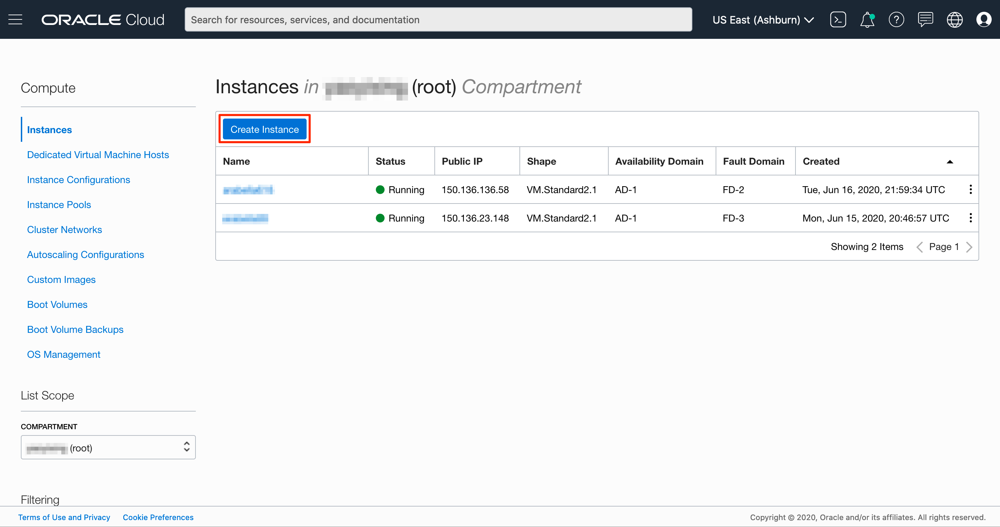
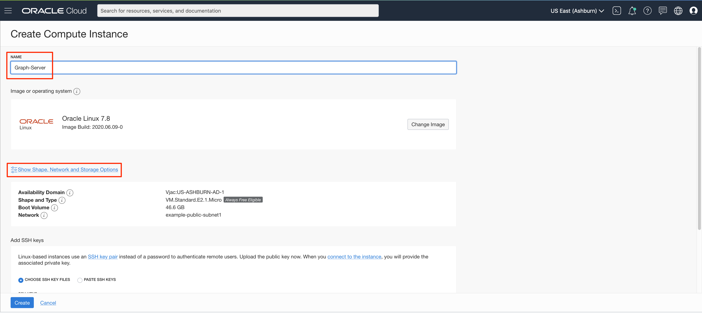
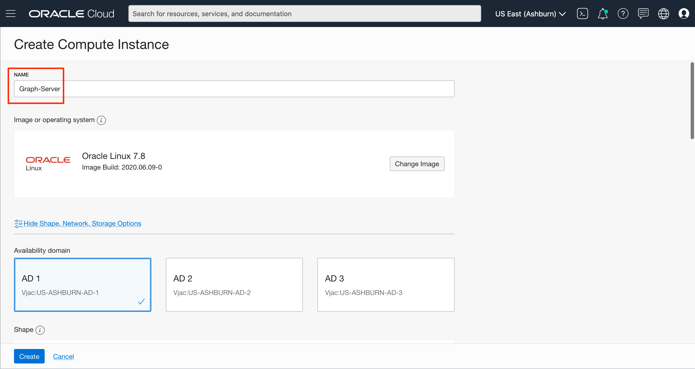
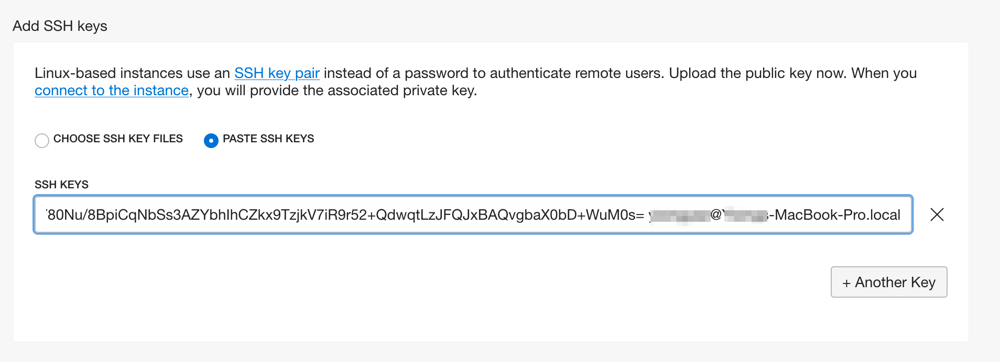
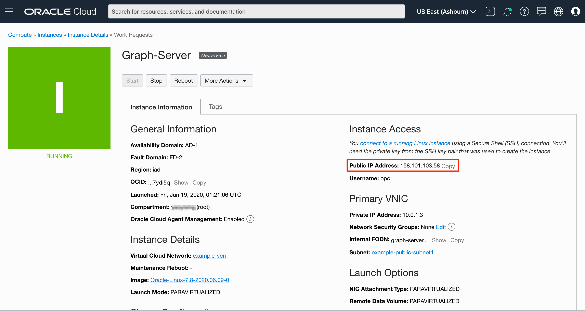
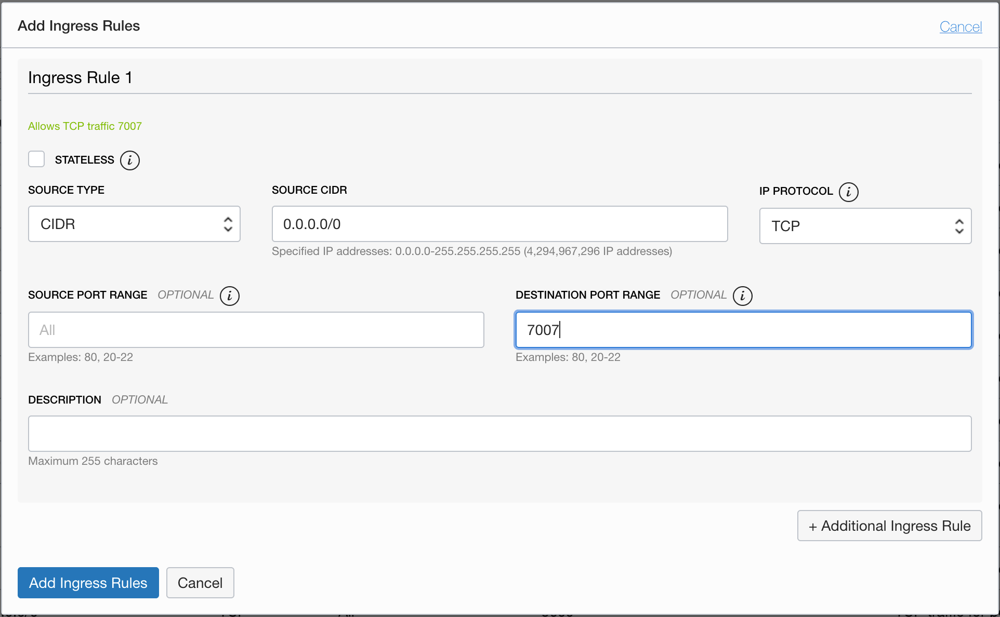
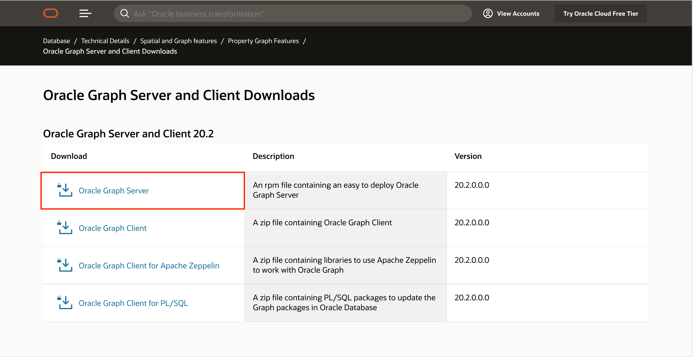
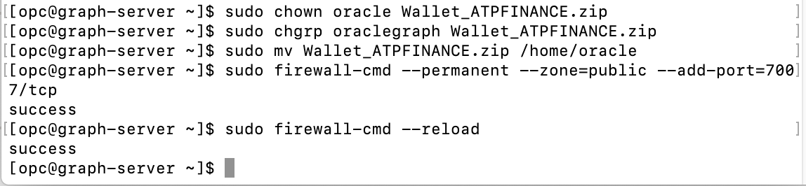
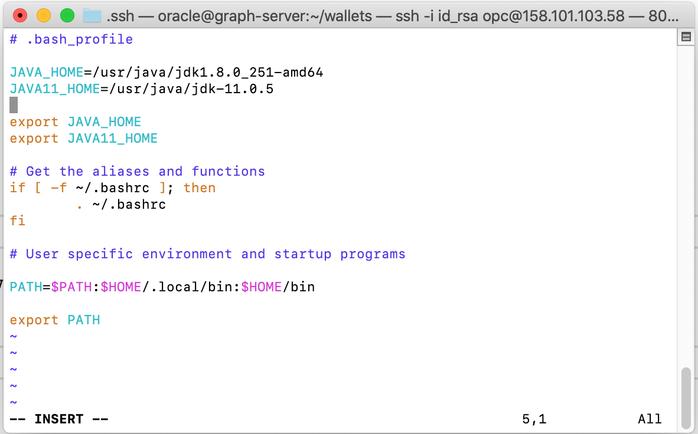

# Setup a Linux Compute Instance

## Introduction

This lab walks you through the steps to get started with setting up and connecting to a Linux compute instance on Oracle Cloud. You will also learn how to copy and deploy Graph Server and Client, as well as ADB Wallet on your compute instance.

### What Do You Need? 
* Registered cloud account
* Created SSH Keys
  
*Note 1: This is based on Practice 2 of the [OCI Lab L100](https://oracle.github.io/learning-library/oci-library/L100-LAB/Compute_Services/Compute_HOL.html#practice-2-creating-a-web-server-on-a-compute-instance) for setting up a web server on a compute instance.*

*Note 2: Some of the UIs may look a little different from the screenshots in the instructions.*

## STEP 1: Create a Free Tier Virtual Machine

An Oracle Cloud Infrastructure Virtual Machine (VM) compute instance runs on the same hardware as a Bare Metal instance, leveraging the same cloud-optimized hardware, firmware, software stack, and networking infrastructure.

1. Go to your Cloud Console. Navigate to the **Compute** tab and click **Instances**. In your Instances homepage, click **Create Instance**. We will launch a VM instance for this lab.

    

    

2. The Create Compute Instance wizard will launch. Set the name of the server to **Graph-Server**. Click on the **Show Shape, Network, and Storage Options** link to expand that area of the page. Choose an Always Free eligible shape (i.e. a Micro VM).

    

    

    

3. Most of the defaults are perfect for our purposes. However, you will need to scroll down to the Configure Networking area of the page and select **Assign a Public IP Address** option.

    

    ***NOTE:*** *You need a public IP address so that you can SSH into the running instance later in this lab.*

4. Scroll down to the SSH area of the page. Choose the *id_rsa.pub* SSH key that you created earlier in this workshop. If you cannot find your SSH Key in the browse window using the **Choose SSH Key Files** option, and are sure you have generated your SSH Key, you can use the **Paste SSH Keys** option instead.  Press the **Create** button to create your instance. 

    

    Launching an instance is simple and intuitive with few options to select. The provisioning of the compute instance will complete in less than a minute and the instance state will change from *Provisioning* to *Running*.

5. Once the instance state changes to Running, you can SSH to the instance by using its Public IP address.

    

6. Add an ingress rule for port 7007 (needed later for the Graph Server).  
   Using the menu, click on **Virtual Cloud Networks**.

    

    Then click on the VCN you created for this lab
    

    Now click on **Security Lists** on the left navigation bar for the VCN.

    

   Click on the **Default Security List** link.

   Here you need to open port 7007. Click on **Add Ingress Rules** and add the following values as shown below:

    - **Source Type:** CIDR
    - **Source CIDR**: 0.0.0.0/0
    - **IP Protocol:** TCP
    - **Source Port Range:** All
    - **Destination Port Range:** 7007
    - Click on **Add Ingress Rules** at the bottom.
    


7. To connect to the instance, you can use `Terminal` if you are using MAC or `Gitbash` if you are using Windows. On your terminal or gitbash enter the following command:

    *Note: For Oracle Linux VMs, the default username is **opc***

    ```shell
    ssh opc@<public_ip_address>
    ```

    If you have a different path for your SSH key enter the following:

    ```shell
    ssh -i <path_to_private_ssh_key> opc@<public_ip_address>
    ```

    


## STEP 2: Copy and deploy Graph Server and Client on the Linux Compute

The [Property Graph Developer's Guide](https://docs.oracle.com/en/database/oracle/oracle-database/20/spgdg/property-graph-overview-spgdg.html#GUID-FF149F69-574D-43B8-B888-4CCD019DAE56) describes the installation and configuration process in greater detail. 

The steps are as follows:
- Create a user (e.g. `oracle`). Set a passwd for that user.
- Create a group named `oraclegraph`.
- Add the user to the group.
- Install JDK8 and JDK11.
- Set the java executable to the one in JDK8.
- Copy the Graph Server and Client 20.2 rpm into the compute instance.
- Install the Graph Server and Client.
- Check if `numactl` is installed. If not install it too.
- Open the firewall for port 7007.
- Copy the ADB wallet zip file into the compute.
- Move it to the `oracle` user's home directory and change the file owner and group.
- Switch to the `oracle` user. Add `JAVA_HOME` and `JAVA11_HOME` to the bash_profile
- Create the `wallets` directory. Unzip the ADB wallet into that directory.

1. SSH into the compute instance using the private key you created earlier. First navigate to the folder where you created your SSH Keys. And connect using:

    ```
    ssh -i <private_key> opc@<public_ip_for_compute>
    ```
    *Note: You should not include the angle brackets <> in you code.*
  
2. Create the user, set a password, create the group, add user to group. *Note: You should include at least one digit in your password.*

    ```
    <copy>sudo useradd oracle</copy>
    ```

    ```
    <copy>sudo passwd oracle</copy>
    ```

    ```
    <copy>sudo groupadd oraclegraph</copy>
    ```

    ```
    <copy>sudo usermod -a -G oraclegraph oracle</copy>
    ```

3. Install the JDK8 and 11. Enter **y** when prompted. You should receive a `Complete!` message when installation is finished.

    ```
    <copy>
    sudo yum install jdk1.8.x86_64 jdk-11.0.5.x86_64 
    </copy>
    ```

4. Check which is the default java and change it using `alternatives`.

    ```
    $ <copy>alternatives --list</copy>
    libnssckbi.so.x86_64	auto	/usr/lib64/pkcs11/p11-kit-trust.so
    ld	auto	/usr/bin/ld.bfd
    mta	auto	/usr/sbin/sendmail.postfix
    cifs-idmap-plugin	auto	/usr/lib64/cifs-utils/cifs_idmap_sss.so
    java	auto	/usr/java/jdk-11.0.5/bin/java
    javac	auto	/usr/java/jdk1.8.0_251-amd64/bin/javac
    ```

5. Use alternatives set java executable to JDK8, enter **2** when prompted.

    ```
    <copy>sudo alternatives --config java</copy>

    There are 2 programs which provide 'java'.

    Selection    Command
    -----------------------------------------------
    *+ 1           /usr/java/jdk-11.0.5/bin/java
    2           /usr/java/jdk1.8.0_251-amd64/jre/bin/java

    Enter to keep the current selection[+], or type selection number: 2
    ```

    Check the java version now.
    ```
    <copy>java -version</copy>
    java version "1.8.0_251"
    Java(TM) SE Runtime Environment (build 1.8.0_251-b08)
    Java HotSpot(TM) 64-Bit Server VM (build 25.251-b08, mixed mode)
    ```

6. Next, download the Graph Server and Client RPM.

    Click [here](https://www.oracle.com/database/technologies/spatialandgraph/property-graph-features/graph-server-and-client/graph-server-and-client-downloads.html) to download the Graph Server and the Client. Login and accept the license terms and downlaod the 20.2 Graph Server RPM.

    

7.  Download your ADB Wallet if you haven't done so. Go to your Cloud console, under **Database**, select **Autonomous Transaction Processing**. If you don't see your instance, make sure the **Workload Type** is **Transaction Processing** or **All**.

    

    Click on your Autonomous Database instance. In your Autonomous Database Details page, click **DB Connection**.

    

    In Database Connection window, select **Instance Wallet** as your Wallet Type, click **Download Wallet**.
    
    
    In the Download Wallet dialog, enter a wallet password in the Password field and confirm the password in the Confirm Password field.
    The password must be at least 8 characters long and must include at least 1 letter and either 1 numeric character or 1 special character. This password protects the downloaded Client Credentials wallet.

    Click **Download** to save the client security credentials zip file.
    

    By default the filename is: Wallet_databasename.zip. You can save this file as any filename you want.
    You must protect this file to prevent unauthorized database access.
    

    Content in this section is adapted from [Download Client Credentials (Wallets)](https://docs.oracle.com/en/cloud/paas/autonomous-data-warehouse-cloud/user/connect-download-wallet.html#GUID-B06202D2-0597-41AA-9481-3B174F75D4B1)

8.  Now, copy your Graph Server RPM and ADB Wallet to you compute instance.  Let's assume both files are in ~/Downloads.
    
    On your desktop or laptop (i.e. your machine), do not close your old Terminal window. Open a new Terminal, navigate to the folder where you created your SSH Keys:

    ```
    ## replace with specifics for your environment: private_key, location of downloaded rpm, public ip address of compute instance
    <copy>scp -i private_key ~/Downloads/oracle-graph-20.2.0.x86_64.rpm opc@public_ip_for_compute:/home/opc</copy>
    ```
    
    *This may take a few minutes.*

    ```
    ## copy the Wallet. Once again modify with correct values for your setup.
    <copy>scp -i private_key ~/Downloads/ADB_Wallet_Zip opc@public_ip_for_compute:/home/opc</copy>
    ```
    


9.  Now go back to the Terminal window which is connected (via SSH) to the compute instance as `opc`, enter **y** when prompted during installation.

    ```
    ## install numactl if it is not already installed
    <copy>sudo yum install numactl</copy>
    ```
    ```
    ## install the graph server
    <copy>sudo yum install oracle-graph-20.2.0.x86_64.rpm</copy>

    ## Ignore the error about the `jar` executable. This lab does not use the `war` files.

    ```

    You can use `alternatives` or some other means to set the `jar` executable (to the one in JDK8) if you wish.

10. Move the ADB wallet to the `oracle` user. Modify the commands as appropriate for your environment and execute them as `opc`. 

    ```
    <copy>sudo chown oracle ADB_Wallet.zip</copy>
    ```

    ```
    <copy>sudo chgrp oraclegraph ADB_Wallet.zip</copy>
    ```

    ```
    <copy>sudo mv ADB_Wallet.zip /home/oracle</copy>
    ```

11. Open the firewall for port 7007.

    ```
    <copy>sudo firewall-cmd --permanent --zone=public --add-port=7007/tcp</copy>
    ```

    ```
    <copy>sudo firewall-cmd --reload</copy>
    ```

    

12. Now `su` to `oracle` and complete the setup. Modify the commands as appropriate for your environment and execute them as `opc`.

    ```
    <copy>su - oracle</copy>
    ```

    ```
    <copy>mkdir wallets</copy>
    ```

    ```
    <copy>mv ADB_Wallet.zip /home/oracle/wallets</copy>
    ```

    ```
    <copy>cd wallets</copy>
    ```

    ```
    <copy>unzip ADB_Wallet.zip</copy>
    ```

    ```
    ## open .bash_profile in a text editor and add the env vars for JAVA_HOME and JAVA11_HOME  
    <copy>vi /home/oracle/.bash_profile</copy>
    ```
    

    Hit **i** to enter insert mode.
    ```
    ## Add these lines in oracle's bash_profile 
    JAVA_HOME=/usr/java/jdk1.8.0_251-amd64
    JAVA11_HOME=/usr/java/jdk-11.0.5

    export JAVA_HOME
    export JAVA11_HOME

    ## save and exit the text editor
    ```
    

    After you finished editing, hit **esc**, then **wq**, and hit `Enter` to save your changes and exit the insert mode.
    

    ```
    ## open the tnsnames and get the service name you will use later.
    <copy>cat /home/oracle/wallets/tnsnames.ora</copy>
    ```

    ```
    ## you will see something similar to
    atpfinance_high = 
        (description=
            (address=
                (https_proxy=proxyhostname)(https_proxy_port=80)(protocol=tcps)(port=1522)
                (host=adwc.example.oraclecloud.com)
            )
            (connect_data=(service_name=adwc1_high.adwc.oraclecloud.com))
            (security=(ssl_server_cert_dn="adwc.example.oraclecloud.com,OU=Oracle BMCS US,O=Oracle Corporation,L=Redwood City,ST=California,C=US"))
    )
    ```

    An entry in tnsnames.ora is of the form  
    `<addressname> =`  
    &nbsp;&nbsp;`(DESCRIPTION =`  
    &nbsp;&nbsp;&nbsp;&nbsp;`(ADDRESS_LIST = `  
    &nbsp;&nbsp;&nbsp;&nbsp;&nbsp;&nbsp;`(ADDRESS = (PROTOCOL = TCP)(Host = <hostname>)(Port = <port>)) `  
    &nbsp;&nbsp;&nbsp;&nbsp;`) `  
    &nbsp;&nbsp;&nbsp;&nbsp;&nbsp;&nbsp;`(CONNECT_DATA =  `  
    &nbsp;&nbsp;&nbsp;&nbsp;&nbsp;&nbsp;`(SERVICE_NAME = <service_name>)  `  
    &nbsp;&nbsp;&nbsp;&nbsp;`) `  
    &nbsp;&nbsp;`)`  

    Note the `addressname`, e.g. `atpfinance_high` that you will use later when connecting to the databases using JDBC.

## Acknowledgements ##

- **Author** - Jayant Sharma - Product Manager, Spatial and Graph.  
  With a little help from colleagues (Albert Godfrind and Ryota Yamanaka).  
  Thanks to Jenny Tsai for helpful, constructive feedback that improved this workshop.

- **Contributor** - Arabella Yao, June 2020

See an issue?  Please open up a request [here](https://github.com/oracle/learning-library/issues).   Please include the workshop name and lab in your request.