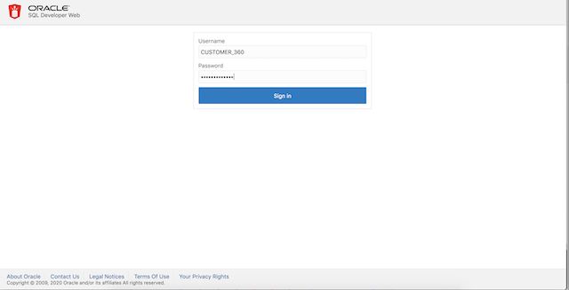
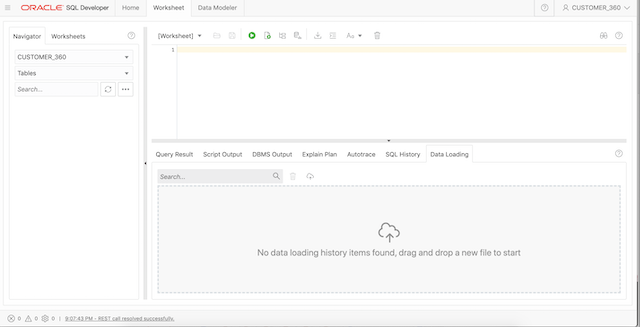
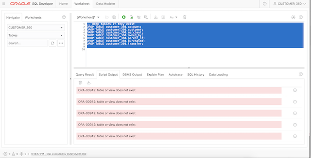
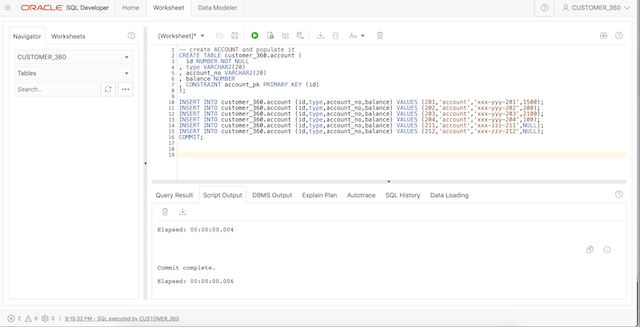
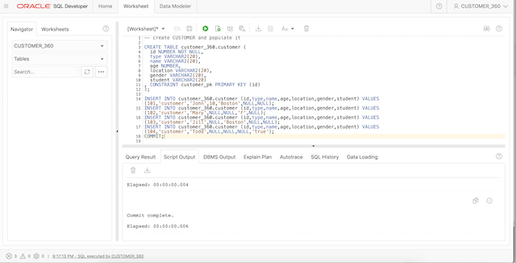
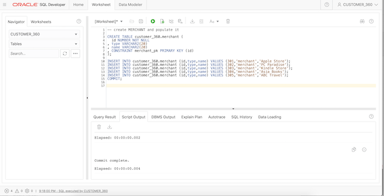
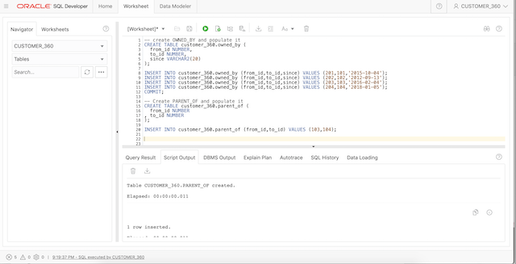
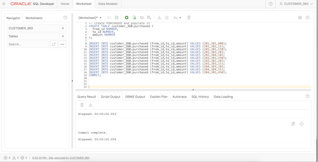
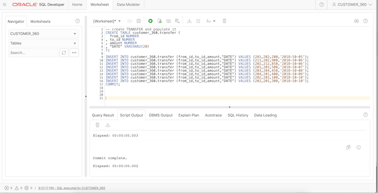

## Create the tables and insert data

Open the correct URL for SQlDevWeb for the Customer_360 user. It is almost the same URL as the one for the Admin user execpt that `admin` in that url is replaced with the schema-alias we provided, i.e. with `c360`.

Login as `CUSTOMER_360` using the password you entered when creating the user.





### Drop existing tables if any
To ensure a clean slate drop any existing tables. Copy, paste, and execute the following commands into the SQL Worksheet.

```
<copy>
DROP TABLE account;
DROP TABLE customer;
DROP TABLE merchant;
DROP TABLE owned_by;
DROP TABLE parent_of;
DROP TABLE purchased;
DROP TABLE transfer;

</copy>
```



### Create and populate the Account table

Clear the SQL Worksheet and copy, paste, and run the following SQL script.

```
<copy>
CREATE TABLE account (
  id NUMBER NOT NULL
, type VARCHAR2(20)
, account_no VARCHAR2(20)
, balance NUMBER
, CONSTRAINT account_pk PRIMARY KEY (id)
);

INSERT INTO account (id,type,account_no,balance) VALUES (201,'account','xxx-yyy-201',1500);
INSERT INTO account (id,type,account_no,balance) VALUES (202,'account','xxx-yyy-202',200);
INSERT INTO account (id,type,account_no,balance) VALUES (203,'account','xxx-yyy-203',2100);
INSERT INTO account (id,type,account_no,balance) VALUES (204,'account','xxx-yyy-204',100);
INSERT INTO account (id,type,account_no,balance) VALUES (211,'account','xxx-zzz-211',NULL);
INSERT INTO account (id,type,account_no,balance) VALUES (212,'account','xxx-zzz-212',NULL);
COMMIT;

</copy>
```



### Create and populate the Customer table

Clear the SQL Worksheet and copy, paste, and run the following SQL script.

```
<copy>
CREATE TABLE customer (
  id NUMBER NOT NULL,
  type VARCHAR2(20), 
  name VARCHAR2(20),
  age NUMBER,
  location VARCHAR2(20),
  gender VARCHAR2(20),
  student VARCHAR2(20)
, CONSTRAINT customer_pk PRIMARY KEY (id)
);

INSERT INTO customer (id,type,name,age,location,gender,student) VALUES (101,'customer','John',10,'Boston',NULL,NULL);
INSERT INTO customer (id,type,name,age,location,gender,student) VALUES (102,'customer','Mary',NULL,NULL,'F',NULL);
INSERT INTO customer (id,type,name,age,location,gender,student) VALUES (103,'customer','Jill',NULL,'Boston',NULL,NULL);
INSERT INTO customer (id,type,name,age,location,gender,student) VALUES (104,'customer','Todd',NULL,NULL,NULL,'true');
COMMIT;
</copy>
```



### Create and populate the Merchant table 

Clear the SQL Worksheet and copy, paste, and run the following SQL script.

```
<copy>
CREATE TABLE merchant (
  id NUMBER NOT NULL
, type VARCHAR2(20)
, name VARCHAR2(20)
, CONSTRAINT merchant_pk PRIMARY KEY (id)
);

INSERT INTO merchant (id,type,name) VALUES (301,'merchant','Apple Store');
INSERT INTO merchant (id,type,name) VALUES (302,'merchant','PC Paradise');
INSERT INTO merchant (id,type,name) VALUES (303,'merchant','Kindle Store');
INSERT INTO merchant (id,type,name) VALUES (304,'merchant','Asia Books');
INSERT INTO merchant (id,type,name) VALUES (305,'merchant','ABC Travel');
COMMIT;

</copy>

```



### Create and populate the Owned_By table

Clear the SQL Worksheet and copy, paste, and run the following SQL script.

```
<copy>
CREATE TABLE owned_by (
  from_id NUMBER,
  to_id NUMBER,
  since VARCHAR2(20)
);

INSERT INTO owned_by (from_id,to_id,since) VALUES (201,101,'2015-10-04');
INSERT INTO owned_by (from_id,to_id,since) VALUES (202,102,'2012-09-13');
INSERT INTO owned_by (from_id,to_id,since) VALUES (203,103,'2016-02-04');
INSERT INTO owned_by (from_id,to_id,since) VALUES (204,104,'2018-01-05');
COMMIT;
</copy>
```



### Create and populate the Parent_Of table

Clear the SQL Worksheet and copy, paste, and run the following SQL script.

```
<copy>
CREATE TABLE parent_of (
  from_id NUMBER
, to_id NUMBER
);

INSERT INTO parent_of (from_id,to_id) VALUES (103,104);
COMMIT;
</copy>
```


### Create and populate the Purchased table

Clear the SQL Worksheet and copy, paste, and run the following SQL script.

```
<copy>
CREATE TABLE purchased (
  from_id NUMBER,
  to_id NUMBER,
  amount NUMBER
);

INSERT INTO purchased (from_id,to_id,amount) VALUES (201,301,800);
INSERT INTO purchased (from_id,to_id,amount) VALUES (201,302,15);
INSERT INTO purchased (from_id,to_id,amount) VALUES (202,301,150);
INSERT INTO purchased (from_id,to_id,amount) VALUES (202,302,20);
INSERT INTO purchased (from_id,to_id,amount) VALUES (202,304,10);
INSERT INTO purchased (from_id,to_id,amount) VALUES (203,301,350);
INSERT INTO purchased (from_id,to_id,amount) VALUES (203,302,20);
INSERT INTO purchased (from_id,to_id,amount) VALUES (203,303,15);
INSERT INTO purchased (from_id,to_id,amount) VALUES (204,303,10);
INSERT INTO purchased (from_id,to_id,amount) VALUES (204,304,15);
INSERT INTO purchased (from_id,to_id,amount) VALUES (204,305,450);
COMMIT;
</copy>
```



### Create and populate the Transfer table

Clear the SQL Worksheet and copy, paste, and run the following SQL script.

The quotes are needed since DATE is a reserved word.

```
<copy>
CREATE TABLE transfer (
  from_id NUMBER
, to_id NUMBER
, amount NUMBER
, "DATE" VARCHAR2(20) 
);

INSERT INTO transfer (from_id,to_id,amount,"DATE") VALUES (201,202,200,'2018-10-05');
INSERT INTO transfer (from_id,to_id,amount,"DATE") VALUES (211,202,900,'2018-10-06');
INSERT INTO transfer (from_id,to_id,amount,"DATE") VALUES (202,212,850,'2018-10-06');
INSERT INTO transfer (from_id,to_id,amount,"DATE") VALUES (201,203,500,'2018-10-07');
INSERT INTO transfer (from_id,to_id,amount,"DATE") VALUES (203,204,450,'2018-10-08');
INSERT INTO transfer (from_id,to_id,amount,"DATE") VALUES (204,201,400,'2018-10-09');
INSERT INTO transfer (from_id,to_id,amount,"DATE") VALUES (202,203,100,'2018-10-10');
INSERT INTO transfer (from_id,to_id,amount,"DATE") VALUES (202,201,300,'2018-10-10');
COMMIT;
</copy>
```

