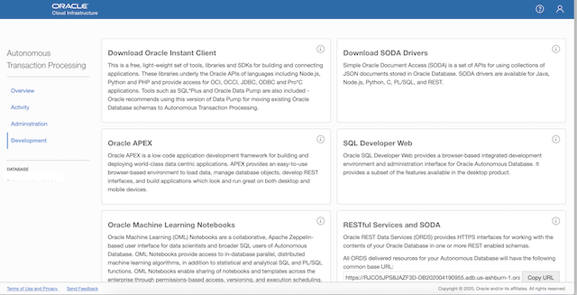
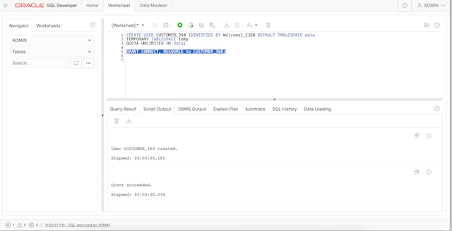
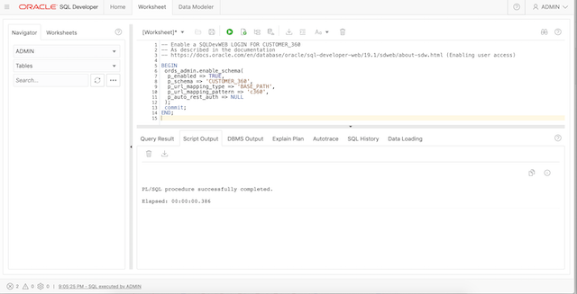

## Create the Customer_360 user

Login as the Admin user in SQLDevWeb of the newly cerated ADB Free Tier instance.

That is, open the ADB Console, choose Development from the list on the left, then click the SQLDeveloperWeb Link.



Login as the ADMIN user. 


Now create the `CUSTOMER_360` user. Enter the following commands into the SQL Worksheet and run it while connected as the Admin user.

```
<copy>
CREATE USER customer_360 
IDENTIFIED BY Welcome1_C360 
DEFAULT TABLESPACE data 
TEMPORARY TABLESPACE temp 
QUOTA UNLIMITED ON data;  

GRANT connect, resource TO customer_360;
</copy>
```

 


## Enable SQLDevWeb for Customer_360

Now provide SQLDevWeb access for this user. See the [documentation](https://docs.oracle.com/en/cloud/paas/autonomous-data-warehouse-cloud/user/sql-developer-web.html#GUID-4B404CE3-C832-4089-B37A-ADE1036C7EEA)
for details.
First clear the previous text in the SQL Worksheet. 

Copy and paste the following text into the SQL Worksheet and run it. 
```
<copy>
BEGIN
   ORDS_ADMIN.ENABLE_SCHEMA(
     p_enabled => TRUE,
     p_schema => 'CUSTOMER_360',
     p_url_mapping_type => 'BASE_PATH',
     p_url_mapping_pattern => 'c360',
     p_auto_rest_auth => TRUE
   );
   COMMIT;
END;
/
</copy>
```



The URL for SQLDeveloperWeb for the Customer_360 user will have `c360` in place of `admin` in it.   
Save the URL for the next step.  

For details, see the ["Provide SQL Developer Web Access to Database Users"](https://docs.oracle.com/en/cloud/paas/autonomous-data-warehouse-cloud/user/sql-developer-web.html#GUID-4B404CE3-C832-4089-B37A-ADE1036C7EEA) section in the documentation. 