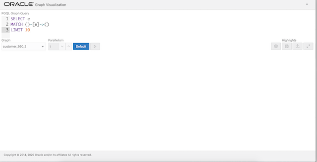
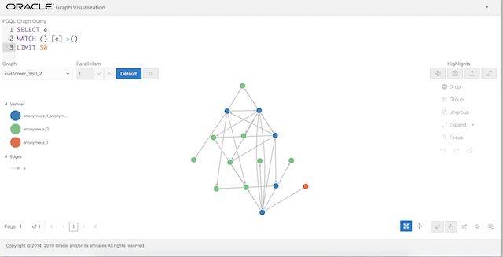
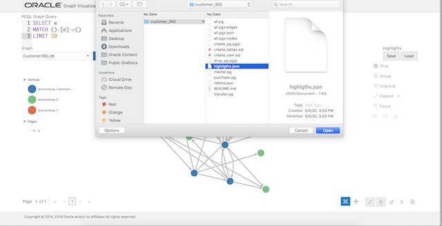
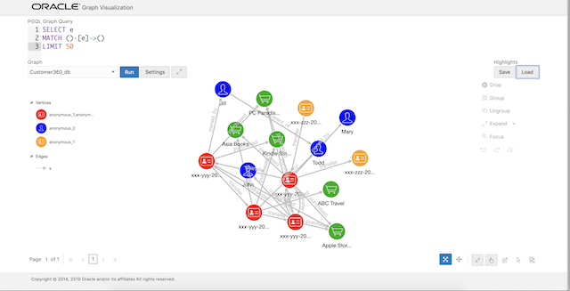
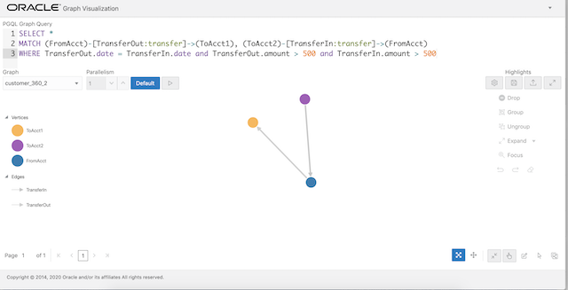
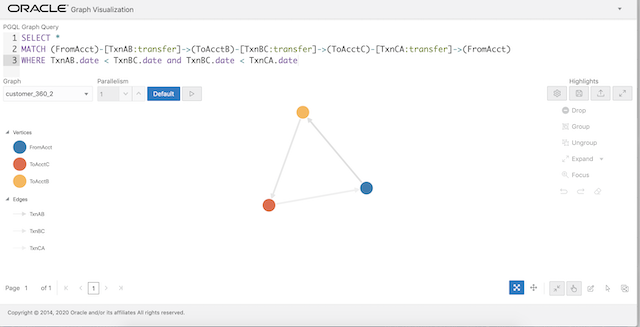

# Use Case: Customer 360 Graph Visualization#

## Overview
The results of the analyses done in the previous labs can easily be visualized using Graph Visualization feature.

The following video provides an overview of the visualization component.
[](youtube:zfefKdNfAY4)

### Prerequisites
This lab assumes you have successfully completed Lab 8 and published the graph. It also assumes the Graph Visualization component is up and running on the compute instance on `public_ip_for_compute:7007/ui`.

We will use the Graph Visualization component to explore the graph and run some PGQL queries.

## STEP 0: Setup

1. Open the Graph Viz at `http://<public_ip_for_free_tier_compute>:7007/ui`. Replace `<public_ip_for_free_tier_compute>` with the one for your Graph Server compute instance.

    You should see a screen similar to the screenshot below.  
    

### Troubleshooting
If you have a `Page Not Found` error, the graph you published at Lab 8 may expire. You can try to redo Lab 8 (only Step 0, 1, and 7) to publish the graph.

## STEP 1: Modify query
1. Modify the query to get the first 50 rows, i.e. change LIMIT 10 to LIMIT 50, and click Run.

    You should see a graph similar to the screenshot below.  
    

## STEP 2: Add highlights
Now let's add some labels and other visual context. These are known as highlights.  
*Note: If you did the Lab: Setup with Docker and cloned the `oracle-pg` repo, then the required `highlights.json` file is in the `customer_360` folder.
If however you are doing the Setup Graph with Free Tier Lab by itself, then left-click on <a href="highlights.json" download="highlights.json" target="\_blank">this link</a> to download it.*

1. Click on the Load button under Highlights (on the right side of the screen). Browse to the appropriate folder (i.e. either to `oracle-pg/graphs/customer_360`  or the folder where you just downloaded it) and choose the file named 'highlights.json' and click Open to load that.  


    The graph should now look like  
    

    

## STEP 3: Pattern matching with PGQL
1. Next let's run a few PGQL queries. 

    The [pgql-lang.org](http://pgql-lang.org) site and [Specification](http://pgql-lang.org/spec/1.2) are the best references for details and examples. For the purposes of this lab, however, here are minimal basics.

    The general structure of a PGQL query is
    ```
    SELECT <select list>
    FROM <graph_name> 
    MATCH <graph_pattern>
    WHERE <condition>
    ```

    PGQL provides a specific construct known as the *MATCH* clause for matching graph patterns. A graph pattern matches vertices and edges that satisfy the given conditions and constraints.  
    - `(v)` indicates a vertex variable `v`   
    - `-` indicates an undirected edge, as in (source)-(dest)  
    - `->` an outgoing edge from source to destination  
    - `<-` an incoming edge from destination to source  
    - `[e]` indicates an edge variable `e`

2. Let's find accounts that have had an outbound and and inbound transfer of over 500 on the same day.

    The PGQL query for this is:
    ```
    <copy>
    SELECT * 
    MATCH (FromAcct)-[TransferOut:TRANSFER]->(ToAcct1), (ToAcct2)-[TransferIn:TRANSFER]->(FromAcct)
    WHERE TransferOut.DATE = TransferIn.DATE and TransferOut.AMOUNT > 500 and TransferIn.AMOUNT > 500
    </copy>
    ```
    In the query text above, (FromAcct) indicates the source vertex and (ToAcct1) the destination, while [TransferOut:TRANSFER] is the edge connecting them. The [:TRANSFER] specifies that the TransferOut edge has the label 'TRANSFER'. The comma (',') between the two patterns is an AND condition.

3. Copy and paste the query into the PGQL Graph Query text input box of the GraphViz application.
Click Run.

    The result should look as shown below.

    

4. The next query finds patterns of transfers to and from the same two accounts, i.e. from A->B and back B->A.

    The PGQL query for this is:
    ```
    <copy>
    SELECT * 
    MATCH (FromAcct)-[TransferOut:TRANSFER]->(ToAcct)-[TransferIn:TRANSFER]->(FromAcct)
    WHERE TransferOut.DATE < TransferIn.DATE 
    </copy>
    ```

5. Copy and paste the query into the PGQL Graph Query text input box of the GraphViz application. Click Run.

    The result should look as shown below.

    

6. Let's add one more account to that query to find a circular transfer pattern between 3 accounts. 

    The PGQL query becomes:
    ```
    <copy>
    SELECT *
    MATCH (FromAcct)-[TxnAB:TRANSFER]->(ToAcctB)-[TxnBC:TRANSFER]->(ToAcctC)-[TxnCA:TRANSFER]->(FromAcct)
    WHERE TxnAB.DATE < TxnBC.DATE and TxnBC.DATE < TxnCA.DATE
    </copy>
    ```

7. Copy and paste the query into the PGQL Graph Query text input box of the GraphViz application. Click Run.

    The result should look as shown below.

    


## Acknowledgements ##

* **Author** - Jayant Sharma, Product Manager, Spatial and Graph.  

* **Contributors** - With a little help from colleagues (Albert Godfrind and Ryota Yamanaka). And lots from Jenny Tsai. Thank you.

* **Last Updated By/Date** - Arabella Yao, Product Manager Intern, Database Management, July 2020

## See an issue?
Please submit feedback using this [form](https://apexapps.oracle.com/pls/apex/f?p=133:1:::::P1_FEEDBACK:1). Please include the *workshop name*, *lab* and *step* in your request.  If you don't see the workshop name listed, please enter it manually. If you would like for us to follow up with you, enter your email in the *Feedback Comments* section.