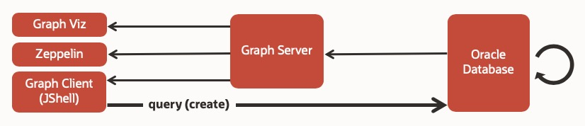

# Create the Graph

## Introduction

This lab will walk you through the steps to create a graph from the database tables containing customer, account, purchase, and relationship data.

Estimated Lab Time: 5 minutes

### Objectives

In the lab, you will:
* Create a graph from the database tables

### Prerequisites

* This lab assumes that you have successfully completed the labs - Setup a Property Graph Analysis Environment in Docker, Setup Oracle Database in Docker, Create and Populate Database Tables

## **STEP 1:** Create the Customer 360 Property Graph

1. If you don't have an open SSH connection to your compute instance, open a terminal window. Navigate to the folder where you created the SSH keys, replace *your-key-name* with your private key name and *your-instance-ip-address* with your compute instance ip address and connect to your compute instance:

    ```
    ssh -i ./your-key-name opc@your-instance-ip-address
    ```

2. The following DDL creates a property graph (i.e. node and edge tables) from the relational table data.

  

    ```
    <copy>
    CREATE PROPERTY GRAPH customer_360
      VERTEX TABLES (
        customer
          LABEL "Customer"
          PROPERTIES (
            type AS "type"
          , name AS "name"
          , age AS "age"
          , location AS "location"
          , gender AS "gender"
          , student AS "student"
          )
      , account
          LABEL "Account"
          PROPERTIES (
            type AS "type"
          , account_no AS "account_no"
          , balance AS "balance"
          )
      , merchant
          LABEL "Merchant"
          PROPERTIES (
            type AS "type"
          , name AS "name"
          )
      )
      EDGE TABLES (
        owned_by
          SOURCE KEY(from_id) REFERENCES account
          DESTINATION KEY(to_id) REFERENCES customer
          LABEL "owned_by"
          PROPERTIES (
            since AS "since"
          )
      , parent_of
          SOURCE KEY(from_id) REFERENCES customer
          DESTINATION KEY(to_id) REFERENCES customer
          LABEL "parent_of"
      , purchased
          SOURCE KEY(from_id) REFERENCES account
          DESTINATION KEY(to_id) REFERENCES merchant
          LABEL "purchased"
          PROPERTIES (
            amount AS "amount"
          )
      , transfer
          SOURCE KEY(from_id) REFERENCES account
          DESTINATION KEY(to_id) REFERENCES account
          LABEL "transfer"
          PROPERTIES (
            amount AS "amount"
          , date AS "date"
          )
      )
    </copy>
    ```

  Note: The file is part of the repository under the `graphs/customer_360/` directory. The parent directory is mapped to `/graphs` in the container.

3. Using Graph Client, connect to Oracle Database and run the DDL above.

  If the graph-client is not up and running start it by executing the following command.

    ```
    <copy>docker-compose -f docker-compose-rdbms.yml up -d graph-client</copy>
    ```

4. Then start a JShell in the client.

    ```
    $ <copy>docker exec -it graph-client opg-rdbms-jshell</copy>
    ```

  Once JShell is running and you see the lines.

    ```
    Oracle Graph Server Shell 20.1.0
    PGX server version: 19.4.0 type: SM
    PGX server API version: 3.6.0
    PGQL version: 1.2
    Variables instance, session, and analyst ready to use.
    opg-rdbms-jshell>
    ```

5. Enter the following code to:

    - Specify the JDBC connection to the database
    - Open a Connection
    - Set a required parameter for PGQL operation
    - Create a PgqlConnection
    - Read, prepare, and execute the CREATE PROPERTY GRAPH statement

    ```
    <copy>
    var jdbcUrl = "jdbc:oracle:thin:@oracle-db:1521/orclpdb1";
    var conn = DriverManager.getConnection(jdbcUrl, "customer_360", "Welcome1");
    conn.setAutoCommit(false);
    var pgql = PgqlConnection.getConnection(conn);
    pgql.prepareStatement(Files.readString(Paths.get("/graphs/customer_360/create_pg.pgql"))).execute();
    </copy>
    ```

  Note: The execute() above will return `false` on completion since the first result is not a ResultSet.

## **STEP 2:** Check if the graph was created

1. You can check the graph by executing the following code and query (= PGQL on RDBMS) in the JShell.

  How many nodes are in the newly created property graph?

  Enter the following code in JShell.

    ```
    <copy>
    Consumer&lt;String&gt; query = q -> {
        try(var s = pgql.prepareStatement(q)) {
          s.execute();
          s.getResultSet().print();
        } catch(Exception e) {
          throw new RuntimeException(e);
        }
      };

    query.accept("select count(v) from customer_360 match (v)");
    </copy>
    +----------+
    | count(v) |
    +----------+
    | 15       |
    +----------+
    ```

2. Exit the JShell.

    ```
    <copy>
    /exit
    </copy>
    ```

You may now proceed to the next lab where you will load, query, and analyze the Customer 360 graph.

## Acknowledgements

* **Author** -  Jayant Sharma, Product Manager
* **Contributors** - Ryota Yamanaka, Anoosha Pilli, Product Manager
* **Last Updated By/Date** - Anoosha Pilli, Database Product Management, October 2020

## Need Help?
Please submit feedback or ask for help using our [LiveLabs Support Forum](https://community.oracle.com/tech/developers/categories/oracle-graph). Please click the **Log In** button and login using your Oracle Account. Click the **Ask A Question** button to the left to start a *New Discussion* or *Ask a Question*.  Please include your workshop name and lab name.  You can also include screenshots and attach files.  Engage directly with the author of the workshop.

If you do not have an Oracle Account, click [here](https://profile.oracle.com/myprofile/account/create-account.jspx) to create one.
