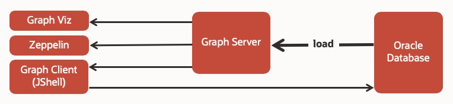

# Query and Analyze the Customer 360 Graph

## Introduction

This lab will walk you through the steps to load, query, and analyze a graph from the database tables containing customer, account, purchase, and relationship data.

Estimated Lab Time: 7 minutes

### Objectives

In this lab, you will:
* Load, query, and analyze a graph from the database tables

### Prerequisites

* This lab assumes that you have successfully completed the lab - Create the Graph

## **STEP 1:** Configure the graph server to load the graph

The following configuration files determine the graph server startup settings and optionally the graphs that are pre-loaded.

1. The pgx-rdbms.conf file under `{$REPO_HOME}/docker/conf/` specifies which graph to pre-load.

2. The configuration of the graph itself, i.e. how and what to load, is in the JSON file rdbms.  json under `{$REPO_HOME}/graphs/customer_360/`.

  

  `pgx-rdbms.conf`

    ```
    $ oracle-pg/docker/conf/pgx-rdbms.conf
    "preload_graphs": [
      {"path": "/graphs/customer_360/rdbms.json", "name": "Customer360_db"},
    ```

  `rdbms.json`

    ```
    {
      "format":"pg",
      "db_engine":"rdbms",
      "jdbc_url":"jdbc:oracle:thin:@oracle-db:1521/orclpdb1",
      "username":"customer_360",
      "keystore_alias":"database1",
      "max_num_connections":8,
      "name":"customer_360",
      "vertex_props": [
        {"name":"type", "type":"string"},
        {"name":"name", "type":"string"},
        {"name":"age", "type":"integer"},
        {"name":"location", "type":"string"},
        {"name":"gender", "type":"string"},
        {"name":"student", "type":"string"},
        {"name":"account_no", "type":"string"},
        {"name":"balance", "type":"integer"}
      ],
      "edge_props": [
        {"name":"since", "type":"string"},
        {"name":"amount", "type":"integer"},
        {"name":"date", "type":"string"}
      ],
      "loading":{
        "load_edge_label":true
      }
    }
    ```

  Note that edge labels are also loaded.

## **STEP 2:** Start the graph server and verify that the graph was loaded

1. Start the database and Graph Server

2. Run Docker containers for Graph Server, Graph Client, and Zeppelin.

    ```
    <copy>cd oracle-pg/docker/
    docker-compose -f docker-compose-rdbms.yml -d up</copy>
    ```

3. To test the database graph loading configuration (i.e. rdbms.json) start JShell and execute the code below.

    ```
    $ <copy>docker exec -it graph-client opg-rdbms-jshell -b http://graph-server:7007</copy>
    var graph = session.readGraphWithProperties("/graphs/customer_360/rdbms.json")
    ```

## **STEP 3:** Query and analyze in Zeppelin

1. Open Zeppelin and execute all the paragraphs in the "Customer 360" analytics example notebook.

  [http://localhost:8080/](http://localhost:8080/)

You may now proceed to the next lab.

## Acknowledgements

* **Author** -  Jayant Sharma, Product Manager
* **Contributors** - Ryota Yamanaka
* **Last Updated By/Date** - Anoosha Pilli, Database Product Management, October 2020

## Need Help?
Please submit feedback or ask for help using our [LiveLabs Support Forum](https://community.oracle.com/tech/developers/categories/livelabsdiscussions). Please click the **Log In** button and login using your Oracle Account. Click the **Ask A Question** button to the left to start a *New Discussion* or *Ask a Question*.  Please include your workshop name and lab name.  You can also include screenshots and attach files.  Engage directly with the author of the workshop.

If you do not have an Oracle Account, click [here](https://profile.oracle.com/myprofile/account/create-account.jspx) to create one.


