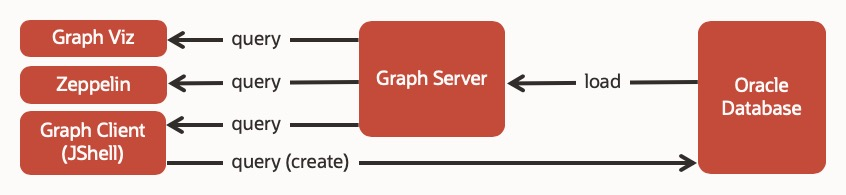

# Setup Oracle Database in Docker

## Introduction

This lab will walk you through the steps to build and start an Oracle Database Docker container. You will also deploy and configure the Property Graph server and client components for use with the database Docker container.

That is, you will create a docker container for Oracle Database as backend storage of graphs.



Estimated Lab Time: 30 minutes

### Objectives

In this lab, you will:
* Build and start an Oracle Database Docker container
* Deploy and configure the Property Graph server and client components

### Prerequisites

* Docker and GIT on your local machine (laptop or desktop).
* Internet access to download the Oracle Database distribution.
* Cloned `oracle-pg` repository on your local machine.

## **STEP 1:** Build the Oracle Database Docker image

1. Clone the Oracle `docker-images` repository.

    ```
    $ <copy>git clone https://github.com/oracle/docker-images.git</copy>
    ```

2. Download Oracle Database for Linux.

    [Oracle Database 19.3.0 for Linux x86-64 (ZIP)](https://www.oracle.com/database/technologies/oracle-database-software-downloads.html)

3. Put `LINUX.X64_193000_db_home.zip` under:

 `docker-images/OracleDatabase/SingleInstance/dockerfiles/19.3.0/`

4. Build the image.

    ```
    $ <copy>cd docker-images/OracleDatabase/SingleInstance/dockerfiles/ ;</copy>
    $ <copy>bash buildDockerImage.sh -v 19.3.0 -e </copy>
    ```

## **STEP 2:** Start the containers

1. Start the containers for **Oracle Database** only.

    ```
    $ <copy>cd oracle-pg/docker/ ;</copy>
    $ <copy>docker-compose -f docker-compose-rdbms.yml up -d oracle-db </copy>
    ```

    This step takes 15-20 minutes because it starts the container and then builds the database itself. View the container's log to track progress.

### Viewing the log files

1. Enter the following commands to view the logs and check on the progress of database initialization.

    ```
    $ cd oracle-pg/docker/
    $ <copy>docker-compose -f docker-compose-rdbms.yml logs -f oracle-db</copy>
    ```

2. Enter `Ctl+C` to quit.

    Proceed to step 2 the database is up and running.

## **STEP 3:** Configure the database

1. Connect to the Oracle Database server.

    ```
    $ <copy>docker exec -it oracle-db sqlplus sys/Welcome1@localhost:1521/orclpdb1 as sysdba</copy>
    ```

2. Set max\_string\_size running max\_string\_size.sql. At the SQL prompt enter:

    ```
    SQL> <copy>@/home/oracle/scripts/max_string_size.sql</copy>

    ...

    NAME              TYPE        VALUE
    ----------------- ----------- ---------
    max_string_size   string      EXTENDED
    ```

### Troubleshooting

1. You will get this error when you try to connect before the database is created.

    ```
    $ <copy>docker exec -it oracle-db sqlplus sys/Welcome1@localhost:1521/orclpdb1 as sysdba</copy>
    ...
    ORA-12514: TNS:listener does not currently know of service requested in connect
    ```

### Starting, stopping, restarting, or removing the containers once built

1. Start, stop, or restart the containers.

    ```
    $ cd oracle-pg/docker/
    $ docker-compose -f docker-compose-rdbms.yml start|stop|restart
    ```

2. Stop the containers and remove them.

    ```
    $ cd oracle-pg/docker/
    $ <copy>docker-compose -f docker-compose-rdbms.yml down</copy>
    ```

You may now proceed to the next lab.

## Acknowledgements ##

* **Author** - Jayant Sharma, Product Manager
* **Contributors** - Ryota Yamanaka
* **Last Updated By/Date** - Anoosha Pilli, Database Product Management, October 2020

## Need Help?
Please submit feedback or ask for help using our [LiveLabs Support Forum](https://community.oracle.com/tech/developers/categories/livelabsdiscussions). Please click the **Log In** button and login using your Oracle Account. Click the **Ask A Question** button to the left to start a *New Discussion* or *Ask a Question*.  Please include your workshop name and lab name.  You can also include screenshots and attach files.  Engage directly with the author of the workshop.

If you do not have an Oracle Account, click [here](https://profile.oracle.com/myprofile/account/create-account.jspx) to create one.


