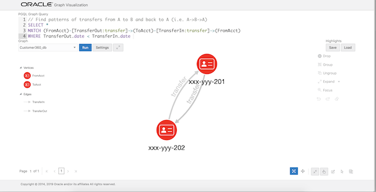
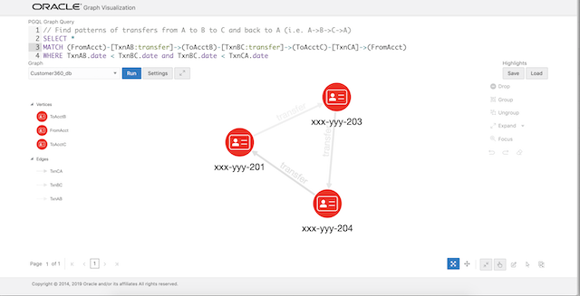

# Graph Visualization

## Introduction

This lab will walk you through the steps to visualize graph queries on the Customer 360 graph.

Estimated time: 4 minutes

### Objectives

In this lab, you will:
* Visualize graph queries on the Customer 360 graph

### Prerequisites

* This lab assumes that you have successfully completed the lab - Query and Analyze the Customer 360 Graph

## **STEP 1:** Open the graph viz web page

1. Open Graph Visualization and check if this graph is successfully loaded.

    [http://localhost:7007/ui/](http://localhost:7007/ui/)

## **STEP 2:** Run some queries and visualize the results

Next, let's run a few PGQL queries.

The [pgql-lang.org](http://pgql-lang.org) site and [specification](http://pgql-land.org/spec/1.2) are the best reference for details and examples. For the purposes of this lab, however, here are minimal basics.

The general structure of a PGQL query is

```
SELECT <select list>
FROM <graph_name> 
MATCH <graph_pattern>
WHERE <condition>
```

PGQL provides a specific construct known as the MATCH clause for matching graph patterns. A graph pattern matches vertices and edges that satisfy the given conditions and constraints.  
- `(v)` indicates a vertex variable `v`   
- `-` indicates an undirected edge, as in (source)-(dest)  
- `->` an outgoing edge from source to destination  
- `<-` an incoming edge from destination to source  
- `[e]` indicates an edge variable `e`

Let's find accounts that have had an outbound and inbound transfer of over 500 on the same day.

1. The PGQL query for this is:

    ```
    <copy>SELECT * 
    MATCH (FromAcct)-[TransferOut:transfer]->(ToAcct1), (ToAcct2)-[TransferIn:transfer]->(FromAcct)
    WHERE TransferOut.date = TransferIn.date and TransferOut.amount > 500 and TransferIn.amount > 500
    </copy>
    ```

    In the query text above (FromAcct) indicates the source vertex and (ToAcct1) the destination, while [TransferOut:transfer] is the edge connecting them. The [:transfer] specifies that the TransferOut edge has the label 'transfer'. The comma (',') between the two patterns is an AND condition.

    Copy and paste the query into the PGQL Graph Query text input box of the GraphViz application. Click Run.

    The result should look as shown below.

    

2. The next query finds patterns of transfers to and from the same two accounts, i.e. from A->B and back B->A.

    The PGQL query for this is:

    ```
    <copy>SELECT * 
    MATCH (FromAcct)-[TransferOut:transfer]->(ToAcct)-[TransferIn:transfer]->(FromAcct)
    WHERE TransferOut.date < TransferIn.date 
    </copy>
    ```

    Copy and paste the query into the PGQL Graph Query text input box of the GraphViz application.Click Run.

    The result should look as shown below.

    

3. Let's add one more account to that query to find a circular transfer pattern between 3 accounts.

    The PGQL query becomes:

    ```
    <copy>SELECT * 
    MATCH (FromAcct)-[TxnAB:transfer]->(ToAcctB)-[TxnBC:transfer]->(ToAcctC)-[TxnCA:transfer]->(FromAcct)
    WHERE TxnAB.date < TxnBC.date and TxnBC.date < TxnCA.date
    </copy>
    ```

    Copy and paste the query into the PGQL Graph Query text input box of the GraphViz application. Click Run.

    The result should look as shown below.

    

## Acknowledgements

* **Author** -  Jayant Sharma, Product Manager
* **Contributors** - Ryota Yamanaka
* **Last Updated By/Date** - Anoosha Pilli, Database Product Management, October 2020

## Need Help?
Please submit feedback or ask for help using our [LiveLabs Support Forum](https://community.oracle.com/tech/developers/categories/livelabsdiscussions). Please click the **Log In** button and login using your Oracle Account. Click the **Ask A Question** button to the left to start a *New Discussion* or *Ask a Question*.  Please include your workshop name and lab name.  You can also include screenshots and attach files.  Engage directly with the author of the workshop.

If you do not have an Oracle Account, click [here](https://profile.oracle.com/myprofile/account/create-account.jspx) to create one.
