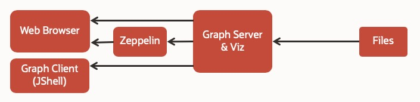

# Setup Graph environment

## Introduction
Property graphs have become a useful way to model, manage, query and analyze much of the connected data found in today’s applications and information systems.  They allow you to represent data based on relationships and connectivity, query data by traversing those connections, and analyze data using algorithms that evaluate the strength of the connections, patterns and anomalies in the graph, the importance of elements in the graph, and other factors.

Oracle Database property graph support consists of graph storage, indexing, and search; a powerful in-memory analyst with 50 built-in, parallel analytic functions; a graph query language and developer APIs. Graph algorithms enable you to explore and discover relationships in social networks, IoT, big data, data warehouses and complex transaction data for applications such as fraud detection in banking, customer 360, and smart manufacturing.

Watch the video below for an overview of Oracle Graph.
[](youtube:-DYVgYJPbQA)


## Overview

Let's load graph data from files before setting up database.



## Step 1: Launch Graph Server

### Clone this Repository
    $ <copy>git clone https://github.com/jayant62/oracle-pg.git</copy>

### Download and Extract Packages
Go to the following pages and download the packages.

- [Oracle Graph Server and Client 20.1](https://www.oracle.com/database/technologies/spatialandgraph/property-graph-features/graph-server-and-client/graph-server-and-client-downloads.html)
- [Apache Groovy 2.4.18](https://dl.bintray.com/groovy/maven/apache-groovy-binary-2.4.18.zip)

Put the following files into `oracle-pg/docker/tmp/`

- oracle-graph-20.1.0.x86_64.rpm
- oracle-graph-zeppelin-interpreter-20.1.0.zip
- apache-groovy-binary-2.4.18.zip
 
Run the following script to extract the packages:

```
$ <copy>cd oracle-pg/docker/tmp/</copy>
$ <copy>sh extract.sh</copy>
```

### Modify the PGX interpreter settings for Zeppelin

The extract script above copies the necessary jar files and a json configuration file into the `oracle-pg/docker/zeppelin/interpreter/pgx` directory. Open the file `interpreter-settings.json` in a text editor and change the default PGX_BASE_URL property in it. i.e. change the line (line 15)
` "defaultValue":"https://localhost:7007" `
to 
```
<copy>"defaultValue":"http://graph-server:7007"</copy>
```

### Start Containers
Build and pull images, create containers, and start them.

```
$ <copy>cd oracle-pg/docker/</copy>
$ <copy>docker-compose up -d</copy>
```

This takes some time. To check the progress, see **Appendix 1**.

Access Graph Visualization.

 - [http://localhost:7007/ui/](http://localhost:7007/ui/)

Access Zeppelin and start querying and analyzing graphs, e.g. Lab 2: Customer 360 Analysis.

- [http://localhost:8080/#/](http://localhost:8080/#/)

To stop, restart, or remove the containers, see **Appendix 2**.

### Appendix 1
View the containers' log files to check the progress of creating and starting them.

```
$ <copy>cd oracle-pg/docker/ ;</copy>
$ <copy>docker-compose logs -f</copy>
```

`Ctl+C` to quit.

### Appendix 2
To start, stop, or restart the containers.

```
$ <copy>cd oracle-pg/docker/ ;</copy>
$ <copy>docker-compose start|stop|restart</copy>
```

To remove the docker containers.

```
$ <copy>cd oracle-pg/docker/ ;</copy>
$ <copy>docker-compose down</copy>
```

## Step 2: Configure database on Docker

In this tutorial, we will create a docker container for Oracle Database as a backend storage of graphs.


### Build Docker Image
Clone `docker-images` repository.

```
$ <copy>git clone https://github.com/oracle/docker-images.git</copy>
```

Download Oracle Database.

[Oracle Database 19.3.0 for Linux x86-64 (ZIP)](https://www.oracle.com/database/technologies/oracle-database-software-downloads.html)

Put `LINUX.X64_193000_db_home.zip` under:

- `docker-images/OracleDatabase/SingleInstance/dockerfiles/19.3.0/`

Build the image.

```
$ <copy>cd docker-images/OracleDatabase/SingleInstance/dockerfiles/ ;</copy>
$ <copy>bash buildDockerImage.sh -v 19.3.0 -e </copy>
```

### Start Containers

Start the containers for **Oracle Database** only.

```
$ <copy>cd oracle-pg/docker/ ;</copy>
$ <copy>docker-compose -f docker-compose-rdbms.yml up -d oracle-db </copy>
```

This step takes time becuase it starts the container and then builds the databse itself. View the container's log to track progress.  **Appendix 1**.

### Configure Oracle Database

Connect to the Oracle Database server.

```    
$ <copy>docker exec -it oracle-db sqlplus sys/Welcome1@localhost:1521/orclpdb1 as sysdba</copy>
```

Set max\_string\_size running max\_string\_size.sql. At the SQL prompt enter:

```
SQL> <copy>@/home/oracle/scripts/max_string_size.sql</copy>

...

NAME              TYPE        VALUE
----------------- ----------- ---------
max_string_size   string      EXTENDED
```

Next step is to create a graph in the database.

### Load Table Data

Connect to the database as "sys" user, and create a user, "customer_360".

```
$ <copy> docker exec -it oracle-db sqlplus sys/Welcome1@localhost:1521/orclpdb1 as sysdba</copy>
```

At the SQL prompt enter:
```
<copy>
@/graphs/customer_360/create_user.sql
EXIT
</copy>
```

Connect to the database as the "customer_360" user, and create tables.

```
$ <copy>docker exec -it oracle-db sqlplus customer_360/Welcome1@localhost:1521/orclpdb1</copy>
```

At the SQL prompt enter:
```
<copy>
@/graphs/customer_360/create_tables.sql
EXIT
</copy>
```

### Create Property Graph

The following DDL creates a property graph (i.e. node and edge tables) from the relational table data.


[create_pg.pgql](.setup/files/graphs/customer_360/create_pg.pgql)


```
CREATE PROPERTY GRAPH customer_360
  VERTEX TABLES (
    customer
      LABEL "Customer"
      PROPERTIES (
        type AS "type"
      , name AS "name"
      , age AS "age"
      , location AS "location"
      , gender AS "gender"
      , student AS "student"
      )
  , account
      LABEL "Account"
      PROPERTIES (
        type AS "type"
      , account_no AS "account_no"
      , balance AS "balance"
      )
  , merchant
      LABEL "Merchant"
      PROPERTIES (
        type AS "type"
      , name AS "name"
      )
  )
  EDGE TABLES (
    owned_by
      SOURCE KEY(from_id) REFERENCES account
      DESTINATION KEY(to_id) REFERENCES customer
      LABEL "owned_by"
      PROPERTIES (
        since AS "since"
      )
  , parent_of
      SOURCE KEY(from_id) REFERENCES customer
      DESTINATION KEY(to_id) REFERENCES customer
      LABEL "parent_of"
  , purchased
      SOURCE KEY(from_id) REFERENCES account
      DESTINATION KEY(to_id) REFERENCES merchant
      LABEL "purchased"
      PROPERTIES (
        amount AS "amount"
      )
  , transfer
      SOURCE KEY(from_id) REFERENCES account
      DESTINATION KEY(to_id) REFERENCES account
      LABEL "transfer"
      PROPERTIES (
        amount AS "amount"
      , date AS "date"
      )
  )
```
Note: The file is part of the repository under the `graphs/customer_360/` directory. The parent directory is mapped to `/graphs` in the container.

Using Graph Client, connect to Oracle Database and run the DDL above.

If the graph-client is not up and runnning start it by executing the following command.
```
<copy>docker-compose -f docker-compose-rdbms.yml up -d graph-client</copy>
```
Then start a JShell in the client.

```
$ <copy>docker exec -it graph-client opg-rdbms-jshell</copy>
```

Once JShell is running and you see the lines 
```
Oracle Graph Server Shell 20.1.0
PGX server version: 19.4.0 type: SM
PGX server API version: 3.6.0
PGQL version: 1.2
Variables instance, session, and analyst ready to use.
opg-rdbms-jshell> 
```

Enter the following code to:  
- Specify the JDBC connection to the database
- Open a Connection
- Set a required parameter for PGQL operation
- Create a PgqlConnection
- Read, prepare, and execute the CREATE PROPERTY GRAPH statement

```
<copy>
var jdbcUrl = "jdbc:oracle:thin:@oracle-db:1521/orclpdb1";
var conn = DriverManager.getConnection(jdbcUrl, "customer_360", "Welcome1");
conn.setAutoCommit(false);
var pgql = PgqlConnection.getConnection(conn);
pgql.prepareStatement(Files.readString(Paths.get("/graphs/customer_360/create_pg.pgql"))).execute(); 
</copy>
```

Note: The execute() above will return `false` on completion since the first result is not a ResultSet. 

Exit Graph Client. See also **Appendix 2**.
```
\exit
```
### Loading Configuration

The following configuration files determine the graph server startup settings and optionally the graphs that are pre-loaded. 

The pgx-rdbms.conf file under `{$REPO_HOME}/docker/conf/` specifies which graph to pre-load.

The configuration of the graph itself, i.e. how and what to load, is in the JSON file rdbms.json under `{$REPO_HOME}/graphs/customer_360/`.


`pgx-rdbms.conf`

```
$ oracle-pg/docker/conf/pgx-rdbms.conf
"preload_graphs": [
  {"path": "/graphs/customer_360/rdbms.json", "name": "Customer360_db"},
```

`rdbms.json`

```
{
  "format":"pg",
  "db_engine":"rdbms",
  "jdbc_url":"jdbc:oracle:thin:@oracle-db:1521/orclpdb1",
  "username":"customer_360",
  "keystore_alias":"database1",
  "max_num_connections":8,
  "name":"customer_360",
  "vertex_props": [
    {"name":"type", "type":"string"},
    {"name":"name", "type":"string"},
    {"name":"age", "type":"integer"},
    {"name":"location", "type":"string"},
    {"name":"gender", "type":"string"},
    {"name":"student", "type":"string"},
    {"name":"account_no", "type":"string"},
    {"name":"balance", "type":"integer"}
  ],
  "edge_props": [
    {"name":"since", "type":"string"},
    {"name":"amount", "type":"integer"},
    {"name":"date", "type":"string"}
  ],
  "loading":{
    "load_edge_label":true
  }
}
```

Note that edge labels are also loaded.

See also **Appendix 3**.

Start Graph Server
Run Docker containers for Graph Server, Graph Client, and Zeppelin.

    $ <copy>cd oracle-pg/docker/ ;</copy>
    $ <copy>docker-compose -f docker-compose-rdbms.yml -d up</copy>

See also **Appendix 4**.

Open Graph Visualization and check if this graph is successfully loaded.

[http://localhost:7007/ui/](http://localhost:7007/ui/)

Open Zeppelin and try running "Customer 360" analytics example.

[http://localhost:8080/](http://localhost:8080/)

### Appendix 1

You will get this error when you try to connect before the database is created.

```
$ <copy>docker exec -it oracle-db sqlplus sys/Welcome1@localhost:1521/orclpdb1 as sysdba</copy>
...
ORA-12514: TNS:listener does not currently know of service requested in connect
```

To check the progress, see logs.

```
$ cd oracle-pg/docker/
$ <copy>docker-compose -f docker-compose-rdbms.yml logs -f oracle-db</copy>
```

`Ctl+C` to quit.

### Appendix 2

You can check the graph by executing the following code aqnd query (= PGQL on RDBMS) in the JShell.  
How many nodes are in the newly created property graph?

Start a JShell. Then check which graph is loaded. Then query it.

```
<copy>docker exec -it graph-client opg-rdbms-jshell -b http://graph-server:7007</copy>
```

Enter the following code in JShell.
```
<copy>
Consumer<String> query = q -> {
    try(var s = pgql.prepareStatement(q)) {
      s.execute();
      s.getResultSet().print();
    } catch(Exception e) {
      throw new RuntimeException(e);
    }
  }

query.accept("select count(v) from Customer360-PG match (v)");
</copy>
+----------+
| count(v) |
+----------+
| 8        |
+----------+
```

### Appendix 3

To test the database graph loading configuration (i.e. rdbms.json) start JShell and execute the code below.

```
$ <copy>docker exec -it graph-client opg-rdbms-jshell -b http://graph-server:7007</copy>
var graph = session.readGraphWithProperties("/graphs/customer_360/rdbms.json")
```


### Appendix 4

Start, stop, or restart the containers.

```
$ cd oracle-pg/docker/
$ docker-compose -f docker-compose-rdbms.yml start|stop|restart
```

Stop the containers and remove them.

```
$ cd oracle-pg/docker/
$ <copy>docker-compose -f docker-compose-rdbms.yml down</copy>
```


## Acknowledgements ##

- **Author** - Ryota Yamanaka - Product Manager in Asia-Pacific for geospatial and graph technologies  
  With a little help from colleagues (Albert Godfrind and Jayant Sharma).  