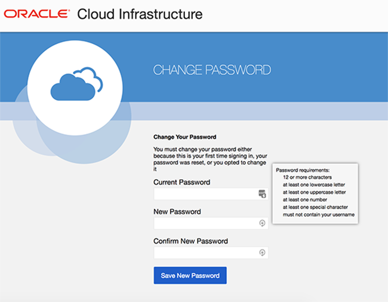

# Enter tutorial title here
## Before You Begin

This 15-minute tutorial walks you through the steps to login to Oracle Cloud and create your SSH Key pair.

### What Do You Need?

* A valid login to an Oracle Cloud account (Free Tier or Paid)
* The ability to generate an ssh public and private key on your machine

## STEP 1-Login to the Oracle Cloud
1.  You should have received two emails.  **Email 1:**  From noreply with the subject **Verify Email Request** (check your spam and junk folders).  This has the link that verifies your email.  Without clicking on this link you cannot login to the tenancy.  Open up this email.  Click on the **Sign In to Oracle Cloud** link.  

    


2.  You should have received a 2nd email with your temporary password.  Enter your username and your password (Email 2) in the box on the right hand side that says **Oracle Infrastructure** (Do not use SSO, SSO is not enabled for this tenancy).  

    
   
3. You will then be taken to a screen to change your password.  Choose a new password that you can remember and click **Sign In** (make sure you are using an approved browser.  IE is not supported)

    


4. Once you successfully login, you will be presented with the Oracle Cloud homepage. (NOTE: If you get an *Email Activation Unsuccessful* message, check to see if you can still access the cloud by looking for the hamburger menu to the left). 
   


5.  In Email 2, you were also assigned a region.  Click in the upper right hand corner and set your Region appropriately.   (NOTE:  Setting the region is important, your network is region specific.  If you choose a different region that does not match your subnet, you will get an error on environment creation) 

     

## STEP 2-Generate an SSH Key Pair

If you already have an ssh key pair, you may use that to connect to your environment.  Based on your laptop config, choose the appropriate step to connect to your instance.

IMPORTANT:  If the ssh key is not created correct, you will not be able to connect to your environment and will get errors.  Please ensure you create your key properly. ` 

### Mac Users
1.  Open up a terminal and type the following commands.  When prompted for a passphrase click **enter**. *Do not enter a passphrase*.
     ````
    cd ~
    cd .ssh
    <copy>ssh-keygen -b 2048 -t rsa -f optionskey</copy>
    ````

     
3.  Inspect your .ssh directory.  You should see two files.  optionskey and optionskey.pub.  Copy the contents of the pub file `optionskey.pub` into notepad.  Your key file should be one line. You will need this to access your instance later.  

    ````
    <copy>ls -l .ssh
    more optionskey.pub</copy>
    ````


### Windows (Gitbash)
Using GitBash or Windows Subsystem for Linux (WSL) ### 

1. Open the terminal tool of your choice
2. Type the following command at the prompt to generate keys for your instance.
    ````
    ssh-keygen -f optionskey
    ````
3. Press enter to accept the default values
4. Do not assign a password for this exercise. (note you should always assign an SSH key password in production)
5. Type the following to retrieve your public key.  You will need this to access your instance in Section 5.  
    ````
    cat ~/.ssh/optionskey.pub 
    ````


### Windows (Puttygen)

1. Open PuttyGen
2. Click the [Generate] button

     
3. Move your mouse around the screen randomly until the progress bar reaches 100%
4. Click the [Save private key] button. Name the file `optionskey`.  This file will not have an extension.

     
5. Save the public key (displayed in the text field) by copying it to the clipboard and saving it manually to a new text file. Name the file `optionskey.pub`.   You will need this to access your instance in Section 5.  

6. Note: Sometimes PuttyGen does not save the public key in the correct format. The text string displayed in the window is correct so copy/paste to be sure.

