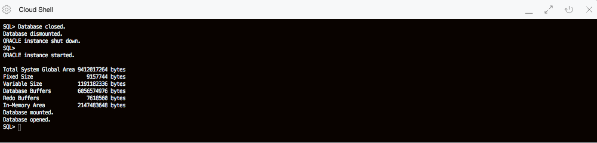

# Enable In-Memory

## Introduction
Watch the video below to get an explanation of enabling the In-Memory column store.

[](youtube:dZ9cnIL6KKw)

### Objectives

-   Learn how to enable In-Memory on the Oracle Database
-   Explore various views to monitor In-Memory

### Prerequisites

This lab assumes you have completed the following labs:
* Lab: Generate SSH Key (FreeTier and Paid accounts)
* Lab: Environment Setup or Verify Setup

## Step 0: Download the Lab Files

1.  Open up the Oracle Cloud Shell or terminal of your choice and log in to the compute instance you created in the previous lab.


2.  Copy the following commands into your terminal.  These commands download the files needed to run the lab.

    Note: If you are running in windows using putty, ensure your Session Timeout is set to greater than 0

    ````
    <copy>
    cd /home/opc/
    wget https://objectstorage.us-ashburn-1.oraclecloud.com/p/CQFai9l6Lt2m9g6X3mYnfTJTWrv2Qh62-kPcw2GyRZw/n/c4u03/b/labfiles/o/multiscripts.zip
    unzip multiscripts.zip; chmod +x *.sh
    /home/opc/setupenv.sh
    </copy>
    ````

## **Step 1:** Run the In-Memory Setup Scripts
1.  Run this command to setup the schema, SSB, you will use for this lab.   This script takes about 15 minutes to complete.   It downloads the ssb.dmp file and then imports it.


    ````
    <copy>
    cd /home/opc/
    wget https://objectstorage.us-ashburn-1.oraclecloud.com/p/axp5T8m0cF0_p1N832Qo6ImwczP_V6bSQi9ABLti6Ug/n/c4u03/b/labfiles/o/inmemoryscript.sh
    chmod +x /home/opc/inmemoryscript.sh
    nohup /home/opc/inmemoryscript.sh &> setupinmem.out&
    </copy>
    ````
    

2.  To check the status of the script above run the command below (Note: You will have to issue a Ctl-C to exit the tail command).   You can also use the unix **jobs** command to see if the script is still running.  *Note:  Ignore the error that the SSB User exists, that is expected.  The script should finish with 1 error*

    ````
    <copy>
    tail -f /home/opc/setupinmem.out
    </copy>
    ````
    

   Note: When you see the message that the job completed and the "Last login:" line you need to enter a control and C to exit out of the tail command.

## **Step 2:** Logging In and Enabling In-Memory

1.  All scripts for this lab are stored in the labs/inmemory folder and should be run as the oracle user.  Let's navigate there now.  We recommend that you run the SQL scripts in the lab directories to get a better feel for working with Database In-Memory. But you can also copy the commands with the COPY button.

    ````
    <copy>
    sudo su - oracle
    cd ~/labs/inmemory/Part1
    ls
    </copy>
    ````

2. In-Memory is integrated into Oracle Database 12c (12.1.0.2) and higher.  The IM column store is not enabled by default, but can be easily enabled in a few steps.  Before you enable it, let's take a look at the default configuration. First, set your oracle environment and verify the memory allocations and parameter settings.

    ````
    . oraenv
    ORCL
    ````
     

    ````
    <copy>
    sqlplus / as sysdba
    show sga;
    show parameter inmemory_size;
    show parameter db_keep_cache_size;
    </copy>
    ````

     

    Notice that the SGA is made up of Fixed Size, Variable Size, Database Buffers and Redo.  There is no In-Memory Area in the SGA.  Let's enable it.

3.  Enter the commands to enable In-Memory.  The database will need to be restarted for the changes to take effect. Note that we are also enabling the db\_keep\_cache\_size parameter. This is being done so that we can also fully cache the tables in the lab in the buffer cache. This will provide a memory to memory comparison between the row-store and the column-store later in the lab. This is not required to enable Database In-Memory, this is just for this lab.

    ````
    <copy>
    alter system set inmemory_size=2500M scope=spfile;
    alter system set db_keep_cache_size=2G scope=spfile;
    alter system set inmemory_virtual_columns=enable scope=spfile;
    shutdown immediate;
    startup;
    </copy>
    ````
     


4.  Now let's take a look at the memory allocations and parameter settings.

    ````
    <copy>
    show sga;
    show parameter inmemory_size;
    show parameter db_keep_cache_size;
    exit
    </copy>
    ````
     

## **Step 3:** Enabling In-Memory

The Oracle environment is already set up so sqlplus can be invoked directly from the shell environment. Since the lab is being run in a pdb called orclpdb you must supply this alias when connecting to the ssb account. If running scripts you just need to connect to sqlplus since ssb connection info is part of the scripts, for example: `sqlplus /nolog`.

1.  Log in to the pdb as the SSB user.  
    ````
    <copy>
    sqlplus ssb/Ora_DB4U@localhost:1521/orclpdb
    set pages 9999
    set lines 200
    </copy>
    ````
     

2.  The In-Memory area is sub-divided into two pools:  a 1MB pool used to store actual column formatted data populated into memory and a 64KB pool to store metadata about the objects populated into the IM columns store.  The V$INMEMORY\_AREA view shows the total IM column store allocations and usage.  The COLUMN command in these scripts identifies the column you want to format and the model you want to use. Run the query 03\_im\_usage.sql or the query below.

    ````
    <copy>
    column alloc_bytes format 999,999,999,999;
    column used_bytes format 999,999,999,999;
    column populate_status format a15;
    --QUERY

    select * from v$inmemory_area;
    </copy>
    ````
     

3.  To check if any objects are populated in the IM column store query the V$IM\_SEGMENTS view by running the script 05\_im\_segments.sql or the query below.

    ````
    <copy>
    column name format a30
    column owner format a20
    --QUERY

    select v.owner, v.segment_name name, v.populate_status status from v$im_segments v;
    </copy>
    ````
        

4.  To add objects to the IM column store the INMEMORY attribute must be set.  This tells Oracle Database these tables should be populated into the IM column store. Run the script 06\_\im\_alter\_table.sql or run the commands below.  

    ````
    <copy>
    ALTER TABLE lineorder INMEMORY;
    ALTER TABLE part INMEMORY;
    ALTER TABLE customer INMEMORY;
    ALTER TABLE supplier INMEMORY;
    ALTER TABLE date_dim INMEMORY;
    </copy>
    ````
        

5.  This looks at the USER\_TABLES view and queries attributes of tables in the SSB schema. Run the script 07\_im\_attributes.sql or the query below.  

    ````
    <copy>
    set pages 999
    column table_name format a12
    column cache format a5;
    column buffer_pool format a11;
    column compression heading 'DISK|COMPRESSION' format a11;
    column compress_for format a12;
    column INMEMORY_PRIORITY heading 'INMEMORY|PRIORITY' format a10;
    column INMEMORY_DISTRIBUTE heading 'INMEMORY|DISTRIBUTE' format a12;
    column INMEMORY_COMPRESSION heading 'INMEMORY|COMPRESSION' format a14;
    --QUERY    

    SELECT table_name, cache, buffer_pool, compression, compress_for, inmemory,
        inmemory_priority, inmemory_distribute, inmemory_compression
    FROM   user_tables;
    </copy>
    ````
        

By default the IM column store is only populated when the object is first accessed.

6.  Let's populate the IM column store by accessing the tables that were enabled for in\-memory. Run the script 08\_im\_start\_pop.sql or run the queries below.

    ````
    <copy>
    SELECT /*+ full(d)  noparallel (d )*/ Count(*)   FROM   date_dim d;
    SELECT /*+ full(s)  noparallel (s )*/ Count(*)   FROM   supplier s;
    SELECT /*+ full(p)  noparallel (p )*/ Count(*)   FROM   part p;
    SELECT /*+ full(c)  noparallel (c )*/ Count(*)   FROM   customer c;
    SELECT /*+ full(lo)  noparallel (lo )*/ Count(*) FROM   lineorder lo;
    </copy>
    ````
     

7. Background processes are populating these segments into the IM column store.  To monitor this, you could query the V$IM\_SEGMENTS view.  Once the data population is complete, the BYTES\_NOT\_POPULATED should be 0 for each segment. Run the script 09\_im\_populated.sql or run the query below.  

    ````
    <copy>
    column name format a20
    column owner format a15
    column segment_name format a30
    column populate_status format a20
    column bytes_in_mem format 999,999,999,999,999
    column bytes_not_populated format 999,999,999,999,999
    --QUERY

    SELECT v.owner, v.segment_name name, v.populate_status status, v.bytes bytes_in_mem, v.bytes_not_populated
    FROM v$im_segments v;
    </copy>
    ````

     

8.  Now let's check the total space usage. Run the script 10\_im\_usage.sql or run the query below.

    ````
    <copy>
    column alloc_bytes format 999,999,999,999;
    column used_bytes      format 999,999,999,999;
    column populate_status format a15;
    select * from v$inmemory_area;
    exit
    </copy>
    ````

    

    

In this Lab you saw that the IM column store is configured by setting the initialization parameter INMEMORY\_SIZE. The IM column store is a static pool in the SGA, and once allocated it can be increased in size dynamically, but it is not managed by either of the automatic SGA memory features.

You also had an opportunity to populate and view objects in the IM column store and to see how much memory they use. In this lab we populated about 1471 MB of compressed data into the  IM column store, and the LINEORDER table is the largest of the tables populated with over 23 million rows.  Remember that the population speed depends on the CPU capacity of the system as the in\-memory data compression is a CPU intensive operation. The more CPU and processes you allocate the faster the populations will occur.

Finally you got to see how to determine if the objects were fully populated and how much space was being consumed in the IM column store.

You may now proceed to the next lab.

## Acknowledgements

- **Author** - Andy Rivenes, Sr. Principal Product Manager, Oracle Database In-Memory
- **Last Updated By/Date** - Kay Malcolm, Director, DB Product Management, June 2020

## Need Help?
Please submit feedback or ask for help using our [LiveLabs Support Forum](https://community.oracle.com/tech/developers/categories/livelabsdiscussions). Please click the **Log In** button and login using your Oracle Account. Click the **Ask A Question** button to the left to start a *New Discussion* or *Ask a Question*.  Please include your workshop name and lab name.  You can also include screenshots and attach files.  Engage directly with the author of the workshop.

If you do not have an Oracle Account, click [here](https://profile.oracle.com/myprofile/account/create-account.jspx) to create one.    Please include the workshop name and lab in your request.
