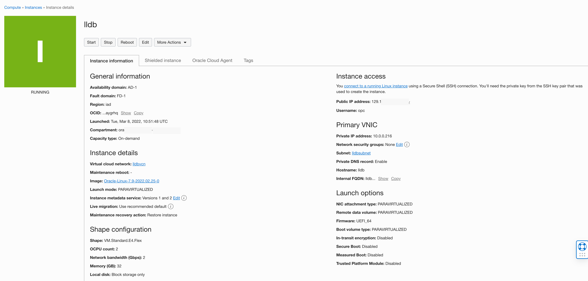

# Create compute instance

## Introduction

Oracle Cloud Infrastructure provides fast, flexible, and affordable compute capacity to fit any workload need from performant bare metal servers and VMs to lightweight containers. OCI Compute provides uniquely flexible VM and bare metal instances for optimal price-performance.

Estimated Time: 20 minutes

### Objectives

In this lab, you will create:

* Compute instance
* Create virtual cloud network and associate it with compute instance
* SSH into compute instance
* Oracle user

### Prerequisites
This lab assumes:

* You have access to Oracle cloud account
* Authorized to create a compute instance and virtual cloud network 
* A valid SSH key pair

## Task 1: Create compute instance with virtual cloud network 

1. Create compute instance in the compartment of your choice

       

2. Select Image, An Oracle Enterprise Linux 7 or 8  

       

3. Create a virtual cloud network in the same compartment as that of the compute instance

       

4. Make note of public and private IP address

       

## Task 2: SSH into instance

1. SSH into compute instance using the private key and public IP address of the instance

      ```
      <copy>
      ssh -i <private key> opc@<public ip address>
      </copy>
      ``` 

## Task 3: Create oracle user 

1. You can check the logged-in user with whoami. This will return *opc*
 
      ```
      <copy>
      whoami 
      </copy>
      ```  

      As the root user, add a user named oracle which is used later in this lab

      ```
      <copy> 
      groupadd oracle 
      </copy>
      ``` 

      ```
      <copy> 
      useradd -m -g oracle -d /home/oracle -s /bin/bash oracle 
      </copy>
      ``` 

      ```
      <copy> 
      passwd oracle
      < password > 
      </copy>
      ``` 

      ```
      <copy> 
      su - oracle
      Password: 
      </copy>
      ``` 


 
   You successfully made it to the end this lab. You may now *proceed to the next lab*.  

## Learn More

* [Create users and groups on Oracle Linux ](https://docs.oracle.com/en/learn/users_groups_linux8/index.html#administer-group-accounts) 
 
## Acknowledgements

- **Author** - Madhusudhan Rao, Principal Product Manager, Database
* **Contributors** - Kevin Lazarz, Senior Principal Product Manager, Database and Gregg Christman, Senior Product Manager
* **Last Updated By/Date** -  Madhusudhan Rao, Feb 2022 
