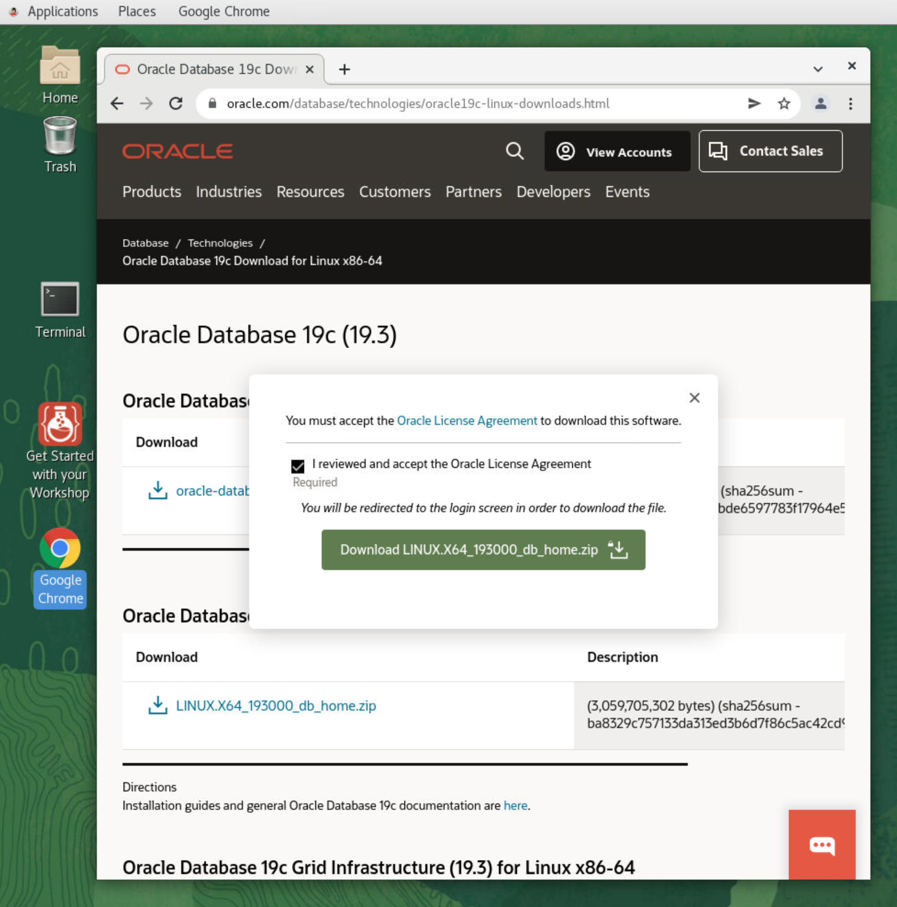
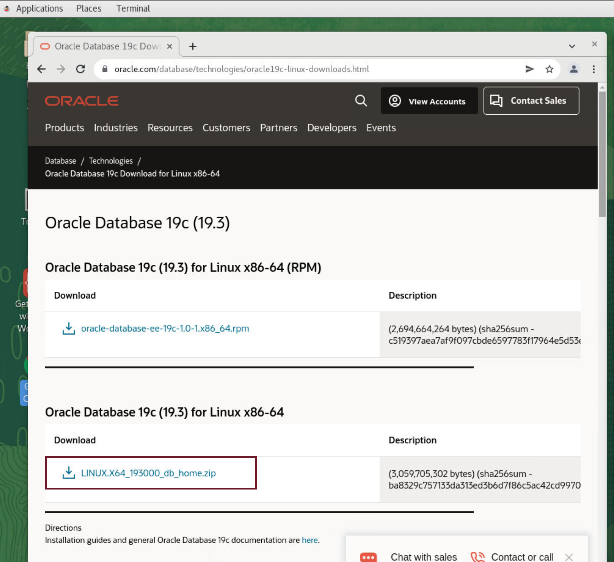
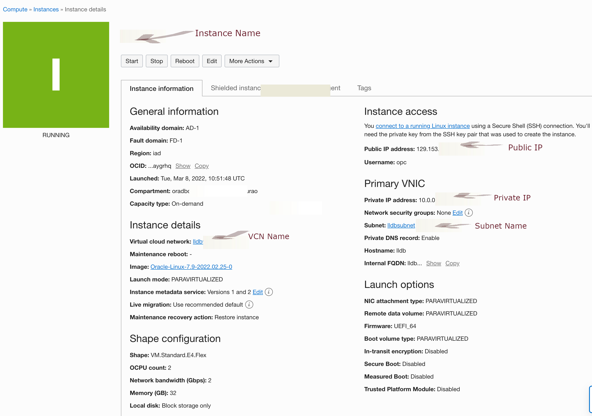
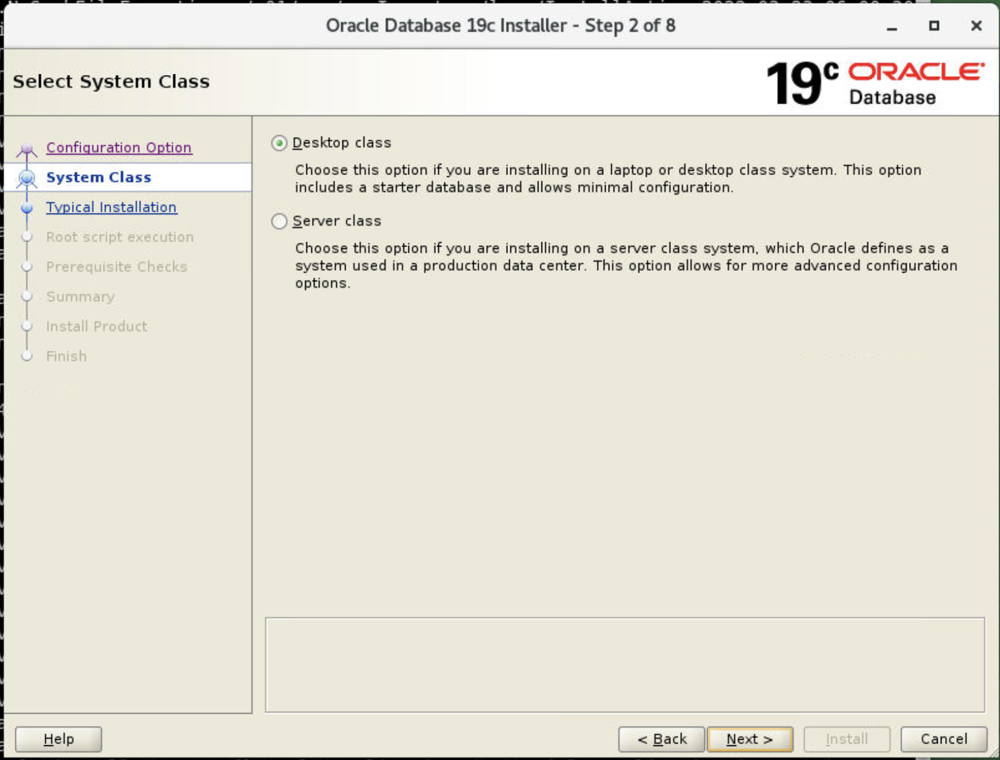
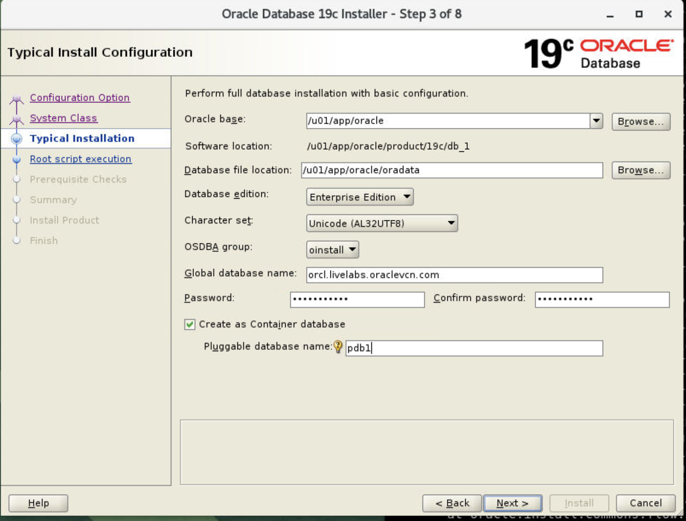
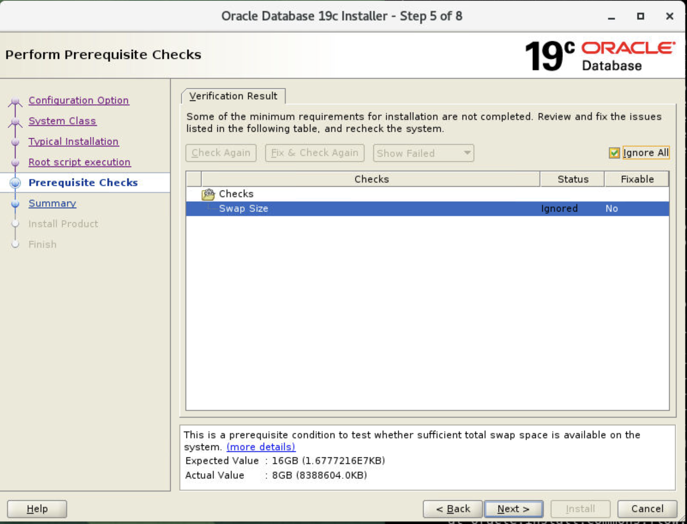
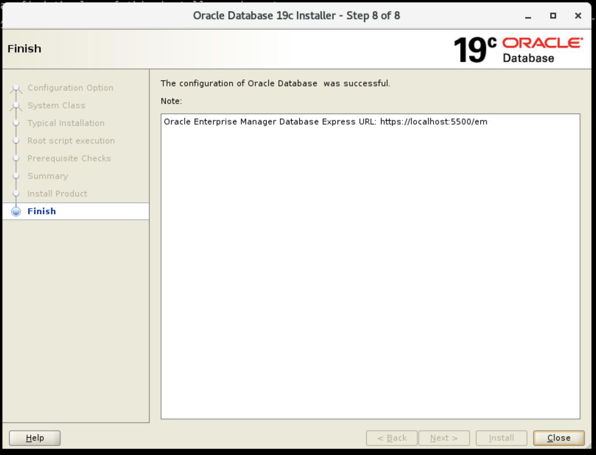
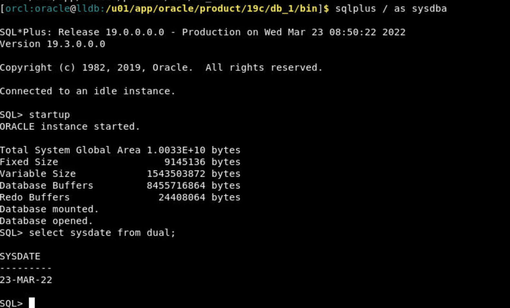

# Install Oracle Database 19c

## Introduction

In this lab, we will install the Oracle Database 19c software.
 
> **Note:** This workshop is available in free or paid environments only.

Estimated Time: 40 minutes

### About Oracle Database 19c Installation

In this lab, we will log in to the noVNC Desktop image as an oracle user, create required groups and directories, and install Oracle Database 19c in a GUI mode. Once the installation is complete, we will start the database listener and database. We will end this lab by creating a simple database table.
 
### Objectives
 
In this lab, you will:

* Download Oracle Database 19c
* Create required group, directories and set permissions 
* Setup the Kernel parameters
* Stop and disable the firewall
* Install pre-installation packages
* Run the installer in GUI mode
* Review the success of the installation 
* Start the listener and database
* Create a simple database table

### Prerequisites 
This lab assumes you have:

* Compute instance created with Virtual cloud network attached to the instance
* Oracle user created
* noVNC remote desktop is available and you have already logged into the remote desktop environment
  
## Task 1: Download Database 19c 

1. Sign in to the Oracle Database 19c download page and Accept the License 
 
       

2. Download *Oracle Database 19c for Linux* zip file 

       

3. Create backup of .bash_profile in /home/oracle

      ```
      <copy>
            $ pwd
      /home/oracle
      cp .bash_profile .bash_profile.bkup
      </copy>
      ``` 

4. Edit .bash_profile 

      ```
      <copy>
      # Get the aliases and functions
      if [ -f ~/.bashrc ]; then
            . ~/.bashrc
      fi

      # User specific environment and startup programs 

      export TMP=/tmp
      export TMPDIR=$TMP
      export ORACLE_BASE=/u01/app/oracle
      export DB_HOME=$ORACLE_BASE/product/19c/db_1
      export ORACLE_HOME=$DB_HOME
      export ORACLE_SID=orcl
      export BASE_PATH=/usr/sbin:$PATH
      export ORACLE_PATH=$ORACLE_HOME/bin:$BASE_PATH
      export LD_LIBRARY_PATH=$ORACLE_HOME/lib:/lib:/usr/lib

      PATH=$PATH:$HOME/.local/bin:$HOME/bin 
 
      export PATH
      . ~/.set-env.sh
      </copy>
      ```

## Task 2: Create group, create directories and set permissions

1. As root create group *oinstall*, add user *oracle* to group *oinstall*

      ```
      <copy>
      [opc@x:~]$ sudo su
      [root@x:/home/opc]$ groupadd oinstall
      [root@x:/home/opc]$ usermod -g oinstall oracle 
      </copy>
      ``` 

## Task 3: Setup Kernel parameters 

1. Setup Kernel parameters as root and then reboot
 
      ```
      <copy>
      [root@x:/home/oracle]$ vi /etc/security/limits.conf
      </copy>
      ```  

      add the following soft and hard limits 

      ```
      <copy>
      oracle  soft  nofile  1024
      oracle  hard  nofile  65536
      oracle  soft  nproc   16384
      oracle  hard  nproc   16384
      oracle  soft  stack   10240
      oracle  hard  stack   32768
      oracle  soft  memlock   134217728
      oracle  hard  memlock   134217728
      </copy>
      ```  

## Task 3: Stop and Disable Firewall

1. Disable firewall

      ```
      <copy> 
      [root@x:/home/oracle]$ systemctl stop firewalld
      [root@x:/home/oracle]$ systemctl disable firewalld
      </copy>
      ```  

      reboot system

## Task 4:  Install database *preinstall* packages and extract the installer

1. Install additional packages *oracle-database-preinstall-19c*
          
      ```
      <copy> 
      [opc@x:~]$ sudo su
      [root@x:/home/opc]$ yum install -y oracle-database-preinstall-19c  
      </copy>
      ``` 

2. Extract the downloaded installer in */u01/app/oracle/product/19c/db_1/*

      ```
      <copy>
      [oradb:oracle@x:/tmp]$ mv LINUX.X64_193000_db_home.zip /u01/app/oracle/product/19c/db_1/ 
      [oracle@x:/u01/app/oracle/product/19c/db_1]$ ls
      LINUX.X64_193000_db_home.zip
      [oracle@x:/u01/app/oracle/product/19c/db_1]$ unzip LINUX.X64_193000_db_home.zip
      Archive:  LINUX.X64_193000_db_home.zip
      creating: drdaas/
      creating: drdaas/admin/
      .... 
      </copy>
      ``` 

## Task 5:  Get OPatch version 

1. Get OPatch version 

      ```
      <copy>
      [oracle@x:/u01/app/oracle/product/19c/db_1]$ cd OPatch/
      [oracle@x:/u01/app/oracle/product/19c/db_1/OPatch]$ ./opatch version
      OPatch Version: 12.2.0.1.17 
      OPatch succeeded. 
      </copy>
      ```
2. Make required directories for installation 

      ```
      <copy> 
      mkdir -p /u01/app/oracle/product/19c/db_1/
      mkdir -p /u01/app/oracle/oradata/
      mkdir -p /u01/app/oracle/oradata/FRA/
      mkdir -p /u01/app/oraInventory/
      chown -R oracle:oinstall /u01/
      chmod -R 755 /u01/  
      </copy>
      ```

## Task 6:  Verify hostname

1. Verify hostname

      ```
      <copy>
      [oracle@x]$ hostname
      <instance name>.livelabs.oraclevcn.com. 
      </copy>
      ```

      if you view the system hostname it should look similar to the one below

      ```
      <copy>
      [oracle@x] cat /etc/hosts
      127.0.0.1   localhost localhost.localdomain localhost4 localhost4.localdomain4
      ::1         localhost localhost.localdomain localhost6 localhost6.localdomain6
      <private ip> <instance name>.subnet<id>.vcn<id>.oraclevcn.com <instance name>
      <private ip>   <instance name>.livelabs.oraclevcn.com  <instance name> 
      </copy>
      ```
       

## Task 7:  Run Installer

1. Run Installer 

      ```
      <copy>
      [oracle@x:/tmp]$ cd /u01/app/oracle/product/19c/db_1
      [oracle@x:/u01/app/oracle/product/19c/db_1]$ ./runInstaller 
      </copy>
      ```

2. Step 1 of 9: select create and configure single instance database installer

       

3. Step 2 of 8: Select Desktop class

       

4. Step 2 of 8: setup install configuration, Database Edition as Enterprise Edition, specify database password and Pluggable database name

      The following values will be configured:
 
      - Oracle base: /u01/app/oracle
      - Database file location: /u01/app/oracle/oradata
      - Database edition: Enterprise Edition
      - Character set: Unicode (AL32UTF8)
      - OSDBA group: oinstall or dba
      - Global database name: orcl.livelabs.oraclevcn.com
      - Password: < your password >
      - Create as Container database (selected)
      - Pluggable database name: pdb1 or orclpdb
          
   

5. Step 4 of 8: check automatically run configuration scripts

       

6. Step 5 of 8: ignore all for swap size check

       

7. Step 6 of 8: View summary and save response file

       

8. Step 7 of 8: review the installation progress

       

9. Step 8 of 8: review the Finish and close the installer

       

10. Reboot the system 
   
       

## Task 8:  Review installation and start database listener

1. Open noVNC remote desktop through the web browser. 

      ```
      <copy>
      http://[your instance public-ip address]/livelabs/vnc.html?password=LiveLabs.Rocks_99&resize=scale&quality=9&autoconnect=true&reconnect=true
      </copy>
      ```
2. Open the terminal and run the following commands as an oracle user. View the tnsnames.ora  
   
      ```
      <copy>
      [oracle@x]$ cat /u01/app/oracle/product/19c/db_1/network/admin/tnsnames.ora  

            LISTENER_ORCL =
            (ADDRESS = (PROTOCOL = TCP)(HOST = <instance name>.livelabs.oraclevcn.com)(PORT = 1521))
 
            ORCL =
                  (DESCRIPTION =
                  (ADDRESS = (PROTOCOL = TCP)(HOST = localhost)(PORT = 1521))
                  (CONNECT_DATA =
                        (SERVER = DEDICATED)
                        (SERVICE_NAME = orcl.livelabs.oraclevcn.com)
                  )
            )
      </copy>
      ```

3. View the listener.ora  
   
      ```
      <copy>
      [oracle@x]$ cat /u01/app/oracle/product/19c/db_1/network/admin/listener.ora  
  
      LISTENER =
      (DESCRIPTION_LIST =
            (DESCRIPTION =
                  (ADDRESS = (PROTOCOL = TCP)(HOST = <instance name>.livelabs.oraclevcn.com)(PORT = 1521))
                  (ADDRESS = (PROTOCOL = IPC)(KEY = EXTPROC1521))
            )
      )
      </copy>
      ```

4. check listener status 
   
       ```
      <copy>
      [orcl:oracle@x:/u01/app/oracle/product/19c/db_1/bin]$ cd $ORACLE_HOME/bin
      [orcl:oracle@x:/u01/app/oracle/product/19c/db_1/bin]$ ./lsnrctl status

      LSNRCTL for Linux: Version 19.0.0.0.0 - Production on 25-MAR-2022 08:09:45

      Copyright (c) 1991, 2019, Oracle.  All rights reserved.

      Connecting to (DESCRIPTION=(ADDRESS=(PROTOCOL=TCP)(HOST=< image name >.livelabs.oraclevcn.com)(PORT=1521)))
      STATUS of the LISTENER
      ------------------------
      Alias                     LISTENER
      Version                   TNSLSNR for Linux: Version 19.0.0.0.0 - Production
      Start Date                23-MAR-2022 08:07:10
      Uptime                    2 days 0 hr. 2 min. 35 sec
      Trace Level               off
      Security                  ON: Local OS Authentication
      SNMP                      OFF
      Listener Parameter File   /u01/app/oracle/product/19c/db_1/network/admin/listener.ora
      Listener Log File         /u01/app/oracle/diag/tnslsnr/<image name>/listener/alert/log.xml
      Listening Endpoints Summary... 
      </copy>
      ```
5. start listener if it is not started 
 
      ```
      <copy>
      [orcl:oracle@x:/u01/app/oracle/product/19c/db_1/bin]$ cd $ORACLE_HOME/bin
      [orcl:oracle@x:/u01/app/oracle/product/19c/db_1/bin]$ ./lsnrctl start 
      </copy>
      ```

6. check sqlplus version

      ```
      <copy>
      [orcl:oracle@x:/u01/app/oracle/product/19c/db_1/bin]$ sqlplus -v 
      SQL*Plus: Release 19.0.0.0.0 - Production
      Version 19.3.0.0.0 
      </copy>
      ```

7. connect to sqlplus as sysdba

      ```
      <copy> 
      [orcl:oracle@x:~]$ . oraenv
      ORACLE_SID = [orcl] ? orcl
      The Oracle base remains unchanged with value /u01/app/oracle
      [orcl:oracle@x:~]$ sqlplus / as sysdba

      SQL*Plus: Release 19.0.0.0.0 - Production on Mon Mar 28 07:18:26 2022
      Version 19.3.0.0.0

      Copyright (c) 1982, 2019, Oracle.  All rights reserved.


      Connected to:
      Oracle Database 19c Enterprise Edition Release 19.0.0.0.0 - Production
      Version 19.3.0.0.0

      SQL> exit
      Disconnected from Oracle Database 19c Enterprise Edition Release 19.0.0.0.0 - Production
      Version 19.3.0.0.0
      [orcl:oracle@x:~]$  
      </copy>
      ```

       

8. start database if it has not yet been started

      ```
      <copy> 
      SQL> startup
      ORACLE instance started.

      Total System Global Area 1.0033E+10 bytes
      Fixed Size		    9145136 bytes
      Variable Size		 1543503872 bytes
      Database Buffers	 8455716864 bytes
      Redo Buffers		   24408064 bytes
      Database mounted.
      Database opened. 
      </copy>
      ```
9. check system date 

      ```
      <copy> 
      SQL> select sysdate from dual; 
      SYSDATE
      ---------
      25-MAR-22  
      </copy>
      ```

## Task 9:  CRUD Operation on a sample table

1. Run the following commands at the sqlplus prompt *SQL>* to create a table
    
      ```
      <copy>   
      CREATE TABLE emp  ( emp_id NUMBER , first_name VARCHAR2(128) , last_name VARCHAR2(128)  ); 
      </copy>
      ``` 

2. Insert few records 
   
      ```
      <copy>   
      insert into emp  ( emp_id, first_name, last_name) values (1, 'James','Smith'); 
      </copy>
      ``` 
      ```
      <copy>   
      insert into emp  ( emp_id, first_name, last_name) values (2, 'Jon','Doe'); 
      </copy>
      ``` 

3. Update a record
   
      ```
      <copy>   
      update emp set first_name='Jane' where emp_id=2; 
      </copy>
      ``` 

      Verify table for updated record

      ```
      <copy>   
      select * from emp; 
      </copy>
      ``` 

4. Delete a record
   
      ```
      <copy>   
      delete from emp where emp_id=2  ; 
      </copy>
      ``` 

5. Verify table for deleted record. 

      ```
      <copy>   
      select * from emp; 
      </copy>
      ``` 

6. exit sqlplus
   
      ```
      <copy>   
      exit; 
      Disconnected from Oracle Database 19c Enterprise Edition Release 19.0.0.0.0 - Production
      Version 19.3.0.0.0
      </copy>
      ```  
 
   You successfully made it to the end this lab. You may now  *proceed to the next lab* .  

## Learn More

* [Create users and groups on Oracle Linux 8](https://docs.oracle.com/en/learn/users_groups_linux8/index.html#administer-group-accounts)
* [Download Oracle Database 19c](https://www.oracle.com/in/database/technologies/oracle19c-linux-downloads.html) 
 
## Acknowledgements

- **Author** - Madhusudhan Rao, Principal Product Manager, Database
* **Contributors** - Kevin Lazarz, Senior Principal Product Manager, Database
* **Last Updated By/Date** -  Madhusudhan Rao, Apr 2022 
