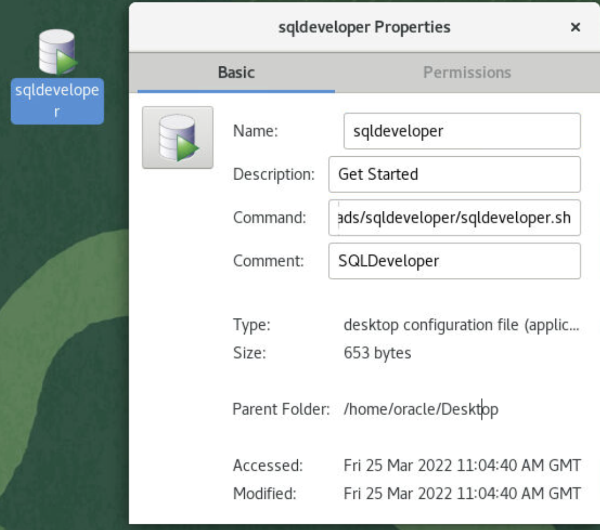

# Install Tools and Services

## Introduction

TBD.

Estimated Time: 20 minutes

### About TBD

some content.. . 

### TBD

some content.. . 
  
### Objectives
 
In this lab, you will enable:
* some content.. . 
* some content.. .  

### Prerequisites 
This lab assumes you have:

* TBD
* A Valid SSH Key Pair
  
## Task 1: Install JDK 

1. Download JDK, since we are using Oracle Linux x64 Compressed Archive
 
       
 
2. Download JDK

       

3. UnCompress the JDK file in Downloads folder


## Task 2: Install SQL Developer

1. Download SQL Developer for other platforms 

       

2. Accept License

       

3. UnCompress the Downloaded SQLDeveloper file in Downloads folder
   
4. Set the Java Home  

      ```
      <copy>
            [orcl:oracle@x]$ vi /home/oracle/.sqldeveloper/21.4.3/product.conf
      </copy>
      ``` 
      add the following line depending upon the JDK uncompressed folder location
   
      ```
      <copy>
            SetJavaHome /home/oracle/Downloads/jdk1.8.0_321
      </copy>
      ``` 

      Launch SQL Developer with following command

      ```
      <copy>
            /home/oracle/Downloads/sqldeveloper/sqldeveloper.sh
      </copy>
      ``` 

5. Setup SQLDeveloper Launcher from Desktop

      Replace the command with absolute path to sqldeveloper.sh and the icon in sqldeveloper, *Trust* the Launcher if prompted

      ```
      <copy>
            /home/oracle/Downloads/sqldeveloper/sqldeveloper.sh
      </copy>
      ``` 

      

## Task 3: Configure SQL Developer connection parameters

1. Configure connection parameters

       

       

## Task 4: Configuring Net Manager ( Optional )

1. You can also update the configurations through Net Manager 

      ```
      <copy>
      cd /u01/app/oracle/product/19c/db_1/bin
      netmgr
      </copy>
      ``` 

       

       
   
   You successfully made it to the end this lab. You may now  *proceed to the next lab* .  

## Learn More

* [Create users and groups on Oracle Linux 8](https://docs.oracle.com/en/learn/users_groups_linux8/index.html#administer-group-accounts) 
 
## Acknowledgements

- **Author** - Madhusudhan Rao, Principal Product Manager, Database
* **Contributors** -  
* **Last Updated By/Date** -  Madhusudhan Rao, Mar 2022 
