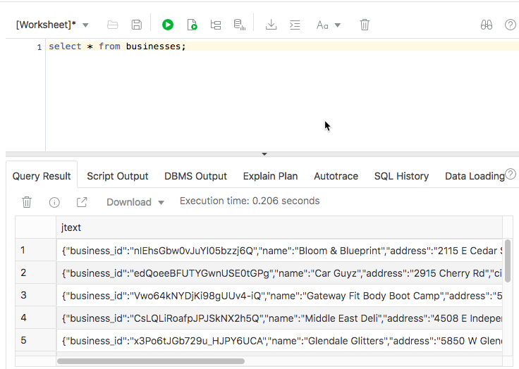
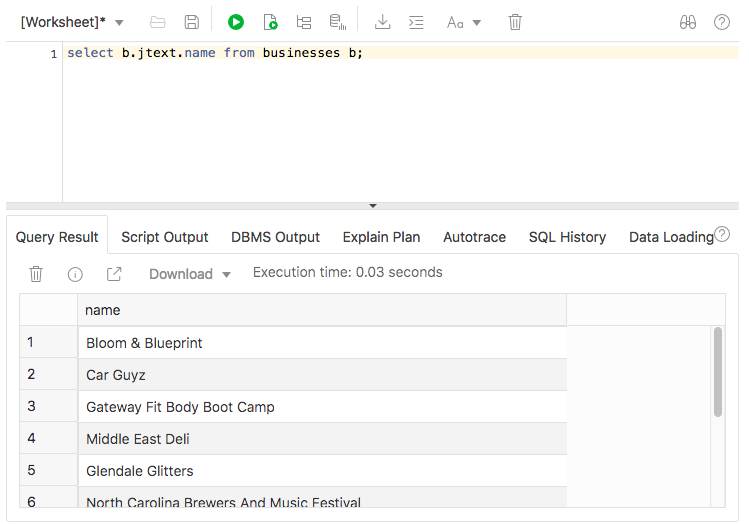
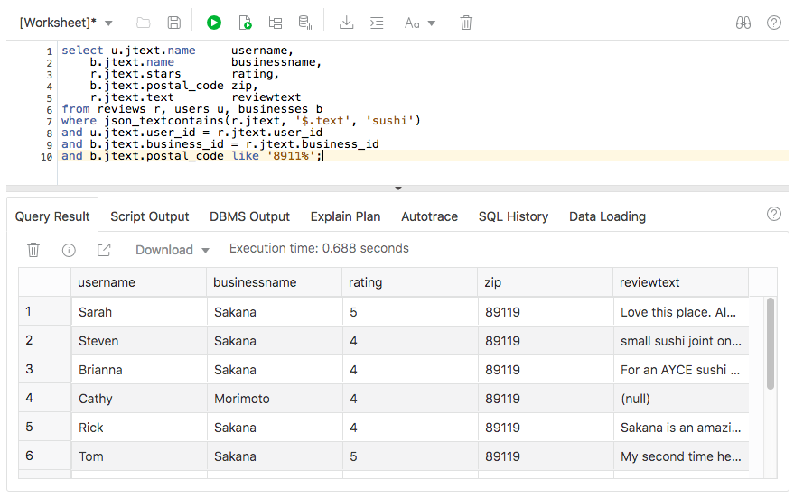

# Indexes and Queries

## Introduction
In this lab we will create some indexes on our JSON data. We will create two types of index, functional and search. Then we will run some queries against the indexed JSON.

Estimated time: 20 minutes, plus around 30 minutes for the search index to complete.

## Step 1: Functional indexes

All our data is now loaded, and we can proceed to creating indexes.  The main index we’ll be using is a “json search index” on the REVIEWS table. This is a JSON full-text index which indexes ALL of the JSON in the table, and allows for word-based searching on textual fields.

1.  Functional index on business_id
    
    We are expected to be in SQL Developer Web at this point.

    We will be joining our three tables, BUSINESSES, REVIEWS and USERS. There is a one-to-many relationship between users and reviews (one user can submit many reviews) and a one-to-many relationship between businesses and reviews (each business may have many reviews about it). To make useful queries (who said what about where) we will need to join these three tables. Since the tables are large, we need indexes to support these joins. The join relationship will be based on USER\_ID and BUSINESS\_ID. Both of these values are embedded in JSON text - they are not in relational columns. But no matter, it's easy to create a functional index on a JSON component using the simple "dot" notation to indentify the value to be indexed.

    First we create an index on businesses.jtext.business_id

    ```
    <copy>
    create index businessIdIndex on businesses b( b.jtext.business_id );
    </copy>
    ```

    Run that in SQL Developer Web. It should be very fast.

2.  Functional index on user_id

    Very similar to the previous step, though it will take longer as the USERS table is much larger than BUSINESSES.

    ```
    <copy>
    create index userIdIndex on users u( u.jtext.user_id );
    </copy>
    ```
    That will probably take 5 to 6 minutes to run.

## Step 2: Creating a search index

A search index indexes **all** the JSON in a collection. It is particularly useful if
-    You don't know the schema (layout) of the JSON in advance. Creating a functional index _requires_ you to know the name of the element (such as business_id) on which you wish to create the index.
-    You want to be able to do full-text searching on textual content (for example, "find me all the businesses which have _workshop_ in their description")

Search indexes take a significant time to create on large collections. As earlier, we will submit this as a batch job:

1. Search Index Job

    Run the following in SQL Developer Web:

    ```
    <copy>    
    create or replace procedure createSearchIndex authid current_user as
    begin
        execute immediate ('create search index reviewIndex on reviews( jtext ) for json');
    end;
    /

    begin
    dbms_scheduler.create_job (
        job_name => 'searchIndexJob',
        job_type => 'STORED_PROCEDURE',
        job_action => 'createSearchIndex',
        start_date => sysdate,
        enabled => TRUE,
        auto_drop => TRUE
        );
    end;
    /
    </copy>
    ```

2. Monitor the job progress

    You should allow 20 - 30 minutes for that to complete.  As before, you can use these statements to monitor the job's progress:

    ```
    <copy>
    
    select job_name, state, sysdate-start_date runtime from user_scheduler_jobs;
    </copy>
    ```

    ```
    <copy>
    select * from user_scheduler_job_run_details order by log_date desc;
    </copy>
    ```

   
## Step 3: Queries

**Note:** All queries in SQL Developer Web should be run using the "Run Statement" button. If you run them using "Run Script", the query will run to completion, which may fetch many thousands of rows and take some minutes to run.

1. Basic JSON Queries

    We can simple SQL query against our BUSINESSES table

    ```
    <copy>
    select * from reviews;
    </copy>
    ```

    

    Note that shows us that we have one column called JTEXT which contains all our JSON data. Now we can access any top-level element of that JSON using the simple "dot notation" - &lt;table alias>**.**&lt;  JSON col name&gt;**.**&lt;  element&gt; Note that dot notation _requires_ us to have a table alias (**b** in this example):

    ```
    <copy>
    select b.business.name from businesses b;
    </copy>
    ```
    

    There are many more types of JSON queries, but we don't have time to go into them here. See the [JSON Developer's Guide](https://docs.oracle.com/en/database/oracle/oracle-database/19/adjsn/query-json-data.html#GUID-119E5069-77F2-45DC-B6F0-A1B312945590) for more details.

2. A full-text Query

    Full text queries use the json_textcontains operator. It will search for a word, group of words or complex query expression within a JSON column.

    Try this to search for the word 'sushi' anywhere in the review text:

    ```
    <copy>
    select r.jtext.user_id, r.jtext.text from reviews r 
    where json_textcontains(jtext, '$.text', 'sushi') 
    </copy>
    ```

    Now since we have a separate table with usernames in, we can do a SQL join on the two tables. Here we're combining the best of unstructured JSON with structured relational:

    ```
    <copy>
    select u.jtext.name, r.jtext.text
    from reviews r, users u
    where json_textcontains(r.jtext, '$.text', 'sushi') 
    and u.jtext.user_id = r.jtext.user_;
    </copy>
    ```
    And finally to make the query actually useful, we'll get the business name and search only within a range of zip codes. We'll also add some the number of stars, and some column aliases (meaning we can distinguish between user name and business name).

    ```
    <copy>
    select u.jtext.name     username, 
        b.jtext.name        businessname, 
        r.jtext.stars       rating,
        b.jtext.postal_code zip,
        r.jtext.text        reviewtext
    from reviews r, users u, businesses b
    where json_textcontains(r.jtext, '$.text', 'sushi')
    and u.jtext.user_id = r.jtext.user_id
    and b.jtext.business_id = r.jtext.business_id
    and b.jtext.postal_code like '8911%';
    </copy>
    ```

    

    Searching within a range of postal codes (all ZIP codes starting 8911) is not the best way to work - it would be better to include a spatial index on the latitude and longitude values within the business data, and that woud allow us to do, for example, a search for only restaurants within five miles miles of a certain location. But spatial indexes are covered in a separate workshop, so we'll leave the query as it is for now.


You may now proceed to the next lab.

## Acknowledgements

- **Author** - Roger Ford, Principal Product Manager
- **Last Updated By/Date** - Roger Ford, June 2020

See an issue?  Please open up a request [here](https://github.com/oracle/learning-library/issues).   Please include the workshop name and lab in your request.
