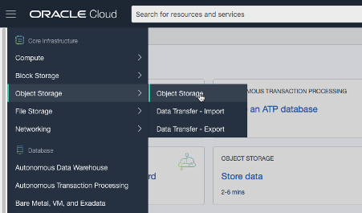
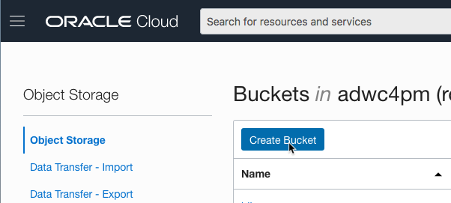
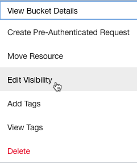
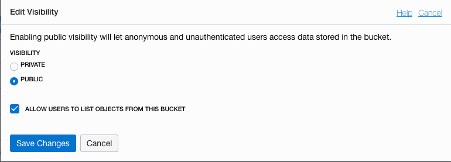
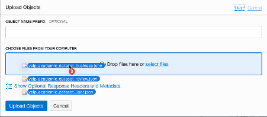
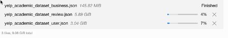

# Upload Files to Object Storage

## Introduction
In this lab, we will create a bucket in Object Storage to store our JSON files ready to load into the database.

Estimated time: 5 - 10 minutes

### Objectives

In this lab, you will:
- Create a bucket.
- Learn to upload JSON data to Oracle's Object Storage.

### Prerequisites

This lab assumes you have completed the following labs:
- Getting Started

## **STEP 1:** Download the Data Files Necessary for the Workshop

The files are available at [https://www.yelp.com/dataset]( https://www.yelp.com/dataset ). Click Download Dataset and agree to the license. The dataset is a zip archive of just under 5GB, so may take a while to download on a slow internet connection.

Once downloaded, you can unzip the archive, which will give you 5 JSON files and a PDF file containing the license agreement.
Of those 5 files, we need 3:
- yelp\_academic\_dataset\_business.json
- yelp\_academic\_dataset\_review.json
- yelp\_academic\_dataset\_user.json

In the next step, we will upload these files to Oracle Cloud storage.

## **STEP 2:** Upload JSON Data Files to Oracle Cloud Storage

1.  Log in to the Oracle Cloud console. Click on the hamburger menu at the top left and choose "Object Storage".

    

2.  Click on "Create bucket".

    

    The new bucket can be named "yelp".

    

    Once the bucket is created, click the 3 dots the right of our new bucket and select "Edit Visibility". Change the visibility to "Public" and save any changes.

    
    

3.  Upload the files. Click on the “yelp” bucket to open it and and click on “Upload Objects”.
   
    Drag the review, business and user JSON files to the upload window, and click “Upload Objects”.

    

Note: there are several GB to upload. The upload process will take a while, depending on the _upload_ speed of your internet connection.

   

Once the business file is uploaded, we can move onto the next module to start loading it to the database. Alternatively, we can wait until all files have uploaded.

You may now proceed to the next lab.

## Acknowledgements

- **Author** - Roger Ford, Principal Product Manager
- **Last Updated By/Date** - Brianna Ambler, May 2021
