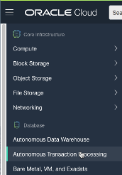
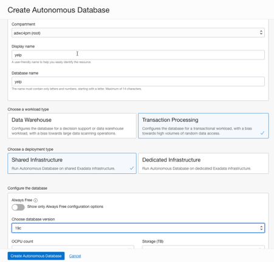
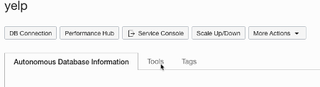
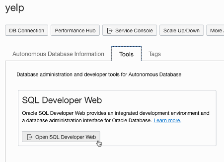
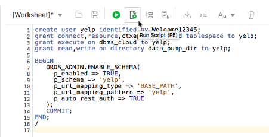
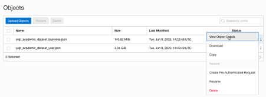

# Object Storage

## Introduction
In this lab we will create a new instance of Autonomous Transaction Processing (ATP), an Autonomous Database, and use SQL Developer Web to create a new user.
That user will then go on to load the files from object storage into tables in ATP.

This lab assumes that you have completed the previous lab, Object Storage, and that at least one of the files has finished uploading to object storage. Of course you will not be able to complete this lab until all of the files from that lab have uploaded.

Estimated time: 15 minutes, plus some time for the actual loading, typically around 30-40 minutes.

## **Step 1:** Provision an Autonomous Transaction Processing Database

1.  Log in to the Oracle Cloud console (in a new window if you still have files uploading from the previous lab). Click on the hamburger menu at the top left and choose "Autonomous Transaction Processing under Database

    

2.  Click “Create Automous Database”. 
    
    Set the Display Name and Database Name to “yelp”, make sure “Transaction Processing” is selected, and that database version is set to 19c. 


    

    Scroll down and provide a password for the AMIN user. Remember the password! (Once you've finally convinced the complexity algorithm to accept one). Click Create Autonomous Database. This will take around 1-2 minutes to provision the database. When the big square ATP logo goes green, your database is ready to use.

    

##  Step 2: Connecting to the database using SQL Developer Web and Creating a New User

SQL Developer Web (SDW) is an entirely browser-based tool for interacting with the database. Users of the standalone SQL Developer tool will be familiar with most of the interface elements.

1. Start up SQL Developer Web

    We should be on the page for our newly-created Autonomous Transaction Processing database.

    Click on "Tools"

    

    Then choose "Open SQL Developer Web"

    

    We will need to log in to SQL Developer Web using the username ADMIN and the password we provided earlier.

    

2. Create a new user called **yelp**.

    We need to create a user and provide it with certain roles and privileges.
    
    In the Worksheet, enter the following (changing the password from YourPassword to a password of your choice):

    ```
    <copy>
    create user yelp identified by YourPassword;
    grant connect,resource,ctxapp,unlimited tablespace,create job, dwrole to yelp;
    grant execute on dbms_cloud to yelp;
    grant read,write on directory data_pump_dir to yelp;

    BEGIN
        ORDS_ADMIN.ENABLE_SCHEMA(
            p_enabled => TRUE,
            p_schema => 'yelp',
            p_url_mapping_type => 'BASE_PATH',
            p_url_mapping_pattern => 'yelp',
            p_auto_rest_auth => TRUE
        );
        COMMIT;
    END;
    /
    </copy>
    ```

    Then click on the “Run Script” button above the worksheet (document with small green arrow). You'll need to remember the password you set. If any step fails, you can safely run it again after correcting the error.

    

## **Step 3:**  Log into SQL Developer Web as the new user yelp.

We now have a user who has the required privileges, and can use SQL Developer Web.

1.  Modify the SDW URL to allow access to our new user
   
    **Important:** Currently you can ONLY login to SQL Developer Web from the supplied URL as the ADMIN user. To log in as a different user, you must modify the URL.  So copy the URL from your browser – for example mine shows:

    https://xcs...-yelp.adb.uk-london-1.oraclecloudapps.com/ords/**admin**/_sdw/?nav=worksheet

    We must edit that and and change “admin” to our username “yelp”.

    https://xcs...-yelp.adb.uk-london-1.oraclecloudapps.com/ords/**yelp**/_sdw/?nav=worksheet

    We can log in as our user “yelp” with the password provided in the previous step. **SAVE THIS URL**!

    **Note** about users:  Very soon Autonomous Database will be upgraded with full GUI user administration. You will then be able to create new users and run SQL Developer Web (SDW) without worrying about the “ENABLE_SCHEMA” call or editing the URL to access SDW

2. Create tables for loading

    We are going to create three tables to store our JSON documents. There were three files, containing businesses, reviews, and users. So will create the tables with those names. Each table consists of just a single CLOB (Character Long OBject) column, which will contain the JSON text. There is no need to create individual columns for each JSON value.

    We should be logged into SDW as our "yelp" user at this point. Copy the following into the worksheet and click "Run Script".

    ```
    <copy>
    create table businesses (
        jtext clob
        constraint busjson check (jtext is json) );

    create table reviews (
        jtext clob
        constraint revjson check (jtext is json) );

    create table users (
        jtext clob
        constraint usrjson check ( jtext is json ) );
    </copy>
    ```
    **Note:** From this point on, I won't tell you to copy text into the worksheet or click "Run Script", I'll leave that to you. Note you can either run all the commands in the worksheet with "Run Script", or just a single command with "Run Statement" after highlighting it. Generally, for SQL <code>SELECT</code> statements, it's better to use "Run Statement" as the output is laid out neatly in columns, and it will only attempt to fetch the first few rows. "Run Script" will run all commands to completion (unless they time out).

    That should create our three table which will contain the JSON we are about to load. The JSON text will be stored in a CLOB column called 'jtext' in each case.

## **Step 4:** Performing the load into the database

We can now load our files from object storage to the database. The business file is small (145MB), so we’ll do first and run it interactively.

1. Find the object storage URI for the file.

    First we’ll need to get the address of the "business" file from object storage. Go back to our yelp bucket in Object Storage, locate the file “yelp\_academic\_dataset\_business.json” and click on the 3 dots to the right. Choose “View Object Details”.

    

    In the next page you will see a URL path, which you can copy

    

2.  Run <code>DBMS_CLOUD.COPY_DATA</code> to load the first table.

    Back to SQL Developer Web (as the "yelp" user), and in the Worksheet enter the following, replacing the ‘file\_uri\_list’ parameter with the URL you just copied.
    ```
    <copy>
    begin
        DBMS_CLOUD.copy_data(
        table_name =>'businesses',
        field_list =>'jtext char(32000)',
        file_uri_list => 'https://objectstorage.us-ashburn-1.oraclecloud.com/n/adwc4pm/b/yelp/o/yelp_academic_dataset_business.json',
        format => JSON_OBJECT('delimiter' value '0x''01''')
    );
    end;
    /
    </copy>
    ```
    Click on "Run Statement" or "Run Script".  This is loading the data from object storage to the database, and will take 10-20 seconds to run.

3.  Load the other tables via background jobs

    **Note:** The previous lab said you could continue if the review and user files were not completely copied. This next step uses those files, so make sure the relevant file upload is complete before continueing.

    The next table to load is reviews. This is far bigger than businesses, and SQL Developer Web is limited to 15 minutes execution time for any command. Loading will probably take less time than that, but to be safe (and so we can learn how to do it) we’ll submit the load as a scheduler job.  First we create a stored procedure which does the work. This is much like the PL/SQL block we used previously but with a procedure wrapper around it. Don’t forget to substitute the URL for your own file by following the same process in Object Storage as you did for the previous step.

    ```<copy>
    create or replace procedure loadReviews authid current_user as
    begin
    dbms_cloud.copy_data(
    table_name =>'reviews',
    field_list =>'jtext char(32000)',
    file_uri_list =>' https://objectstorage.us-ashburn-1.oraclecloud.com/n/adwc4pm/b/yelp/o/yelp_academic_dataset_review.json',
    format => JSON_OBJECT('delimiter' value '0x''01''')
    );
    end;
    /
    </copy>
    ```

    Now we create and run a scheduler job to run that procedure (we could do it all in one command by specifying PLSQL_BLOCK rather than STORED_PROCEDURE and providing the PL/SQL inside a quoted string – but the quotes start getting a bit of nightmare!)
    
    ```
    <copy>
    begin
    dbms_scheduler.create_job (
        job_name => 'loadReviewsJob',
        job_type => 'STORED_PROCEDURE',
        job_action => 'loadReviews',
        start_date => sysdate,
        enabled => TRUE,
        auto_drop => TRUE
        );
    end;
    /
    </copy>
    ```

    Once we execute that the job starts running. We can monitor it with 

    ```
    <copy>
    
    select job_name, state, sysdate-start_date runtime from user_scheduler_jobs;
    </copy>
    ```

    That should return a state of “Running”.  When the job is complete, we will no longer get any output from that, and we can check the final status with:

    ```
    <copy>
    select * from user_scheduler_job_run_details order by log_date desc;
    </copy>
    ```

    Now to load the final table – users. Some of the records are quite long so we need to increase the size of the field list. Change the url again as appropriate.

    ```
    <copy>
    create or replace procedure loadUsers authid current_user as
    begin
    dbms_cloud.copy_data(
    table_name =>'users',
    field_list =>'jtext char(370000)',
    file_uri_list =>' https://objectstorage.us-ashburn-1.oraclecloud.com/n/adwc4pm/b/yelp/o/yelp_academic_dataset_user.json',
    format => JSON_OBJECT('delimiter' value '0x''01''')
    );
    end;
    /
    
    begin
    dbms_scheduler.create_job (
        job_name => 'loadUsersJob',
        job_type => 'STORED_PROCEDURE',
        job_action => 'loadUsers',
        start_date => sysdate,
        enabled => TRUE,
        auto_drop => TRUE
        );
    end;
    /
    </copy>
    ```

    Monitor that as before. After a few minutes the load will be complete.


That completes our loading of data. We now have three tables which have all our JSON loaded - around 8 million reviews of 200,000 businesses by 2 million users. You can verify the exact numbers using <code>SELECT COUNT(*)</code> queries if you choose.

## Acknowledgements

- **Author** - Roger Ford, Principal Product Manager
- **Last Updated By/Date** - Roger Ford, June 2020

## See an issue?
Please submit feedback using this [form](https://apexapps.oracle.com/pls/apex/f?p=133:1:::::P1_FEEDBACK:1). Please include the *workshop name*, *lab* and *step* in your request.  If you don't see the workshop name listed, please enter it manually. If you would like us to follow up with you, enter your email in the *Feedback Comments* section.
