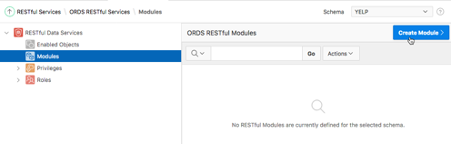
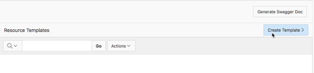
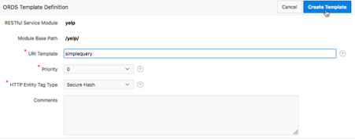
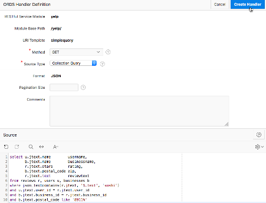

# RESTful Queries

## Introduction
In previous labs we've shown how to load, index and search our JSON data in the database. But our queries were run in SQL Developer Web. While that's great for developing queries, it can't be used by real-world applications. So how do we make our database available to other applications? Of course you can query a database from many tools and languages, but one of the simplest methods to make queries available is to generate a RESTful API through Oracle' Application Express (APEX). That's what we'll be covering in this lab.

Estimated time: 20 minutes.

## **Step 1:** Create an APEX workspace

All our data is now loaded, and we can proceed to creating indexes.  The main index we’ll be using is a “json search index” on the REVIEWS table. This is a JSON full-text index which indexes ALL of the JSON in the table, and allows for word-based searching on textual fields.

1.  Start APEX via the Web Console
   
    Go back to the main cloud menu, choose Autonomous Transaction Processing and then click on your "yelp" database.

    

    Then click on the Tools tab, and under Oracle Application Express click on "Open APEX"

    

    Enter the ADMIN password for your database, and click on "Enter Administration"

    You'll see a "Create Workspace" button. Click on that.

    

    In the "Create Workspace" dialog, enter the Database User as "YELP" and the workspace name also "YELP", then click "Create Workspace".

    

    Sign out of admininstration (top right corner), and log in again with the Workspace name YELP, username YELP and the database password for YELP.

    At this point you MAY be required to set another password for your APEX account (depending on how you originally logged into Oracle Cloud). If asked, provide account details and a password accordingly (just to keep you on your toes, the password complexity rules are different from the database rules, so be careful to memorize the password if it's different).

    

## **Step 2:** Create a RESTful module, template and handler

1. RESTful Services - Create a module
   
    We're now in APEX. Looking along the top menu bar, choose SQL Workshop and RESTful Services:

    

    Now in the RESTful services menu, choose "Modules" then "Create Module"

    

    In Module name and Base path, enter "yelp" for both and click "Create Module" again.

    

    We now have a RESTful module, we need to create a template with its associatied handler for GET calls.

2.  RESTful Services - Create a template

    In the next page, go down to "Resource Templates" and click "Create Template".

    

    For URI template, we can put in "simplequery". This will be part of the URL we will have for our RESTFul service.

    

3.  RESTful Services - Create a GET handler

    Next we need to create the Resource Handler which implements a particular call to the RESTful interface. Click "Create Handler"

    

    Since we're running a simple query, a GET handler is all we need (we don't need to POST any data). So leave the Method as GET and the source type as "Collection Query". Collection Query means APEX will handle all the assembly of output into the JSON necessary for a REST call return value.

    Here's the query we ran earlier in SQL Developer Web. Copy the query into the "Source" box, and click "Create Handler". DO NOT include a semi-colon at the end of the SQL (you will get an obscure "missing right parentheses" error at the next step if you do).

    ```
    <copy>
    select u.jtext.name     username, 
        b.jtext.name        businessname, 
        r.jtext.stars       rating,
        b.jtext.postal_code zip,
        r.jtext.text        reviewtext
    from reviews r, users u, businesses b
    where json_textcontains(r.jtext, '$.text', 'sushi')
    and u.jtext.user_id = r.jtext.user_id
    and b.jtext.business_id = r.jtext.business_id
    and b.jtext.postal_code like '8911%'
    </copy>
    ```
    
    

    And that's it for our simple - we've created a REST interface. You'll see a URL listed. 

    

    Click on the two squares to copy the URL, and paste it into a new tab in a web browser.  If everything is right, you will see JSON on your screen. Some browsers will display it as an unformatted block of JSON, others (including Firefox) will display it laid out and formatted nicely.

    


    Just one more thing here - that query still had hard-coded search terms for "sushi" and the partial zip code. That's not really helpful, we need to let the calling program specify them.
    So let's go back to our GET handler and change the query slightly so the WHERE clause includes a couple of bind variables:

    …
    where json_textcontains(r.jtext, '$.text', :queryterms)
    and u.jtext.user_id = r.jtext.user_id
    and b.jtext.business_id = r.jtext.business_id
    and b.jtext.postal_code like :partialzip||'%'

    Click on apply changes, and copy the URL again.  This time in your browser, paste the URL but add ?queryterms=wonderful sushi&partialzip=8911

    

    (depending on your browser you may need to encode the space in "wonderful sushi" as %20. I didn't need to).

    5. RESTful Queries - A PL/SQL example
   
    By default the REST call returns the first 25 records. If you scroll down you will see that it lists "hasMore" : "true" towards the end.  So it tells us that there are more than 25 hits, but not how many hits there are in total.  That's because a simple SQL query can't provide that information.  However, for Oracle Text or JSON search queries, we can get the total count by calling a PL/SQL function CTX_QUERY.COUNT_HITS (this is much faster than doing a separate SELECT COUNT(*) query, which has to actually fetch all the hits to count them). If we're doing PL/SQL we could also get a "snippet" - a fragment of the text with search terms highlighted.

    Let's go back to the "yelp" module in APEX and create a new template. We'll call this one "plsqlquery". Within the template, create a new Handler. This time, leave the Method as GET but set the Source Type to PL/SQL.

    In the source, enter the following.  We've used a slightly simpler query here joining two tables rather than three, but the point is to illustrate the use of JSON_OBJECT and JSON_ARRAYAGG to generate JSON output directly from the query. We're also limiting the number of rows returned to 5 to make it easier to understand the output:

    ```
    <copy>
    declare
        outvar varchar2(32000);
    begin
    select json_object(
        'hitlist' value
            json_arrayagg(json_object (r.jtext.user_id, r.jtext.stars, b.jtext.name) returning varchar2(4000) pretty),
        'totalcount' value
            ctx_query.count_hits('reviewIndex', :queryterms)) into outvar
    from reviews r, businesses b
    where json_textcontains(r.jtext, '$.text', :queryterms)
    and b.jtext.business_id = r.jtext.business_id
    and rownum < 6;
    OWA_UTIL.mime_header('application/json');
    htp.p(outvar);
    end;
    </copy>
    ```

    Now we can copy the URL for this new GET handler, and enter it into our browser with <code>?queryterms=sushi</code> at the end:

    

    We should see output like this (in Firefox, messier in many other browsers):

    

    Notice that we've got a hitlist with five array elements, and then a separate total count of the number of hits that we would get if we fetched them all.

That concludes this workshop.  We've learned

1.	How to transfer JSON documents into Object Storage
2.	How to load JSON documents from Object Storage into Autonomous Database
3.	How to index and query JSON documents in Autonomous Database
4.	How to create a simple RESTful API on queries using Oracle Application Express.


Thank you for taking the time to learn about JSON in Oracle Database 19c.

## Acknowledgements

- **Author** - Roger Ford, Principal Product Manager
- **Last Updated By/Date** - Roger Ford, June 2020

## See an issue?
Please submit feedback using this [form](https://apexapps.oracle.com/pls/apex/f?p=133:1:::::P1_FEEDBACK:1). Please include the *workshop name*, *lab* and *step* in your request.  If you don't see the workshop name listed, please enter it manually. If you would like for us to follow up with you, enter your email in the *Feedback Comments* section.
