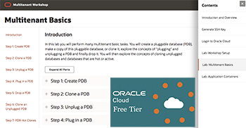
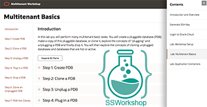

# Oracle Converged Database Github

Oracle Spatial and Graph offers the industry’s most comprehensive, advanced database for enterprise spatial applications and high performance, secure graph databases. With Oracle Database 19c, in the cloud and on premises, Spatial and Graph powers applications from GIS and location services to fraud detection, social networks, linked data and knowledge management. 
The spatial features of Spatial and Graph include both basic spatial data management and analysis and additional high-end functionality including: spatial aggregates, 3D, LiDAR, geospatial imagery, geocoding, routing, and linear referencing. 
Oracle Spatial and Graph is included at no extra cost with all Oracle Database cloud services and on-prem editions.

## Workshops
Click on one of our workshops below to access the content.

    

- [I have a Freetier or Oracle Cloud account](https://oracle.github.io/learning-library/data-management-library/database/multitenant/freetier/index.html)
- [I have an account from SSWorkshop](https://oracle.github.io/learning-library/data-management-library/database/multitenant/ssworkshop/index.html)

## Get an Oracle Cloud Trial Account for Free!
If you don't have an Oracle Cloud account then you can quickly and easily sign up for a free trial account that provides:
- $300 of free credits good for up to 3500 hours of Oracle Cloud usage
- Credits can be used on all eligible Cloud Platform and Infrastructure services for the next 30 days
- Your credit card will only be used for verification purposes and will not be charged unless you 'Upgrade to Paid' in My Services

Click here to request your trial account: [https://www.oracle.com/cloud/free](https://www.oracle.com/cloud/free)

## Product Pages
- [Oracle Multitenant](https://www.oracle.com/database/technologies/multitenant.html)
- [Oracle Database 19c](https://www.oracle.com/database/)

## Documentation
- [Introduction to the Multitenant Architecture](https://docs.oracle.com/en/database/oracle/oracle-database/19/multi/introduction-to-the-multitenant-architecture.html#GUID-267F7D12-D33F-4AC9-AA45-E9CD671B6F22)
- [Multitenant Administrators Guide - 19c](https://docs.oracle.com/en/database/oracle/oracle-database/19/multi/index.html)
- [Database Product Management YouTube Channel](https://www.youtube.com/channel/UCr6mzwq_gcdsefQWBI72wIQ)

## Videos
- [Oracle Multitenant](https://www.youtube.com/watch?v=lho1kurDVWE)
- [Multitenant for World-Class SaaS](https://www.youtube.com/watch?v=-okrTDHqAdA)
- [Oracle Database 19c](https://www.youtube.com/watch?v=EVPNyL2vAVI)
- [Upgrading to Oracle Database 19c](https://www.youtube.com/watch?v=lOzL5irmuJo)
- [Converged Database Architcture](https://www.youtube.com/watch?v=9d76-LhgMQs)
- [Multitenant PDBs for Microservices and Clouds](https://www.youtube.com/watch?v=JdfATqdXuRc)
- [The Hidden Data Economy](https://www.youtube.com/watch?v=CP3pwAwNepU)

## See an issue?
Please submit feedback using this [form](https://apexapps.oracle.com/pls/apex/f?p=133:1:::::P1_FEEDBACK:1). Please include the *workshop name*, *lab* and *step* in your request.  If you don't see the workshop name listed, please enter it manually. If you would like for us to follow up with you, enter your email in the *Feedback Comments* section.

-- Oracle Database Product Management
