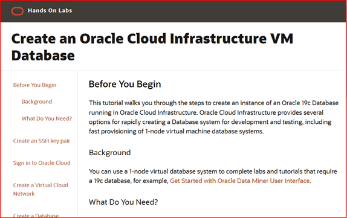

# Oracle Cloud Infrastructure: Working with Virtual Machine Databases
These tutorials cover how to create a Virtual Machine Database and connect to it using SSH and SQL Developer.

## Access the Labs Using Our Web Interface
**Click the image to use our easy to navigate HTML format:**

## Oracle Cloud Account

### Trial Account
If you don't have an Oracle Cloud account then you can quickly and easily sign up for a free trial account that provides:
- $300 of free credits good for up to 3500 hours of Oracle Cloud usage
- Credits can be used on all eligible Cloud Platform and Infrastructure services for the next 30 days
- Your credit card will only be used for verification purposes and will not be charged unless you 'Upgrade to Paid' in My Services

Click here to request your trial account: https://cloud.oracle.com/tryit

### Self-Paced Labs
Self-paced labs provide hands-on experience with Oracle Cloud Infrastructure in real cloud environments. You can try self-paced labs here: https://ocitraining.qloudable.com/
