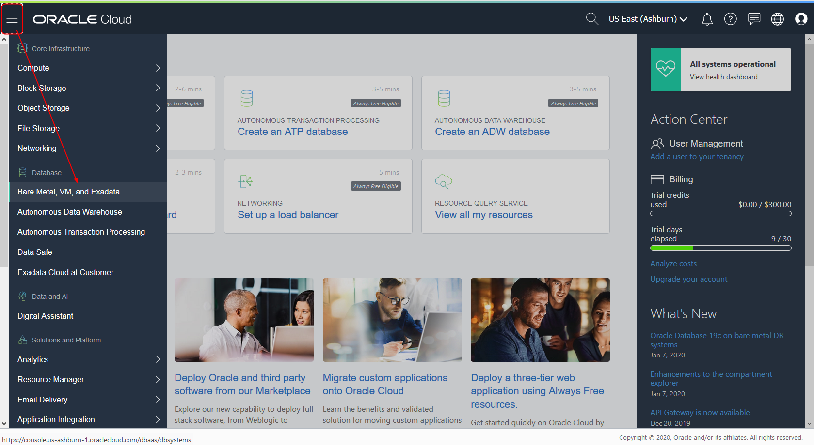
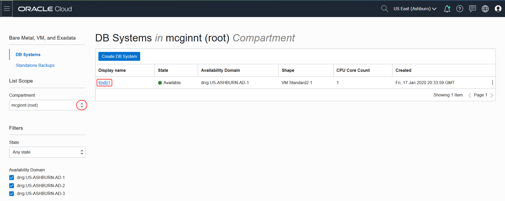
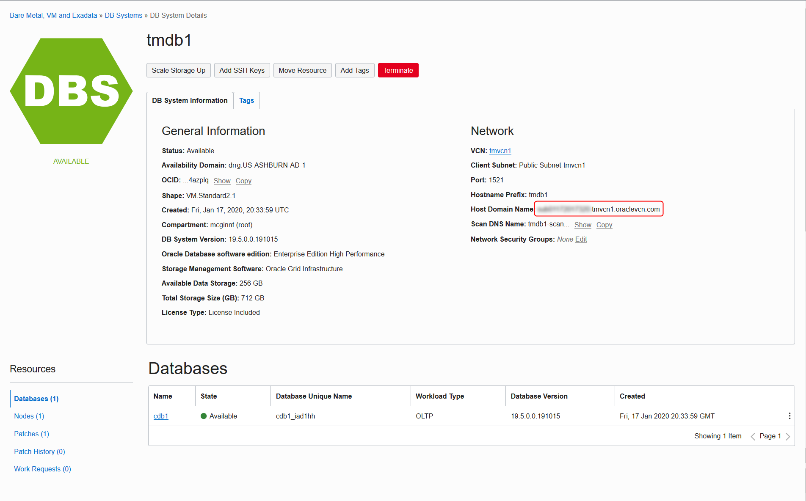
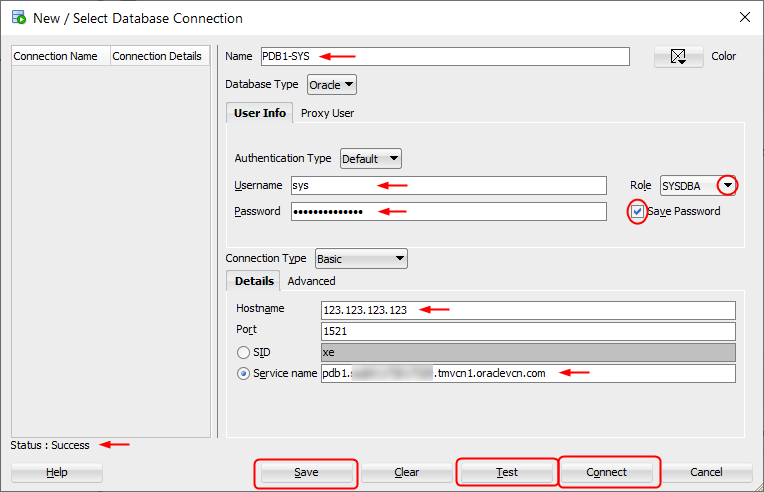
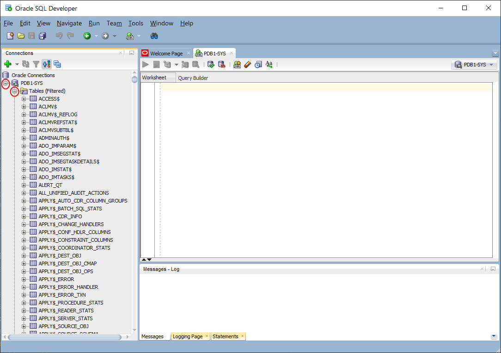

# Connect SQL Developer to Oracle Cloud Infrastructure VM Database
## Before You Begin

This lab walks you through the steps to connect Oracle SQL Developer to an Oracle Database running in an Oracle Cloud Infrastructure Virtual Machine.

### Background
Oracle Cloud Infrastructure provides a quick and easy to create an Oracle Database 19c instance running in a Virtual Machine. Oracle SQL Developer is a free, integrated development environment that simplifies the development and management of Oracle Database in both traditional and Cloud deployments.

### What Do You Need?

* An Oracle Cloud paid account or free trial. To sign up for a trial account with $300 in credits for 30 days, click [here](https://cloud.oracle.com/tryit).
* An instance of an Oracle Database running on an Oracle Cloud Virtual Machine
* An open port (1521) on your Oracle Cloud Virtual Cloud Network (VCN)
* [Oracle SQL Developer](https://www.oracle.com/tools/downloads/sqldev-downloads.html)

## **STEP 1**: Locate your Virtual Machine Database

1. From the menu, click on **Bare Metal, VM, and Exadata**.

  

2. Use the Compartment drop down list to select the compartment that contains your database and click on the **Display name** for your database to open the details page..

  

3. Copy the **Host Domain Name** - you will need this later when you create a connection in SQL Developer.

  

## **STEP 2**: Create a connection through SQL Developer

1. Launch Oracle SQL Developer and select **New Connection** (the green + sign).

  

2. In the New / Select Database Connection window, enter the following information:
     * In the **Name** field, enter **PDB1-SYS** as the name of this connection.
     * In the **Username** field, enter **sys**.
     * In the **Password** field, enter the password for the SYS account.
     * Select **SYSDBA** from the **Role** drop down list.
     * Check the **Save Password** checkbox.
     * In the **Hostname** field, enter your Oracle VM Database System's IP address.
     * Click **Service name** and enter **pdb1.** followed by the host domain you copied earlier.

   

3. Click **Test** to check your connection. You see a Success message in the **Status** field.
4. Click **Save** to save your connection details and then click **Connect**.

5. You now have a connection to your Oracle VM Database system, and you can expand the connection and Tables.

  

## Want to Learn More?

* [Oracle SQL Developer Documentation](https://docs.oracle.com/en/database/oracle/sql-developer/)
* [Oracle Cloud Infrastructure: Connecting to an DB System](https://docs.cloud.oracle.com/en-us/iaas/Content/Database/Tasks/connectingDB.htm)

## Acknowledgements
* **Author** -Tom McGinn, Learning Architect, Database User Assistance
* **Last Updated By/Date** - Tom McGinn, February 2020

## See an issue?
Please submit feedback using this [form](https://apexapps.oracle.com/pls/apex/f?p=133:1:::::P1_FEEDBACK:1). Please include the *workshop name*, *lab* and *step* in your request.  If you don't see the workshop name listed, please enter it manually. If you would like us to follow up with you, enter your email in the *Feedback Comments* section. 
