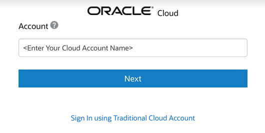
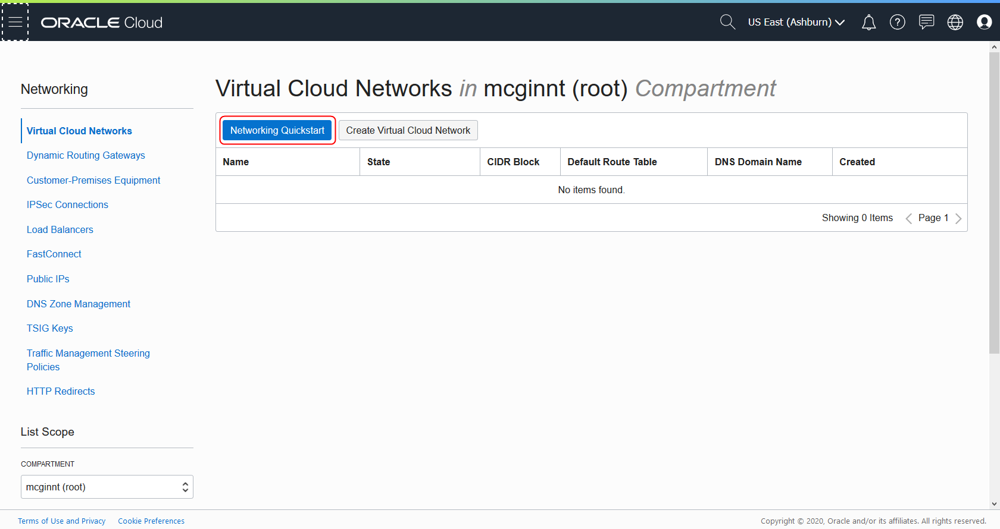
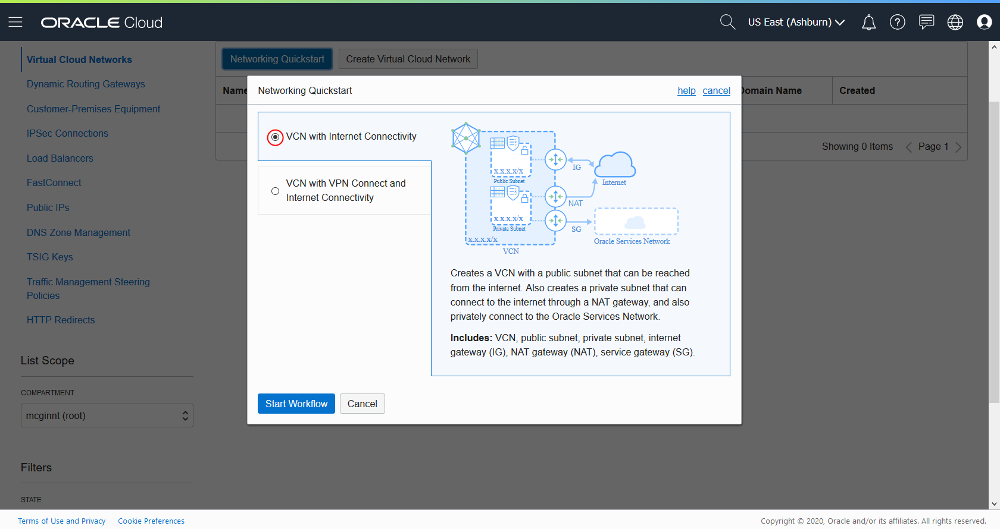
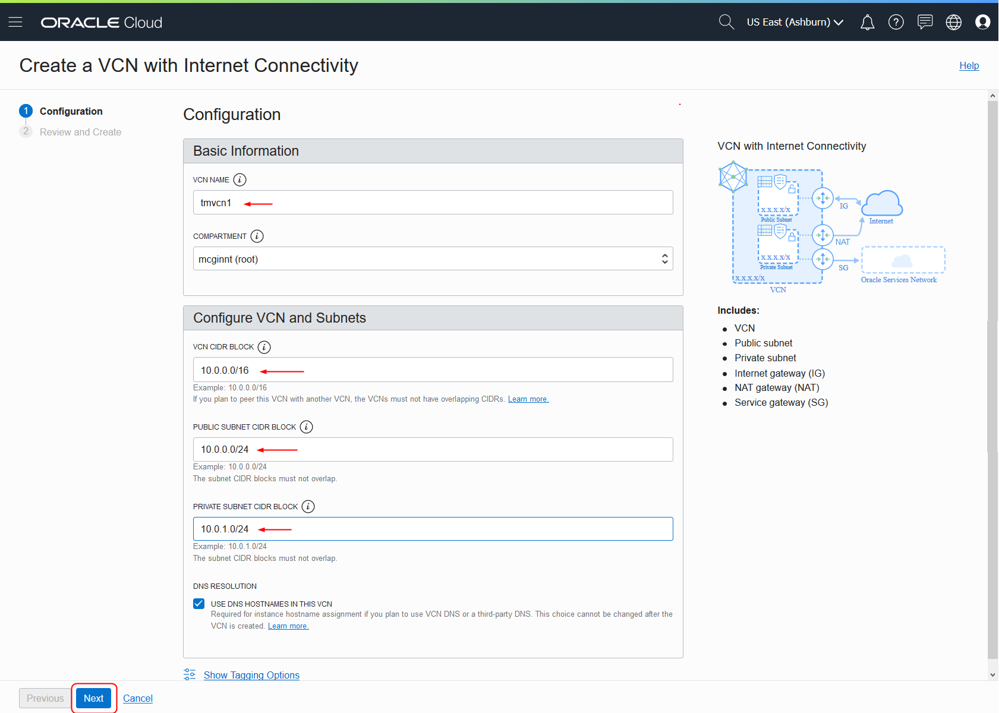
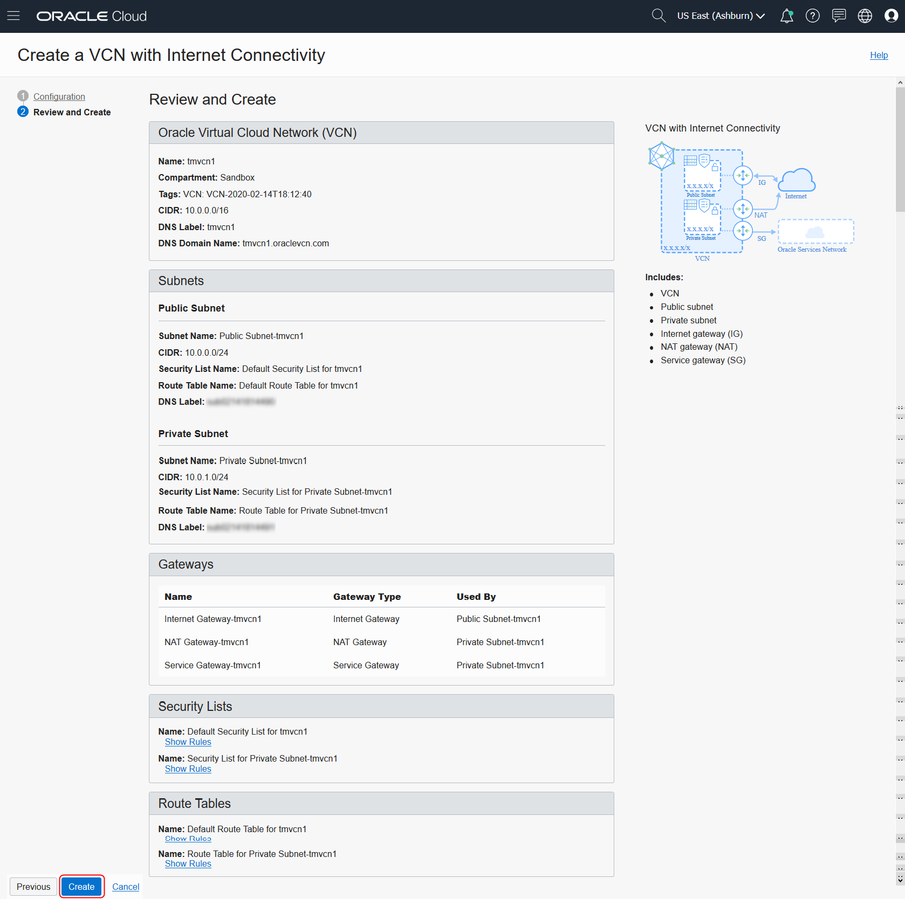
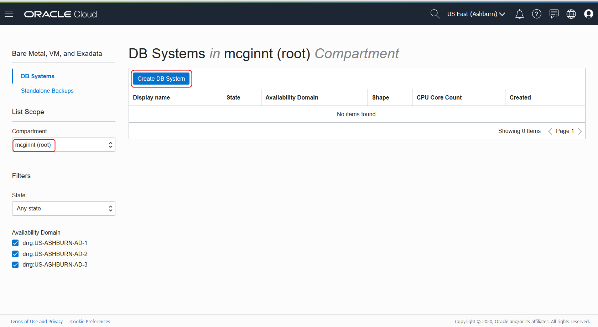
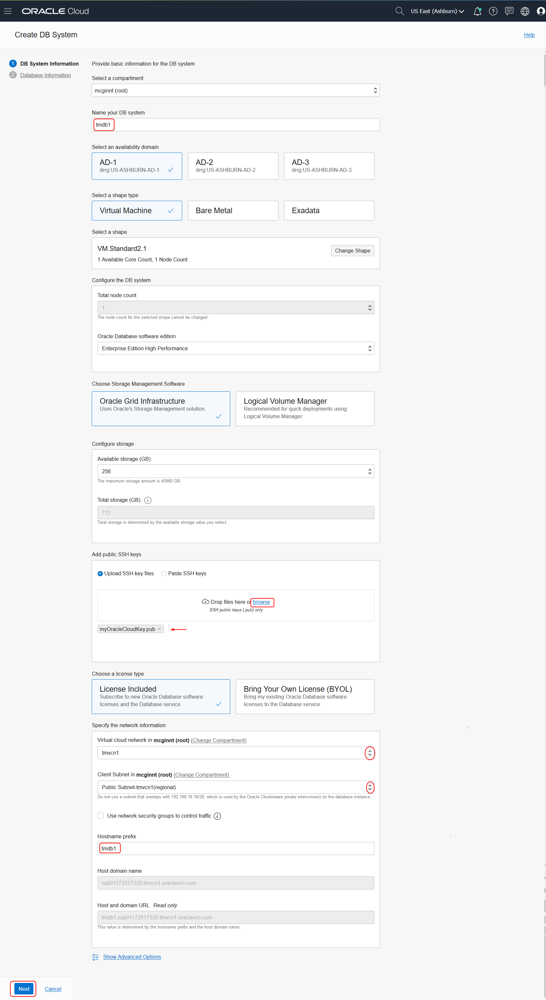
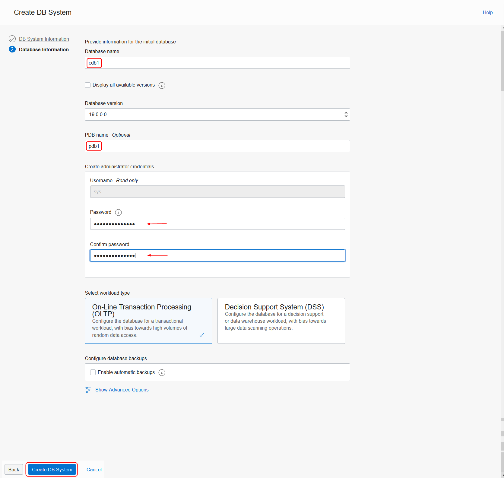
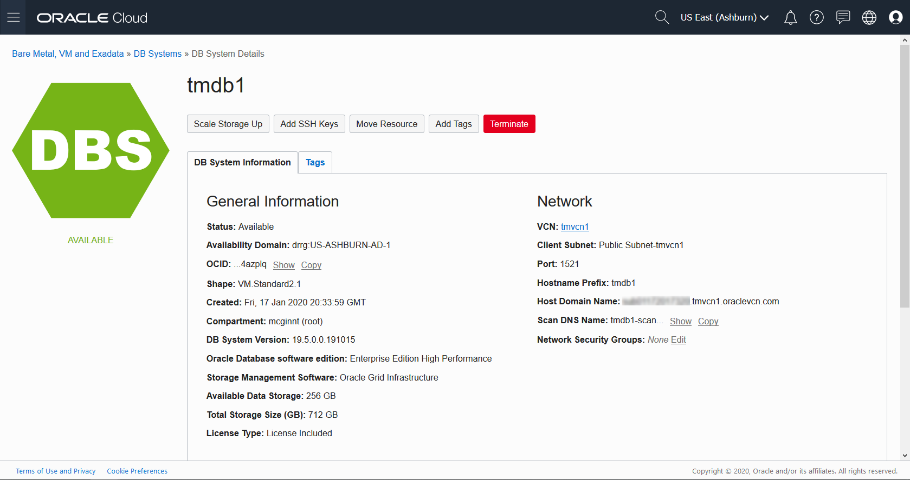
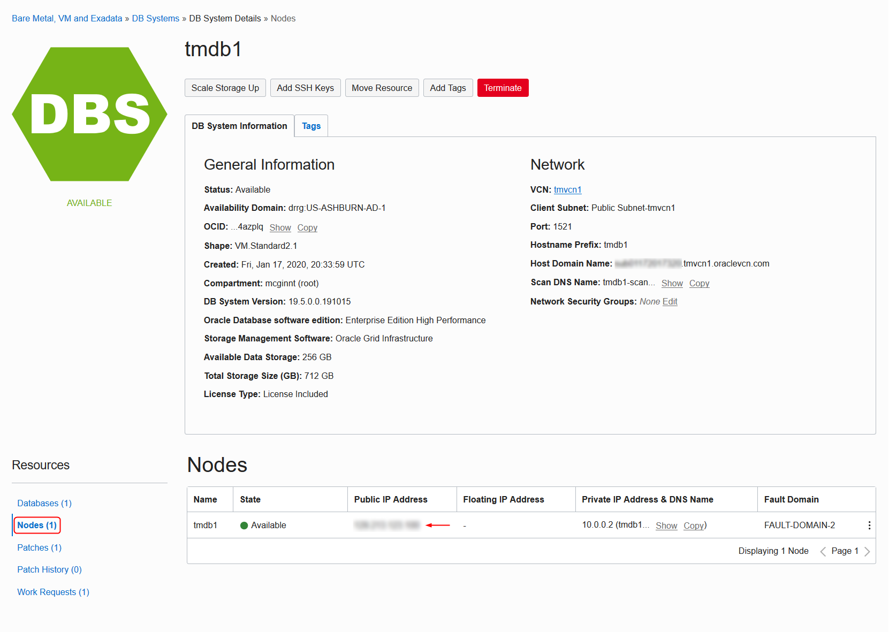

# Create an Oracle Cloud Infrastructure VM Database
## Before You Begin

This tutorial walks you through the steps to create an instance of an Oracle 18c, 19c or the new 20c Preview Database running in Oracle Cloud Infrastructure. Oracle Cloud Infrastructure provides several options for rapidly creating a Database system for development and testing, including fast provisioning of 1-node virtual machine database systems.

### Background
You can use a 1-node virtual database system to complete labs and tutorials that require an Oracle database.

### What Do You Need?

* An Oracle Cloud paid account or free trial. To sign up for a trial account with $300 in credits for 30 days, click [here](https://cloud.oracle.com/tryit).

## Create an SSH key pair

1. In a terminal window on your local PC, enter the following command:

    ```
    $ <copy>ssh-keygen -b 2048 -t rsa -f myOracleCloudKey</copy>
    ```
    Note: If you don't have ssh-keygen on your local machine, download and install [Git Bash](https://git-scm.com/downloads) and run the command in a Git Bash shell.

2. Make note of the directory you created the keys in.

## Sign in to Oracle Cloud

  Sign in to the **Oracle Cloud Infrastructure Console** using the following steps.

  **Note :** Your sign in instructions may be different, especially if you have a corporate tenancy, or have a traditional account, or if logging directly to the Oracle Cloud Infrastructure Console.

1. Browse to the Oracle Cloud Infrastructure URL that was provided for your tenancy. For example, you may access your Cloud account from [www.oracle.com](www.oracle.com).

2. From the home page, click on **View Accounts** or , and select **Sign in to Cloud**.

  

  > **Note :** Oracle Cloud Infrastructure supports the following browsers and versions :
  > * Google Chrome 69 or later
  > * Safari 12.1 or later
  > * Firefox 62 or later

3. Enter the **Account Name** that was chosen during sign up. Click **Next**.

  

4. Enter the **User Name** and **Password** assigned to you and click **Sign In**.

  

5. You will be taken to **Oracle Cloud Infrastructure** console home page.

  

## Create a Virtual Cloud Network

A virtual cloud network (VCN) provides the necessary network Infrastructure required to support your database. This includes a gateway, route tables, security lists, DNS and so on. fortunately, Oracle Cloud Infrastructure provides a wizard that simplifies the creation of a basic, public internet accessible VCN.

1. From the Menu, select **Networking > Virtual Cloud Networks**.

  

2. Select your compartment and click on **Networking Quickstart**. If you haven't created any compartments yet, just leave it as the default (root) compartment.

  

3. Be sure the default "VCN with Internet Connectivity" is selected and click **Start Workflow**.

  

4. Enter a name for your VCN, and enter the default values for the VCN CIDR block(10.0.0.0/16), Public Subnet CIDR block (10.0.0.0/24) and Private CIDR block (10.0.1.0/24), and click **Next**.

  

5. Review your selections on the next screen and click **Create**.

  

6. On the summary screen, click **View Virtual Cloud Network**.

## Create a Database Virtual Machine

Next, you'll create a Database running in a VM.

1. From the menu, click on **Bare Metal, VM, and Exadata**.

  

2. Select the compartment you want to create the database in and click on **Create DB System**.

  

3. On the DB System Information form, enter the following information and click **Next**:

    * In the **Name your DB system** field, give your database a name.
    * Select **Logical Volume Manager** as the Storage Management Software.
    * In the **Add public SSH keys** section, browse to the location of your SSH keys and select the public key file (with a .pub extension).
    * In the **Specify the Network information** section, select the VCN you created using the drop down list.
    * Select the public subnet using the drop down list.
    * Enter a hostname prefix.

    

4. On the Database Information form, enter the following information and click **Create DB System**.

    * In the **Database name** field, change the default database name to "cdb1".
    * On the **Database version** drop down menu, select the version of the Oracle Database you want: 18c, 19c or 20c (Preview).
    * In the **PDB name** field, enter "pdb1".
    * Enter a password for your sys user in the **Password** field and then repeat the password in the **Confirm password** field.

    

5. After a few minutes, your Database System will change color from yellow (Provisioning) to green.

    

## Connect to the Database using SSH

1. On the **DB System Details** page, Click **Nodes**.

  

   Note the IP address.

2. In a terminal window, navigate to the folder where you created the SSH keys and enter this command, using your IP address:

   ```
   $ <copy>ssh -i ./myOracleCloudKey opc@</copy>123.123.123.123
   Enter passphrase for key './myOracleCloudKey':
   Last login: Tue Feb  4 15:21:57 2020 from 123.123.123.123
   [opc@tmdb1 ~]$
   ```

3. Once connected, you can switch to the "oracle" OS user and connect using SQL*Plus:

   ```
   [opc@tmdb1 ~]$ sudo su - oracle
   [oracle@tmdb1 ~]$. oraenv
   [oracle@tmdb1 ~]$ . oraenv
   ORACLE_SID = [cdb1] ?
   The Oracle base has been set to /u01/app/oracle
   [oracle@tmdb1 ~]$ sqlplus / as sysdba

   SQL*Plus: Release 19.0.0.0.0 - Production on Tue Feb 4 21:11:14 2020
   Version 19.5.0.0.0

   Copyright (c) 1982, 2019, Oracle.  All rights reserved.

   Connected to:
   Oracle Database 19c EE High Perf Release 19.0.0.0.0 - Production
   Version 19.5.0.0.0

   SQL>
   ```

## Want to Learn More?

* [Oracle Cloud Infrastructure: Network Setup for DB Systems](https://docs.cloud.oracle.com/en-us/iaas/Content/Database/Tasks/network.htm)
* [Oracle Cloud Infrastructure: Creating Bare Metal and Virtual Machine DB Systems](https://docs.cloud.oracle.com/en-us/iaas/Content/Database/Tasks/creatingDBsystem.htm)
* [Oracle Cloud Infrastructure: Connecting to a DB System](https://docs.cloud.oracle.com/en-us/iaas/Content/Database/Tasks/connectingDB.htm)
