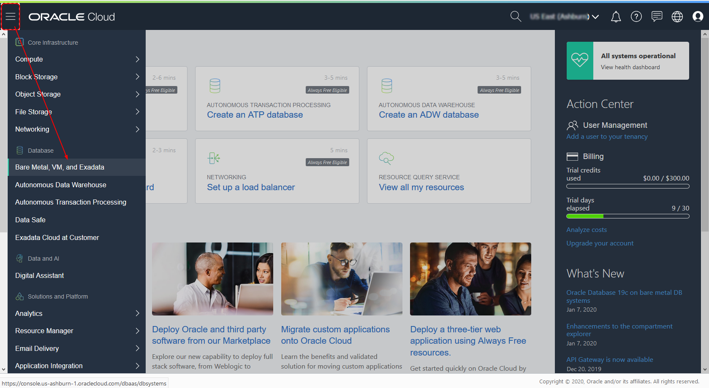
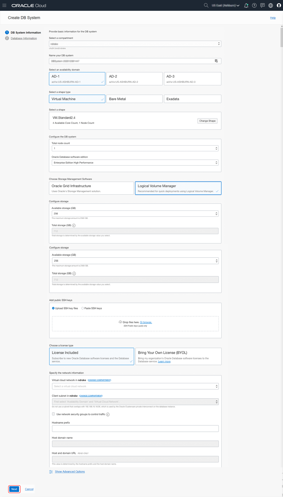

# Create an Oracle Cloud Infrastructure VM Database
## Before You Begin

This lab walks you through the steps to create an instance of an Oracle 18c, 19c or the new 20c Preview Database running in Oracle Cloud Infrastructure. Oracle Cloud Infrastructure provides several options for rapidly creating a Database system for development and testing, including fast provisioning of 1-node virtual machine database systems.

### Background
You can use a 1-node virtual database system to complete labs and tutorials that require an Oracle database.

### What Do You Need?

* An Oracle Cloud paid account or free trial. To sign up for a trial account with $300 in credits for 30 days, click [here](http://oracle.com/cloud/free).
* SSH Keys
* A Virtual Cloud Network (VCN)

## **STEP 1**: Create a Database Virtual Machine

1. From the Console menu, click on **Bare Metal, VM, and Exadata**.

  

2. Select the compartment you want to create the database in and click on **Create DB System**.

  

3. On the DB System Information form, enter the following information and click **Next**:

    * In the **Name your DB system** field, give your database a name.
    * Select **Logical Volume Manager** as the Storage Management Software.
    * In the **Add public SSH keys** section, browse to the location of your SSH keys and select the public key file (with a .pub extension).
    * In the **Specify the Network information** section, select the VCN you created using the drop down list.
    * Select the public subnet using the drop down list.
    * Enter a hostname prefix.

    

4. On the Database Information form, enter the following information and click **Create DB System**.

    * In the **Database name** field, change the default database name to "cdb1".
    * On the **Database version** drop down menu, select the version of the Oracle Database you want: 18c, 19c or 20c (Preview).
    * In the **PDB name** field, enter "pdb1".
    * Enter a password for your sys user in the **Password** field and then repeat the password in the **Confirm password** field.

    

5. After a few minutes, your Database System will change color from yellow (Provisioning) to green.

    

## **STEP 2**: Connect to the Database using SSH

1. On the **DB System Details** page, Click **Nodes**.

  

   Note the IP address.

2. In a terminal window, navigate to the folder where you created the SSH keys and enter this command, using your IP address:

   ```
   $ <copy>ssh -i ./myOracleCloudKey opc@</copy>123.123.123.123
   Enter passphrase for key './myOracleCloudKey':
   Last login: Tue Feb  4 15:21:57 2020 from 123.123.123.123
   [opc@tmdb1 ~]$
   ```

3. Once connected, you can switch to the "oracle" OS user and connect using SQL*Plus:

   ```
   [opc@tmdb1 ~]$ sudo su - oracle
   [oracle@tmdb1 ~]$ . oraenv
   ORACLE_SID = [cdb1] ?
   The Oracle base has been set to /u01/app/oracle
   [oracle@tmdb1 ~]$ sqlplus / as sysdba

   SQL*Plus: Release 20.0.0.0.0 - Production on Sat Feb 15 14:01:48 2020
   Version 20.2.0.0.0

   Copyright (c) 1982, 2019, Oracle.  All rights reserved.

   Connected to:
   Oracle Database 20c EE High Perf Release 20.0.0.0.0 - Production
   Version 20.2.0.0.0

   SQL>
   ```

## Want to Learn More?

* [Oracle Cloud Infrastructure: Creating Bare Metal and Virtual Machine DB Systems](https://docs.cloud.oracle.com/en-us/iaas/Content/Database/Tasks/creatingDBsystem.htm)
* [Oracle Cloud Infrastructure: Connecting to a DB System](https://docs.cloud.oracle.com/en-us/iaas/Content/Database/Tasks/connectingDB.htm)

## Acknowledgements
* **Author** - Tom McGinn, Learning Architect, Database User Assistance
* **Last Updated By/Date** - Tom McGinn, March 2020

## See an issue?
Please submit feedback using this [form](https://apexapps.oracle.com/pls/apex/f?p=133:1:::::P1_FEEDBACK:1). Please include the *workshop name*, *lab* and *step* in your request.  If you don't see the workshop name listed, please enter it manually. If you would like us to follow up with you, enter your email in the *Feedback Comments* section. 
