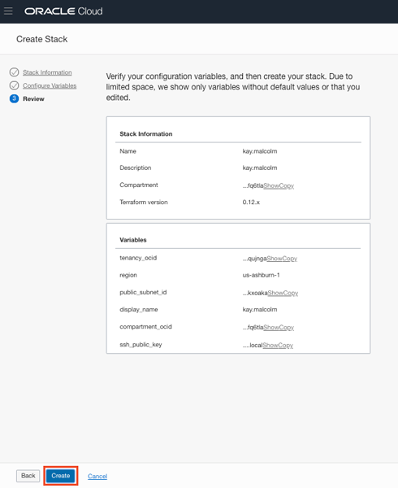

  

# SSWorkshop: Docker Lab
## Table of Contents 
- [SSWorkshop: Docker Lab](#ssworkshop-docker-lab)
  - [Table of Contents](#table-of-contents)
  - [Introduction](#introduction)
  - [Lab Assumptions](#lab-assumptions)
  - [Lab Settings](#lab-settings)
  - [Section 1-Login to the Oracle Cloud](#section-1-login-to-the-oracle-cloud)
  - [Section 2-Generate an SSH Key Pair](#section-2-generate-an-ssh-key-pair)
    - [For MAC Users ###](#for-mac-users)
    - [For Windows: Using GitBash or Windows Subsystem for Linux (WSL) ###](#for-windows-using-gitbash-or-windows-subsystem-for-linux-wsl)
    - [For Windows: Using PuttyGen ###](#for-windows-using-puttygen)
  - [Section 3-Login and Create Stack using Resource Manager](#section-3-login-and-create-stack-using-resource-manager)
  - [Section 4-Terraform Plan and Apply](#section-4-terraform-plan-and-apply)
  - [Section 5-Connect to your instance](#section-5-connect-to-your-instance)
    - [Connecting via MAC or Windows CYGWIN Emulator](#connecting-via-mac-or-windows-cygwin-emulator)
    - [Connecting via Windows](#connecting-via-windows)


## Introduction
This lab will show you how to login to the cloud and setup your environment using Oracle Resource Manager.  Once the environment setup is complete, you will proceed to the Docker lab.

**PLEASE READ:**  If you already have a compute instance (running linux or DB 19c) configured, proceed directly to the [Docker Lab](https://oracle.github.io/learning-library/data-management-library/database/options/docker.html).


## Lab Assumptions
- Each participant has been sent two emails, one from Oracle Cloud  with their username and another with the subject SSWorkshop, this contains their temporary password.


## Lab Settings
- **Tenancy**:  c4u03
- **Username/Password**:  Sent via email
- **Compartment**: \<Provided by Oracle\>
- **VCN**: \<Provided by Oracle\>
- **Region**: \<Provided by Oracle\>
- **Subnet ID**: \<Provided by Oracle\>
- **Linux Image ID**: \<Provided by Oracle\>


## Section 1-Login to the Oracle Cloud
1.  You should have received two emails.  **Email 1:**  From noreply with the subject **Verify Email Request** (check your spam and junk folders).  This has the link that verifies your email.  Without clicking on this link you cannot login to the tenancy.  Open up this email.  Click on the **Sign In to Oracle Cloud** link.  

    


2.  You should have received a 2nd email with your temporary password.  Enter your username and your password (Email 2) in the box on the right hand side that says **Oracle Infrastructure** (Do not use SSO, SSO is not enabled for this tenancy).  

    
   
3. You will then be taken to a screen to change your password.  Choose a new password that you can remember and click **Sign In** (make sure you are using an approved browser.  IE is not supported)

    


4. Once you successfully login, you will be presented with the Oracle Cloud homepage. (NOTE: If you get an *Email Activation Unsuccessful* message, check to see if you can still access the cloud by looking for the hamburger menu to the left). 
   


5.  In Email 2, you were also assigned a region.  Click in the upper right hand corner and set your Region appropriately.   (NOTE:  Setting the region is important, your network is region specific.  If you choose a different region that does not match your subnet, you will get an error on environment creation) 

     

[Back to Top](#table-of-contents)

## Section 2-Generate an SSH Key Pair

If you already have an ssh key pair, you may use that to connect to your environment.  Based on your laptop config, choose the appropriate step to connect to your instance.

`IMPORTANT:  If the ssh key is not created correct, you will not be able to connect to your environment and will get errors.  Please ensure you create your key properly. ` 

### For MAC Users ### 

1.  Open up a terminal and type the following commands.  When prompted for a passphrase click **enter**. *Do not enter a passphrase*.
     ````
    cd ~
    cd .ssh
    ssh-keygen -b 2048 -t rsa -f optionskey
    ````

     
3.  Inspect your .ssh directory.  You should see two files.  optionskey and optionskey.pub.  Copy the contents of the pub file `optionskey.pub` into notepad.  Your key file should be one line. You will need this to access your instance later.  

    ````
    ls -l .ssh
    more optionskey.pub
    ````


### For Windows: Using GitBash or Windows Subsystem for Linux (WSL) ### 

1. Open the terminal tool of your choice
2. Type the following command at the prompt to generate keys for your instance.
    ````
    ssh-keygen -f optionskey
    ````
3. Press enter to accept the default values
4. Do not assign a password for this exercise. (note you should always assign an SSH key password in production)
5. Type the following to retrieve your public key.  You will need this to access your instance in Section 5.  
    ````
    cat ~/.ssh/optionskey.pub 
    ````


### For Windows: Using PuttyGen ### 

1. Open PuttyGen
2. Click the [Generate] button

     
3. Move your mouse around the screen randomly until the progress bar reaches 100%
4. Click the [Save private key] button. Name the file `optionskey`.  This file will not have an extension.

     
5. Save the public key (displayed in the text field) by copying it to the clipboard and saving it manually to a new text file. Name the file `optionskey.pub`.   You will need this to access your instance in Section 5.  

6. Note: Sometimes PuttyGen does not save the public key in the correct format. The text string displayed in the window is correct so copy/paste to be sure.

[Back to Top](#table-of-contents)

## Section 3-Login and Create Stack using Resource Manager
You will be using Terraform to create your database environment.

1.  Click on the link below to download the zip file you need to build your enviornment.  
- [Linux Compute](https://objectstorage.us-ashburn-1.oraclecloud.com/p/fS44gtlzyF-xooB7BUCJc1YpkCQ-4tXmqAlU3_QQZPU/n/c4u03/b/labfiles/o/linux-compute.zip) - Packaged terraform instance creation script for Linux compute instance in London region.


2.  Save in your downloads folder.

3.  Open up the hamburger menu in the left hand corner.  Choose **Resource Manager > Stacks**.   Choose the compartment from your email, click the  **Create Stack** button

     

    

    

    

6.  Click the **Browse** button and select the zip file (multitenant-terraform.zip) that you downloaded. Click **Select**.

    


    Enter the following information and accept all the defaults
    - **Name**:  Enter your firstname and lastname and the day you were born (DO NOT ENTER ANY SPECIAL CHARACTERS HERE, including periods, underscores, exclamation etc, it will mess up the configuration and you will get an error during the apply process)
    - **Description**:  Same as above
    - **Compartment**:  Select Compartment from Email 2

7.  Click **Next**.

    

    **Make sure you have switched to the correct Region.**  Enter the following information. 


    **Choose a Name For Your Instance**
    
    - **Display Name:** Enter your firstname and lastname and the day you were born (do not enter any special characters here, including periods, it may mess up the configuration)

    **Enter Info from your SSWorkshop Email**
    - **Instance Image OCID**: Enter the Image ID you received in your SSWorkshop email

    - **Public Subnet ID**:  Enter the Subnet ID you received in your SSWorkshop email

    - **AD**: Enter 1, 2, or 3 based on your last name.  (A-J -> 1, K - M -> 2, N-Z -> 3)
    
    **Enter Your Public Key**

    - **SSH Public Key**:  Paste the public key you created in the earlier step (it should be one line)

8. Click **Next**.

    

9.  Your stack has now been created!  Now to create your environment.  If you get an error about an invalid DNS label, go back to your Display Name, please do not enter ANY special characters or spaces.  It will fail.

    

[Back to Top](#table-of-contents)


## Section 4-Terraform Plan and Apply
When using Resource Manager to deploy an environment, execute a terraform **plan** and **apply**.  Let's do that now.

1.  [OPTIONAL]Click **Terraform Actions** -> **Plan** to validate your configuration.  This takes about a minute, please be patient.

    

    

    

2.  At the top of your page, click on **Stack Details**.  Click the button, **Terraform Actions** -> **Apply**.  This will create your instance and install Oracle 19c.

    

    

3.  Once this job succeeds, your environment is created!  Time to login to your instance to finish the configuration.

[Back to Top](#table-of-contents)


## Section 5-Connect to your instance

Based on your laptop config, choose the appropriate step to connect to your instance.  

NOTE:  You cannot connect while on VPN or in the Oracle office on clear-corporate (choose clear-internet).  Also, the ssh-daemon is disable for the first 5 minutes or so while the instance is processing.  If you are unable to connect and sure you have a valid key, wait a few minutes and try again.

1.  Go to Compute -> Instance find the instance you created (make sure you choose the correct compartment)
2.  On the instances homepage, find the Public IP addresss for your instance next to the Status column.

    

### Connecting via MAC or Windows CYGWIN Emulator

1.  Open up a terminal (MAC) or cygwin emulator as the opc user.  Enter yes when prompted.

    ````
    ssh -i ~/.ssh/optionskey opc@<Your Compute Instance Public IP Address>
    ````
     

3.  Continue to [Section 5b-Run the Setup Scripts](#section-5b-run-the-setup-scripts)

### Connecting via Windows

1.  Open up putty and create a new connection.

    ````
    ssh -i ~/.ssh/optionskey opc@<Your Compute Instance Public IP Address>
    ````
     

2.  Enter a name for the session and click **Save**.

     

3. Click **Connection** > **Data** in the left navigation pane and set the Auto-login username to root.

4. Click **Connection** > **SSH** > **Auth** in the left navigation pane and configure the SSH private key to use by clicking Browse under Private key file for authentication.

5. Navigate to the location where you saved your SSH private key file, select the file, and click Open.  NOTE:  You cannot connect while on VPN or in the Oracle office on clear-corporate (choose clear-internet).

     

6. The file path for the SSH private key file now displays in the Private key file for authentication field.

7. Click Session in the left navigation pane, then click Save in the Load, save or delete a stored session section.

8. Click Open to begin your session with the instance.
      
Congratulations!  Now you have the environment to run the Docker lab.   You may proceed to the [Docker Lab](https://oracle.github.io/learning-library/data-management-library/database/options/docker.html). 

[Back to Top](#table-of-contents)

