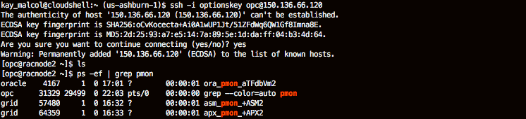
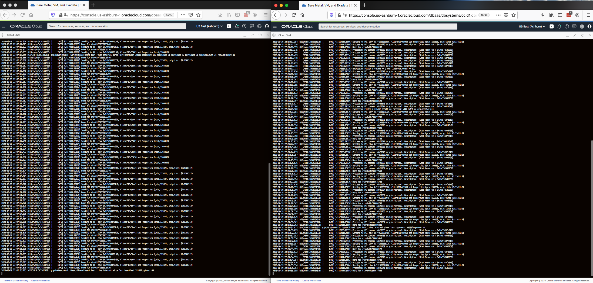
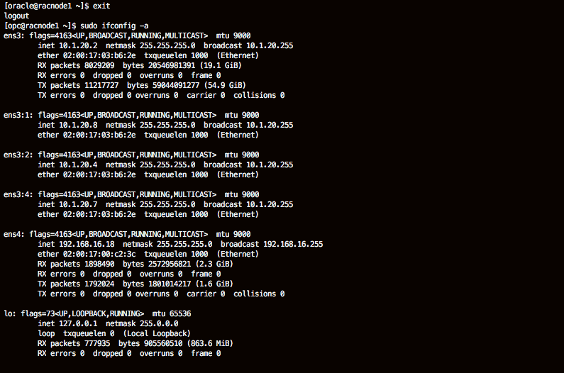
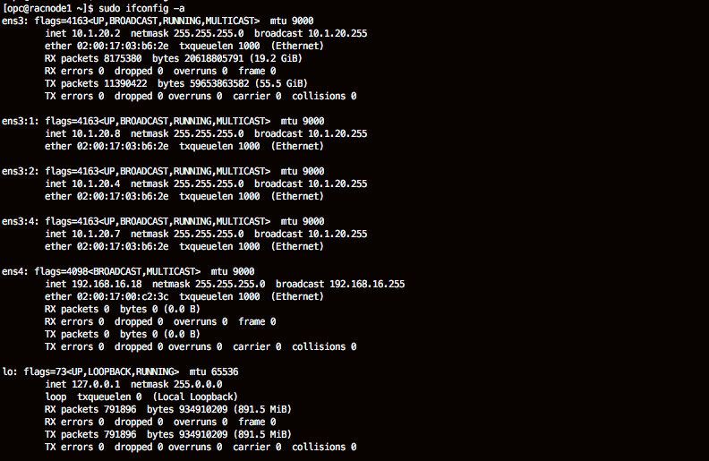
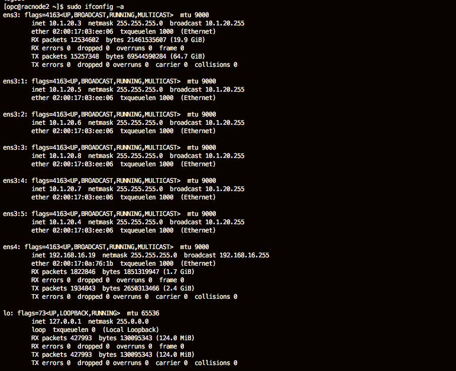

# Clusterware and Fencing

## Introduction

This lab walks you through the steps to demonstrate Oracle Clusterware’s fencing ability by forcing a configuration that will trigger Oracle Clusterware’s built-in fencing features. With Oracle Clusterware, fencing is handled at the node level by rebooting the non-responsive or failed node. This is similar to the as Shoot The Other Node In The Head (STONITH) algorithm, but it’s really a suicide instead of affecting the other machine. There are many good sources for more information online. .

Estimated Lab Time: 20 Minutes

### Prerequisites
- An Oracle LiveLabs or Paid Oracle Cloud account
- Lab: Generate SSH Key
- Lab: Build a DB System

### About Oracle Grid Infrastructure

Oracle Clusterware is the technology used in the RAC architecture that transforms a collection of servers into a highly available unified system. Oracle Clusterware provides failure detection, node membership, node fencing and optimal resource placement. It provides cluster-wide component inter-dependency management for RAC and other applications in the cluster. Clusterware uses resource models and policies to provide high availability responses to planned and unplanned component downtime.

For more information on Oracle Clusterware visit http://www.oracle.com/goto/clusterware

 [](youtube:GIq-jb4bKmo)

## **STEP 1:**  Connect and Disable the private interconnect

1.  If you aren't already logged in to the Oracle Cloud, open up a web browser and re-login to Oracle Cloud. 
2.  Once you are logged in, open up a 2nd webbrowser tab.
3.  Start Cloudshell in each.  Maximize both cloudshell instances.
   
    *Note:* You can also use Putty or MAC Cygwin if you chose those formats in the earlier lab.  
    

4.  Connect to node 1 (you identified the IP in an earlier lab). 

    ````
    ssh -i ~/.ssh/sshkeyname opc@<<Node 1 Public IP Address>>
    ````
    

5. Repeat this step for node 2.
   
    ````
    ssh -i ~/.ssh/sshkeyname opc@<<Node 1 Public IP Address>>
    ps -ef | grep pmon
    ````
    

6. On both nodes, switch to the oracle user and check to see what's running on both nodes.
   
    ````
    <copy>
    sudo su - oracle
    ps -ef | grep pmon
    tail -f /u01/app/grid/diag/crs/`hostname -s`/crs/trace/crsd.trc
    </copy>
    ````
    
    
7. Monitor the **crsd.trc** on each node as the *oracle* user. The **crsd.trc** file is located in the $ADR\_BASE/diag/crs/*nodename*/crs/trace directory. In earlier versions of Grid Infrastructure the logfiles were located under CRS\_HOME/log/<nodename>/crs (these directory structures still exist in the installation)

    ````
    <copy>
    sudo su - oracle
    tail -f /u01/app/grid/diag/crs/`hostname -s`/crs/trace/crsd.trc
    </copy>
    ````
    


8. Examine the network settings as the *opc* user.  Type exit to switch back to the opc user on both nodes.

    ````
    <copy>
    exit
    sudo ifconfig -a
    </copy>
    ````
    Note that the commands **ip** or **if** can be used, but the syntax will not match what is shown here. Use these commands if you are familiar with their construct.


9.  Inspect the output.
   
    


10. The **ifconfig** command shows all of the network interfaces configured and running. The **flags** entry will show whether the interface is UP, BROADCASTing, and whether in MULTICAST or not. The **inet** entry shows the IP address of each interface.

    You should notice that one of the network interfaces has multiple IP addresses associated with it. **ens3** has the virtual interfaces **es3:1** and **es3:2** in the example shown here. These virtual interfaces are for the virtual IPs (VIPs) used by each node and the SCAN listeners.

    The private interconnect addresses for this cluster are **192.168.16.18** and **192.168.16.19** or racnode1-priv and racnode2-priv, respectively.

11. Take down the interconnect (we are doing this on node1, but the other node could be used)
    ````
    <copy>
    sudo ifconfig ens4 down
    </copy>
    ````
    *No error message means this is successful.*

    

12. Look at the ifconfig command again by running the command below on node 1.
   
    ````
    <copy>
    sudo ifconfig -a
    </copy>
    ````
    
13. The output returned should be similar to.  Inspect the output.

     

14. Note that **ens4** is no longer UP.

15. Why have the virtual interfaces disappeared? Why are the virtual interfaces running on the other node? What state are they in?

    - When the private interconnect is down on node 1 the VIP for node 1 is running on node2. The reverse would be true if the private interconnect were down on node2.

16. Go back to node 2 and rerun the ifconfig command.
    
    ````
    sudo ifconfig -a
    ````
     

17.  Explore the result.

## **STEP 2:** Examine the CRSD log

1. Go back to node1 in cloudshell
2. Switch to the oracle user
3. The **crsd.trc** files that you are using **tail** to examine on node1 will begin to get errors related to the network interface and one of the nodes will be removed from the cluster. CLUSTER FENCING will take place.  See an example below.

    ````
    2020-08-17 09:03:48.838 :GIPCHGEN:3320669952:  gipchaInterfaceFailF [gipchaNodeAddInterfaceF : gipchaMain.c : 2466]: failing interface 0x7f6d94092c40 { host '', haName 'dbe1-effd-30dd-adba', local (nil), ip '192.168.16.18:60150', subnet '192.168.16.0', mask '255.255.255.0', mac '02-00-17-00-3b-91', ifname 'ens4', numRef 1, numFail 0, idxBoot 0, flags 0xd }
    2020-08-17 09:03:48.838 :GIPCHGEN:3322771200:  gipchaInterfaceFailF [gipchaWorkerCleanInterface : gipchaWorkerThread.c : 1972]: failing interface 0x7f6d9408f910 { host 'racnode2', haName 'f138-d39a-dbb0-d55d', local 0x7f6d94092c40, ip '192.168.16.19:40337', subnet '192.168.16.0', mask '255.255.255.0', mac '', ifname 'ens4', numRef 0, numFail 0, idxBoot 0, flags 0x6 }
    2020-08-17 09:03:48.838 :GIPCHDEM:3320669952:  gipchaDaemonProcessInfUpdate: completed interface update host 'racnode1', haName '', hctx 0x5573f27694e0 [0000000000000011] { gipchaContext : host 'racnode1', name 'dbe1-effd-30dd-adba', luid 'a97e87d1-00000000', name2 c31a-ec33-ad01-60c2, numNode 1, numInf 1, maxPriority 0, clientMode 0, nodeIncarnation b82a3047-001da000 usrFlags 0x0, flags 0x40805 }
    2020-08-17 09:03:49.839 :GIPCHGEN:3322771200:  gipchaInterfaceDisableF [gipchaWorkerCleanInterface : gipchaWorkerThread.c : 1958]: disabling interface 0x7f6d94092c40 { host '', haName 'dbe1-effd-30dd-adba', local (nil), ip '192.168.16.18:60150', subnet '192.168.16.0', mask '255.255.255.0', mac '02-00-17-00-3b-91', ifname 'ens4', numRef 0, numFail 1, idxBoot 0, flags 0x18d }
    2020-08-17 09:03:49.839 :GIPCHGEN:3322771200:  gipchaInterfaceDisableF [gipchaWorkerCleanInterface : gipchaWorkerThread.c : 1994]: disabling interface 0x7f6d9408f910 { host 'racnode2', haName 'f138-d39a-dbb0-d55d', local 0x7f6d94092c40, ip '192.168.16.19:40337', subnet '192.168.16.0', mask '255.255.255.0', mac '', ifname 'ens4', numRef 0, numFail 0, idxBoot 0, flags 0x86 }
    2020-08-17 09:03:49.839 :GIPCHALO:3322771200:  gipchaLowerCleanInterfaces: performing cleanup of disabled interface 0x7f6d9408f910 { host 'racnode2', haName 'f138-d39a-dbb0-d55d', local 0x7f6d94092c40, ip '192.168.16.19:40337', subnet '192.168.16.0', mask '255.255.255.0', mac '', ifname 'ens4', numRef 0, numFail 0, idxBoot 0, flags 0xa6 }

    ````

4. During cluster fencing messages similar to the following will be seen:

    ````
    2020-08-17 09:04:06.116 :UiServer:1539299072: [     INFO] {1:39776:4738} Sending to PE. ctx= 0x7f6d900a9ee0, ClientPID=89807 set Properties (grid,19633), orig.tint: {1:39776:2}
    2020-08-17 09:04:15.594 :UiServer:1539299072: [     INFO] {1:39776:4740} Container [ Name: FENCESERVER
        API_HDR_VER:
        TextMessage[3]
        CLIENT:
        TextMessage[]
        CLIENT_NAME:
        TextMessage[ocssd.bin]
        CLIENT_PID:
        TextMessage[75947]
        CLIENT_PRIMARY_GROUP:
        TextMessage[oinstall]
        LOCALE:
        TextMessage[AMERICAN_AMERICA.WE8ISO8859P1]
    ]
    2020-08-17 09:04:15.594 :UiServer:1539299072: [     INFO] {1:39776:4740} Sending message to AGFW. ctx= 0x7f6d900a8900, Client PID: 75947
    2020-08-17 09:04:15.594 :  OCRAPI:1539299072: procr_beg_asmshut: OCR ctx set to donotterminate state. Return [0].
    2020-08-17 09:04:15.594 :UiServer:1539299072: [     INFO] {1:39776:4740} Force-disconnecting [20]  existing PE clients...
    2020-08-17 09:04:15.594 :UiServer:1539299072: [     INFO] {1:39776:4740} Disconnecting client of command id :314

    ````

5. Will the same node always be evicted? is it always the node on which the interface was removed? Can this be influenced in any way?

6. Examine the status of the cluster from the node that still has Grid Infrastructure running

    ````
    <copy>
    /u01/app/19.0.0.0/grid/bin//crsctl status server
    </copy>
    ````
    


7. Only one node should be online

    ````
    <copy> 
    /u01/app/19.0.0.0/grid/bin//crsctl status server
    </copy>
    ```` 
    

8. Examine the network adapters on the running node

    ````
    <copy>
    sudo ip addr show
    </copy>
    ````
    


9. Output similar to the following will display:

    ````
    1: lo: <LOOPBACK,UP,LOWER_UP> mtu 65536 qdisc noqueue state UNKNOWN group default
    link/loopback 00:00:00:00:00:00 brd 00:00:00:00:00:00
    inet 127.0.0.1/8 scope host lo
       valid_lft forever preferred_lft forever
    2: ens3: <BROADCAST,MULTICAST,UP,LOWER_UP> mtu 9000 qdisc mq state UP group default qlen 1000
    link/ether 02:00:17:00:be:9d brd ff:ff:ff:ff:ff:ff
    inet 10.1.20.3/24 brd 10.1.20.255 scope global dynamic ens3
       valid_lft 77824sec preferred_lft 77824sec
    inet 10.1.20.5/24 brd 10.1.20.255 scope global secondary ens3:1
       valid_lft forever preferred_lft forever
    inet 10.1.20.7/24 brd 10.1.20.255 scope global secondary ens3:2
       valid_lft forever preferred_lft forever
    inet 10.1.20.8/24 brd 10.1.20.255 scope global secondary ens3:4
       valid_lft forever preferred_lft forever
    inet 10.1.20.6/24 brd 10.1.20.255 scope global secondary ens3:3
       valid_lft forever preferred_lft forever
    inet 10.1.20.4/24 brd 10.1.20.255 scope global secondary ens3:5
       valid_lft forever preferred_lft forever
    3: ens4: <BROADCAST,MULTICAST,UP,LOWER_UP> mtu 9000 qdisc mq state UP group default qlen 1000
    link/ether 02:00:17:00:12:d1 brd ff:ff:ff:ff:ff:ff
    inet 192.168.16.19/24 brd 192.168.16.255 scope global ens4
       valid_lft forever preferred_lft forever

    ````

All of the virtual IP addresses will be present on the running node as ens3\:1 to en3\:5   

Can you connect an application client to a VIP (a host-vip) when it is running on a host other than its home host?

## **STEP 3:** Restart the private interconnect

1. On whichever node you stopped the private interconnect, restart it

    ````
    <copy>
    sudo ifconfig ens4 up
    </copy>
    ````
 2. use ifconfig to examine the network adapters. Ens4 should restart

 3. The nodes will reform the cluster, VIPs will migrate back to their home node, or rebalance in the case of SCAN-VIPs.  An **ifconfig -a** command on the original failed node will now show restarted resources

    ````
    [opc@racnode1 ~]$ sudo ifconfig -a
    ens3: flags=4163<UP,BROADCAST,RUNNING,MULTICAST>  mtu 9000
    inet 10.1.20.2  netmask 255.255.255.0  broadcast 10.1.20.255
    ether 02:00:17:00:6b:67  txqueuelen 1000  (Ethernet)
    RX packets 27902990  bytes 52152693993 (48.5 GiB)
    RX errors 0  dropped 0  overruns 0  frame 0
    TX packets 35991050  bytes 130123471001 (121.1 GiB)
    TX errors 0  dropped 0 overruns 0  carrier 0  collisions 0

    ens3:1: flags=4163<UP,BROADCAST,RUNNING,MULTICAST>  mtu 9000
    inet 10.1.20.4  netmask 255.255.255.0  broadcast 10.1.20.255
    ether 02:00:17:00:6b:67  txqueuelen 1000  (Ethernet)

    ens3:2: flags=4163<UP,BROADCAST,RUNNING,MULTICAST>  mtu 9000
    inet 10.1.20.6  netmask 255.255.255.0  broadcast 10.1.20.255
    ether 02:00:17:00:6b:67  txqueuelen 1000  (Ethernet)

    ens4: flags=4163<UP,BROADCAST,RUNNING,MULTICAST>  mtu 9000
    inet 192.168.16.18  netmask 255.255.255.0  broadcast 192.168.16.255
    ether 02:00:17:00:3b:91  txqueuelen 1000  (Ethernet)
    RX packets 12947655  bytes 27824076300 (25.9 GiB)
    RX errors 0  dropped 0  overruns 0  frame 0
    TX packets 11217857  bytes 15007533970 (13.9 GiB)
    TX errors 0  dropped 0 overruns 0  carrier 0  collisions 0

    lo: flags=73<UP,LOOPBACK,RUNNING>  mtu 65536
    inet 127.0.0.1  netmask 255.0.0.0
    loop  txqueuelen 0  (Local Loopback)
    RX packets 4981610  bytes 10848596188 (10.1 GiB)
    RX errors 0  dropped 0  overruns 0  frame 0
    TX packets 4981610  bytes 10848596188 (10.1 GiB)
    TX errors 0  dropped 0 overruns 0  carrier 0  collisions 0
    ````

4. A status command will show both nodes running

    ````
    <copy>
    /u01/app/19.0.0.0/grid/bin//crsctl status server
    </copy>
    ````

    ````
    [opc@racnode2 ~]$  /u01/app/19.0.0.0/grid/bin//crsctl status server
    NAME=racnode1
    STATE=ONLINE

    NAME=racnode2
    STATE=ONLINE
    ````
You may now *proceed to the next lab*.  

## Acknowledgements
* **Authors** - Troy Anthony, Anil Nair
* **Contributors** - Kay Malcolm
* **Last Updated By/Date** - Troy Anthony, Database Product Management, August 2020

## Need Help?
Please submit feedback or ask for help using our [LiveLabs Support Forum](https://community.oracle.com/tech/developers/categories/oracle-maa-dataguard-rac). Please click the **Log In** button and login using your Oracle Account. Click the **Ask A Question** button to the left to start a *New Discussion* or *Ask a Question*.  Please include your workshop name and lab name.  You can also include screenshots and attach files.  Engage directly with the author of the workshop.

If you do not have an Oracle Account, click [here](https://profile.oracle.com/myprofile/account/create-account.jspx) to create one.
