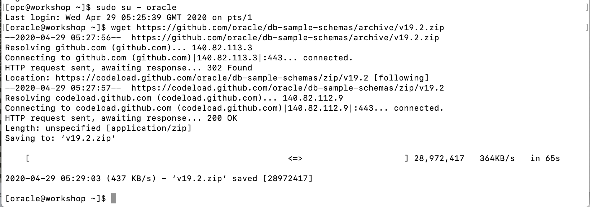
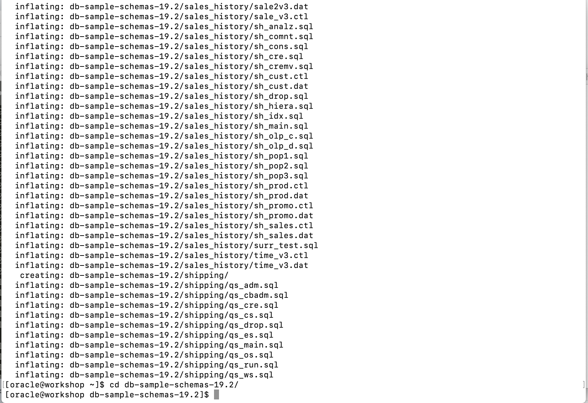
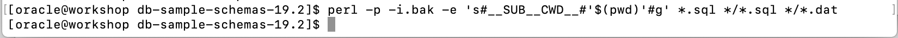
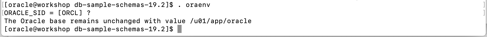
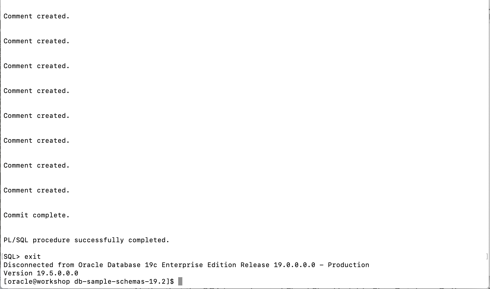

# Install Sample Schemas for Spatial

## Introduction

### Objectives

-   Prepare the sample schema for spatial. Starting with Oracle Database 12c Release 2, the latest version of the sample schema scripts are available on GitHub. You can refer the doucment at [https://github.com/oracle/db-sample-schemas](https://github.com/oracle/db-sample-schemas).

### Prerequisites

This lab assumes you have completed the following labs:
* Lab: Login to Oracle Cloud
* Lab: Generate SSH Key
* Lab: Setup


## **Step 1:** Download Sample Schemas installation Scripts
1.  Sudo to **oracle** user. Run this command to download the database sample schemas installation scripts. You will download a zip file named **v19.2.zip**.
    ````
    <copy>
    sudo su - oracle
    wget https://github.com/oracle/db-sample-schemas/archive/v19.2.zip
    </copy>
    ````

    

2.  Unzip the zip file, and cd to the directory.

    ````
    <copy>
    unzip v19.2.zip
    cd  cd db-sample-schemas-19.2/
    </copy>
    ````

    

3.  Change all embedded paths to match your working directory. The installation scripts need your current directory embedded in various locations. Use a text editor or the following Perl script to make the changes, replacing occurrences of the token `__SUB__CWD__` with your current working directory.

    ```
    <copy>
    perl -p -i.bak -e 's#__SUB__CWD__#'$(pwd)'#g' *.sql */*.sql */*.dat 
    </copy>
    ```

    

## **Step 2:** Install the Sample Schemas

1. Before install, let's check the oracle environment

    ````
    <copy>
    . oraenv
    ORCL
    </copy>
    ````

    

2. You can now install the whole sample schemas. In this spatial lab, we only use the **OE** schema. The **OE** schema depend on **HR** schema. So in the next steps, we will install only the **HR** and **OE** schema.

    Run the following command to install **HR** schema first.

    ````
    <copy>
    sqlplus system/Ora_DB4U@orclpdb @./human_resources/hr_main.sql hr users temp Ora_DB4U ./log localhost:1521/orclpdb
    exit
    </copy>
    ````

    

    Then, install the **OE** schema:

    ```
    <copy>
    sqlplus system/Ora_DB4U@orclpdb @./order_entry/oe_main.sql oe users temp hr Ora_DB4U /home/oracle/db-sample-schemas-19.2/order_entry/ ./log v3 localhost:1521/orclpdb
    exit
    </copy>
    ```

    

You may now proceed to the next lab.

## Acknowledgements

- **Author** - Minqiao Wang, DB Product Management, April 2020
- **Last Updated By/Date** - 

## Need Help?
Please submit feedback or ask for help using our [LiveLabs Support Forum](https://community.oracle.com/tech/developers/categories/livelabsdiscussions). Please click the **Log In** button and login using your Oracle Account. Click the **Ask A Question** button to the left to start a *New Discussion* or *Ask a Question*.  Please include your workshop name and lab name.  You can also include screenshots and attach files.  Engage directly with the author of the workshop.

If you do not have an Oracle Account, click [here](https://profile.oracle.com/myprofile/account/create-account.jspx) to create one.    Please include the workshop name and lab in your request. 
