# Create your first map


## Introduction

doc details link...

Estimated Lab Time: 30 minutes

### Objectives

*  ....

### Prerequisites

* ....


## Task 1: ....

Create.... 

1. drag Static Content region to left column.


2. Rename to **My Filters Region**
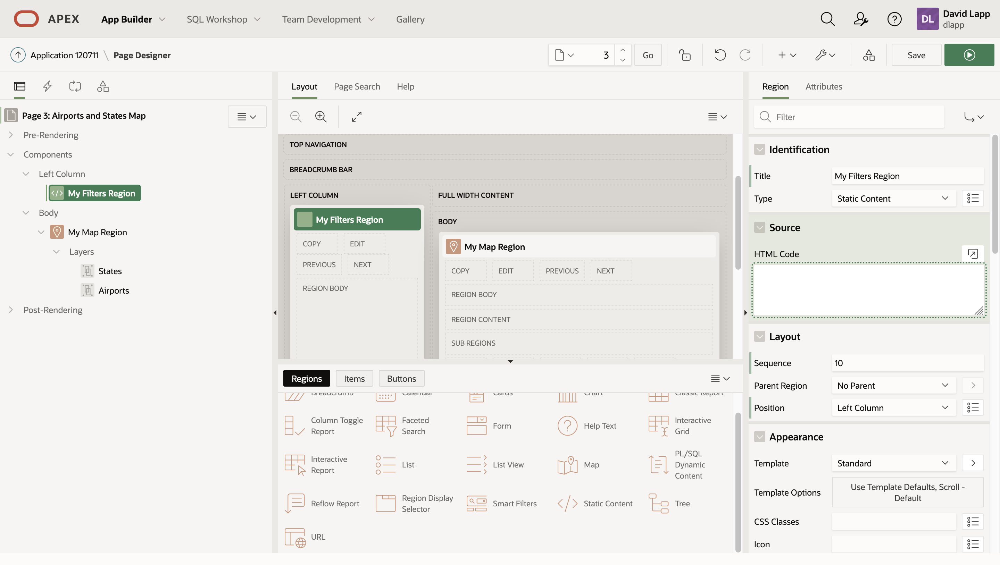 

3. Add Select List item
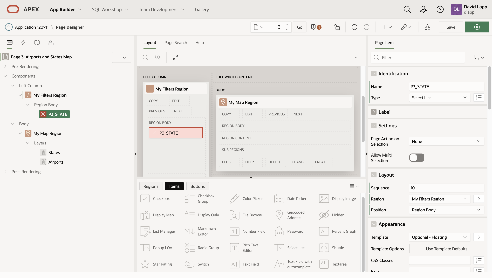 

4. Set query for Select List
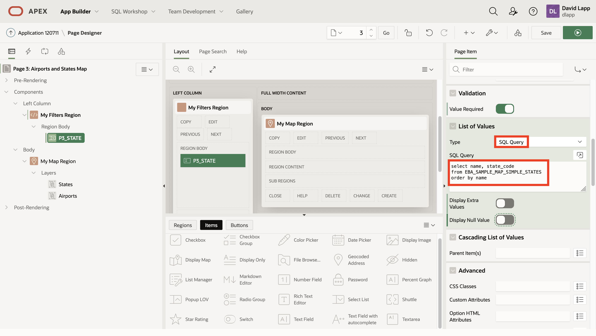 

5. Scroll down and set default to Texas
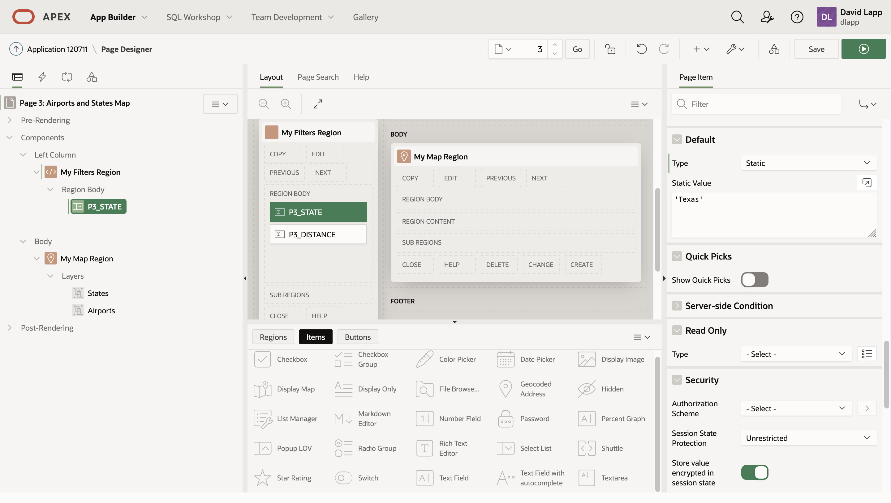 

6. Add number field for distance, name ...,  label **Proximity (km)**
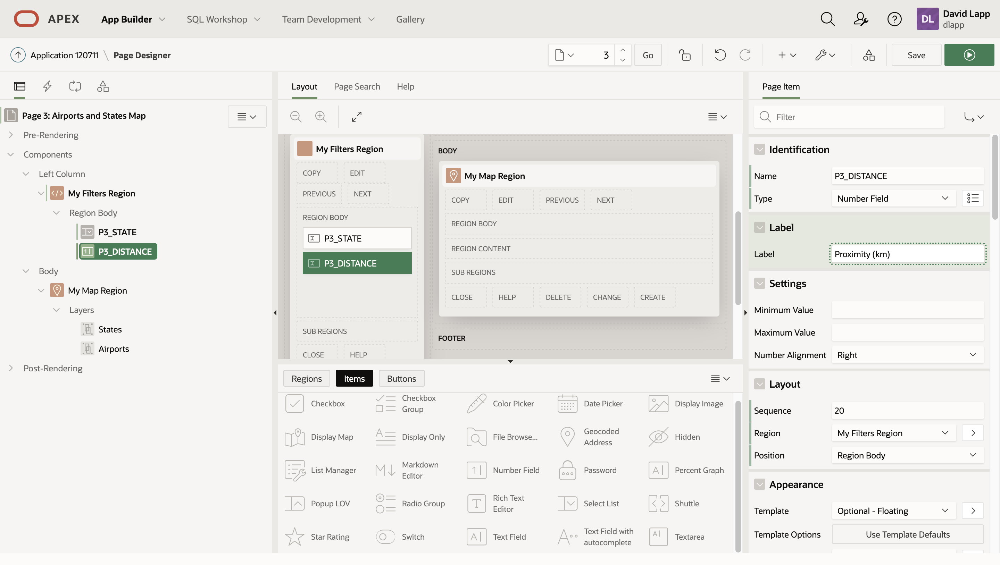 

7. Scroll down and set **Value Required**
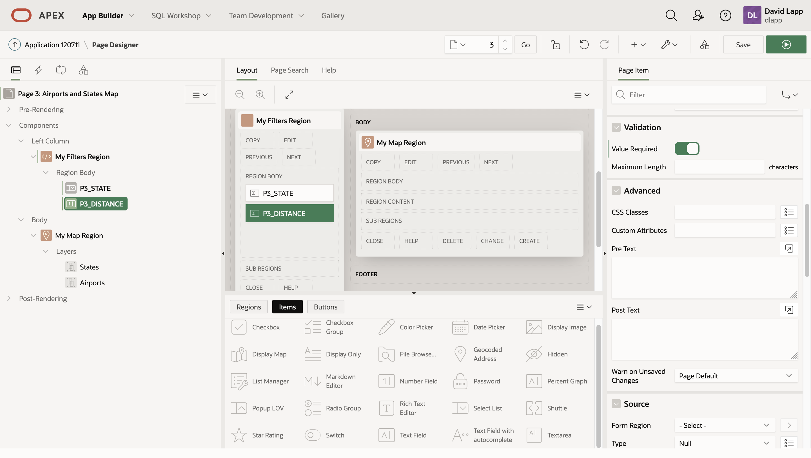 

8. Scroll down and set default to 100
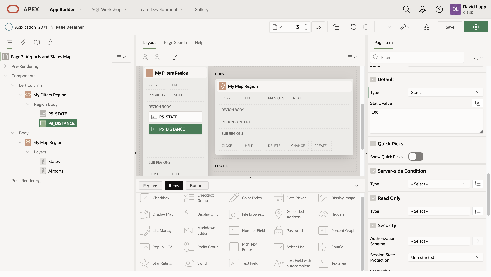 

9. Add Dynamic Action to Distance entry
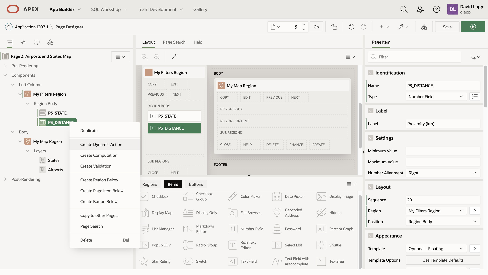 
.
10. Set name to **Validate and Refresh**, Event to , Select type to Item(s), Items(s) to.... Set Client Side Condition to ....
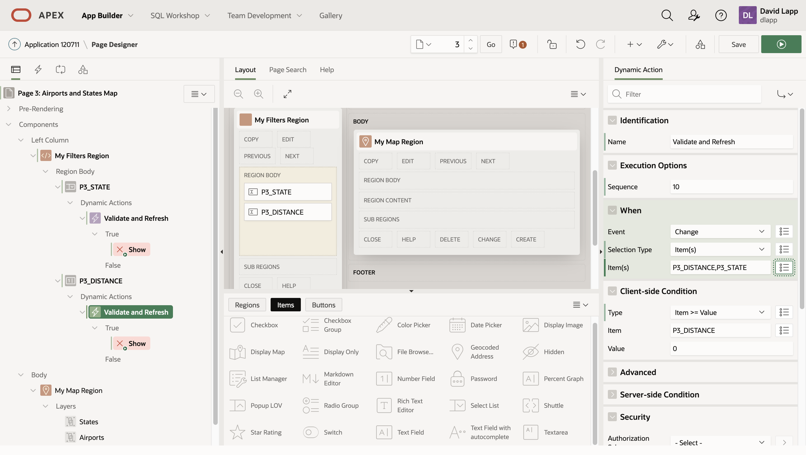

11. Set True action to ....
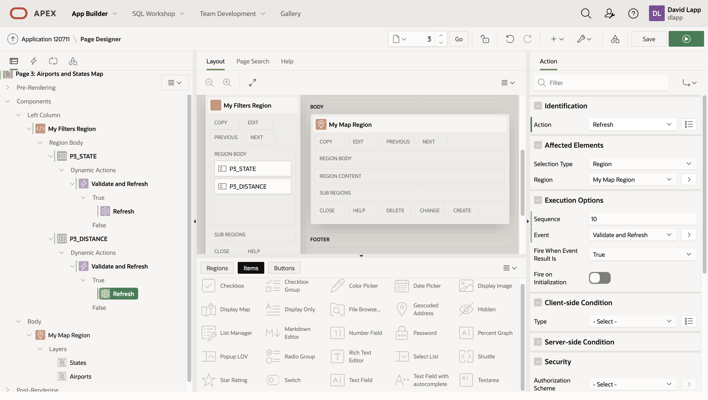    

12. Create **False Action**
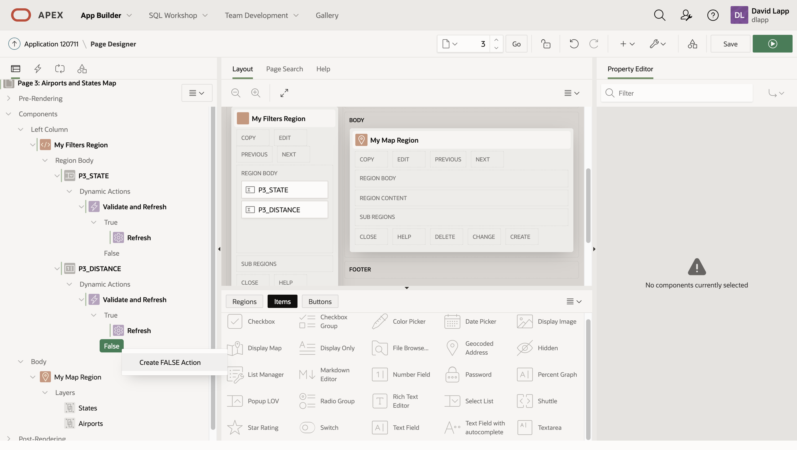    

13. Set false Action to **Alert**...
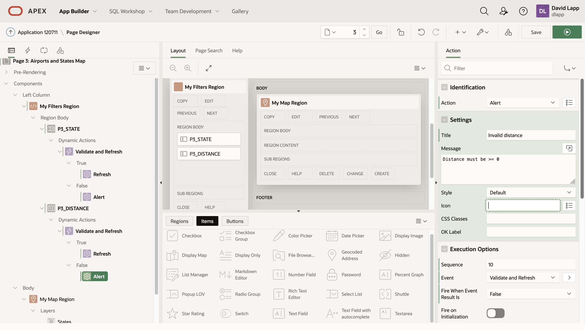 

14. Rename State layer to ... amnd set to menu selection...
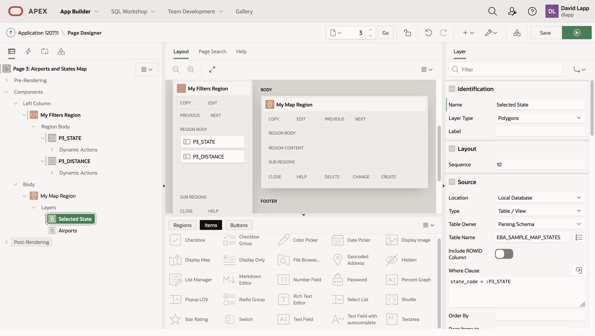 

15. Set Airports to spatial query
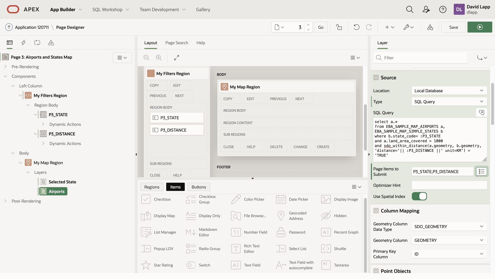 

    ```
    <copy>
    select a.*
    from EBA_SAMPLE_MAP_AIRPORTS a, EBA_SAMPLE_MAP_SIMPLE_STATES b
    where b.state_code= :P3_STATE
    and a.land_area_covered > 1000
    and sdo_within_distance(a.geometry, b.geometry, 'distance='|| :P3_DISTANCE ||' unit=KM') = 'TRUE'
    </copy>
    ```

16. Save and Run. Select Alabama and 100
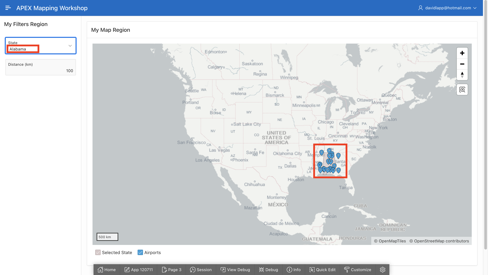 

17. Switch State
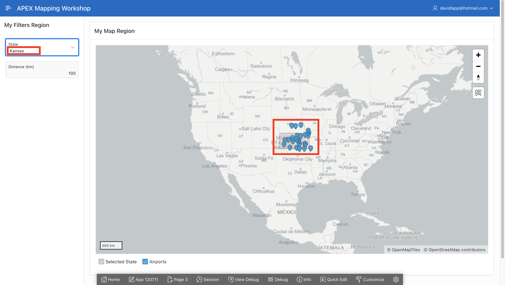 

18. change distance
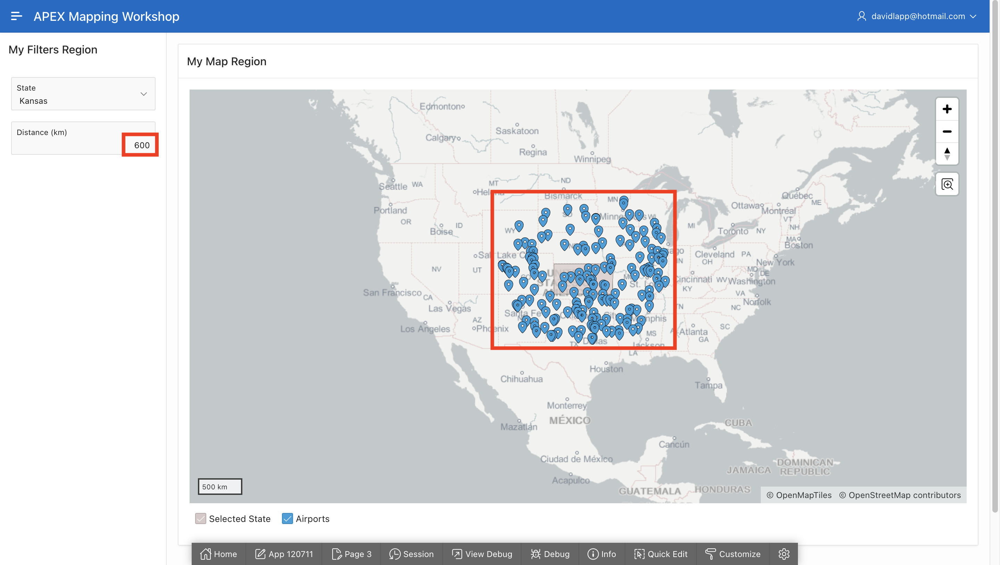 


## Learn More
* 

## Acknowledgements
* **Author** - David Lapp, Database Product Management, Oracle
* **Last Updated By/Date**  - David Lapp, Database Product Management, xxx 2021

