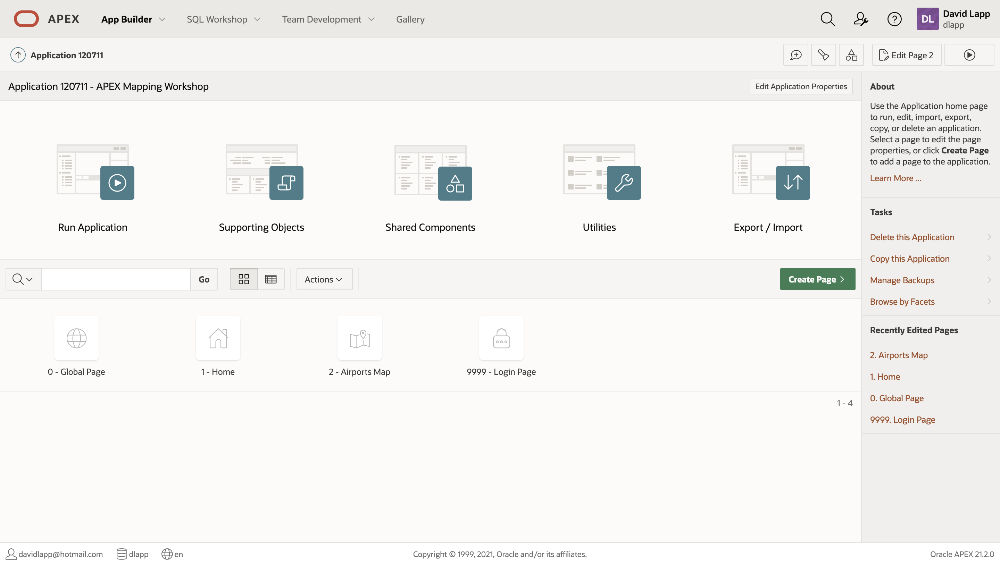
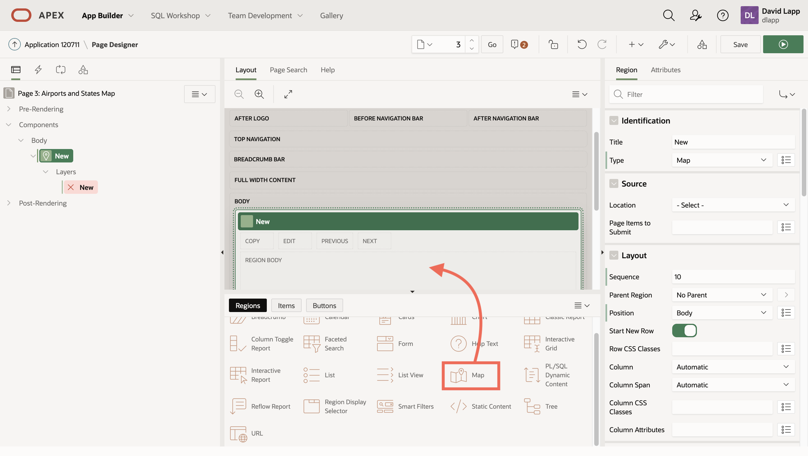

# Create map from scratch


## Introduction

doc details link...

Estimated Lab Time: 30 minutes

### Objectives

* Understand the basics of Map Regions

### Prerequisites

* ....


## Task 1: Create a map from scratch

Create map from scratch in new page

1. Click **App Builder** and then **Create Page**. 


2. You could select Map here to have the same wizard you saw in the Create App wizard. But this step is to create a map from scratch, for example if you had an existing page. Select **Blank Page** and then click **Next**. 


3. For name enter **Airports and States Map** and then click **Next**. 

   

4. Select the option to create a new navigation menu entry and enter **Airports and States Map**, i.e. the same as the page name. Then click **Next**.


4. Review the summary and click **Finish**.


5. Drag **Map** from the Regions pallete at the bottom and drop under the Body section of the page layout. Observe the Map Region appears in the Page tree under Body with default name New. Click on **New** in the Page tree and observe its properties on the right.  Observe the Region Type is Map.
    

6. In the panel on the right, update the Region Title from New to a name of your choosing, for example **My Map Region**. Observe the title is updated in the page tree on the left.


7. Observe that the Map Region includes a child element called Layers with a default Layer called New. Layers are the data driven content to be rendered on the map. Click on the Layer **New** in the page tree to see it's properties in the right panel.


8. Update the Layer Name to **Airports** and the Type to **Points**. Observe the Layer Name update in the page tree on on the left.


9. Scroll down in the Layer properties panel on the right. Update the **Source** to use the table **EBA\_SAMPLE\_AIRPORTS**. To limit the airports rendered in the layer, add the where clause **LAND\_AREA\_COVERED > 2500**.


10. Scroll down in the Layer properties panel on the right to the **Column Mapping** section. This is where you configure the spatial column for rendering. Select geometry data type **SDO\_GEOMETRY** and geometry column **GEOMETRY**.


11. Scroll down in the Layer properties panel on the right to the **Info Window** section. This is where you can configure the content of a info window that pops up when clicking on an item in the map. Enable **Advanced Formatting** and paste in the following:
    ```
    <copy>
    <strong>&AIRPORT_NAME.</strong><br>
    &CITY., &STATE_NAME.<br>
    Code: &IATA_CODE.
    </copy>
    ```
    

12.   Next you will add another Layer to your map. In the Page tree on the left, right-click on **Layers** under your Map Region and select **Create Layer**.  


13.  Click on the newly created Layer in the Page tree under your Map Region. Then in the Layer details panel on the right, update the Name to **States**, Layer type to **Polygons**, and Source to **EBA\_SAMPLE\_SIMPLE\_STATES**.


14.  Layers will be rendered in the order they appear under Layers in the page tree. To have Airports render on top States, drag the **States** layer above the Airports layer under Layers in the page tree. Scroll down in the Layer details panel on the right to the Column Mapping section section. Select geometry data type **SDO\_GEOMETRY** and geometry column **GEOMETRY**. Under Appearance, ....


15.   At the upper right, click **Save** and then green **Run** button.

Observe your map render with States and Airports layers. Click and drag the map to pan, and use the navigation control at the top right to zoom in and out. Click on an Airport to see the Info Window that you configured. Turn layers off and on with the checkboxes under the map.


Congratulations on creating your first maps. There is a lot of capability beyond the basics you have just explored. .....expand....  


You may now [proceed to the next lab](#next).

## Learn More
* 

## Acknowledgements
* **Author** - David Lapp, Database Product Management, Oracle
* **Last Updated By/Date**  - David Lapp, Database Product Management, xxx 2021

